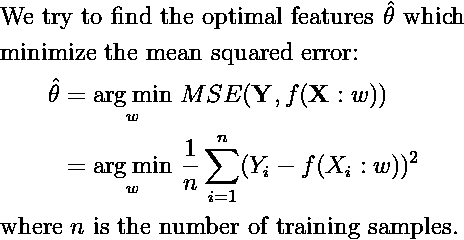
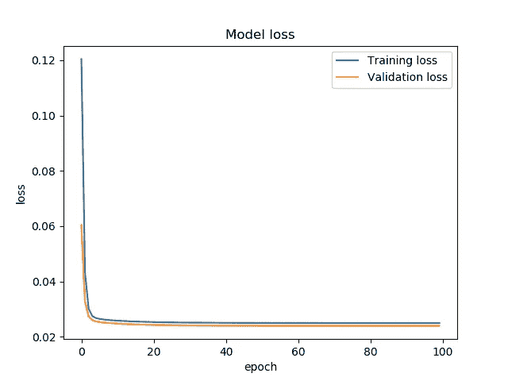
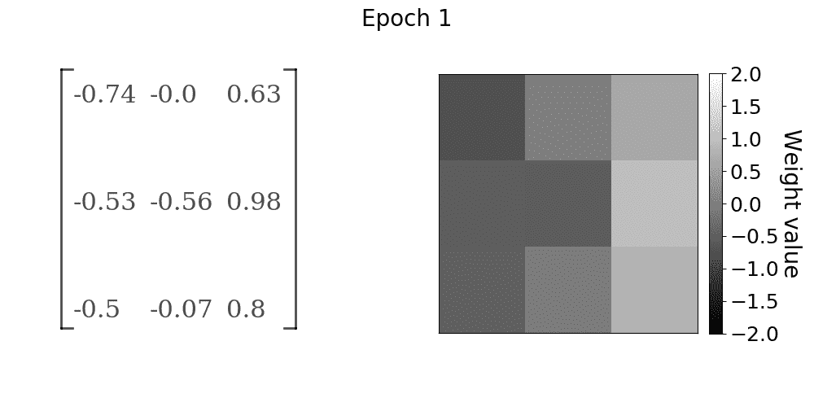
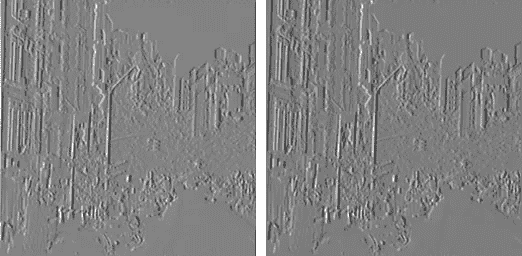
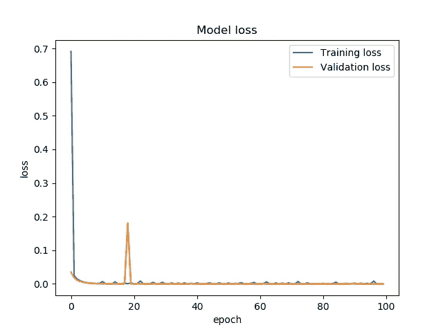
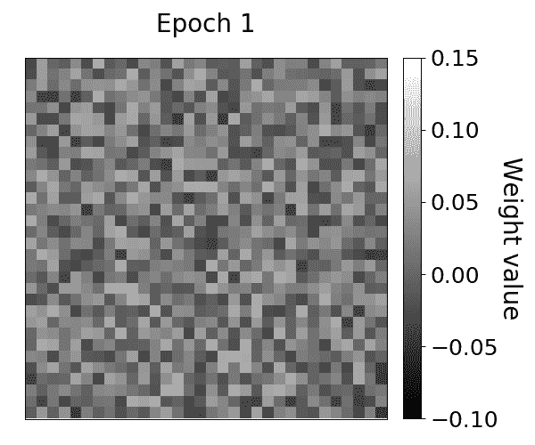
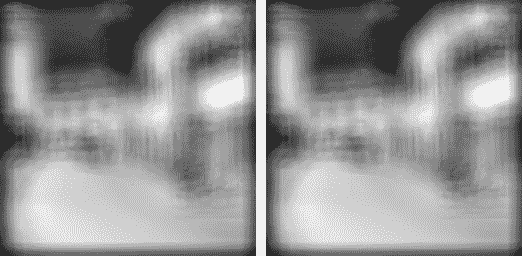

# 学习使用自然图像数据执行线性滤波

> 原文：<https://towardsdatascience.com/learning-to-perform-linear-filtering-using-natural-image-data-db289d0b0457?source=collection_archive---------3----------------------->

Traditional Norwegian hut in Skibotn (Image by author).

卷积神经网络通常从训练数据中学习有用的特征。根据任务的不同，第一个卷积层的特征可能代表训练数据的一些基本内容。例如，在图像数据中，所学习的特征可以表示边缘和斑点。在网络的后续层中，学习到的特征可以表示更抽象、更高级别的实体。

可视化所学习的特征，以及它们如何及时发展，可能提供关于网络如何学习的有用信息。实际上，网络架构几乎总是比仅仅几层深得多，这使得很难直观地解释和分析所学习的特征，因为卷积核的总量很高。

然而，我们可以演示卷积核权重如何随着网络通过受控实验的学习而随时间发展。很容易陈述学习任务，使得网络应该学习的特征已经预先知道，即产生训练数据的过程和参数被很好地定义并且完全在我们的控制之下。这可以通过构建一个极其简单的单层卷积网络并训练它使用各种内核执行线性滤波来实现。

在下面的实验中，我们将 Sobel 边缘滤波(图像处理和计算机视觉中边缘检测的典型方法)应用于数据集，并训练我们的模型来执行类似的线性映射。我们还试图从数据中学习更多的任意线性滤波器，其核的大小比 Sobel 滤波的情况稍大。

该演示有望建立关于神经网络中的卷积层如何对输入数据进行操作、卷积核权重如何在训练期间进行以及神经网络的训练如何可以被视为最小化问题的直觉。

首先，我们必须对输入图像数据 X 应用线性滤波，以便获得原始图像的滤波版本 Y。形式上，线性滤波操作可以总结如下:

线性滤波器是一种定义明确的操作，适用于我们能想到的任何参数集(卷积核)或输入数据。

我们现在可以建立一个单层、单核、卷积神经网络，它近似于线性滤波操作。毕竟，在线性滤波器和卷积神经网络中，两种情况下执行的计算完全相同，只是卷积核参数不同，我们将从数据中了解这一点。

我们可以在线性滤波器和卷积神经网络之间得出以下联系:

学习任务现在可以表述为最小化问题，其中线性滤波器的输出和卷积神经网络的输出之间的均方误差被最小化:

应用于图像数据的线性滤波器的参数被称为卷积核。我们将首先在 x 方向上，然后在 y 方向上，用称为 Sobel 算子的 3×3 卷积核来过滤图像数据，从而开始我们的实验。Sobel 算子给出如下:

对于实验，我们将使用运行在 TensorFlow 之上的 Keras 框架。

## x 方向的 Sobel 滤波器

首先，我们必须为图像预处理定义几个辅助函数。加载数据集，将图像转换为灰度，归一化图像强度范围，并对数据集中的每个图像执行线性滤波。

作为训练和测试数据，我们将利用城市和自然场景类别-数据集([奥利瓦，A. &托拉尔巴，A. (2001)。模拟场景的形状:麻省理工学院计算视觉认知实验室收集的空间包络](http://cvcl.mit.edu/Papers/IJCV01-Oliva-Torralba.pdf)的整体表示。

原始数据集由八个类别的自然场景彩色图像(分辨率:256 x 256)组成，其中我们使用了三个类别:街道、市中心和高楼。这样，我们获得了足够大小的训练和测试集(764 个训练样本和 192 个测试样本),使得训练不会遭受过拟合，并且训练也可以通过在合理的时间帧内利用更适中的硬件来执行。所选的类别代表具有强烈边缘的自然场景(大范围的人类建筑)，这有助于我们比较结果。

下面，我们可以观察到属于数据集的原始图像的可视化、图像的灰度转换和 Sobel 滤波版本:

Original image (left), Grayscale image (middle) and Sobel filtered image in x-direction (right).

我们将只在单通道图像上使用线性滤波器。在实践中，这意味着模型被训练成将灰度转换图像映射成 Sobel 滤波图像。

接下来，我们定义模型:具有线性激活的单层、单核、卷积网络，即，激活函数是恒等式。卷积核的大小被选择为 3×3，以符合 Sobel 滤波器的大小。

使用具有内斯特罗夫动量的随机梯度下降优化器来训练 100 个时期的模型。在每个时期，保存卷积层权重用于进一步可视化。

训练完成后，我们可以绘制训练和验证损失图，以查看训练是否过度拟合。

在整个训练过程中，训练和验证损失是稳定的，模型似乎是收敛的。

现在可以将每个时期的保存的权重可视化为矩阵格式的数值，以及更直观的格式，其中数值表示可视化中的像素强度值。声明用于执行可视化的函数，并且为每个时期创建可视化。

现在我们有了每个时期的可视化效果，我们可以从它们创建一个 gif 电影来看看权重是如何变化的。

The progress of the convolution layer weights as the model is trained. The weight values converge close to the Sobel operator in x-direction.

在 gif 电影中，随着学习的进行，卷积核权重如何向 Sobel x 方向滤波器收敛是相当明显的。在前 10 到 15 个时期收敛很快，之后收敛速度明显稳定下来。如果学习任务比我们在这个实验中使用的简单线性过滤操作更复杂，我们仍然会看到类似的行为。卷积核的值将收敛到某个最佳配置，该配置将从数据中提取有用的特征。在这个实验中，有用的特征是由 Sobel 算子给出的图像 x 方向的边缘。我们能够找到产生第一手训练数据的几乎精确的卷积核参数，主要是因为我们的问题陈述非常简单。然而，对于真实世界的问题，这很少发生，因为训练数据通常不是从输入到输出的线性映射。

为了测试该模型，我们可以看到与 x 方向上的 Sobel 滤波相比，该模型的预测看起来如何。

Output of the model (left) and the same image filtered with Sobel operator in x-direction (right).

在图中(顶部)，我们可以观察到模型的输出和 x 方向上并排的 Sobel 滤波的结果。目测，两幅图像看起来相似。事实上，在强度值中，人们应该仅发现图像之间的微小差异，因为所学习的卷积核收敛到接近原始 Sobel 算子的值。

## y 方向的 Sobel 滤波器

同样的代码也可以利用 Sobel 算子在 y 方向上执行线性滤波。我们所要做的就是改变图像过滤功能，在 y 方向而不是 x 方向执行过滤，再次加载并过滤训练数据，并用新数据训练模型。

在下图中，我们可以观察到 Sobel 过滤器现在如何在垂直方向(y 方向)上强调图像强度边缘。

Original image (left), Grayscale image (middle) and Sobel filtered image in y-direction (right).

我们可以再次观察到，当网络从训练数据中学习时，卷积核权重如何在 y 方向上朝着 Sobel 滤波器前进。收敛行为非常类似于先前在 x 方向上使用 Sobel 算子的情况。

The progress of the convolution layer weights as the model is trained. The weight values converge close to the Sobel operator in y-direction.

同样，在下图中，模型的输出和相同测试图像的 Sobel 滤波版本具有相似的外观。对于人眼来说，不可能分辨出这两幅图像的区别。

Output of the model (left) and the same image filtered with Sobel operator in y-direction (right).

## 笑脸过滤器

之前学习的 Sobel 滤波器非常简单，只需要学习少量的参数。让我们看看，如果我们可以学习一个更大的核线性滤波器。

我们将在下面的实验中使用的过滤器内核是一个 32 x 32 像素的笑脸(谢谢 Leo 的想法:)。加载过滤器内核，并通过用笑脸内核过滤灰度图像来创建训练数据。由于大的内核大小，内核基本上延伸到图像边界之外。图像边界用零填充，以抵消卷积导致的图像分辨率的降低。

The normalized smiley face filter kernel.

在下图中，我们可以看到笑脸过滤图像与原始图像和灰度转换图像相比的样子。

Original image (left), Grayscale image (middle) and smiley face filtered image (right).

我们的模型再次是一个简单的单层、单核、卷积神经网络，其中激活函数是身份。这一次，我们根据笑脸内核的大小，将内核大小设置为 32 x 32。作为对之前实验的增强，我们将基本的随机梯度下降优化器改为更强大的 Adam 优化器。

该模型被训练 100 个时期，并且在每个时期存储卷积核权重。训练和验证损失在大约 10 个时期内快速收敛，之后可以在两个损失值中看到小的波动。

存储的卷积核权重值现在可以可视化并组合成 gif 电影。结果很有启发性:该模型似乎惊人地学习了原始的笑脸过滤器内核，正如在下面的 gif 电影中可以观察到的那样。卷积核权重相对较早地呈现笑脸的形状，大约在十个时期之后，但是权重仍然包含大量噪声。随着训练的进行，噪声慢慢消失，并且相邻的权重值相对于彼此变得更加恒定。

通过分析验证损失和卷积核权重的进展，可以进行重要的观察。即使验证损失在第十个时期后看起来是平坦的，卷积核权重仍然朝着原始笑脸核发展足够的量。训练和验证损失曲线的线性比例有时可能会有点误导，因为初始损失值可能会在损失测量的后期改进中主导损失可视化。

The progress of the convolution layer weights as the model is trained. The weight values converge close to the smiley face filter.

现在我们有了一个训练好的模型，我们可以可视化并比较模型的输出和一个笑脸过滤测试图像的结果。在下图中，我们可以观察模型和笑脸过滤器内核如何产生与测试图像相似的外观。类似于 Sobel 滤波的图像，以及由从数据学习 Sobel 滤波的模型产生的图像，很难将笑脸滤波的图像与模型的输出区分开。

Output of the model (left) and the same image filtered with the smiley face kernel (right).

## 最后的话

我希望使用线性滤波器的三个实验足够清楚地展示了当网络从数据中学习时，卷积核权重是如何发展的。此外，我希望您能够获得一些见解，以便理解卷积层对输入数据的操作方式。这些实验的结果没有直接推广到卷积神经网络被用于例如图像分类的情况，而是为理解卷积层背后的现象和作为优化问题的学习提供了基础。

如果你对在自己的电脑上运行实验感兴趣，这里有一个 github 文件夹的链接，其中包含重复实验所需的一切:[https://github.com/vexcel/Keras-LearnLinearFilter](https://github.com/vexcel/Keras-LearnLinearFilter)。