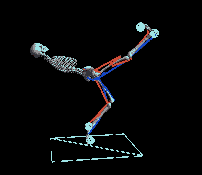
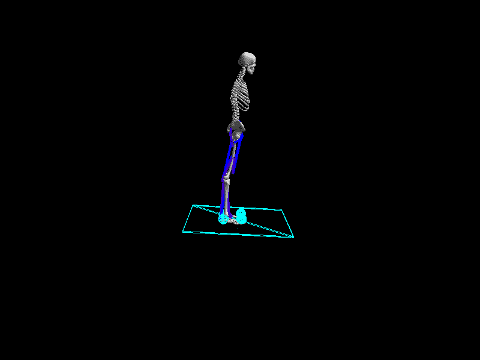
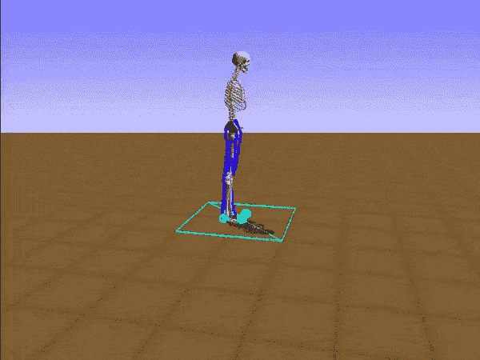

# 用应用于生物力学模型的进化算法学习行走

> 原文：<https://towardsdatascience.com/learning-to-walk-with-evolutionary-algorithms-applied-to-a-bio-mechanical-model-1ccc094537ce?source=collection_archive---------5----------------------->

## 使用真正的肌肉在类似人类的模型上行走。

*这个帖子的代码可以在* [*这个 GitHub 资源库*](https://github.com/normandipalo/learn-to-walk-with-genetic-algs) *中找到。*

**2017 NIPS 挑战**之一是*学习跑步*:顾名思义，任务是设计和开发一种学习算法，能够控制人体的**生物力学模型**使其行走。与大多数机器人情况不同，致动器是**腿** **肌肉**，每条腿 9 个。挑战的作者修改了 OpenSIM 环境，使其适应强化学习设置，从而增加了奖励信号。

Something went terribly wrong (or terribly right).

许多参与者设计了端到端的深度强化学习算法，近年来，这些算法在连续控制任务中表现得非常好。但是，通常情况下，他们需要强大的计算能力和时间来学习一个成功的策略，如果在多台计算机上并行化，效果会更好。

我决定试着玩玩它，实现并扩展我最近为机器人开发的一个相当轻量级的方法:**进化** **算法**应用于神经控制器。它们的优势是**无导数**和高度并行化，可以达到类似深度 RL 算法的结果，如 OpenAI 的[所示](https://blog.openai.com/evolution-strategies/)。问题是他们完全是随机的，因此很难估计他们会学到什么和如何学。但我很乐意给他们一个机会。

First steps, baby steps.

> …重要的是不要只开发性能最好的模型，因为它可能会陷入很难摆脱的局部最小值。

进化算法用于数值优化问题，因此它们相对于适应度函数优化参数。那么，什么是参数和适应度函数呢？经验证明:腿以周期性的方式运动。因此，肌肉激活以周期性和正弦时间规律激活，但是该规律可能难以手工设计。如何塑造周期函数？这就是傅立叶级数发挥作用的地方。利用傅立叶级数，人们可以用正弦和余弦的加权和来近似任何周期函数。但是，理论上，它们需要无限项。我设计了一个**截断傅立叶级数**来塑造肌肉活动。我只使用了余弦级数的前四项，因此有 8 个参数:4 个权重直接乘以不同频率的余弦，4 个相位改变信号。这为每块肌肉创造了一个周期性的功能。每条腿有 9 块肌肉，我使用了 9 个不同的周期函数，因为我假设，对于另一条腿，我们使用相同的函数，但相位偏移 180°。因此，遗传算法修改这些参数(与涉及神经网络的任何算法相比，非常少)来优化适应度函数，这显然是总回报，即机器人在摔倒之前行走的长度。

Walking pattern after around a day of training.

通过从白高斯采样，参数被随机修改，但是如果特定采样方向改善了性能，则参数再次朝着该方向更新以利用该方向，直到性能不再改善。我并行运行了**的三个型号**，因为对于一台笔记本电脑来说，它们的计算量比内存都要大。最佳性能权重被存储到中央参数文件中，并且在一定数量的集之后，学习**从三个最佳性能参数组**重新开始。这允许更好地探索不同的可能行为:重要的是不要只利用表现最好的模型，因为它可能陷入很难摆脱的局部最小值，而从长远来看，一个更差的模型可以通过调整其行为来超越它。事实上，在一系列事件后从最好的模型重新开始是学习可感知的行走模式的关键因素。非常值得注意的是，即使事先没有任何知识，这个模型也能学会类似人类的动作行为。

该模型在非常慢的模型和旧笔记本电脑上进行相对较短的训练后，仅使用英特尔酷睿 2 双核 CPU 成功行走了一些步骤。其他深度 RL 模型显然实现了更好的性能，但是需要非常长的训练和强大的硬件。我的目标并不是真的与它们竞争，而只是展示如何用不到 100 个参数并使用遗传算法来获得行走模式，即使在一台旧笔记本电脑上也能快速训练。

*这个帖子的代码可以在* [*这个 GitHub 资源库*](https://github.com/normandipalo/learn-to-walk-with-genetic-algs) *中找到。*