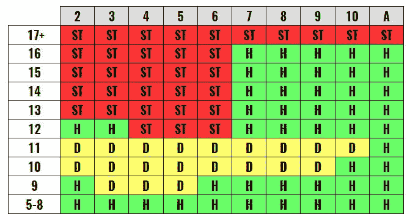

# 学习用蒙特卡罗方法赢 21 点

> 原文：<https://towardsdatascience.com/learning-to-win-blackjack-with-monte-carlo-methods-61c90a52d53e?source=collection_archive---------6----------------------->


Photo by [Sam Goh](https://unsplash.com/@samgoh_?utm_source=medium&utm_medium=referral) on [Unsplash](https://unsplash.com?utm_source=medium&utm_medium=referral)

# 我会学到什么？

本文将带您了解强化学习的基础支柱之一蒙特卡罗(MC)方法背后的逻辑。这种解决强化学习问题的经典方法将通过寻找简化版 21 点的最优策略来演示。

在本文结束时，我希望你能够描述和实现以下主题。完整的代码可以在我的 [GitHub](https://github.com/djbyrne/MonteCarlo) 上找到。

*   蒙特卡洛预测
*   蒙特卡洛控制
*   首次就诊与每次就诊
*   q 值
*   折扣奖励

# 蒙特卡洛方法是什么？


Photo by [Pasquale Iovino](https://unsplash.com/@pask_07?utm_source=medium&utm_medium=referral) on [Unsplash](https://unsplash.com?utm_source=medium&utm_medium=referral)

MC 是一个非常简单的无模型学习的例子，只需要过去的经验就可以学习。这是通过计算在许多游戏中在特定状态下采取特定行动的平均奖励来实现的。如果你不熟悉强化学习的基础，我会鼓励你快速阅读基础知识，如代理生命周期。我之前的文章介绍了这些概念，可以在这里找到。如果你不熟悉 21 点游戏，看看这个[视频](https://www.youtube.com/watch?v=qd5oc9hLrXg)。

# 在 21 点中使用蒙特卡罗

如果你曾经认真玩过 21 点(或者我看过电影《21 小时》)，那么你可能听说过“基本策略”。这是一个简单的表格，包含 21 点中每种可能的状态组合(您的牌的总和和庄家显示的牌值)，以及根据概率和统计采取的最佳行动(击中、坚持、加倍或分裂)。这是一个政策的例子。



Simple version of the basic strategy policy developed by Edward O. Thorp, image taken from [here](https://www.blackjackarmy.com/images/blackjack-basic-strategy-card.jpg)

在我们的示例游戏中，我们将使它变得简单一点，只有击中或坚持的选项。除此之外，我们还会将状态逻辑分为两种类型，一手牌有可用的 a，一手牌没有可用的 a。

在 21 点中，a 的值可以是 1 或 11。如果我们有一张值为 11 的 a 而不破产，我们称之为“可用 a”。

# 预言；预测；预告

假设我们得到了一个非常简单的策略(甚至比上面的基本策略还要简单)。

**策略:**如果我们的手牌≥ 18，以 80%的概率坚持，否则以 80%的概率命中

这不是一个惊人的政策，但它很简单，仍然能够赢得一些比赛。现在，假设我们想知道当庄家出 6 时，持有 14 手牌的价值。这是预测问题的一个例子。

为了解决这个问题，我们将使用首次访问蒙特卡洛。这种方法让我们的代理使用我们当前的策略玩了成千上万个游戏。每次代理在该游戏中第一次执行状态 S 中的动作 A 时，它将从该点开始计算游戏的奖励。通过这样做，我们可以确定我们目前的状态有多有价值。

这与每次访问蒙特卡洛相反，蒙特卡洛每次看到状态/动作对时都会计算奖励。这两种方法提供了相似的结果。实施首次访问蒙特卡洛的步骤可以在这里看到。


First Visit Monte Carlo algorithm for prediction, taken from [here](https://github.com/udacity/deep-reinforcement-learning/blob/master/cheatsheet/cheatsheet.pdf)

如果你不习惯阅读这些算法，这可能看起来有点复杂，但实际上很简单。让我们来看一下实现这个算法的步骤。

1.  提供一个策略 pi
2.  创建空字典 N、returns_sum 和 Q 来保存一个状态/动作对被访问的次数、该状态/动作对收到的返回量以及该状态/动作对的最终值。
3.  用我们目前对 X 游戏的政策玩一局 21 点
4.  循环游戏中的每个回合，检查当前的状态/动作对是否在游戏中出现过
5.  如果这是我们第一次看到这一对，我们增加这一对的计数，并将从该回合开始的每一步的折扣奖励添加到我们的 returns_sum 字典中
6.  最后，用每个状态/动作对的回报和数量的平均值来更新 Q 值。

在我们进入代码之前，我想快速介绍的最后一件事是折扣奖励和 Q 值的概念。

## 折扣奖励

折扣奖励的理念是将眼前的奖励置于潜在的未来奖励之上。就像专业的国际象棋选手一样，我们的代理人不仅仅着眼于在本回合中走一个卒，他们还着眼于如何从现在开始赢得 12 步棋。这就是为什么在计算行动价值时，我们采用累积折扣奖励(行动后所有奖励的总和)而不是直接奖励。

折扣因子只是一个常数，我们在每个时间点用它乘以我们的奖励。在每一个时间步之后，我们增加乘以折扣因子的幂。这给了立即行动更多的优先权，当我们离采取的行动越远，优先权就越低。


the discounted reward of an action over time, image taken from [here](https://cdn-images-1.medium.com/max/1600/0*kvtRAhBZO-h77Iw1.)

这给了立即行动更多的优先权，当我们离采取的行动越远，优先权就越低。选择我们的折扣因子的值取决于手头的任务，但它必须总是在 0 和 1 之间。折扣系数越大，未来奖励的重要性越高，反之亦然。一般来说，0.9 的折扣系数是一个很好的起点。

## q 值

q 值是指在状态 s 中采取行动 A 的值。我们将这些值存储在一个表或字典中，并在学习时更新它们。一旦我们完成了我们的 Q 表，我们将总是知道基于我们所处的当前状态该采取什么行动。

## 履行

下面是一个 jupyter 笔记本，带有实现 MC 预测的代码。每一部分都有注释，并且逐行给出了更多的细节。

如您所见，实现预测算法并不困难，根据笔记本末尾显示的图表，我们可以看到该算法已经成功预测了我们非常简单的 21 点策略的值。接下来是控制。

# 控制


Photo by [Mélanie THESE](https://unsplash.com/@0_astrea?utm_source=medium&utm_medium=referral) on [Unsplash](https://unsplash.com?utm_source=medium&utm_medium=referral)

这是两个问题中更有趣的一个，因为现在我们要用 MC 来学习博弈的最优策略，而不是仅仅验证之前的策略。我们将再次对 MC 使用首次访问方法。


First Visit MC Control with Constant Alpha, image taken from [here](https://github.com/udacity/deep-reinforcement-learning/blob/master/cheatsheet/cheatsheet.pdf)

这个算法看起来比之前的预测算法复杂一点，但本质上还是很简单的。因为这有点复杂，我将把问题分成几个部分来解释。

1.  初始化我们的价值观和字典
2.  探测
3.  更新策略
4.  使用新策略生成剧集
5.  更新 Q 值

## 1)初始化值

这与上一个算法类似，只是这次我们只有一个字典来存储我们的 Q 值。这是因为我们使用了一个新的更新功能，我们将在后面讨论

## 2)更新政策和探索

人们通过不断犯新错误来学习。我们的代理人也是这样学习的。为了学习最好的政策，我们希望有一个很好的组合来执行我们已经学到的好的举措和探索新的举措。这就是所谓的勘探/开发问题。在这种情况下，我们将使用经典的ε贪婪策略，其工作原理如下:

1.  设置一个临时策略，使选择任一操作的概率相等，[0.5，..
2.  获取当前状态 Q[s]的当前最佳策略
3.  获得基于最佳策略的最佳操作，argmax(Q[s])
4.  将选择最佳行动的概率设置为 1-ε+临时策略值(50%)

开始时，ε会很大，这意味着在大多数情况下，最佳行动的概率为 0.5(随机)。随着游戏的进行，ε会减小，采取最佳行动的概率会增加

## 3)用新策略生成剧集

这与我们之前的算法几乎完全相同，但是我们不是基于硬编码策略的概率来选择我们的行动，而是在随机行动和最佳行动之间交替。这就是我们之前讨论过的ε贪婪策略。当我们浏览时，我们记录下每集的状态、动作和奖励，并传递给我们的更新功能。

## 4)更新 Q 值

这是算法的重要部分。这里我们实现了代理如何学习的逻辑。我们将使用一个更新函数来改进我们的策略，而不是简单地获得一个状态/动作对随时间的平均回报。函数看起来是这样的。

```
Q[s][a] = Q[s][a] + alpha*(G - Q[s][a])
```

我们在这里所做的就是获取原始的 Q 值，并添加我们的更新。更新由剧集的累积奖励(G)和减去旧的 Q 值组成。然后这些都乘以α。

在这种情况下，阿尔法作为我们的学习率。一个大的学习率将意味着我们很快取得进步，但是它冒着做出太大改变的风险。


虽然它最初会很快取得进展，但它可能无法找出它正在学习的任务的更微妙的方面。另一方面，如果学习率太小，代理将学习任务，但这可能会花费很长的时间。就像机器学习中的大多数事情一样，这些是重要的超参数，您必须根据项目的需要进行微调。

## 履行

现在我们已经学习了控制算法的理论，我们可以开始写代码了。

现在，我们已经成功地生成了自己的玩 21 点的最佳策略。你会注意到原始的硬编码策略和我们新的最优策略是不同的，我们的新策略反映了 Thorps 的基本策略。

# 结论

我们现在知道如何使用 MC 来寻找 21 点的最优策略。不幸的是，仅凭这一策略，你不会很快赢得很多钱。这个游戏的真正复杂性在于知道何时以及如何下注。一个有趣的项目是将这里使用的策略与关于如何正确下注的第二个策略结合起来。

我希望你喜欢这篇文章，并找到一些有用的东西。任何反馈或意见总是很感谢。完整代码可以在我的 [GitHub](https://github.com/djbyrne/MonteCarlo) 上找到

# 参考资料:

萨顿 r .和巴尔托 a .——*强化学习:导论*，麻省理工学院出版社，1998 年

Udacities RL 资源库:【https://github.com/udacity/deep-reinforcement-learning 

Denny Britz 知识库:[https://github . com/Denny Britz/reinforcement-learning/blob/master/MC/MC % 20 prediction % 20 solution . ipynb](https://github.com/dennybritz/reinforcement-learning/blob/master/MC/MC%20Prediction%20Solution.ipynb)

***来自《走向数据科学》编辑的注释:*** *虽然我们允许独立作者根据我们的* [*规则和指南*](/questions-96667b06af5) *发表文章，但我们并不认可每个作者的贡献。你不应该在没有寻求专业建议的情况下依赖一个作者的作品。详见我们的* [*读者术语*](/readers-terms-b5d780a700a4) *。*