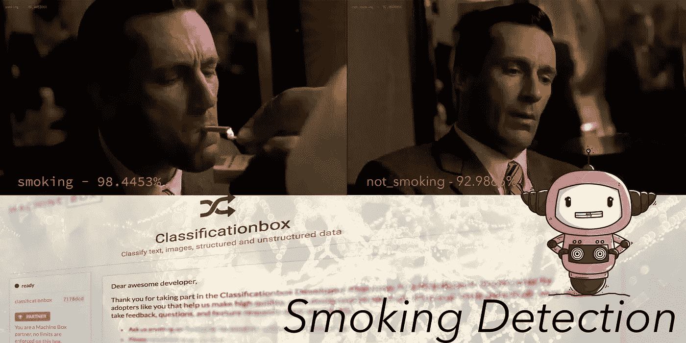
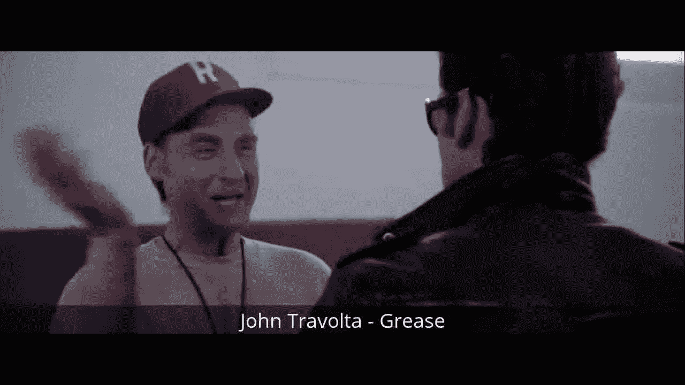

# 利用机器学习构建视频烟雾探测器

> 原文：<https://towardsdatascience.com/lessons-learned-building-a-smoking-detector-for-video-with-machine-learning-5a0e93dfa8ec?source=collection_archive---------16----------------------->



Results from a smoking detection classification model

作为一个花了很多时间与实现机器学习的媒体公司合作的人，我被问及很多关于在视频中检测吸烟的能力。对于向其他国家分发媒体内容来说，这是一个大问题，但它也要求我们就人工智能的现状提出一些棘手的问题。这个故事记录了我试图建立和测试一个机器学习模型来检测电影中人们何时吸烟的尝试，也是我所学的总结。

## 为什么抽烟？



Come on Johnny — stop blowing smoke in my face

吸烟实际上是一个很难分类的行为，甚至只是想想这个问题就迫使你在 computer-sand 中画一些线，这对建立机器学习模型很重要。吸烟仅仅是吸一口烟的行为吗？点根烟怎么样？或者只是用手指捏着一根冒烟的白棍子？如果你在屏幕上看不到香烟，但有一些白烟从角色的鼻子或嘴里冒出来，这是吸烟吗？

不同的国家对电影和电视中如何描述吸烟有不同的规定。例如，在土耳其，电视广播不得不模糊吸烟的内容。搞砸了会让你被政府罚款。

因此，如果我们能够建立一个机器学习模型来检测电影或电视中的吸烟，我们可能能够帮助一些人节省大量时间和金钱，而不用手动操作。

但是从图像识别的角度来看，这是一个很难解决的问题。

> 我在之前已经[写过关于视频图像识别能力的挑战，所以如果你想了解更多，请阅读…我会等的。](https://hackernoon.com/integrating-ai-here-are-3-problems-youre-about-to-encounter-f0f89414608f)

## 培养

我们希望检测电影中的吸烟，因此训练数据的自然来源是人们吸烟的电影。在 YouTube 上快速搜索发现了几个视频，本质上是电影中人们吸烟的超级剪辑。

成功的关键是找到有人们吸烟镜头的视频，以及同样的人，最好是在同一个场景，不吸烟的镜头。这是关键。你需要告诉分类器什么是吸烟，就像你需要告诉它什么不是吸烟一样。

因此，我打开了 good ol' iMovie，将 YouTube 视频放入项目中。然后我仔细检查并精心编辑了人们吸烟的画面。我对嘴里叼着香烟的人划清界限。我保存了那个奇怪的新视频，并将其导出到一个文件中。


然后我编辑了一串相同场景的画面，但是在香烟进入嘴里之前或之后(多么奇怪的句子)。


现在我有两个视频，长度略有不同，一个有吸烟，另一个没有。下一步是将它们切成帧，以便我可以教授机器学习模型。

幸运的是，这部分很容易。只要打开终端，确保你已经安装了 [FFMPEG](https://www.ffmpeg.org/download.html) ，并输入以下命令:

```
$ffmpeg -i path/tp/video.mp4 path/to/output/label%04d.jpg -hide_banner
```

在每个视频上运行，把你所有的帧放进标有“吸烟”和“不吸烟”的文件夹里。

现在，您可能在每个文件夹中有不同数量的 jpegs，所以我们将不得不删除一些以确保两个类以平衡的方式训练。如果一个类太多，模型就会偏向那个类。但是你也不能仅仅从一个类中选择 X 个文件来删除，你必须随机地删除这些文件，以免进一步影响模型。

我花了太多时间在网上搜索，试图找出如何从文件夹中随机删除 X 个文件。我最终使用了这个终端命令(N 是您想要删除的文件数):

`$ ls |sort -R |tail -$N |xargs rm`

好了，现在我们在每个文件夹中有相同数量的图像，是时候使用一些由[机器盒](https://machinebox.io/?utm_source=Medium&utm_medium=Post&utm_campaign=Smoking%20detector)提供的漂亮工具了。

下载并运行开源工具`[imgclass](https://github.com/machinebox/toys/tree/master/imgclass)`，它会为你处理大量训练和验证数据的困难部分。它要求你有[分类框](https://machinebox.io/docs/classificationbox?utm_source=Medium&utm_medium=Post&utm_campaign=Smoking%20detector)在后台运行，所以确保你已经下载了。

当您运行 imgclass 时，它将:

1.  扫描目录。
2.  分离出 80%的数据，用这些数据来教机器学习模型。
3.  用剩余的 20%数据验证准确性。

当我这样做的时候，我得到了大约`97%`的精确度，这似乎高得令人怀疑。我可能让模型过拟合了[，但是为了确定，我们必须测试。](http://statisticsbyjim.com/regression/overfitting-regression-models/)

## 测试

所以我现在有了一个经过训练的机器学习模型，可以检测视频中的吸烟情况。但不知道效果如何。我需要找到其他不属于训练集的人们吸烟的视频。所以我回到 YouTube，下载了一段《广告狂人》的视频。我知道，只是从编辑训练数据，没有场景从[广告狂人](https://www.imdb.com/title/tt0804503/?ref_=nv_sr_1)在训练集，所以这应该是一个很好的测试。但是怎么考呢？

这是最难的部分。我需要将视频分割成帧，并在 Classificationbox 中针对训练好的模型运行每一帧，然后评估结果。

“但是你是怎么做到的呢？”我对着猫尖叫。

如果你有任何脚本印章，他们将在这一点上派上用场。如果你没有，你需要使用一个平台来处理视频，训练[分类框](https://machinebox.io/docs/classificationbox?utm_source=Medium&utm_medium=Post&utm_campaign=Smoking%20detector)(或其他机器学习模型)，并在某种 UI 中显示结果，这样你就可以验证准确性。我使用的一个非常方便的程序叫 aiWARE，它可以让你[注册](https://www.veritone.com/onboarding/#/signUp?type=developer)并免费运行这类测试，而不需要写任何代码。

如果你对写代码感兴趣，那么你会发现接下来的这一点令人厌恶。这里有一个 [Golang](http://golang.org) 脚本，我用机器学习模型来验证一个视频文件(在文件夹中被分割成帧)，将结果打印到帧上，并将该帧输出为 PNG。然后，我可以使用 FFMPEG 将所有打印的帧组合成一个视频，作为后期处理。

下面是一个输出示例:


如果我更擅长计算机，我可能会想出如何让那个该死的标签变得更大，但是我会把它留给真正的程序员去想(可能很快)。

接下来，我将所有帧拼接成一个视频，以便我可以观看整个场景，并判断我的机器学习模型。

```
$ ffmpeg -i [label]%04d.png -c:v libx264 -r 30 -pix_fmt yuv420p out.mp4
```


注意到左上角的小标签了吗？戴上你的眼镜…现在你看到了吗？这是一个很好的方式来直观地看到你的模型在任何给定的视频上做得有多好。分数也很重要，因为它从模型中给你一些反馈，告诉你你发送给它的东西在一个特定的类中有多确定。

一旦你在 10 个视频中尝试了这种方法，你将开始看到置信度的一种模式，你可以开始忽略任何低于某个阈值的东西。

## 太好了，现在怎么办？

让吸烟检测为您的用例工作的关键是实验。如果你有合适的工具，实验会很简单，也很划算。

现在我已经从我的模型中获得了一些反馈，我可能会尝试教它越来越多的吸烟和不吸烟的例子，看看我是否可以减少假阳性和假阴性。

理想情况下，我会从我的真实用例中尽可能多地抓取例子，并将其分解成框架进行教学。

分类框的好处在于它支持在线教学。您可以在它运行时教授它，而不必重新部署或经历昂贵的培训周期。随着时间的推移，当你从它自己的结果中给它反馈时，这让你逐渐地改进它。

这是机器学习成功的秘诀。我无数次看到它工作。把精力花在你的训练数据上。

> 根据您的数据训练的模型将始终优于根据通用数据训练的模型。

所以现在你有了自己做这件事的工具。如果你用自己的[分类框](https://machinebox.io/docs/classificationbox?utm_source=Medium&utm_medium=Post&utm_campaign=Smoking%20detector)或者在 aiWARE 内部开发了一个很棒的模型，请确保你截取了一些截图，在 Medium 上与我们分享，或者通过推特发给我们[玛奇纳](https://medium.com/u/591d020e95d3?source=post_page-----5a0e93dfa8ec--------------------------------)——@ machineboxio