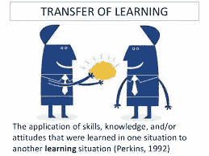

# 将深度学习应用于无大数据的自然语言处理的经验教训

> 原文：<https://towardsdatascience.com/lessons-learned-from-applying-deep-learning-for-nlp-without-big-data-d470db4f27bf?source=collection_archive---------4----------------------->

作为一名数据科学家，你最重要的技能之一应该是为你的问题选择正确的建模技术和算法。几个月前，我试图解决一个文本分类问题，即对哪些新闻文章与我的客户相关进行分类。

我只有几千个带标签的例子，所以我从简单的经典机器学习建模方法开始，如 TF-IDF 上的逻辑回归。这些模型通常对长文档(如新闻文章)的文本分类很有效，但在这项任务中的表现仅略好于 random。

在调查了我的模型的错误后，我发现单词包表示法对于这项任务来说是不够的，我需要一个模型，它将使用对文档更深层次的语义理解。

深度学习模型在翻译、问答、摘要、自然语言推理等需要深度理解文本的复杂任务中表现非常好。因此，这似乎是一个很好的方法，但深度学习通常是在成千上万甚至数百万的标记数据点上训练的，而我的数据集要小得多。

通常，我们需要大数据集进行深度学习，以避免过拟合。深度神经网络有许多许多参数，因此通常如果它们没有足够的数据，它们往往会记住训练集，在测试集上表现不佳。为了避免这种没有大数据的现象，我们需要使用特殊的技术。

在这篇文章中，我将展示我在文章、博客、论坛、Kaggle 和更多资源中找到的或我自己开发的一些方法，以便在没有大数据的情况下，让深度学习在我的任务中更好地工作。这些方法中有许多是基于计算机视觉中广泛使用的最佳实践。

一个小小的免责声明:我不是深度学习专家，这个项目是我第一个深度学习的大项目之一。这篇文章的所有内容都是基于我的经验，可能会在你的问题上有所不同。

# 正规化

正则化方法是在机器学习模型中以不同方式使用的方法，以避免过度拟合，这些方法具有强大的理论背景，并以通用的方式处理大多数问题。

**L1 和 L2 正规化**

这些方法可能是最古老的，并在许多机器学习模型中使用了许多年。在这种方法中，我们将权重大小添加到我们试图最小化的模型损失函数中。这样，模型将尝试使权重变小，对模型没有显著帮助的权重将减少到零，并且不会影响模型。这样，模型可以用来记忆训练集的权重数量就少得多。更多解释，可以阅读[这篇](/only-numpy-implementing-different-combination-of-l1-norm-l2-norm-l1-regularization-and-14b01a9773b)的帖子。

**辍学**

Dropout 是另一种较新的正则化方法，它建议在训练时间内，神经网络中的每个节点(神经元)将以概率 p 被丢弃(权重将被设置为零)，这样，网络就不能依赖于特定的神经元或神经元的交互，而必须学习网络不同部分的每个模式。这使得模型关注于归纳为新数据的重要模式。

**提前停车**

早期停止是一种简单的正则化方法，只需监控您的验证集性能，如果您发现验证性能停止提高，请停止训练。这种方法在没有大数据的情况下非常重要，因为模型往往会在 5-10 个时期甚至更早之后开始过度拟合。

**少量参数**

如果你没有一个大的数据集，你应该非常小心层的数量和每层中神经元的数量。此外，卷积层等特殊层的参数比全连接层少，因此当它们适合您的问题时使用它们非常有帮助。

# 数据扩充

数据扩充是一种通过以标签不变的方式更改训练数据来创建更多训练数据的方法。在计算机视觉中，许多图像变换用于增加数据集，如翻转、裁剪、缩放、旋转等。

Image data augmentation example

这些转换对图像数据很好，但对文本无效，例如，翻转“狗喜欢我”这样的句子不是有效的句子，使用它会使模型学习垃圾。以下是一些文本数据扩充方法:

**同义词替换**

在这种方法中，我们将文本中的随机单词替换为它们的同义词，例如，我们将把句子“我非常喜欢这部电影”改为“我非常爱这部电影”，这仍然具有相同的含义，并且可能具有相同的标签。这种方法对我不起作用，因为同义词有非常相似的词向量，所以该模型将两个句子视为几乎相同的句子，而不是一个扩充。

**反向翻译**

在这种方法中，我们获取文本，用机器翻译将其翻译成中间语言，然后再翻译回英语。这种方法在 Kaggle 毒性评论挑战中被成功使用。例如，如果我们将“我非常喜欢这部电影”翻译成俄语，我们会得到“мнеоченьнравитсяэтотфильм”，当我们翻译回英语时，我们会得到“我真的很喜欢这部电影”。反向翻译方法不仅像第一种方法一样给我们提供了同义词替换，而且它可以添加或删除单词，并在保留相同含义的情况下改写句子。

**文件裁剪**

新闻文章很长，在查看数据时，我发现我不需要所有的文章来对文档进行分类。另外，我看到文章的中心思想通常会重复几次。这让我想到把文章裁剪成几个子文档作为数据扩充，这样我会有更多的数据。首先，我尝试从文档中抽取几个句子并创建 10 个新文档。这创建了句子之间没有逻辑关系的文档，所以我得到了一个糟糕的分类器。我的第二个尝试是把每篇文章分成 5 个连续的句子。这种方法工作得非常好，给了我一个很好的性能提升。

**生成对抗网络**

GANs 是数据科学中最令人兴奋的最新进展之一，它们通常被用作图像创建的生成模型。[这篇博文](/generative-adversarial-networks-for-data-augmentation-experiment-design-2873d586eb59)解释了如何使用 GANs 对图像数据进行数据扩充，但它也可能用于文本。

# 迁移学习

迁移学习是使用一个网络的权重，这个网络是针对另一个问题训练的，通常是针对你的问题的一个大数据集。迁移学习有时用作一些层的权重初始化，有时用作我们不再训练的特征提取器。在计算机视觉中，从预先训练的 Imagenet 模型开始是解决问题的一种非常常见的做法，但 NLP 没有像 Imagenet 那样的非常大的数据集，可以用于迁移学习。

**预训练的单词向量**

NLP 深度学习架构通常从一个嵌入层开始，该嵌入层将一个热编码单词转换为数字向量表示。我们可以从头开始训练嵌入层，但我们也可以使用预先训练的词向量，如 Word2Vec、FastText 或 Glove，它们使用无监督学习方法在大量数据上进行训练，或在来自我们领域的数据上进行训练。预先训练的单词向量非常有效，因为它们给出了基于大量数据的单词的模型上下文，并且减少了模型的参数数量，这显著降低了过度拟合的机会。你可以在这里阅读更多关于单词嵌入[的内容。](https://www.springboard.com/blog/introduction-word-embeddings/)

**预先训练好的句子向量**

我们可以将模型的输入从单词改为句子，这样我们就可以用更少的参数得到更小的模型，但仍然有足够的表达能力。为了做到这一点，我们可以使用预先训练好的句子编码器，如脸书的[推断器](https://github.com/facebookresearch/InferSent)或谷歌的[通用句子编码器](https://tfhub.dev/google/universal-sentence-encoder/1)。我们还可以使用像跳过思维向量或语言模型这样的方法，在我们领域的未标记数据上训练句子编码器。你可以从我的[上一篇博文](https://blog.myyellowroad.com/unsupervised-sentence-representation-with-deep-learning-104b90079a93)中了解更多关于无监督句子向量的知识。

**预训练语言模型**

最近的论文如 [ULMFIT](https://arxiv.org/abs/1801.06146) 、 [Open-AI transformer](https://blog.openai.com/language-unsupervised/) 和 [BERT](https://arxiv.org/abs/1810.04805v1) 通过在非常大的语料库上预先训练语言模型，在许多 NLP 任务中获得了惊人的结果。语言模型是一项利用前面的单词来预测句子中的下一个单词的任务。对我来说，这种预先训练并没有真正有助于获得更好的结果，但是这些文章展示了一些我没有尝试过的有助于更好的微调的方法。这是一个关于预训练语言模型的伟大博客。

**无监督或自我监督学习的预培训**

如果我们有一个来自我们领域的未标记数据的大型数据集，我们可以使用无监督的方法，如自动编码器或屏蔽语言模型，仅使用文本本身来预训练我们的模型。另一个对我更有效的选择是自我监督。自监督模型是自动提取标签而无需人工标注的模型。一个很好的例子就是 Deepmoji 项目。在 Deepmoji 中，作者训练了一个模型来预测推文中的表情符号，在表情符号预测中获得良好结果后，他们使用他们的网络预训练了一个推文情绪分析模型，获得了最先进的结果。表情预测和情感分析显然非常相关，因此作为预训练任务，它表现得非常好。新闻数据的自我监督任务可以预测标题、报纸、评论数量、转发数量等等。自我监督可能是一种非常好的预训练方式，但通常很难判断什么样的代理标签将与您的真实标签相关联。

**与公司网络中的其他人一起进行预培训**

在许多公司中，许多机器学习模型都建立在相同的数据集或不同任务的相似数据集上。例如，对于推文，我们可以预测它的主题、情绪、转发次数等等。用一个已经在使用的网络对你的网络进行预训练可能是能做的最好的事情，对于我的任务来说，它给了性能一个很好的提升。

# 特征工程

我知道深度学习“扼杀”了特征工程，而且这样做有点过时了。但当你没有大数据时，用特征工程帮助网络学习复杂模式可以大大提高性能。例如，在我对新闻文章的分类中，作者、报纸、评论数量、标签和更多特征可以帮助预测我们的标签。

**多模态建筑**

我们可以使用多模态架构将文档级的特性结合到我们的模型中。在 multimodal 中，我们建立两个不同的网络，一个用于文本，一个用于特征，合并它们的输出层(没有 softmax)并添加几个层。这些模型很难训练，因为特征通常比文本具有更强的信号，因此网络主要学习特征效应。[这是一本关于多式联运网络的很好的 Keras 教程。这种方法只提高了我不到 1%的性能。](https://becominghuman.ai/neural-networks-for-algorithmic-trading-multimodal-and-multitask-deep-learning-5498e0098caf)

**词级特征**

另一种类型的特征工程是单词级特征，如词性标注、语义角色标注、实体提取等等。我们可以将一个热编码表示或单词特征的嵌入与单词的嵌入相结合，并将其用作模型的输入。我们还可以在这种方法中使用其他单词特征，例如在情感分析任务中，我们可以使用情感词典，并为嵌入添加另一个维度，其中 1 表示我们词典中的单词，0 表示其他单词，这样模型可以轻松地学习它需要关注的一些单词。在我的任务中，我添加了某些重要实体的维度，这给了我一个很好的性能提升。

**作为特征工程的预处理**

最后一种特征工程方法是以一种模型更容易学习的方式对输入文本进行预处理。一个例子是特殊的“词干”，如果运动对于我们的标签不重要，我们可以将足球、棒球和网球改变为单词 sport，这将帮助网络了解运动之间的差异并不重要，并且可以减少网络中的参数数量。另一个例子是使用自动汇总。正如我之前所说，神经网络在长文本上表现不佳，所以我们可以对我们的文本运行类似“文本排名”的自动摘要算法，只给网络重要的句子。

# 我的模型

在我的案例中，在尝试了我在这篇文章中讨论的方法的不同组合后，最佳模型是来自[这篇](https://www.cs.cmu.edu/~hovy/papers/16HLT-hierarchical-attention-networks.pdf)文章的分层注意力网络，其中退出和提前停止作为正则化，文档裁剪作为数据扩充。我使用了预先训练的单词向量，并对我的公司为该客户在相同数据上完成的另一项任务进行了预先训练。作为特征工程，我在单词嵌入中加入了实体单词级特征。基本模型的这些变化使我的准确性提高了近 10%,这使我的模型从略好于随机的模型变成了具有有价值的业务影响的模型。

使用小数据的深度学习作为一个研究领域仍处于早期阶段，但看起来它越来越受欢迎，特别是在预先训练的语言模型中，我希望研究人员和从业者将找到更多方法，使深度学习对每个数据集都有价值。

希望你喜欢我的帖子，非常欢迎你阅读和关注我的[博客](https://medium.com/@yonatan.hadar)。