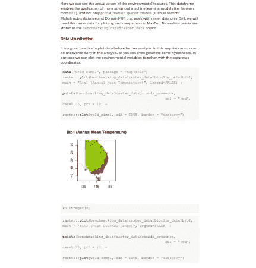

# 构建 R 包的经验教训

> 原文：<https://towardsdatascience.com/lessons-learned-from-building-an-r-package-75d5263d3814?source=collection_archive---------8----------------------->


Make sure to have a hexagon logo ;)

我最近完成了我的 R 包的第一个发布版本，叫做`sdmbench`([https://github.com/boyanangelov/sdmbench](https://github.com/boyanangelov/sdmbench))。这个过程比我想象的要难，也出乎意料。在这里，我将向您提供一些我辛苦学到的经验，如果您打算构建自己的包，希望它们是有用的。

先说要点:

## 为什么您应该构建 R 包

R 在数据科学中如此受欢迎的原因之一是可用的开源软件包的数量(在 [CRAN](http://cran.r-project.org/) 上超过 10，000 个)。即使是一个在神秘领域工作的人，也一定能找到至少一个可以满足她/他需求的包。为这个庞大的社区做贡献本身就是一种强大的动力。

即使你有更自私的动机，如果它们变得流行，编写 R 包可以为你提供大量曝光。作为软件包作者所获得的信誉可能是一笔宝贵的职业资产。

最后，这也是组织工作的好方法。通常在数据科学中，你会在项目之间重用许多函数，最好是(保持干燥)将它们分开组织，并在需要时从包中调用它们。

## 入门指南

开始可能会让人不知所措，因为编写包涉及许多不熟悉的软件工程实践(例如单元测试和文档)。我读了哈德利·韦翰(是的，又是他)写的非常有条理的电子书，得到了很多帮助:[http://r-pkgs.had.co.nz/](http://r-pkgs.had.co.nz/)。这是我在整个过程中的参考手册。

第一步是要有一个明确的目标，你想在包中包含什么功能，并相应地组织它们。良好的命名在这里是必不可少的，我更喜欢过于冗长而不是相反(看看[这篇](https://journal.r-project.org/archive/2012/RJ-2012-018/RJ-2012-018.pdf)论文)。确保选择正确的抽象层次。大函数应该分解成小函数。

以下是好的和坏的对象名的例子，来自 Hadley 的[风格指南](http://adv-r.had.co.nz/Style.html):

```
*# Good*
day_one
day_1*# Bad*
first_day_of_the_month
DayOne
dayone
djm1
```

## 证明文件

编写函数文档有助于阐明你头脑中关于函数应该如何工作的许多想法。这就是为什么你应该这样做的原因之一，即使你不打算和其他人分享这个包。所提供的约束(即，您需要提供关于所有函数参数的信息)有助于迫使您变得彻底。

## 测试

正如 Hadley 在他的书中提到的，R 开发人员经常手工测试他们的代码。我认为这是因为 R 在设计上并不是一种通用的编程语言，因此它经常被用在不需要明确进行单元测试的系统中。如果你尽早编写测试，你仍然可以变得非常有效率。你不需要有 100%的测试覆盖率。从简单开始，在你工作的基础上构建。请务必阅读关于[测试驱动开发](https://en.wikipedia.org/wiki/Test-driven_development) (TDD)的内容。好的测试也会帮助你自信地重构和编辑你的代码。下面是一个测试示例，向您展示这有多简单:

```
context("String length")
library(stringr)

test_that("str_length is number of characters", {
  expect_equal(str_length("a"), 1)
  expect_equal(str_length("ab"), 2)
  expect_equal(str_length("abc"), 3)
})
```

我在这里遇到的一个小问题是测试从互联网下载数据的功能。在`sdmbench`案例中，我有一个从 [GBIF](https://www.gbif.org/) 下载数据的函数。这些数据在每个后续的测试步骤中都要用到，所以它们必须包含在其他函数的测试中。这使得整个过程相当漫长(约 15 分钟)。如果这成为开发过程中的瓶颈，您可以通过单独下载数据集并在您的包和相关测试中使用它来解决。

## 持续集成

如果你没有传统软件开发的经验，很可能你甚至没有听说过这个术语。CI 工具为您提供了一个框架，以自动化的方式在您的代码上运行定制脚本。大多数情况下，每当一个变更被推送到存储库时，您将使用它来自动运行您的测试套件。最流行的解决方案之一是 Travis CI。


Wohoo, everything works!

## 包装简介

软件包文档提供了关于如何使用某些功能的说明，但是它太细了，没有展示更大的图景——软件包可以做什么。简介是概述典型工作流程的文档。在`sdmbench`的情况下，它显示了用户如何下载、预处理、可视化数据并比较在其上训练的机器学习模型。您应该记住，当您构建包时，也会检查小插图，这会增加 CI 时间。



Writing a good vignette also takes a while, akin to writing a paper.

## 后续步骤和最终想法

最重要的带回家的信息是，你一定要考虑打包你的代码，它可能会比你想象的要长！

作为下一步，你应该确保在社交媒体平台(尤其是 Twitter)上分享你的包，甚至更好——联系该领域中可能对它感兴趣的人。网上有许多研究人员社区(例如在 [Research Gate](https://researchgate.net) )。你也可以把这个包提交给[罗彭斯奇](https://ropensci.org/)，甚至以论文的形式发表([乔斯](http://joss.theoj.org))。你至少应该让它可以引用(例如通过 [Zenodo](http://zenodo.org) 添加 DOI)并给它[一个适当的许可](https://opensource.org/licenses)，这样其他人就可以从你的工作中受益。

希望这是有用的，你会加入我和开源社区的其他人！