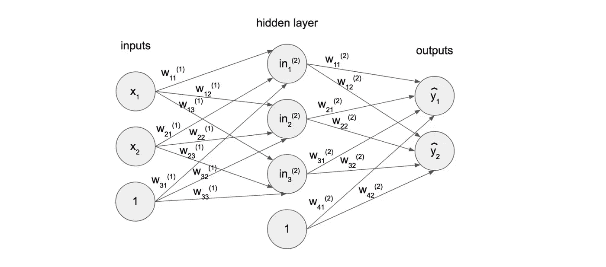
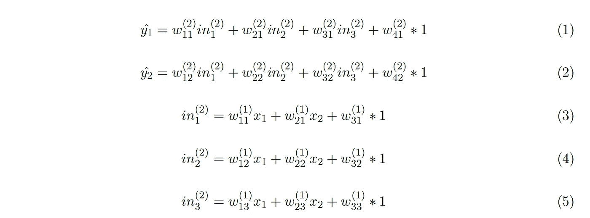

# 让我给你介绍一下神经网络

> 原文：<https://towardsdatascience.com/let-me-introduce-you-to-neural-networks-fedf4253106a?source=collection_archive---------4----------------------->

本文使用一些简单的大学数学公式和术语，为神经网络及其学习过程(反向传播)提供了一种直观的方法。作为一个对知识共享价值深信不疑的人，我希望它能为开始 AI/ML 之旅的人带来一些启发，或者为那些盲目使用 Keras(去过那里，做过那件事)等高水平工具的人澄清一些事情。事不宜迟…

将神经网络(NN)视为一个数学函数是合理的，它在实践中往往非常复杂，原因有三:
1)它有大量的系数(权重)，通常超过数千万，
2)它是一个嵌套非常深的函数，因此即使简单的梯度计算(偏导数)也相对较慢，
3)它的大部分计算是在多维张量上执行的。

图 1 包含一个简单神经网络的流行表示，它有三个基本的构建块:单元(单个圆圈，值为`in`、输入为`x`、输出为`y`或偏差为`1`)、层(排列成一个垂直组的单元)和权重(单元之间的连接，值为`w`，表示其强度)。等式 1、2、3、4 和 5 将该图形表示转化为数学公式。

Figure 1: A simple neural network with one hidden layer (a layer between inputs and outputs).

“感知器”是一个神经网络的通用名称，其中输入与输出直接耦合(没有隐藏层，不像图 1)。隐藏(中间)单元层的存在防止了输入和输出之间的直接连接，允许神经网络模拟高度非线性的数学函数。Norvig 和 Russell 以 XOR 门为例，以如下方式证明:“[……]线性分类器[……]可以表示输入空间中的线性决策边界。这适用于进位函数，它是一个逻辑 AND […]。然而，sum 函数是两个输入的 XOR(异或)。[……]这个函数不是线性可分的，所以感知器无法学习它。线性可分函数仅构成所有布尔函数的一小部分。”(P. Norvig 和 S. J. Russell，*人工智能:一种现代方法*，Prentice Hall，
2010)。

在深入研究神经网络的学习过程之前，重要的是对前面的模型做两个补充:
1)误差函数(也称为成本函数)，
2)激活函数。

Ad 1。该算法表示预测的最可靠方式是通过概率向量。考虑一个基于标签图像的啤酒名称预测的例子。图 2 显示了一个分类器的概率输出(注意所有值的总和为 1)，与它应该努力争取的输出相比较。本节中介绍的成本函数称为分类交叉熵(等式 6)，它简单地测量这两个概率分布(预测的和理想的)之间的相关性。请注意，与一位热码编码示例相乘，会迫使函数只比较理想分布的非零元素，与接近 1 的值相比，进一步远离 1 的分类器输出的相应值会受到更多惩罚(由于对数的性质)。

Figure 2: Exemplary classifier input, output and desired (one-hot encoded) output with legend.

where:
d_i is the ith element of one-hot encoded (desired) probability vector d,
p_i is the ith element of probability vector p predicted by the classifier.

Ad 2。单元的值`in`很少被显式传播到下一层。而是使用所谓的激活功能。本节介绍的一个称为 sigmoid(方程式 7)。图 1 中简单神经网络的更新模型如图 3 所示。值得指出的一点是 sigmoid 函数和 softmax 函数(等式 8)之间的差异，两者都用于人工神经网络。sigmoid 输入单个值并输出归一化标量，而 softmax 输入一系列值并输出一个范围为[0，1]的实数向量，这些值的总和为 1，因此可以解释为概率分布。Sigmoid 用于隐藏单元，而 softmax 通常应用于最后一个输出层。这两种功能都可以归类为逻辑功能。

Figure 3: Updated model of simple neural network from Figure 1\. g is a sigmoid activation
function. Outputs are often normalized using softmax.

Softmax function s(z)_j “squashes” a K-dimensional vector z to K-dimensional probability distribution,
where j = 1, …, K.

神经网络学习过程的目标是找到正确的权重，即产生数学模型的权重，其中输入的差异清楚地表示在输出向量的差异中，输出向量是分析和预测的对象。例如，在经过训练的狗品种分类器中，德国牧羊犬的图像的输出向量明显不同于约克的图像。这可以很容易地解释，并导致正确的人类可读的品种预测。目前，训练网络的最佳方法是通过称为反向传播的算法。该方法的主要思想是计算关于每个权重的成本函数 E(例如分类交叉熵)的梯度，该梯度稍后由这些梯度的某个部分更新，如等式 9 所示。

where:
alpha is a learning rate (indicating what portion of gradient should be used).

让我们考虑图 4 中的神经网络，其具有三个单元、一个隐藏层和 sigmoid 激活函数。在进行反向传播之前，所谓的正向传递被执行，其简单地是给定输入的输出的数学推断(等式 10)。

Figure 4: A simple neural network, with sigmoid activation function g (Equation 7).

如前所述，NN 的学习算法是基于计算每个权重的偏导数。代表更复杂网络的深层函数嵌套鼓励利用[链规则](https://en.wikipedia.org/wiki/Chain_rule)。图 5 概述了使用分类交叉熵误差函数 e 的反向传播的单个步骤。等式 11 和等式 12 给出了学习过程发生所必需的符号梯度计算。此时，sigmoid 函数的一个非常简单的导数值得回忆一下:

Figure 5: Outline of a single step of backpropagation with chain rule.

在符号计算之后，考虑图 5 中神经网络的以下输入:

1) A training example. NN should strive for returning 1, whenever the input is equal to 10.

2) Randomly initialized weights for first forward pass (Equation 10).

学习过程的主要步骤是在给定随机初始化的权重和输入的情况下进行推理。产生的结果是:

这与期望的 1 相差甚远。反向传递允许计算每个重量的梯度，即:

在应用来自等式 9 的更新规则之后，学习率α= 0.5，新的权重是:

并产生结果:

非常接近期望的 1！提出的算法是迭代的。随着上述步骤重复次数的增加和示例数量的增加，它应该收敛到最优权重(全局或局部)。