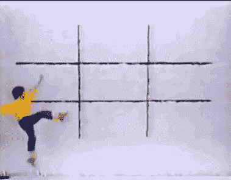
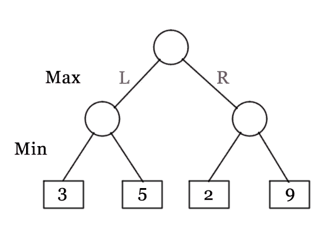
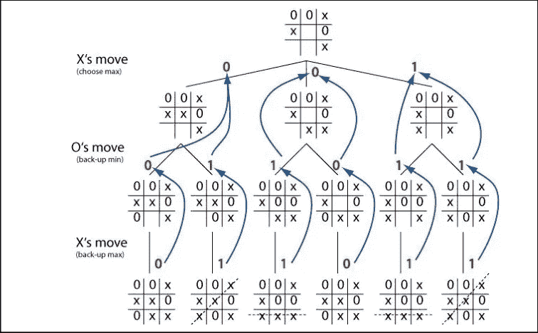

# 用 Python 玩游戏—第 1 部分:井字游戏

> 原文：<https://towardsdatascience.com/lets-beat-games-using-a-bunch-of-code-part-1-tic-tac-toe-1543e981fec1?source=collection_archive---------5----------------------->



如果你碰巧看了我关于柔术的第一篇文章，我暗示了一个事实，我和电子游戏有一种苦乐参半的关系。当我赢了的时候，他们给了我一个惊人的自我提升，但是每隔一段时间，当一些孩子在火箭联赛中击败我的时候，我想把我的拳头穿过我的显示器。在我们进入令人生厌的技术内容(这是本文的主要内容)之前，让我们回顾一下我的记忆，解释一下我写这篇文章的动机:

我对电子游戏的历史可以追溯到任天堂试图拯救桃子公主到最近有毒的电子竞技地狱的时候。我涉猎了所有类型的游戏——MMORPG、射击游戏、平台游戏、MOBAs 等(如果你是麻瓜，可以在谷歌上搜索这些术语),但我还是会不断回到 MOBAs 和射击游戏上来。如果有人能联系到有一个狗屎互联网连接，你就会知道玩在线比赛是一个明确的禁忌。所以我经常发现自己在游戏的“VS 机器人”部分，在那里我可以像角斗士一样磨练我的技能，完全控制他们，感到欣喜若狂，上网玩一场排名赛，完全被控制，看着我的 ***elo*** 排名下降，哭泣(以这种确切的顺序)。没过多久，我就意识到，所谓的人工智能机器人与我有很多相似之处——毫无用处。因此，我的动机是创造更好的人工智能机器人，让我玩游戏更开心(是的，这是一个完全自私的原因)。

现在让我们回到正题——“用一堆代码解决井字游戏”。敏锐的观众可能会注意到，我使用“一堆代码”这个短语只是因为我不想只关注解决游戏的强化学习技术，还想探索其他虽然低效的技术，如树搜索、遗传算法等。我本来想玩一个更复杂的游戏，比如国际象棋，但是作为这个领域的初学者，我决定放弃自我，从一个最小状态空间的游戏开始——**井字游戏**。

让我们来看看我们的第一个角斗士:

# 1.极大极小算法

极大极小算法是为两人零和游戏(井字游戏、国际象棋、围棋等)制定的决策规则。).这种算法看到了前面几步，并设身处地地为对手着想。它会一直玩下去并探索后续可能的状态，直到达到最终状态，导致平局、胜利或失败。处于这些可能的终端状态中的任何一种对 AI 都有一些效用——例如处于“赢”状态是好的(效用为正)，处于“输”状态是坏的(效用为负)，以及处于不好也不坏的平局(效用为中性)。



The Minimax Algorithm

在我们执行求解井字游戏的极大极小算法时，它通过可视化棋盘未来所有可能的状态来工作，并以树的形式构造它。当当前棋盘状态被给定给算法(树根)时，它分裂成‘n’个分支(其中 n 表示 AI 可以选择的棋步数/AI 可以放置的空单元格数)。如果这些新状态中的任何一个是终止状态，则不对该状态执行进一步的拆分，并按以下方式为其分配分数:

*   得分= +1(如果 AI 赢了)
*   得分= -1(如果 AI 输了)
*   得分= 0(如果出现平局)



An example Minimax game tree for Tic-Tac-Toe

然而，如果没有终结状态——这些新状态中的每一个都被认为是新的根，它们会生成自己的树。但是，有一个问题——因为这是一个双人游戏，玩家轮流玩，所以每当我们在网络中深入一层时，我们需要更换将被放置在其中一个空单元格中的玩家。这样我们就可以想象对方会因为我们的行动而采取什么行动。该算法通过在轮到人工智能时选择得分最高的棋步，并在轮到人类时选择得分最低的棋步来评估最佳棋步。

用代码写出来:

完整代码:[https://github . com/agr awal-rohit/medium-playing-games-with-python/blob/master/Tic % 20 tac % 20 toe/HumanvsAI _ minimax . py](https://github.com/agrawal-rohit/medium-playing-games-with-python/blob/master/Tic%20Tac%20Toe/HumanvsAI_Minimax.py)

由于井字游戏的状态空间如此之小，我们不可能有深度超过 9 的树。因此，我们不需要在这里使用像阿尔法-贝塔剪枝技术。然而，Minimax 的问题在于它假设了对手的一种特殊玩法。例如，一个最小最大玩家永远不会达到一个可能会输的游戏状态，即使它总是因为对手的不正确打法而从那个状态中获胜。

下面是一个示例游戏:

```
New Game!
----------------
|   ||   ||   |
----------------
|   ||   ||   |
----------------
|   ||   ||   |
----------------Choose which player goes first - X (You - the petty human) or O(The mighty AI): O
AI plays move: 2
----------------
|   || O ||   |
----------------
|   ||   ||   |
----------------
|   ||   ||   |
----------------Oye Human, your turn! Choose where to place (1 to 9): 3
----------------
|   || O || X |
----------------
|   ||   ||   |
----------------
|   ||   ||   |
----------------
AI plays move: 9
----------------
|   || O || X |
----------------
|   ||   ||   |
----------------
|   ||   || O |
----------------Oye Human, your turn! Choose where to place (1 to 9): 5
----------------
|   || O || X |
----------------
|   || X ||   |
----------------
|   ||   || O |
----------------
AI plays move: 7
----------------
|   || O || X |
----------------
|   || X ||   |
----------------
| O ||   || O |
----------------Oye Human, your turn! Choose where to place (1 to 9): 6
----------------
|   || O || X |
----------------
|   || X || X |
----------------
| O ||   || O |
----------------
AI plays move: 4
----------------
|   || O || X |
----------------
| O || X || X |
----------------
| O ||   || O |
----------------Oye Human, your turn! Choose where to place (1 to 9): 1
----------------
| X || O || X |
----------------
| O || X || X |
----------------
| O ||   || O |
----------------
AI plays move: 8
----------------
| X || O || X |
----------------
| O || X || X |
----------------
| O || O || O |
----------------
Draw!Wanna try again BIYTACH?(Y/N) : n
```

现在让我们来看看一个更令人兴奋的算法。带来第二个角斗士:

# 2.强化学习


我觉得这个算法更容易掌握，因为你可能每天都在使用它，甚至没有意识到这一点。让我们举一个实际的例子:

说你是狗主人。你纠缠你的配偶几个月，终于得到了那个小混蛋，但这个毛球**(我们的代理)**需要上厕所**训练**。我们的代理可以互动的物理世界是我们的**环境。**问题很简单——我们想让我们的狗狗在我们想要的地方做生意。但是我们如何告诉它哪个地方好或者坏，而不试图“跟狗说话”并且看起来很愚蠢？对，我们使用一个**奖励系统**。每当我们的代理人在我们漂亮的地毯上拉屎，它就会得到一个**负面奖励**(称他为坏孩子，取消一次款待，在鼻子上猛烈一击，等等)。每当它在凌晨 2 点用扩音器播放贾斯汀·比伯的邻居门前拉屎时，它就会得到一个**正面奖励**(称他为最好的男孩，他最喜欢的零食，揉肚子，等等)。随着时间的推移，代理人了解到，每当它想要放松时(**一个特定的状态**，弄脏邻居的人行道比弄脏珍贵的地毯要好，因为这会使他处于一个更好的状态，一个给予积极奖励的状态。

## 开发与探索

强化学习中的一个基本权衡是开发与探索的权衡。**开发**意味着选择最大化我们回报的行动(可能会陷入局部最优)。**探索**意味着选择一个行动，而不考虑它提供的回报(这有助于我们发现其他局部最优，从而使我们更接近全局最优)。在其中任何一个方面全力以赴都是有害的，所有的开发都可能导致一个次优的代理，而所有的探索只会给我们一个愚蠢的代理，它不断采取随机行动。

解决这个问题的一个广泛使用的策略是**ε递减策略**，我在我的实现中也使用了这个策略。它的工作原理如下:

1.  将变量“epsilon”初始化为 0 到 1 之间的值(通常在 0.3 左右)
2.  现在概率=ε，我们**探索**，概率= 1-ε，我们**利用**。
3.  我们**随时间减少ε的值**，直到它变为零

使用这种策略，代理可以在训练的早期探索更好的行动，然后在游戏的后期开发最好的行动。这有点类似于我们人类的运作方式——我们在 20 岁出头的时候探索不同的选择并寻求新的体验(探索)，然后我们决定一条既定的职业道路并继续沿着这条道路前进(开发)。

## 时间差异学习

在该实现中使用的强化学习方法被称为**时间差异学习。它的工作原理是每个状态都有一个值。比方说，如果一个状态导致 AI 获胜，它应该有一个正值(值= 1)。如果 AI 在某个状态下输了，它应该有一个负值(value = -1)。所有其余的状态将具有中性值(值= 0)。这些是初始化的状态值。**

一旦游戏开始，我们的代理计算在当前状态下它能采取的所有可能的动作，以及每个动作将导致的新状态。这些状态的值是从一个 *state_value* 向量中收集的，该向量包含游戏中所有可能状态的值。然后，代理可以选择导致具有最高值的状态的动作(利用)，或者选择随机动作(探索)，这取决于ε的值。在整个训练过程中，我们玩了几个游戏，每次移动后，状态的值都使用以下规则进行更新:


Temporal Difference Update Rule

其中， **V(s)** —游戏棋盘的当前状态， **V(s^f)** —代理采取某个动作后棋盘的新状态， **alpha** —学习速率/步长参数。

使用该更新规则，导致损失的状态也获得负的状态值(其大小取决于学习率)。代理了解到处于这种状态可能会导致损失，所以除非必要，否则它会尽量避免在这种状态下着陆。另一方面，导致胜利的州获得正的州值。代理了解到处于这种状态可能会导致最终的胜利，所以它会被鼓励处于这种状态。

该算法的代码片段如下:

该算法有两个版本的代码:

1.  **测试代码——可以和经过训练的 AI 进行对战**:[https://github . com/agr awal-rohit/medium-playing-games-with-python/blob/master/Tic % 20 tac % 20 toe/testing _(HumanvsAI)_ reinforcement learning . py](https://github.com/agrawal-rohit/medium-playing-games-with-python/blob/master/Tic%20Tac%20Toe/testing_(HumanvsAI)_ReinforcementLearning.py)
2.  **训练代码——两个玩家都是 AI** ，他们每个人都互相帮助训练。这是给我外面的懒惰小队的。如果你更喜欢抓一些爆米花，让这两个 AI 在它们之间战斗，那么这里是代码:[https://github . com/agr awal-rohit/medium-playing-games-with-python/blob/master/Tic % 20 tac % 20 toe/training _(AIV sai)_ reinforcement learning . py](https://github.com/agrawal-rohit/medium-playing-games-with-python/blob/master/Tic%20Tac%20Toe/training_(AIvsAI)_ReinforcementLearning.py)

下面是一个对抗训练了大约 10000 个纪元的机器人的示例游戏。

```
New Game!
----------------
|   ||   ||   |
----------------
|   ||   ||   |
----------------
|   ||   ||   |
----------------Choose which player goes first - X (You - the petty human) or O(The mighty AI): XOye Human, your turn! Choose where to place (1 to 9): 5
----------------
|   ||   ||   |
----------------
|   || X ||   |
----------------
|   ||   ||   |
----------------
Possible moves = [1, 2, 3, 4, 6, 7, 8, 9]
Move values = [-0.218789, -0.236198, -0.147603, -0.256198, -0.365461, -0.221161, -0.234462, -0.179749]
AI plays move: 3
----------------
|   ||   || O |
----------------
|   || X ||   |
----------------
|   ||   ||   |
----------------Oye Human, your turn! Choose where to place (1 to 9): 1
----------------
| X ||   || O |
----------------
|   || X ||   |
----------------
|   ||   ||   |
----------------
Possible moves = [2, 4, 6, 7, 8, 9]
Move values = [-0.633001, -0.625314, -0.10769, -0.543454, -0.265536, 0.034457]
AI plays move: 9
----------------
| X ||   || O |
----------------
|   || X ||   |
----------------
|   ||   || O |
----------------Oye Human, your turn! Choose where to place (1 to 9): 6
----------------
| X ||   || O |
----------------
|   || X || X |
----------------
|   ||   || O |
----------------
Possible moves = [2, 4, 7, 8]
Move values = [-0.255945, 0.003558, -0.2704, -0.25632]
AI plays move: 4
----------------
| X ||   || O |
----------------
| O || X || X |
----------------
|   ||   || O |
----------------Oye Human, your turn! Choose where to place (1 to 9): 2
----------------
| X || X || O |
----------------
| O || X || X |
----------------
|   ||   || O |
----------------
Possible moves = [7, 8]
Move values = [0.0, 0.03941]
AI plays move: 8
----------------
| X || X || O |
----------------
| O || X || X |
----------------
|   || O || O |
----------------Oye Human, your turn! Choose where to place (1 to 9): 7
----------------
| X || X || O |
----------------
| O || X || X |
----------------
| X || O || O |
----------------
Draw!Wanna try again BIYTACH?(Y/N) : n
Suit yourself bitch!
```

# 表演时间到了

现在我们已经准备好了两个冠军，让我们把他们扔进虚拟竞技场，让他们在我们敬畏的注视下一决雌雄。既然我们现在只有 2 个，那就来一场 1v1 的 TKO 战吧。这是结果:

```
Results(10 games):
Minimax Wins = 0
RL Agent Wins = 10
```

(我召唤了一个怪物，不是吗？)

如果你想看完整场比赛，下面是代码:[https://github . com/agr awal-rohit/medium-playing-games-with-python/blob/master/Tic % 20 tac % 20 toe/downstall _ Minimax _ vs _ rl . py](https://github.com/agrawal-rohit/medium-playing-games-with-python/blob/master/Tic%20Tac%20Toe/Showdown_Minimax_vs_RL.py)

这些是我已经修补过的唯一的算法。我可能会研究一些其他有趣的算法，比如遗传算法，但那是以后的事了。如果你觉得我的文章很有帮助，甚至有趣到让你微微发笑，请鼓掌并在下面回复。

感谢你阅读❤