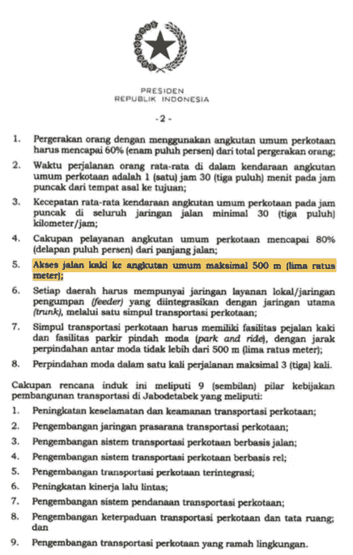
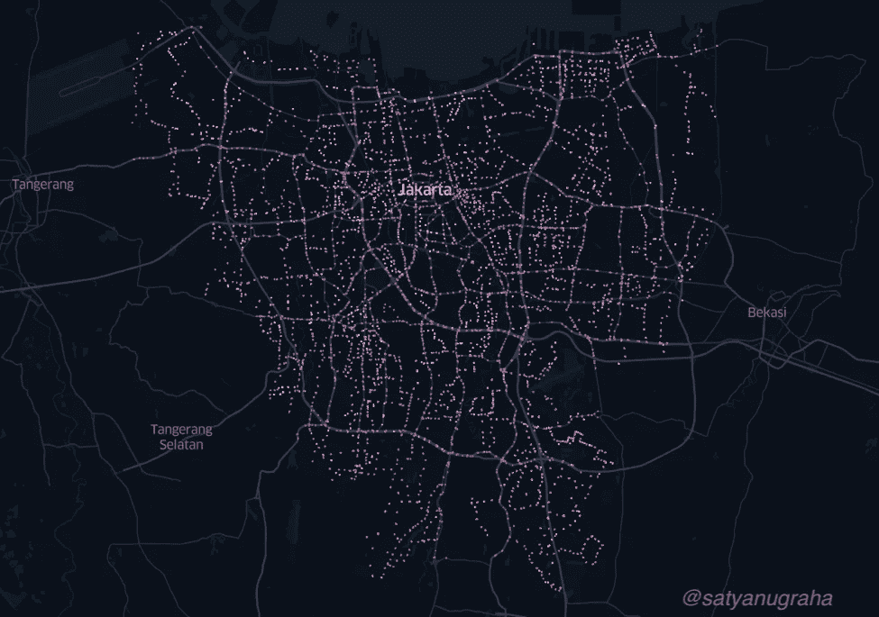
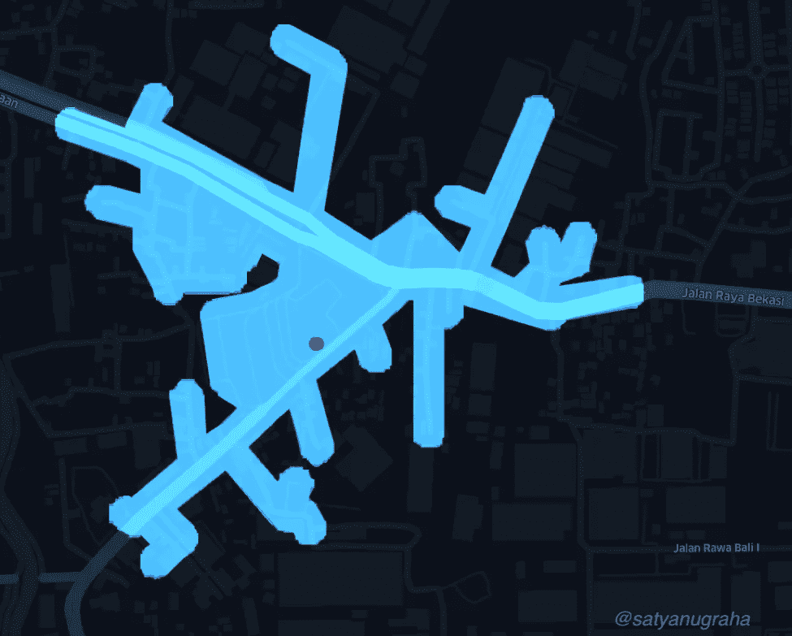
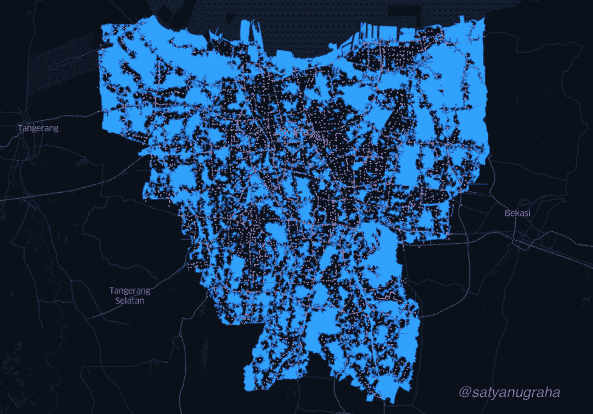
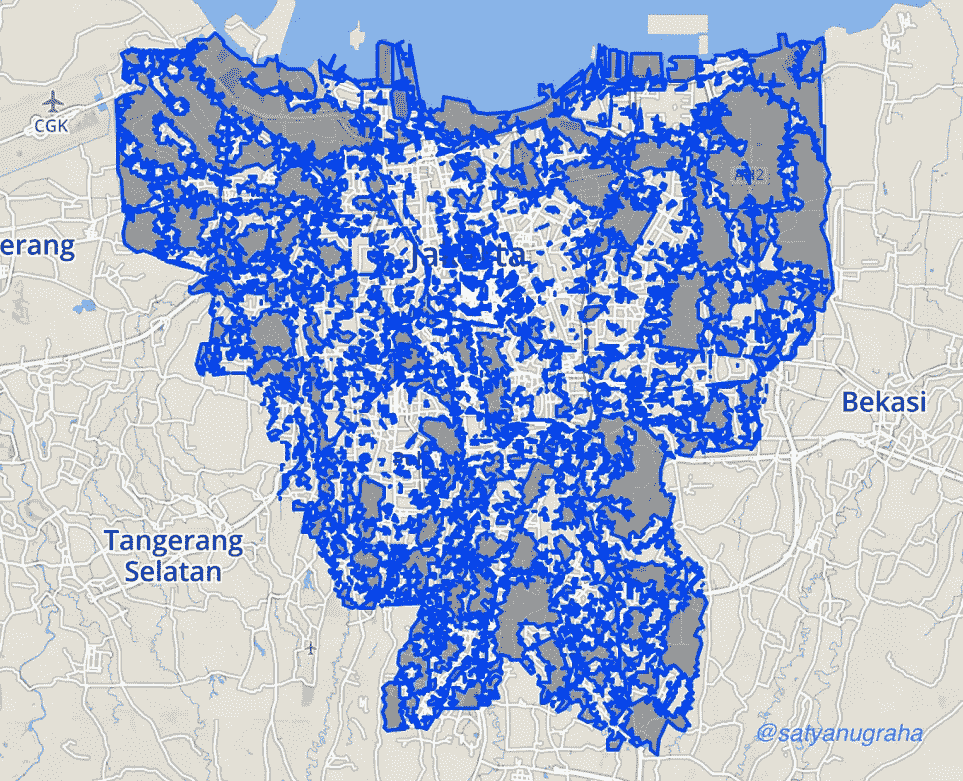

# 让我们解决雅加达的交通问题

> 原文：<https://towardsdatascience.com/lets-fix-jakarta-s-traffic-584058dac87f?source=collection_archive---------6----------------------->

## *推进公共交通的分析方法*

Photo by [Alexander Popov](https://unsplash.com/@5tep5?utm_source=medium&utm_medium=referral) on [Unsplash](https://unsplash.com?utm_source=medium&utm_medium=referral)

众所周知，雅加达的交通状况是一个问题。最近的一项 T2 调查将雅加达列为世界第七差。事实令人震惊——目前道路上的摩托车数量徘徊在 1400 万辆左右，但预计到 2020 年将跃升至 6600 万辆，如果不采取任何措施，这一数字将增长 370%。然而，应对这一挑战并非没有通知或补救措施。雅加达省长和中央政府已经尝试了几种方法来减少交通拥堵。其中之一是[单双号交通政策](https://en.tempo.co/read/news/2018/08/31/057921243/Jakarta-Extends-Asian-Games-Odd-Even-Policy-until-October)，该政策试图通过控制某一天城市道路上的车辆数量来减少交通流量。虽然这是一项值得称赞的努力，但它只是触及了试图解决更大问题的表面。佐科·维多多总统认识到了这一点，并发布了一项行政命令，集中精力改善公共交通，作为解决城市交通问题的长期方案。

***下面来看看实际订单。请原谅我，如果你不会说巴哈萨语…请相信我。；)***

在第 2 章**“SASARAN DAN KEBIJAKAN PENYELENGGARAAN TRANSPORTASI JABODETABEK”中，**规定到*任何*公共交通站的最大步行距离应为 500 米。

所以我从一个简单的问题开始:

**城市(区域)中有多大比例不在此距离内(基于道路距离，而不仅仅是半径，因为半径并不能完全反映您需要步行的距离)？**

我首先收集了目前雅加达所有的公共交通站点，包括小型货车、小型公共汽车、中型公共汽车、Transjakarta 和火车。总共有超过 19，749 站。

*Pink dots represent individual public transportation stops*

接下来，我画出了一个距离每个车站 500 米以内的区域。例如，我模拟了一条 500 米长的可步行路径，从位于 Kelapa Gading 的一个 Transjakarta 通勤站出发。模拟路径是**实际街道路线**，它必须与 Transjakarta 站连接。街道路径可以是一条主干道或街道小巷(Jalan Gang)。

以下是这一分析的直观描述:

Pink Node is the Transjakarta Bus Stop, blue area indicate that within 500 meters walking distance

**为什么我选择了道路/路径路线而不是半径？**

一个点周围的半径通常不能预测一个人要走多远。是的，从理论上讲，一个人可以通过穿越房产、跳过栅栏、跑过建筑物或其他我们在任何情况下都无法预测的策略来减少步行距离(当然，我们永远不会建议一个人这样做来缩短步行距离)。因为半径代表一种不太可能的情况，我觉得使用实际的道路将是一种更准确的方式来预测步行距离。

然后，我将交通站点数据与 500 米的路线数据合并，并创建了以下模拟。这描绘了当前公共交通生态系统覆盖的城市面积。

*Black represents the covered area by public transport. Blue is currently uncovered by public transport.*

**清理最终可视化**

我想更好地看看这个城市的差距在哪里。所以，我拓宽并合并了雅加达的所有停靠点，并把它们重新标在了地图上。这让我能够更好地识别和区分覆盖区域和未覆盖区域。然后，出于视觉清洁的目的，我移除了所有的公共停车点。现在我们可以看到公共交通站点未覆盖的剩余区域。

Uncovered area within 500 meters walking distance to public transportation

# 摘要

对地图背后的数据进行一些基本的分析，我估计 **45%的地区没有公共交通站**。这代表了覆盖大约 3 亿平方米的区域(在该城市的总共 6.55 亿平方米中)。

一个警告:很可能这个区域至少有一部分不是你通常需要步行的地方。例如，如果你站在一条繁忙的高速公路上，距离一个站点 600 米，那么从技术上来说，你是“未被覆盖”的。然而，你不太可能需要从那里走过去(除非你的车坏了或者类似的事情)。因此，虽然我可能稍微夸大了未覆盖的区域，但这可能已经不远了。

最后，这方面的数据设计在改善城市交通挑战方面有着广泛的应用。它还应该让我们所有人都意识到，并继续学习和提问。

# 跟进问题

**为什么行政命令把规则定在“500 米”？**

这是一个起点，但也许更好的问题是“步行的合理距离是多少？”。设定这一目标的后果值得考虑。如果 250 米是标准，那么未覆盖的区域将会更大，需要更高水平的投资。如果我们把范围设得更长(比如 750 米)，政府的投入会更低，但那样人们可能就不会使用公共交通了。

人们喜欢较短的步行距离还是较短的等待时间？

与其投资新的车站，解决方案可能是增加公共交通“车队”。也许这甚至不是消费者考虑的权衡，但在我们向这个系统投资数十亿美元之前，我们不应该知道吗？

我要感谢我的同事 Raihan Saputra 的分析支持，感谢 GO-JEK 公司重视社会影响。这些都是我探索这个挑战和解决这个项目的关键动力。我的希望是，通过使我们对这个问题的理解更加经验性和基于事实，我们可以改善雅加达居民的流动性。

有兴趣做更多这样的事情吗？邮箱