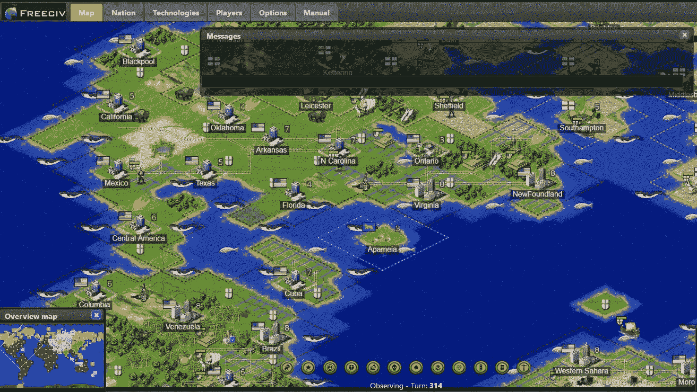
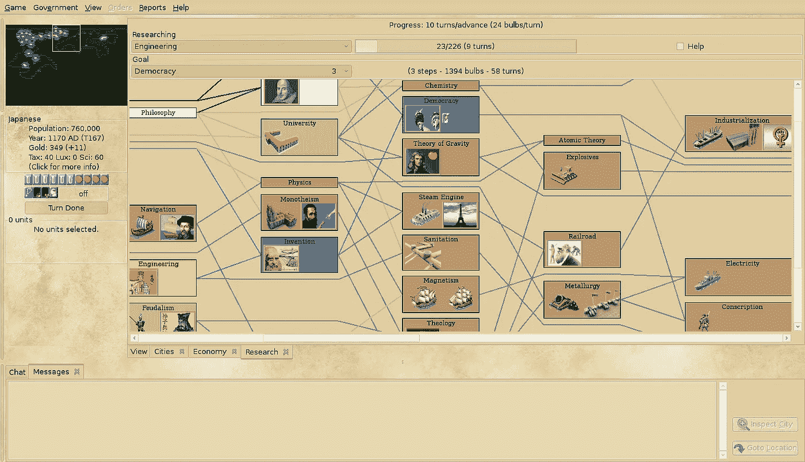
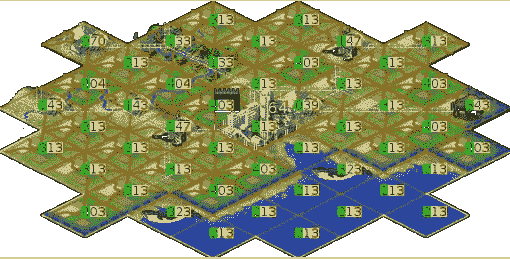
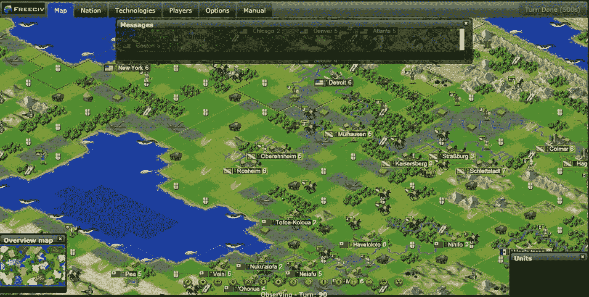

# 让我们自由地检查一些东西！

> 原文：<https://towardsdatascience.com/lets-go-over-few-things-freeciv-1d400969ad3e?source=collection_archive---------22----------------------->

## 建立正确的基础是大发展的关键

正如我在[上一篇文章](https://medium.com/@yashbonde/call-for-an-army-of-be-a-sts-f751436671be)中所说，我对用 python 建立一个[自由学习环境](https://github.com/yashbonde/freeciv-python)很感兴趣。但许多人认为，这些细节要么过于宽泛，要么包含了太多的想法。在接下来的几篇文章中，我想澄清一些问题，为这个项目打下基础。

如今，建立一个开源项目非常容易，你所要做的就是注册一个 Github 账户，然后嘣，你就准备好了！但是困难的部分是运行和维护代码库，更困难的是让人们足够关心你的项目，为你的项目贡献任何东西，我想在这里把重点放在后者。通过这些帖子，我想澄清我的想法，并讨论提出的问题。这一次，我想谈谈这三点:

1.  **行动空间:**为什么自由公民的离散行动空间很重要
2.  **游戏结构:**游戏的浩瀚如何与现实世界相似
3.  **多人协作理念:【freeciv 如何支持不同类型的互动，它有什么特别之处**

为了更容易理解，我还会在每一点上添加分点。这

> 我在这里不是问那些很难回答的问题，比如为什么关心任何事情。**但是为什么要关心这个项目呢？**

# 1.动作空间

我们宇宙中的每一个动作都可以分解成两种类型，连续动作空间和离散动作空间。通俗地说，离散空间是需要做出艰难决定的地方，而连续空间是要产生分布的地方。

*   现实生活领域中涉及硬件使用的大多数应用(机器人、自动驾驶汽车等。)需要生成值的分布。用来操作它们的运动矢量是一组力的值和方向。这一领域仍处于早期阶段，但其应用仍将遥遥无期。随着时间的推移，它将继续改进，尽管速度较慢，原因是模拟器不够好(讽刺的是，在机器人模拟器上训练的代理很少在现实生活中给出相同的结果)。我们的算法在样本效率方面并不擅长，在现实生活中的机器人上进行训练将意味着非常长的训练持续时间，这使得它不可行。

Self driving car operates in the continuous distribution

*   离散动作空间有不同的任务，所有那些需要做出艰难决策的应用都有一个离散空间。视频游戏就是一个很好的例子，它们需要一个非常具体的单一动作，需要在任何给定的时刻采取。到目前为止，我们看到的大多数研究都是在这个领域，彻底改变了深层强化学习理念的 DQN 在离散领域采取了行动。在医学领域，我们需要随着时间的推移展开行动，这是离散空间中现实世界应用的一个例子。其他应用包括，优化由于网络条件差而受到影响的流媒体服务的视频质量，社交网站上的通知系统只通知你重要的内容，等等。

Montezuma’s Revenge is an Atari game with discrete action space. This also happens to be a notoriously difficult game for AI to master due to its sparse reward structure.

我们不需要一个擅长所有事情的单个智能体，事实上，未来将充满整体架构，其中每个擅长特定事情的多个智能体合作实现远超人类的目标，这就是我们所说的超级智能。作为一款视频游戏，Freeciv 在离散的空间中运行。这是选择它的原因之一，它将是最具挑战性的学习环境之一。尽管在这种情况下仍有可能采取连续的行动。稍后将提供更多详细信息！

> Freeciv 将是最具挑战性的学习环境之一，这里所做的研究将是突破

# 2.游戏结构

说 freeciv 很大是一种保守的说法。你可以做的事情太多了，很难记住所有的事情，而且在任何时候采取的行动都会影响游戏后期的结果。

*   每个单位都有动态的移动次数，也就是说，每个单位都有不同的行动，每个城市都可以建造新的单位和物品。在下图中，我们可以看到一个单元有 12 个动作。这就要求人工智能根据它在特定时刻控制的单元进行优化。现在你可以有一个复杂的单一网络来运行这个，但我认为使用集成可以获得更好的结果。

The game at turn 314 is so advanced, though the game in ‘default’ mode can run to 5000 turns. The small circles at the bottom show the actions that can be takes for any unit. 12 actions can be taken for this particular unit, 1 less than the Atari games! This is an amazing example of the vastness of this game.

*   除了行动之外，看看[技术树](http://freeciv.wikia.com/wiki/Technology)可以让你了解必须做出的各种决策的规模及其后果。为了在游戏中进步，代理需要获得新的和不同的技术。每项技术都是大树上的一个节点，要得到一项，需要完成前面的几项。这对人工智能进行长时间步骤的结构规划提出了挑战。这与通过查看当前帧来选择单个动作的现有技术环境非常不同。

A sample tech-tree in freeciv. As you can see in the right, to get Electricity, you need to have Metallurgy and Magnetism. This complex intermixing of possibilities make life tricky for our small agent.

*   我还想谈一下城市。你的城市质量和你的权力之间有明显的关联。城市是这个游戏的核心，改善它们会增加你成功的机会。看看下面一个简单的城市，这是一个大城市。“城市半径”中的每块瓷砖都有与之相关的价值，如食物和黄金。瓷砖的质量越好，你的城市就越好，反过来你的文明也就越好。

A sample city, more details about the cities [here](http://freeciv.wikia.com/wiki/Radius)

*   由于战争的迷雾(以及不清楚的工作列表、资源),敌人的位置/状态和整个地图并不完全清楚——因此需要高风险的投资(探险队)来获取信息。

如上所示，战略、行动、决策、运动等的多样性。将这种环境推向了一个新的领域。由于所有这些挑战，看看人工智能将如何自我运作是很有趣的。这与现实世界非常相似，在现实世界中，我们需要在大量不完整信息的情况下做出决策，而我们今天的行为会对以后产生影响。

> 从使用这个平台开发模型和架构中学到的知识可以用来解决各种现实世界的问题。

# 3.多层协作结构

Freeciv 可以被大量玩家玩，具体来说，在 freeciv 桌面上可以玩 126 人，在 freeciv 网络上可以玩 500 人。游戏是有规则可循的，这些被称为规则集。在经典/默认规则集中，有三种获胜方式:

*   正如在其他征服和扩张的游戏中，一旦其他文明的最后一个城市和单位被摧毁，你就被默认宣布为胜利者。
*   一旦技术进步将你带入太空时代，你可能会发射一艘前往半人马座阿尔法星的宇宙飞船；第一个工艺到达该系统的文明获胜。
*   在没有其他手段决定胜利的情况下，如果还没有飞船发射，游戏将在 5000 回合后结束。然后对幸存的文明进行评级，拥有最高[分数](http://freeciv.wikia.com/wiki/Score)的文明获胜。

由于项目的开源性质，可以根据研究人员的需要修改规则集。我们打算让这项工作变得轻而易举，这样研究人员就可以把大部分时间花在开发他们的模型上，而不必担心无聊的事情。这也允许极端定制，可以使这个环境更好。

Look at the minimap at bottom left, the opportunity to see how various AIs will compete with each other is one thing that really excites me about this!

*   [外交](http://freeciv.wikia.com/wiki/Diplomacy)是这场游戏的重要组成部分，其中的互动非常重要。开放和贸易有利于玩家促进国家的经济发展，但在游戏的后期却变成了敌人并互相争斗。所有这些当然都可以通过改变配置文件中的游戏结构来改变`*.fcfg.`这种合作可以在整体人工智能系统中产生巨大的成果，其中许多小型人工智能系统组合起来使整个系统工作。

有了大量的玩家可以玩这个游戏，就有了一个研究协作系统如何工作的机会。随着[竞技自我游戏](https://blog.openai.com/competitive-self-play/)和[合作游戏](https://deepmind.com/blog/capture-the-flag/)领域的最新发展，当大量人工智能被单独留在一个类似地球的世界中时，看看世界将如何发展将是有趣的。也许我们会明白聪明的智能将如何从这一团乱麻中脱颖而出。

> 当大量人工智能被单独留在一个类似地球的世界里时，观察事件如何发展将会很有趣

# 结论

这些帖子不仅宣传了这个想法，也给了我一个机会来表达我对如何使这个项目成功的想法。对于任何开源项目来说，开始阶段都非常重要。有大量的工作要做，还有很长的路要走。在目前处于设计阶段的第一个版本中，我们更多地关注迷你游戏，所以可以开始小的开发，并且可以进行改编。

欢迎投稿人，如果您有任何疑问/想法，请发我的 [LinkedIn](https://www.linkedin.com/in/yash-bonde/) 给我，或者留下私人笔记，我不介意现在是凌晨 4 点，我会回复您。

干杯！