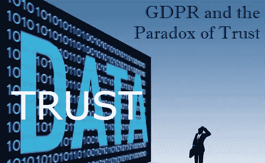

# 在后 GDPR 时代利用您的数据

> 原文：<https://towardsdatascience.com/leveraging-your-data-in-a-post-gdpr-world-208064472659?source=collection_archive---------7----------------------->

image credit — Modus Direct

搜索、社交媒体、云计算和商业分析已经在很大程度上实现了发展我们经济的全球参与者的承诺。为了保护我们自己的数字投资，我们今天投入资源解决 GDPR 问题也就不足为奇了。尽管如此，这些法规遵从性的努力可能被证明是被误导的，因为你的公司数据永远不会比你的利益相关者对你的数据实践的信心更有价值。在数字经济中，竞争优势依赖于对信任的理解，而不是对数据的理解。让我们探索挑战的本质，GDPR 在多大程度上是答案，以及公司如何利用“设计的信任”为后 GDPR 世界做准备。

为了理解这个赤裸裸的事实，我们需要仔细看看是什么产生了一个组织的底线。消费者购买产品、服务和想法的条件是，有一个普遍接受的经济交换体系，确保交易本身的定义、价值和秩序。由于公司和消费者都无法确保合规，他们传统上向各种中介机构付费，以保证交易所的偿付能力:银行核实账目以促进支付，保险公司监督健康和财产风险，国家本身提供教育、基础设施和社会保障。随着数字经济成为现实，这种对可信中介的需求加速增长:Alphabet、脸书、亚马逊和阿里巴巴利用规模经济和网络效应，形成了事实上的垄断。

*信任的悖论:随着企业收集越来越多的数据，信任本身变得越来越稀有和珍贵。*

在数字经济中，服务只不过是问题的答案，而数据则为尚未提出的问题提供答案。这些问题中首先也是最重要的是信任的悖论:尽管关于公司、经理和产品的信息从未如此丰富，但信任本身已经变得越来越稀缺和宝贵。这种信任缺失在某种程度上可以用全球经济的本质来解释:信息生产者和消费者之间的物理和感知距离从未如此之大。在第二个层面上，经济和社会交流的数字化创造了营销占主导地位的虚拟交流。最后，商业道德和价值观的衰落证明了后真相经济的假新闻是正确的——产品变成了信息。难怪真理的本质已经从基于对经济的盲目信任转变为作为经济决策基础的“委托信任”。

欧洲的一般数据保护法规既承认数字数据已成为世界经济的新货币，也承认收集和组织这些“交易”的大量记录的私人和公共组织控制着他们的客户。GDPR 明确认识到这种内在的危险，建议对描述我们是谁、我们想什么和我们做什么的私人和敏感数据的商业使用进行监管。 *GDPR 推出了欧洲公民数字权利法案*欧洲公民(“数据主体”)有权知道这些数据是如何、在哪里以及出于什么目的被收集的。现在要求数据控制员和数据处理员制定流程和内部记录保存要求，以确保符合这些新法规。最重要的是，立法者旨在影响我们数据实践的性质——数据保护应该是我们数据库、应用程序和信息系统设计的前提。

*GDPR 保护个人数据，而不是个人隐私和利益*

尽管这些努力值得称赞，但 GDPR 优先考虑数据保护，而不是个人隐私，同时将目标对准依赖于信息集中控制的计算机应用程序。随着技术的发展，新的软件迭代正在部署分散管理，以实现更大程度的透明性和可追溯性。分布式账本技术就是这样一种迭代；基于区块链的交易可以在很大程度上消除在我们的边境、我们的行政部门和我们的日常经济交易中保证个人数据有效性的中介需求。这些共享可以透明地实时报告组织的财务交易以及个人收入。区块链可以检查求职者的就业、信用或社会服务的凭证，从而促进更安全、更保密的点对点交易。如果 GDPR 的目标是在保护个人隐私的同时限制企业中介的垄断，那么它反过来也需要发展，以促进这些新一代技术的发展。

*Trust by design 是一套数据实践，它结合了短期监管要求，同时探索了新形式 IT 的长期机遇。*

" **Trust by design** "提出了一套数据实践，既考虑了 GDPR 的短期需求，又探索了新形式 IT 的长期机遇。总体愿景是开放、交互式的数据实践，提供透明度、客户授权、可移植性和数据质量。指导原则包括**数据合理性** - 为消费者提供捕获其私人数据的既定目标、**影响评估** - 记录您的数据存储在内部和云上的过程、**数据安全性**-确保您的组织拥有安全使用专有和开放数据的专业知识、**选择性访问** -允许数据所有者决定其暴露程度，以及**开放实践** -制定

我将于 11 月 9 日在柏林的 Group Futurista 的[后 GDPR/FODP 峰会](https://www.eventbrite.com/e/post-gdprfodp-summit-2018-tickets-49594192565)上讨论和发展这些主张。请不要犹豫，分享你的想法和建议头导致这一事件。我期待着在那里见到你。

李·施伦克博士

[商业分析研究所](http://baieurope.com./)

2018 年 10 月 27 日

Lee Schlenker 是商业分析和社区管理教授，也是 http://baieurope.com 商业分析研究所的负责人。你可以在的推特上关注白