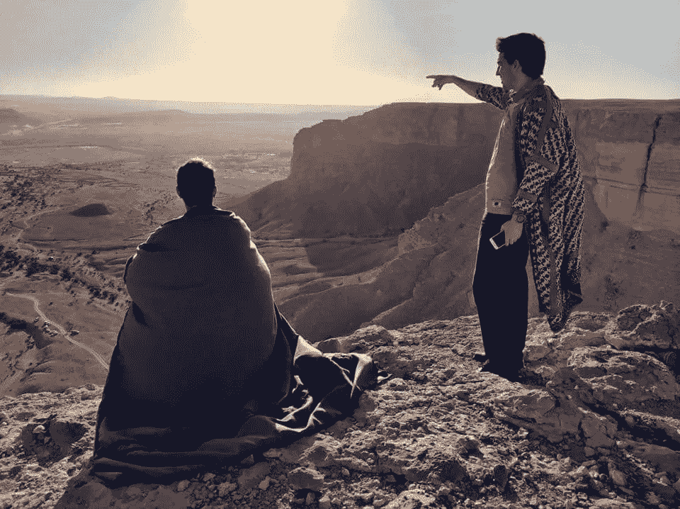
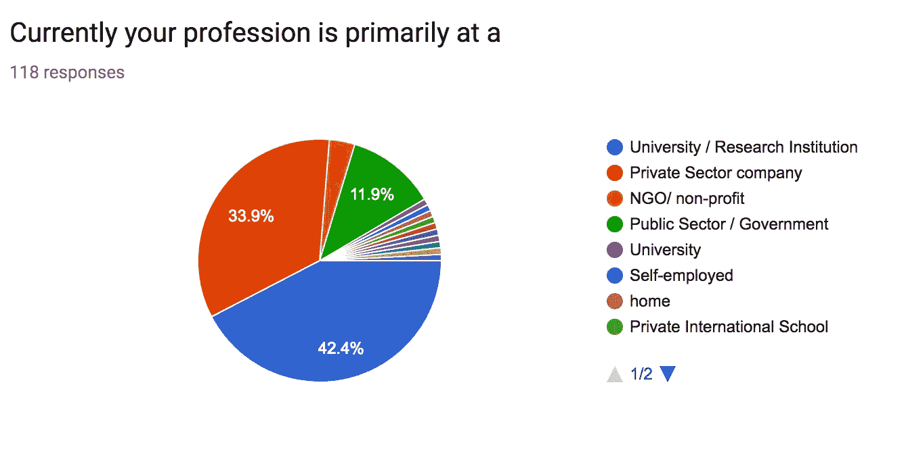
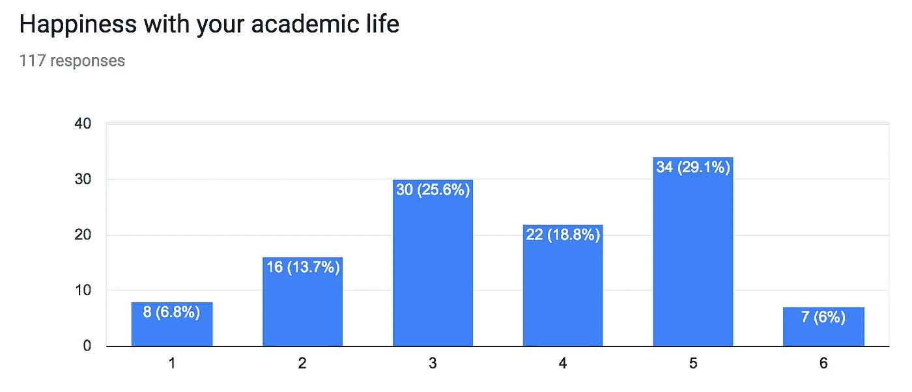

# 博士后的生活:❤️的“b 选项”，离开

> 原文：<https://towardsdatascience.com/life-after-a-phd-the-option-b-leaving-a18bc89e2d33?source=collection_archive---------0----------------------->

Leaving Academia might feel like pointing to the dessert from a high tower. (“Edge of the World”, Riyadh)

上周，我被邀请去我的博士学校分享我离开学术界的经历。在准备我的想法时，我写了这个，我分享它，希望它也能服务于其他人。按照要求，它包括一个问卷答案。

在科学方面，读完博士后的 A 计划是获得一个或两个博士后，同时发表论文，积累引用。这为最终获得永久职位创造了条件。我们被告知，这是最优秀科学家的最佳案例。这就是科学家的 A 计划。我认为这也是错误的、危险的和短视的。

> 从科学家的知识基础价值转变为科学家的技能基础价值。

一个选择离开学术界的科学家不应该成为 b 计划。这不比继续进入公共资助的学术研究的漏斗更好或更坏。我们应该致力于让科学家对社会产生最积极的影响。影响的发生通过同行评议论文的确增加了我们对现实的了解，但也非常具体地改善了私营部门的产品和服务，找到了更好的方法来消除贫困，制造自动驾驶汽车，了解政府政策的影响并提出建议。这里的关键是从科学的知识基础价值转移到科学家的技能基础价值。注意我强调的是**科学家**对**科学**，以及**技能**对**知识**。不是拥有在论文中发表事实的活字典的价值，而是拥有罕见技能的人的价值，他们必须发展这些技能来获得这些知识。数学技能，建模技能，剖析复杂过程的概念框架，…

我 9 年前拿到了博士学位。我为我的工作感到非常自豪。两年后我离开了研究。起初，我有一种非常强烈的想要其他东西的感觉，但不确定是什么，或者如何得到它。我觉得自己处于某个领域的顶端，但去别的地方就意味着失去这种特权。我也觉得这比停留在学术科学上更没有价值。这可能听起来有些耳熟。这么多年后，我可以分享这条路是怎么走的。我学到的一件重要的事情是，我们通常说科学，当我们指的只是它的一种类型:公共资助的学术研究科学。有很多科学不是公共资助的，或者不是在学术界做的，或者不是为了研究做的。这些年来，我[周游世界的次数比我梦想的还要多(我还多次梦想*去旅行)。我的贡献在实用主义和经济上都受到高度评价。我遇到了非常有趣的人，并向他们学习。我参与了非常具体的解决方案，涉及非常广泛的主题(比如*](https://www.instagram.com/nasonurb/)*[不丹的榛子物流](https://www.weforum.org/agenda/2017/06/going-nuts-in-bhutan-using-data-to-merge-for-profit-for-purpose-and-green-at-scale/)、[跨国公司对气候变化的适应](http://gain.org/news/gain-brings-private-sector-perspective-global-adaptation-conference)，或者[在旧金山为自动驾驶汽车制作地图](http://mapbox.com))。我对……选项 b 很满意。世界需要更多……选项 b。事实上，今年 1 月，我决定离开我在世界银行的工作岗位，投身于这一关于科学家在学术界之外的价值的想法。我们需要更多这种**撞击科学**。*

> 当我们只指一种类型的科学时，让我们停止说科学:公共资助的学术研究科学

但不要把这当成建议。我这里提供的是我的经验。我试着解释我的情况，帮助的来源和态度。这充其量只是一个案例奏效的轶事证据。我不知道有多少人尝试过却失败了，也不知道他们做了什么，也不知道有多少无形的玻璃门向我敞开，作为一个没有债务、没有依靠的西方白人。这也是为什么最近我一直在世界各地旅行并收集对那些也离开学术界的科学家的采访的部分原因。为了准备这次会议，我还做了一份[快速问卷](https://docs.google.com/forms/d/e/1FAIpQLScoN4k4xeUjbB3Dhvjnx5248BrROrxq_baGI5Ia8xoG2DeX6A/viewform?usp=sf_link)来获得一些额外的反馈。这不是一个统计研究，但它现在是几个轶事证据的集合，在我写这篇文章的时候有 120 个案例。[所有的回答都可以在这里找到](https://docs.google.com/spreadsheets/d/13tkRXY0Qm-MoCgpHCjV0hSYOiPEh4AXsH--hwj9RZww/edit?usp=sharing)(只要回答中包含可识别的信息，我都会匿名)。

在目前回答的 120 人中，45%目前不在研究中，58%不在大学或研究机构。“备选方案 B”。

我从问卷中得到的一个惊喜是，科学家离开学术界时自我报告的最大资产与最大障碍密切相关。使科学家优秀的东西似乎也使我们不优秀。那就是*解决问题*。我们自我报告了一个非常好的解决问题的能力，但也说兴趣更多的是在理解问题本身，而不是*那么什么*，实现的链接，或将这种解决问题的技能应用于“现实世界”的问题。

从调查问卷中我还了解到，离开学术界的原因很少是积极的，例如扩大科学的应用，对人们的生活产生更直接的积极影响，……在几乎所有情况下，人们似乎都是被推出去的(压力、生活平衡或很少的钱)，而不是选择离开。

Happiness with academic life now, or at the moment of leaving. 1 is HAPPY (reality meets expectations). 6 is UNHAPPY (reality doesn’t meet expectations).

上图对我来说也很有戏剧性。大多数(> 50%的受访者)不快乐(> 3)，尤其是最常见的是第二至最严重的不快乐。如果我分解一下，以“2+博士后”为“最高学术水平”的人最不开心(中位数 4.5)。最快乐的是那些在私营部门做研究的人(中位数为 1)和全职教授(也是 1，但他们也有最高的可变性，总体标准差超过两倍)。

离开学术界的原因不应该(仅仅)是沮丧。我这样说是因为在与人交谈时，我发现这种消极情绪是许多人的主要原因。对非研究任务、文书工作、拨款、内部政治、发表或毁灭的失望……这里有两点要说明。一方面，其中一些确实是生活的一部分。你的工作不会只有好的部分，所以这实际上是一件好事，因为博士生被迫增加那些“支持”活动。博士学位不仅是它的新颖内容，它增加了人类对一个领域的理解，而且创造了一个独立的科学家，包括它所涉及的所有事情，包括组织一次会议和做文书工作。现在，另一方面，学术界有许多破碎的东西是绝对正确的。[不可复制的论文](https://en.wikipedia.org/wiki/Replication_crisis)、[只发表正面成果](https://en.wikipedia.org/wiki/Publication_bias)、[腐蚀心理健康的环境](https://www.insidehighered.com/news/2017/08/08/scientific-papers-acknowledgments-section-calls-reform-postdocs-treatment)、[供给过剩的博士后](http://www.labcritics.com/review-the-surplus-of-postdocs-6286/)，不一而足。我发现避免美化或贬低任何选项都非常重要。

现在，对于实际的东西。根据我的经历、我面试过的人的经历和我做过的研究(一语双关)，我能提供什么建议？这项工作仍在进行中，但我可以提供一些建议:

## 如果你是一名学者

*   *爱情无国界，跨越界限。测试你在一个领域/地方/主题发展到另一个领域/地方/主题的技能。它有助于看到技能相对于知识的价值。例如，将您对太阳的图像分析技能应用到飓风破坏的地球观测图像上，以更好的图像支持响应行动。看看你是否可以使用其他仪器的数据。创新通常发生在不同领域的界面或交叉点。*
*   *你建了什么> CVs。当我招聘的时候，我需要人来解决问题。如果他们坦率地说出他们从头到尾都在做的项目，我会更愿意倾听。雇主需要知道你在第一天就能发挥作用，而不是你有学位。*
*   *挑剔≠消极。*我想说，科学家真的很擅长找出漏洞，找出问题所在，找出可以改进或做得更好的地方。有时候，更好的办法是关注什么在起作用，并理解为什么会这样。这在团队工作、尽职调查或提供专业建议时尤为重要。把事情做得更好可能是好的，把事情做好更好。
*   *不要家长式作风*。我发现许多科学家，包括我自己，都落入了“照我说的做，因为如果你知道我知道的，你会照我说的做吗”的陷阱。通常你知道你不知道的部分，并且可能有很强的理由说明事情不应该是这样的。比如气候变化。这不仅仅是停止排放二氧化碳，还涉及激励、就业、政治议程、外交……尽管科学家推出了停止排放二氧化碳的数据，但在科学只是其中一部分的场所，进展正在发生，如[联合国](http://unfccc.int/bodies/body/6383.php)或[达沃斯](https://www.weforum.org/agenda/archive/climate-change/)。

## 如果你管理学术

*   *科学家还是科学？*。你所在单位的目标是搞科学(这可能意味着获得政府资助的研究拨款)，还是培养科学家(拥有科学技能的人，不管他们在哪里应用科学)。如果是后一种情况，它提供了一个起点来建立一个衡量成功的标准，而不是关于数量或论文、资金或给予机构的引用。
*   *心理健康不是管理危机*。有一个系统来检查人们并在危机中提供专业帮助是好的，但它也为心理健康、恢复力、压力管理、自省、冥想等提供工具
*   *衡量幸福感*。我非常支持测量匿名化的幸福水平。幸福是主观的，部分是个人的决定，是整体的。这通常是一个糟糕的指标。然而，缺乏快乐通常发生在一系列你可以克服的具体障碍上。如果你压力很大，如果你生病了，如果你和你的导师有问题，如果你的通勤时间是 2 小时，如果你没有通过，你就不会快乐。建立集体幸福感意味着努力消除让人们不快乐的障碍。
*   *在培训中加入软技能*:雇佣专家来提高沟通技巧(像演员一样)，更多面向公众的学生组织的活动，…
*   *提供非研究选项的可见性*。联系公司和校友，宣传他们的职位、实习或特定项目。邀请离开学术界的校友分享经验。与其他非研究机构建立联盟和协议，以共享职位空缺、新闻和会议机会。
*   *良师益友*。导师的形象很重要，同样重要的是有更专业经验的人来帮助你做出决定或解决问题。你的博士导师通常是你的导师。好友的形象更像是一个刚去过你那里的同伴，所以它能提供更多个人的和具体的建议。伙伴通常是去年的学生或最近的博士后。

**请**发送您对这些话题的想法和反馈。我非常想听听我应该研究的其他经历、观点、人物或研究。谢谢！！