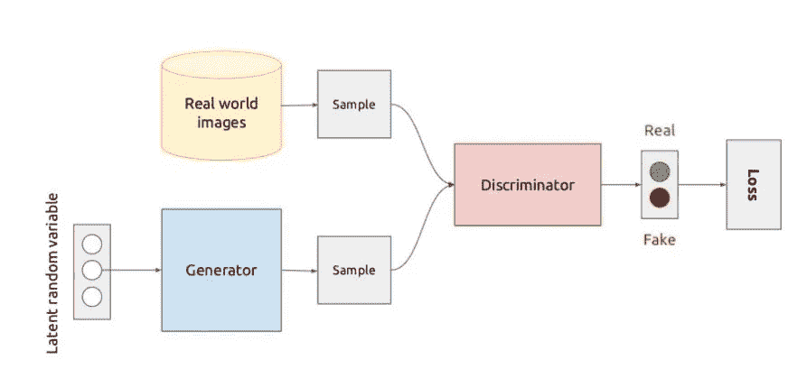
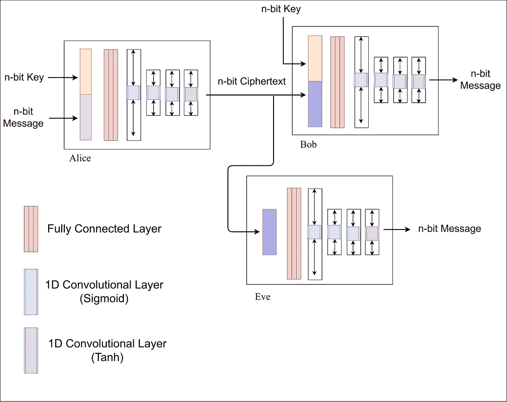
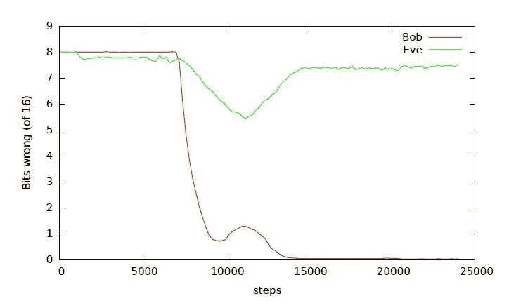
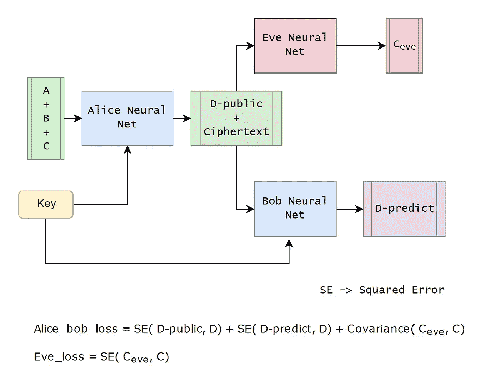

# 爱丽丝、鲍勃和夏娃的神经网络生活

> 原文：<https://towardsdatascience.com/life-of-alice-bob-and-eve-with-neural-net-6df0ad1d6077?source=collection_archive---------16----------------------->

## 学习用对抗的神经密码术保护通信


[Image from pixabay](https://pixabay.com/en/hacking-coding-code-hack-computer-2275593/)

作为一个“人”，如果说我对我们这个物种有一件事是肯定的，那就是，当我们发现或发明某样东西时，我们会尝试将它与已经存在的技术相结合，不管它可能多么怪异。嗯，我想这是人类的一部分。Martin Abadi 和 David G. Andersen 的论文[学习用对抗性神经加密技术保护通信就是这种好奇心的结果。](https://arxiv.org/pdf/1610.06918v1.pdf)

这篇文章将会是一篇很长的阅读文章，完整地介绍了这个理论，并使用 TensorFlow 在 python 中实现了这个系统。我建议你在我们开始前喝杯热伯爵茶。

# 我们需要知道什么？

至少有两个话题是在座的各位需要清楚了解的:

1.  对称密码系统
2.  甘是如何被训练的

它们都是非常宽泛的话题。出于时间和注意力的考虑，我将对这两者做一个简单的介绍，这样就足够了，如果你已经很熟悉了，可以直接跳过。

## 对称密码系统

对称密码系统的基本思想可以很容易地用一个古老的三个人的例子来解释，他们是爱丽丝、鲍勃和伊芙。在开始之前，我们假设 Alice 和 Bob 共享了一个密钥。一天，Alice 想给 Bob 发送一条秘密消息，她用共享密钥加密这条消息，生成一条密文。之后，Alice 通过一个可能不安全的通道将密文发送给 Bob。稍后，当 Bob 接收到该密文时，他使用相同的共享密钥对其进行解密并读取消息。另一方面，当密文通过不安全的通道时，它被 Eve 截获，但她无法解密，因为她没有共享密钥。这里要注意的关键点是，即使消息是通过不安全的通道传递的，它也不会受到损害。现在可能会出现一个问题，关于这个共享密钥的起源，这是一个完全不同的故事，它会将我们带入非对称密码系统的世界，我们现在不会研究它。


Figure 1 — Symmetric Cryptosystem

上图不仅清楚地展示了刚才所解释的内容，还直观地一口气解释了对称密码系统的基本基础。

## 甘是如何被训练的



Figure 2 image from [Generative models and adversarial training by Kevin McGuinness](https://www.slideshare.net/xavigiro/deep-learning-for-computer-vision-generative-models-and-adversarial-training-upc-2016)

> 对抗的:以冲突或对立为特征的

与神经网络作为监督学习算法的常见用途不同，在神经网络中，它学习分类或预测某些东西，在生成对抗网络或简称 GANs 的系统中，通常有两个网络，一个名为*生成器*，另一个名为*鉴别器。*生成器模型的工作是创建自己的假样本。例如，一个图像；而鉴别器的工作是分类它看到的图像是假的(即由生成器创建)还是真的(即取自真实世界)。在训练中，每次迭代生成器都试图愚弄鉴别器，而鉴别器则试图不被生成器愚弄。因此得名**。**在发生器欺骗鉴别器的情况下，鉴别器会根据损耗进行优化，以便更好地区分真假样品。但是如果发生器不能欺骗鉴别器，那么发生器通过损失被优化以创建更好的样本。

如果你对 GAN 的工作方式很感兴趣，我建议你阅读这篇文章[或者如果你想看看目前所有的应用，你可以看看这篇文章](https://medium.com/@awjuliani/generative-adversarial-networks-explained-with-a-classic-spongebob-squarepants-episode-54deab2fce39)。

**注意:**我们不会使用 GAN，但我使用它是为了解释一种不同类型的训练，其中神经网络可以通过相互竞争来训练，这是本文的重要部分。

# 走向

现在我们都有了对称密码系统和对抗网络的基本概念，是时候把它们混合在一起了。在这篇论文中，作者尝试使用神经网络，而不是使用严格的对称密钥算法，如 AES、Triple DES 等。加密或解密信息，我们很快就会谈到它的对抗性部分。

## 我们把神经网络整合到这个密码系统的什么地方？



Figure 3

我们训练三个神经网络，即 Alice、Bob 和 Eve，它们的工作如下:

*   **Alice 的工作**是接收 n 位消息(编码为-1 和 1 的向量，分别代表 0 和 1)和 n 位密钥作为输入，输出 n 位密文。
*   **Bob 的工作**是获取 Alice 创建的 n 位密文，并使用 n 位密钥作为输入来重构原始的 n 位消息。
*   **Eve 的工作**是只获取 n 位密文，并尝试重新创建原始的 n 位消息。

与最初的对称密码系统模型相比，除了用神经网络代替了严格的加密和解密算法之外，没有什么变化。
这里要注意的要点是，我们正在创建一个对抗性的神经网络，在这种意义上，Alice 训练使用共享密钥来创建密文，Bob 训练使用共享密钥来解密密文，Eve 训练在不知道共享密钥的情况下从密文重建原始消息。

**我们为什么需要夏娃？** 由于我们正试图让爱丽丝和鲍勃自己学习一种安全地交流数据的方法，我们无法向他们提供从可用的对称加密算法创建的消息和密码对的数据集。这将违背它自己学习加密和解密的全部目的。此外，仅让 Alice 和 Bob 在模型中可能会导致 Alice 学习将消息原样传递给 Bob，而不进行任何形式的加密或进行某种形式的容易被破解的加密，因此我们需要 Eve 充当安全通信的对手。爱丽丝学会了更好的加密方式来与鲍勃安全地通信，夏娃变得更擅长破解它们，直到达到一个点，在这一点上，夏娃不再能够跟上，没有密钥就无法理解任何事情。现在，我们实际上实现了它并计算了它背后的数学。

希望现在这里的每个人都**对我们的讨论有了一些**形式的想法，所以，从这一点开始，我们将继续理论的其余部分，同时也构建其相应的代码，这是因为至少对我来说，我一直觉得通过代码来理解事物更舒服，这是由于单词的性质有时可以以不同的方式解释，但代码…代码是绝对的。

# 让我们使用 TensorFlow 亲自尝试一下

对于那些有足够信心直接钻研其代码的人来说:

[](https://github.com/VamshikShetty/adversarial-neural-cryptography-tensorflow) [## VamshikShetty/对抗性-神经-密码学-张量流

### 使用对抗网络模仿对称密码系统

github.com](https://github.com/VamshikShetty/adversarial-neural-cryptography-tensorflow) 

## 创建单个模型

在开始构建单独的模型之前，我们还需要一些东西。为了简单起见，我们将认为文本和密钥具有相同的大小，让我们说 16 位，这是作者在本文中考虑的最小大小。为了训练，作者使用了从 256 到 4096 的小批量。

```
text_size   = 16
key_size    = 16
batch_size  = 4096
```

考虑到这一点，现在这些都是必需的参数，我们创建两个张量来保存随机生成的消息和密钥。我们希望一次保存 4096 的整批大小，因为每个文本或键的大小是 16，所以每个张量的形状将是(4096，16)。

在上面的代码片段中，名为`model`的函数用于创建所需的神经网络。该函数采用三个输入参数，其中`collection`是模型的名称(“Alice”、“Bob”或“Eve”)，因此为模型创建的所有层都在一个范围内。`message`是保存文本的张量，而`key`是保存共享密钥的张量。这里需要注意的一点是，如果给定了一个密钥，`if`条件的计算结果为`True`，消息和密钥被连接起来形成一个大小为 32 位(text_size + key_size)的张量。这个场景对 Alice 和 Bob 有效。而对于 Eve，`if`将评估为`False`，并且仅给出密文作为输入。

在每个模型中，除了输入张量之外，模型的其余部分彼此相似。每个网络都有一个大小为 2n (n =消息/密钥位数)的全连接(fc)层，其后是四个 1 维卷积层。

完全连接的层的作用非常直观。每种加密方法都有某种形式的混合和转换，该层使消息和密钥位能够影响 fc 层中每个独立神经元的输出，因为每个输出位可以是所有输入位的线性组合。

FC 层之后是一系列卷积层，最后一层产生大小适合于明文或密文的输出。这些卷积层学习将一些函数应用于由前一层混合的比特组，以利用空间局部性。因为作者希望局部性(即要组合的位)成为一种习得的属性，而不是像严格对称密钥算法中那样预先指定的属性。

现在是从 2n 位 FC 层获得 n 位输出的棘手部分，因为它后面有 4 个卷积层，并且我们最终没有任何 n 位大小的 FC 层来产生 n 位输出。为了回答这个问题，让我们把注意力转移到第二 Conv 层，我们设置步幅值为 2，填充设置为“有效”。如果你熟悉卷积，那么你一定已经明白，在这个模型中，2N 个单位减半，我们得到一个 n 位张量。

**注:**滤镜、核大小、步幅等参数均按原纸取。

**为什么我们在最后一层**有 Tanh 作为激活函数？
由于我们分别使用-1 & 1 来表示 0 & 1 位，如果我们的输出也有类似的表示，并且双曲正切函数在-1 和 1 的范围内产生输出，那就更好了。就这么简单。

对于好奇的读者来说，他们想知道`Expand_dims`和`Squeeze`函数在扮演什么角色；最初，输入的大小为(4096，32)，当进行卷积时，出现了一个称为通道的概念，类似于我们在一幅图像中有 3 个通道，即 RGB。鉴于我们的数据只是一个渠道，我们需要数据来显示类似的特征。因此`Expand_dim`将(4096，32)转换为具有一个通道的数据，即(4096，32，1)，最后`Squeeze`函数做相反的操作。

## 模仿对称密码系统

Alice _ out _ ciphew 表示 Alice 模型的输出，即 Bob 和 Eve 将试图解密的 n 位密文。您可以在第 8 行和第 11 行分别看到这个密文作为 Bob 和 Eve 模型的输入。

现在，以这样的方式训练 Alice 和 Bob，使他们能够在不丢失任何信息的情况下进行数据通信，并且还能够自己从头开始学习加密和解密，这样 Eve 就无法理解 Alice 发送给 Bob 的内容。答案隐藏在他们损失函数的形成中。

## 损失函数

Eve 的丢失很简单，只需尝试使用 L1 范数/距离来最小化 Eve 的输出和原始消息之间的比特差的误差。我们认为损失函数是给定批次的平均 L1 范数损失。

在系统中引入**对抗性** **本性**的真正诀窍落在爱丽丝和鲍勃的损失上，分为两部分。第一部分类似于 Eve 的损失，即尽量减少位数的错误，Bob 学习使用密文和密钥重建原始消息。正如我们已经讨论过的，仅试图最小化比特中的错误可能会导致 Alice 将原始消息本身作为密文传递给 Bob，因为不学习一些花哨的加密方法来加密原始消息并从密文和密钥中重建原始消息更容易。
我们如何确保这种情况不会发生，我们引入了一个损失复制 Eve 作为窃听者。简而言之，夏娃破解他们的密码越好，爱丽丝-鲍勃的损失就越大。用公式表示:


这种损失确保 Eve 不会比随机猜测做得更好，即当一半的消息位是错误的而一半是正确的时，这种成分被最小化。在 Alice 和 Bob 的训练中，我们不应该试图最大化 Eve 的重建误差，因为如果我们这样做并使 Eve 完全错误，那么通过简单地翻转所有输出位，Eve 可以在下一次迭代中完全正确。作者选择二次公式是为了强调使 Eve 具有较大的误差。因此，我们需要夏娃的 L1 损失来计算爱丽丝和鲍勃损失函数的第二部分。我们可以在下面提到的代码片段中看到 TensorFlow 编写的内容。

## 让我们创建一些随机数据集

这里的数据集是一对向量，用于表示具有随机位值(即 0 和 1)的消息和密钥，但是 0 作为神经网络的输入从来都不是一个好的选择，因为它表示没有信号，所以我们只对 0 到-1 和 1 到 1 进行编码。

## 训练开始

在下面的代码片段中，我们使用了迄今为止我们讨论过的所有函数的顶点。它从创建对称密码系统模型开始，然后我们继续创建用于网络对抗训练的 Alice-Bob 和 Eve 损失函数。稍后，为了表示用于通过训练属于 Alice 和 Bob 模型的张量来最小化 Alice -Bob 通信损失的优化器，我们创建了一个名为 bob_opt 的变量。而另一方面，eve_opt 对 eve 的模型做了同样的事情。

**注:** Eve 的模型比原始论文中提到的 Alice-Bob 通信模型优化了两倍。(下面代码片段中的第 60 行)

## 实验和结果



[Reference](https://www.semanticscholar.org/paper/Learning-to-Protect-Communications-with-Adversarial-Abadi-Andersen/3d338953e47b54cfa07e2f544158478d9e6301fb/figure/1) - Evolution of Bob’s and Eve’s reconstruction errors during training. Lines represent the
mean error across a mini-batch size of 4096

作者接受了 4096 小批量的 16 位文本和密钥大小的培训。理想的结果应该是 Bob 的重构误差下降到零，Eve 的重构误差达到 8(一半的比特是错误的)。在这个实验中，两个重建误差都很高。一段时间后，爱丽丝和鲍勃开始相当有效地交流，但这种方式也让夏娃提高了理解能力。然后，在第 10，000 步左右，爱丽丝和鲍勃对抗
夏娃的进程。到大约 15，000 步时，训练目标有效地实现了。剩下的步骤只是稍微增加了 Eve 的重建误差。

**注:**在第 0 步，4096 个样本的平均误差为 8 或接近 8。可以认为，给定二进制输出，我们有 50%的机会是正确的，因此 16 位中有 50%是正确的。

**作者的一些观察:**

1.  依赖于密钥:改变密钥并保持明文
    不变会导致不同的密文输出。
2.  密钥中的单比特翻转通常会导致密文中 16 个元素中的 3 到 6 个发生显著变化。

# 学会有选择地保护

到目前为止，我们已经看到了一个简单的场景，试图通过加密来保护整个消息免受对手攻击，但如果消息由许多部分组成，这些部分可用于发布与该消息相关的一些相关值，并使其对正确的个人可用，但保护消息的其余部分不被对手计算，那会怎么样呢？

## 理论:

为了测试这些想法，作者构建了一个由四个值(A，B，C，D)的元组组成的数据集。现在，一个系统被创建并训练为使用前三个输入(A、B、C)来输出 D 的两个值，即:

1.  **D-public** 这是对 D 的最佳可能估计，并且**不会透露**任何关于 c 的值的信息(由 Alice 产生)
2.  **D 预测**(对 D 的“真实”预测)，这是对 D 的最准确的可能估计(由鲍勃制作)

已知的假设已经存在，即爱丽丝和鲍勃共享一个秘密密钥。这里，Alice 接收(A，B，C)作为输入，除了密文之外，还产生 D-public。Bob 使用 D-public 和带有共享密钥的密文来产生 D . I . e . D . predict 的改进估计。而 Eve 接收 D-public 和密文来恢复 C，充当系统的对手**。**

****目标:**证明对抗性训练允许在不暴露 c 的情况下逼近 D。**

> **如何生成这样的数据集，即(A，B，C，D)？**
> 
> ****"** A、B、C 和 D 是正态分布的浮点值，其上施加有相关矩阵。我们如何生成 A、B、C 和 D 的细节是标准的:我们计算指定成对相关的 4x4 相关矩阵的乔莱斯基分解 LL，我们生成 4 个正态分布浮点值的向量，然后我们将这些向量乘以 L，以便生成 A、B、C 和 D 的值。”**

## **培训流程:**

****

**训练 Eve 的目标是最小化估计 C 的平方误差。训练 Alice 和 Bob 的目标不仅是最小化估计 D-public 和 D-predict w . r . t . D 的平方误差，而且还要确保 Eve 不能使用 D-public &密文来重构 C，这是通过最小化它们的协方差值来实现的。**

## **结果:**

**为了检查系统是否工作，作者创建了一个新的模型，称为“盲 Eve”，它知道 C 的分布。盲 Eve 根据其分布的基线信息预测 C 的值。如果可以访问 D-public 和密文的 Eve 的错误等于盲 Eve 的错误，那么我们可以得出结论，Eve 无法从 D-public 和密文中提取有意义的信息，如下图所示:**

****

**[Reference](https://www.semanticscholar.org/paper/Learning-to-Protect-Communications-with-Adversarial-Abadi-Andersen/3d338953e47b54cfa07e2f544158478d9e6301fb/figure/3) - Training to estimate D while hiding C**

*   **`Public Error`是 D-public 和 D 之间的错误。**
*   **`Bob Error`是 D-predict 和 D 之间的误差。**
*   **`Blue Dots`显示 Eve 相对于盲 Eve 的平均误差改善，但是随着训练的进行，平均误差变为零，这表示 Eve 不能提取任何有用的信息来重建 c**

# **做这一切的目的是什么？**

> **“我们不为这些神经网络指定特定的密码算法；相反，我们进行端到端的对抗训练。我们证明了神经网络可以学习如何执行各种形式的加密和解密，以及如何有选择地应用这些操作以满足机密性目标”**
> 
> *****-*-**马丁·阿巴迪和大卫·g·安徒生**

**摘要结尾引用的这段话总结了一切，从如何训练神经网络模仿对称密码系统彼此安全通信，到如何对对手隐藏选择性信息，同时确保正确的个人能够使用共享秘密提取隐藏的信息。所有这些都不需要任何先前的领域知识或者已经存在的严格加密系统的帮助。**

**尽管它可能没有足够的革命性来改变密码学的世界，但它给了我们一个新的视角来看待深度学习和密码系统。**

**谢谢你看这篇文章，快乐学习！**

## **参考资料:**

 **[## [1610.06918]学习使用对抗性神经加密技术保护通信

### 摘要:我们问神经网络是否可以学习使用密钥来保护信息免受其他神经网络的攻击

arxiv.org](https://arxiv.org/abs/1610.06918)** **[](https://github.com/tensorflow/models/tree/master/research/adversarial_crypto) [## 张量流/模型

### 用 TensorFlow 建立的模型和例子。通过在…上创建帐户，为 tensor flow/模型开发做出贡献

github.com](https://github.com/tensorflow/models/tree/master/research/adversarial_crypto)** 

**如果你认为我们是志同道合的人，应该联系，那么你可以在 LinkedIn 上找到我，或者发电子邮件到 vamshikdshetty@gmail.com 找我。如果您有任何想法、问题或反馈，请在下面随意评论，我很乐意收到您的来信。**