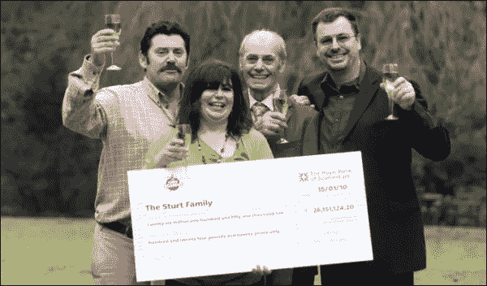

# 生活的小赌注

> 原文：<https://towardsdatascience.com/lifes-little-bets-568a6dc1179c?source=collection_archive---------4----------------------->

一个亲戚突然送你 1000 欧元的礼物。这是一笔可观的钱，但还不足以购买梦想中的房子，更不用说退休了。你决定用这笔意想不到的施舍来玩法国国家彩票，宣布的奖金比你想象的要多。即使获胜的可能性很小，坚持一定会有回报。你决定在接下来的一年中每周下注 20 欧元，并打算用你最终的赢款在下一次下注时加倍下注。一年后你会赢多少钱？

你应该相信你最初的直觉，这是一个好主意，还是使用现有的数据来批判性地思考你成功的机会？利用决策科学的原理，我们当然可以做得比瞎猜好得多。我们对决策环境和手头的数据了解多少？我们有一千欧元可以花。我们正在考虑把这笔钱花在为公共项目融资的彩票上。基于从 49 个数字中选择 6 个正确数字，任何一周赢得一些钱的机会是 16.7%。这是一个随机决策环境的例子——问题*“我这周会赢得头奖吗？”*不包含在数据本身中。我们一周可以玩三次，但无法提前知道哪些号码会构成中奖票。

赌博，就像一般的商业，尤其是创新一样，是一种没有绝对保证的概率游戏。[【我】](http://file///C:/Users/Lee/Dropbox/Business%20Analytics%20Insitute/Life's%20Lttle%20Bets.docx#_edn1)在这样的决策环境中，我们仍然可以通过探索手头的数据，选择适当的方法来解决问题的本质，并使用数据来激励行动，从而做出更好的决策。当分析可能的结果时，我们需要从探索我们所知道的独立(条件因素)和从属(可解释的结果)变量开始。然后，我们可以分析上下文来理解事件链的潜在组合和排列。在这种情况下，我们选择的数字和每周的中奖票有什么关系？

统计学中众所周知的问题类型被称为一维随机游走，通常被称为赌徒的破产。如果你每周下注相等的遗产(1/N)，你将在 N 周内失去一切。问题的本质是，你输掉每周赌注的概率小于 1(在国家彩票的情况下，赔率严重偏向庄家)。不仅很有可能你会输掉你的每一笔赌注，而且无论输赢，你都离清空你的下注帐户还有 N 步之遥。忘掉你的预感和直觉，把你的 1000 欧元投资在学习如何做出更好的决定上(例如在我们的[大师班](http://http/Baimasterclass.com))会是一个更好的投资…

改善管理决策是商业分析研究所的核心和灵魂。在我们位于巴约纳的[暑期学校](http://baisummer.com)，以及我们在欧洲的[大师班](http://baimasterclass.com)，我们让分析为您和您的组织服务。该研究所专注于管理者数据科学的五个应用:在数字时代工作、数据驱动的决策、机器学习、社区管理和视觉通信。培养你做出更好决定的能力会对你未来的工作和职业生涯产生影响。

*********

Reis，r .(2015)，[创始人:以下是如何利用概率为你带来优势](https://medium.com/startupsco/how-to-use-probability-to-your-advantage-f3a59e711dda)，Medium

[[ii]](http://file///C:/Users/Lee/Dropbox/Business%20Analytics%20Insitute/Life's%20Lttle%20Bets.docx#_ednref2)t . Lieghton，(2006)，T14 随机漫步 T15，讲稿，麻省理工学院计算机科学数学