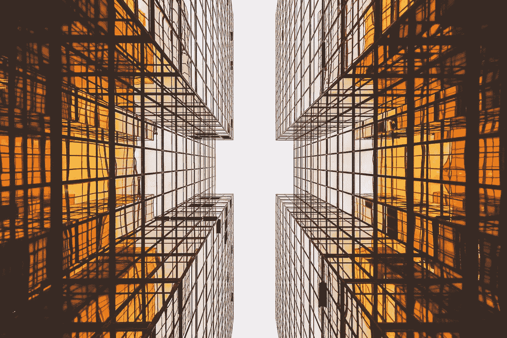
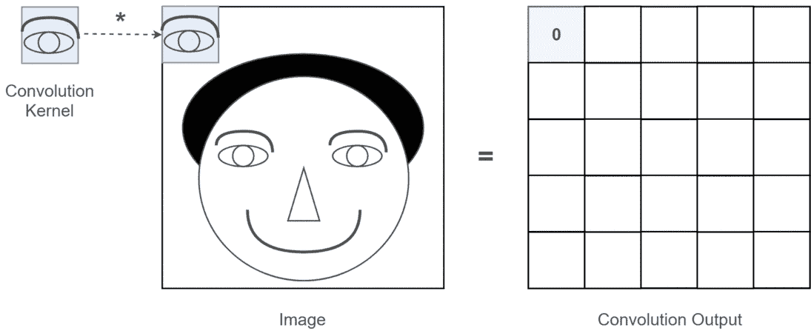
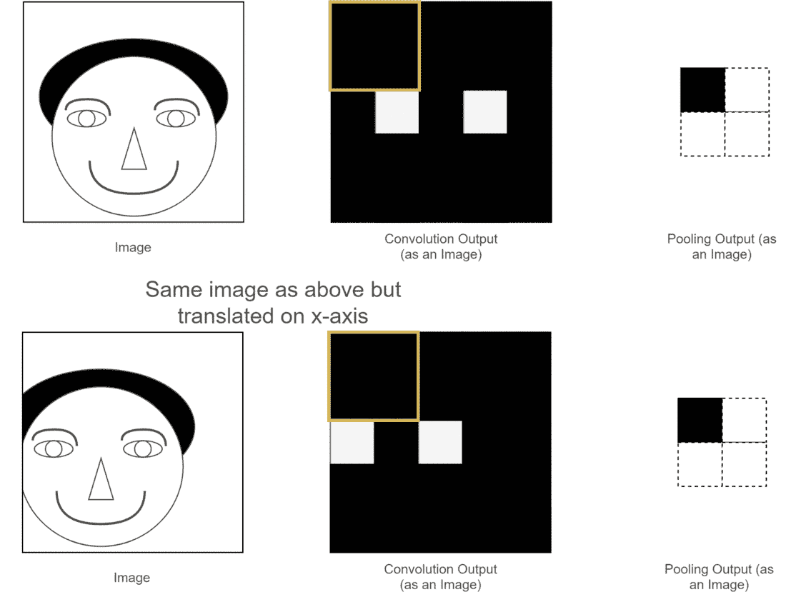
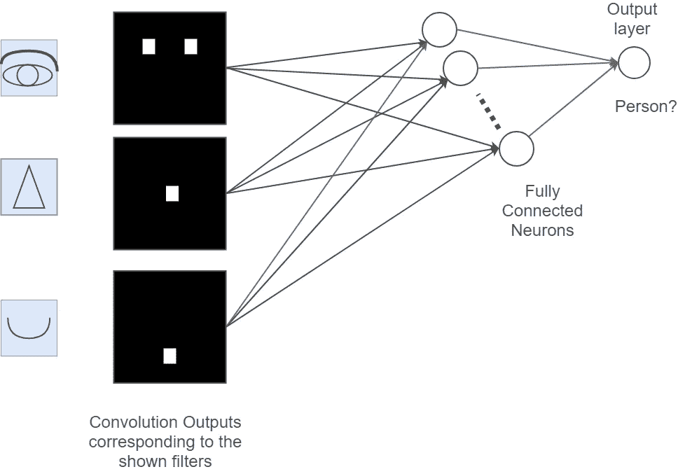

# 卷积神经网络直观指南

> 原文：<https://towardsdatascience.com/light-on-math-machine-learning-intuitive-guide-to-convolution-neural-networks-e3f054dd5daa?source=collection_archive---------1----------------------->

## [点亮数学机器学习](https://towardsdatascience.com/tagged/light-on-math)



Image by [Free-Photos](https://pixabay.com/photos/?utm_source=link-attribution&utm_medium=referral&utm_campaign=image&utm_content=768432) from [Pixabay](https://pixabay.com/?utm_source=link-attribution&utm_medium=referral&utm_campaign=image&utm_content=768432)

这是我的系列文章中的第二篇，介绍机器学习概念，同时略微涉及数学。如果你错过了之前的文章，你可以在[这里找到](http://www.thushv.com/machine-learning/light-on-math-machine-learning-intuitive-guide-to-understanding-kl-divergence)(关于 KL 发散)。*有趣的事实*，我将通过为字母表中的每个字母引入一些机器学习概念来使这成为一次有趣的冒险(这将是字母 **C** )。

**A B C**[**D**](/light-on-math-machine-learning-intuitive-guide-to-understanding-decision-trees-adb2165ccab7)*** E F**[**G**](/light-on-math-ml-intuitive-guide-to-understanding-glove-embeddings-b13b4f19c010)*** H I J**[**K**](http://www.thushv.com/machine-learning/light-on-math-machine-learning-intuitive-guide-to-understanding-kl-divergence/)**[**L**](/light-on-math-machine-learning-intuitive-guide-to-latent-dirichlet-allocation-437c81220158)*** M**[**N**](/light-on-math-machine-learning-intuitive-guide-to-neural-style-transfer-ef88e46697ee)**O P Q R S T U****

***表示中等付费墙后面的文章**

# **介绍**

**卷积神经网络(CNN)是一种深度网络，可以利用数据(例如图像)的空间结构来学习数据，以便算法可以输出有用的东西。考虑这样一个问题，我们想要识别在给定的图像中是否有一个人。例如，如果我给 CNN 一个人的图像，这个深度神经网络首先需要学习一些局部特征(例如，眼睛、鼻子、嘴等。).这些局部特征在 ***卷积层*** 中学习。**

**然后，CNN 将查看给定图像中存在哪些局部特征，然后产生特定的激活模式(或激活向量),其全局地表示这些局部特征图的存在。这些激活模式是由 CNN 中的 ***全连接*** 层产生的。例如，如果图像不是一个人，激活模式将不同于它给出的一个人的图像。**

# **CNN 在一个模块的水平**

**现在让我们看看 CNN 中存在哪种子模块。一个典型的 CNN 有三个不同的组成部分。它们是卷积层、汇集层和全连接层。关于什么是卷积层和全连通层，我们已经有了一个大致的概念。我们没有讨论的一件事是 ***池层*** ，我们将很快讨论它。**

**首先，我们深入讨论卷积层的作用。一个卷积层由许多 ***内核*** 组成。卷积层中存在的这些内核(有时称为 ***卷积滤波器*** )学习图像中存在的局部特征(例如，人的眼睛看起来像什么)。卷积层学习的这种局部特征称为 ***特征图*** 。然后这些特征在图像上进行卷积。这个卷积操作将产生一个矩阵(有时被称为 ***激活图*** )。如果卷积滤波器中表示的要素出现在输入的给定位置，则激活图会在该位置产生高值。**

**汇集层使 CNN 翻译学习的这些特征不变(例如，不管人的眼睛在[ *x=10，y=10* ]或[ *x=12，y=11* ]位置，汇集层的输出将是相同的)。请注意，我们讨论的是每层的轻微翻译变化。然而，聚集几个这样的层，允许我们具有更高的平移不变性。**

**最后，我们有完全连接的层。完全连接的层负责基于激活的特征映射的集合和图像中的位置产生不同的激活模式，特征映射被激活用于图像中的位置。这是 CNN 视觉上的样子。**

****

**对 CNN 的整体结构有了很好的了解后，让我们继续了解组成 CNN 的每一个子组件。**

# **卷积层**

**卷积运算到底是做什么的？如果卷积特征存在于给定位置，则卷积运算输出该位置的高值，否则输出低值。更具体地，在卷积核的给定位置，我们对每个核单元值和与核单元重叠的相应图像像素值进行逐元素相乘，然后对其求和。确切的值是根据下面的公式决定的( *m* —内核宽度和高度， *h* —卷积输出， *x* —输入， *w* —卷积内核)。**

****

**图像上的卷积过程可以被可视化如下。**

****

**仅仅知道卷积运算做什么是不够的，我们还需要了解卷积输出代表什么。想象卷积输出值的颜色(0 —黑色，100 —白色)。如果你观想这个图像，它将代表一个二进制图像，在眼睛所在的位置发光。**

****

**卷积运算也可以被认为是对给定图像执行某种变换。这种变换可以产生各种效果(例如，提取边缘、模糊等。).让我们更具体地理解卷积运算对图像的影响。考虑下图和卷积核。你可以在这篇[维基百科文章](https://en.wikipedia.org/wiki/Kernel_(image_processing))中找到更多相关信息。**

# **汇集层**

**现在让我们了解一下池操作是做什么的。池(有时称为子采样)层使 CNN 在卷积输出方面有一点平移不变。实践中使用了两种不同的汇集机制(最大汇集和平均汇集)。我们将最大池称为池，因为与平均池相比，最大池被广泛使用。更准确地说，池化操作在给定的位置输出输入的最大值，该值在内核中。所以从数学上来说，**

****

**通过对我们前面看到的卷积输出应用池化操作，让我们了解池化是如何工作的。**

****

**如你所见，我们使用了同一个图像的两个变体；一幅原始图像和另一幅在 x 轴上稍微平移的图像。但是，池化操作会为两幅图像输出完全相同的特征图(黑色— 0，白色— 100)。因此，我们说汇集操作使得 CNN 翻译中的知识不变。需要注意的一点是，我们不是一次移动 1 个像素，而是一次移动 2 个像素。这就是所谓的 ***步距池*** ，意味着我们以 2 的步距执行池操作。**

# **完全连接的层**

**完全连接的层将组合由不同卷积核学习的特征，以便网络可以建立关于整体图像的全局表示。我们可以如下理解全连通层。**

****

**全连接层中的神经元将基于由卷积特征表示的各种实体是否实际存在于输入中而被激活。由于完全连接的神经元为此被激活，它将基于输入图像中存在的特征产生不同的激活模式。这为输出层提供了影像中存在的内容的紧凑表示，输出层可以轻松地使用该表示对影像进行正确分类。**

# **将它们编织在一起**

**现在，我们要做的就是将所有这些放在一起，形成一个端到端的模型，从原始图像到决策。一旦连接上，CNN 就会变成这样。总而言之，卷积层将学习数据中的各种局部特征(例如，眼睛看起来像什么)，然后汇集层将使 CNN 对这些特征的平移不变(例如，*如果眼睛在两个图像中出现轻微平移，CNN 仍会将其识别为眼睛*)。最后，我们有完全连接的层，也就是说，“我们发现两只眼睛，一个鼻子和一张嘴，所以这一定是一个人，并激活正确的输出。**

****

# **添加越来越多的层有什么作用？**

**增加更多的层，显然提高了深度神经网络的性能。事实上，深度学习中最引人注目的突破性研究与解决 ***的问题有关，我们如何增加更多的层？*** ，虽然没有打乱模特的训练。因为模型越深，训练难度越大。**

**但是拥有更多的层有助于 CNN 以分层的方式学习特征。例如，第一层学习图像中的各种边缘方向，第二层学习基本形状(圆形、三角形等)。)而第三层学习更高级的形状(例如眼睛的形状、鼻子的形状)，等等。这提供了更好的性能，相比之下，你可以用一个 CNN 来学习所有这些。**

# **训练 CNN(又名反向传播)**

**现在，要记住的一件事是，这些卷积特征(眼睛、鼻子、嘴巴)不会在你实现 CNN 时神奇地出现。目标是在给定数据的情况下学习这些特征。为此，我们定义了一个代价函数，奖励正确识别的数据，惩罚错误分类的数据。示例成本函数可以是均方根误差或二元交叉熵损失。**

**在我们定义损失之后，我们可以优化特征的权重(即特征的每个单元值)以反映有用的特征，从而使 CNN 正确地识别一个人。更具体地说，我们优化每个卷积核和全连接神经元，通过在每个参数相对于损失的梯度所示的相反方向上迈出一小步。然而，要实现 CNN，你不需要知道如何实现梯度传播的确切细节。这是因为，当你定义正向计算时，大多数深度学习库(例如 TensorFlow、PyTorch)在内部自动实现这些微分操作。**

# **用 Keras 实现和运行 CNN**

**这里我们将简要讨论如何实现一个 CNN。了解基础知识是不够的，我们还应该了解如何使用像 Keras 这样的标准深度学习库来实现模型。Keras 是一个很好的工具，尤其是快速原型模型，看看他们的行动！此处 的练习可用 [**。**](https://github.com/thushv89/exercises_thushv_dot_com/blob/master/cnn_light_on_math_ml/cnn_keras.ipynb)**

**首先，我们定义想要使用的 Keras API。我们将使用[顺序 API](https://keras.io/models/sequential/) 。你可以在这里了解更多信息:**

```
# Define a sequential model
model = Sequential()
```

**然后我们定义一个卷积层如下:**

```
# Added a convolution layer
model.add(Conv2D(32, (3,3), activation=’relu’, input_shape=[28, 28, 1]))
```

**这里，`32`是层中内核的数量，`(3,3)`是卷积层的内核大小(高度和宽度)。我们使用非线性激活`Relu`和输入形状`[28, 28, 1]`，即`[image height, image width, color channels]`。请注意，输入形状应该是前一层产生的输出形状。对于第一个卷积层，我们有实际的数据输入。对于层的其余部分，它将是前一层产生的输出。接下来，我们讨论如何实现最大池层:**

```
# Add a max pool lyer
model.add(MaxPool2D())
```

**这里我们不提供任何参数，因为我们将使用 Keras 中提供的默认值。如果不指定参数，Keras 将使用内核大小(2，2)和步距(2，2)。接下来，我们定义完全连接的层。然而，在此之前，我们需要拉平我们的输出，因为完全连接的图层处理 1D 数据:**

```
model.add(Flatten())model.add(Dense(256, activation=’relu’))
model.add(Dense(10, activation=’softmax’))
```

**这里我们定义了两个全连接或密集层。第一个全连接层有`256`个神经元，使用`Relu`激活。最后，我们定义了一个密集层，它有 10 个输出节点，并激活了`softmax`。这充当输出层，它将为具有相同对象的图像激活特定的神经元。最后，我们编译我们的模型，**

```
model.compile(
 optimizer=’adam’, loss=’categorical_crossentropy’, metrics=[‘accuracy’]
)
```

**这里我们说使用`Adam`优化器(来训练模型)，使用交叉熵损失并使用模型的`accuracy`来评估模型。最后，我们可以使用数据来训练和测试我们的模型。我们将使用 [MNIST 数据集](http://yann.lecun.com/exdb/mnist/)，我们将使用[练习](https://github.com/thushv89/exercises_thushv_dot_com/blob/master/cnn_light_on_math_ml/cnn_keras.ipynb)中定义的`maybe_download`和`read_mnist`函数下载并读入内存。MNIST 数据集包含手写数字(0–9)的图像，目标是通过分配图像所代表的数字来对图像进行正确分类。**

**接下来，我们通过调用以下函数来训练我们的模型:**

```
model.fit(x_train, y_train, batch_size = batch_size)
```

**我们可以用下面的测试数据来测试我们的模型:**

```
test_acc = model.evaluate(x_test, y_test, batch_size=batch_size) 
```

**我们将运行几个时期，这将允许您提高模型的性能。**

# **结论**

**我们在这里结束关于卷积神经网络的讨论。我们首先从一个更高的角度讨论了 CNN 内部发生的事情，然后一节一节地讨论。然后，我们讨论了典型 CNN 的主要组成部分，如卷积层、池层和全连接层。最后，我们更详细地介绍了每个组件。然后我们简单讨论了 CNN 中的训练是如何进行的。最后，我们讨论了如何用 Keras 实现一个标准的 CNN:一个高级的 TensorFlow 库。你可以在这里 找到本教程 [**的练习。**](https://github.com/thushv89/exercises_thushv_dot_com/blob/master/cnn_light_on_math_ml/cnn_keras.ipynb)**

**干杯！**

**如果你喜欢我分享的关于数据科学和机器学习的故事，考虑成为会员吧！**

**[](https://thushv89.medium.com/membership) [## 通过我的推荐链接加入媒体

### 作为一个媒体会员，你的会员费的一部分会给你阅读的作家，你可以完全接触到每一个故事…

thushv89.medium.com](https://thushv89.medium.com/membership)** 

# **想在深度网络和 TensorFlow 上做得更好？**

**检查我在这个课题上的工作。**

****

**[1] [(书)TensorFlow 2 在行动——曼宁](https://www.manning.com/books/tensorflow-in-action)**

**[2] [(视频教程)Python 中的机器翻译](https://www.datacamp.com/courses/machine-translation-in-python) — DataCamp**

**[3] [(书)TensorFlow 中的自然语言处理 1](https://www.amazon.com.au/Natural-Language-Processing-TensorFlow-Ganegedara/dp/1788478312/ref=sr_1_25?dchild=1&keywords=nlp+with+tensorflow&qid=1603009947&sr=8-25) — Packt**