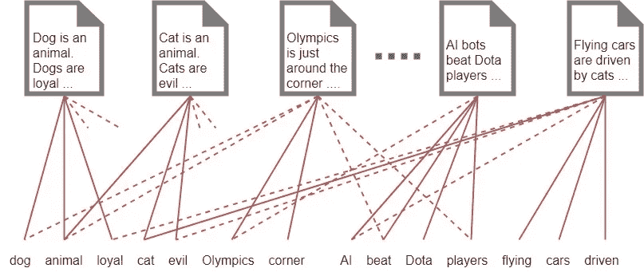
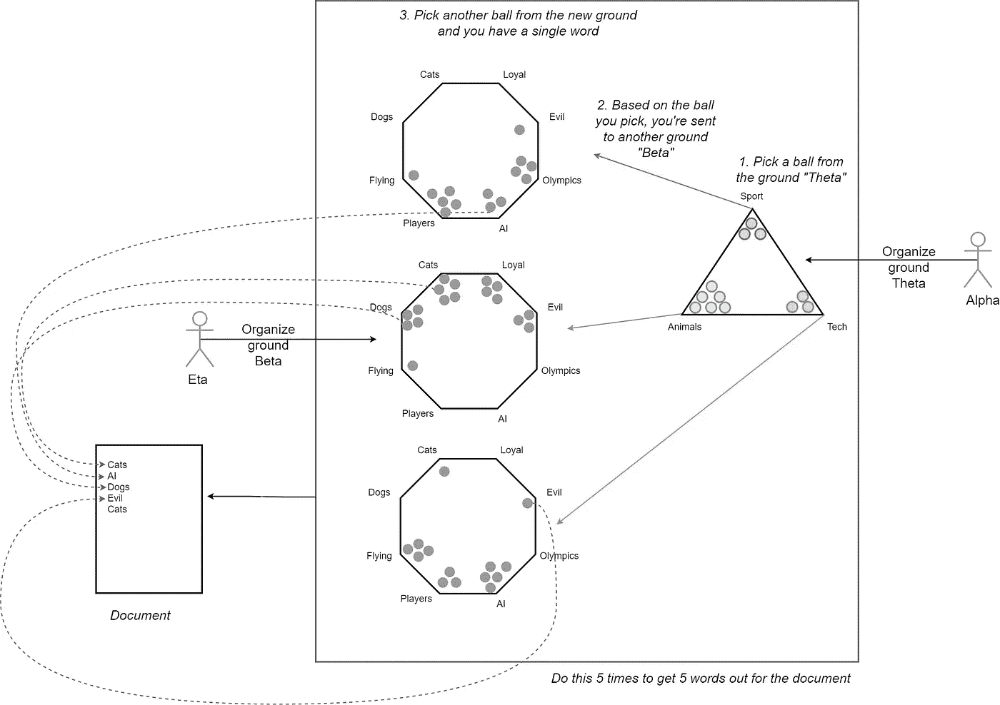
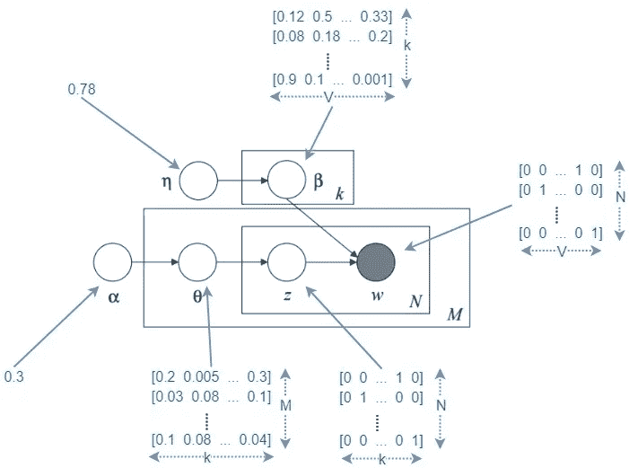
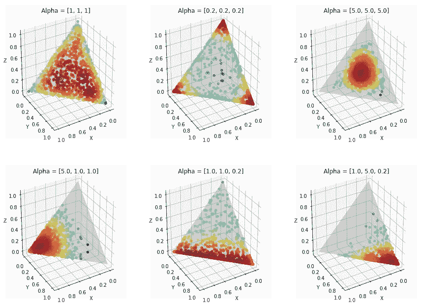

# 潜在狄利克雷分配直观指南

> 原文：<https://towardsdatascience.com/light-on-math-machine-learning-intuitive-guide-to-latent-dirichlet-allocation-437c81220158?source=collection_archive---------1----------------------->

## [点亮数学机器学习](https://towardsdatascience.com/tagged/light-on-math)

主题建模是指确定最能描述一组文档的主题的任务。这些主题只会在主题建模过程中出现(因此称为潜在)。其中一种流行的主题建模技术被称为*潜在狄利克雷分配* (LDA)。虽然名字很拗口，但背后的概念非常简单。

简而言之，LDA 设想了一组固定的主题。每个主题代表一组单词。LDA 的目标是以某种方式将所有文档映射到主题，使得每个文档中的单词大部分被那些虚构的主题捕获。我们将系统地学习这种方法，直到你能足够舒服地自己使用这种方法。

这是数学机器学习系列 ***之光 A-Z*** 的第四篇博文。你可以在下面的信中找到以前的博客文章。

**A B**[**C**](http://www.thushv.com/computer_vision/light-on-math-machine-learning-intuitive-guide-to-convolution-neural-networks/)**[**D**](/light-on-math-machine-learning-intuitive-guide-to-understanding-decision-trees-adb2165ccab7)**E F G H I J**[**K**](http://www.thushv.com/machine-learning/light-on-math-machine-learning-intuitive-guide-to-understanding-kl-divergence/)**L**[**M**](https://thushv89.medium.com/light-on-math-ml-intuitive-guide-to-matrix-factorization-bee5af0c01aa)***[**N**](/light-on-math-machine-learning-intuitive-guide-to-neural-style-transfer-ef88e46697ee)**O P Q R S T U V******

******🔈🔥**最新文章**🔥🔈**:[M—矩阵分解](https://medium.com/p/bee5af0c01aa)********

*******表示中等付费墙后面的文章。******

# ******为什么要主题建模？******

******主题建模在现实世界中有哪些用途？历史学家可以使用 LDA 通过分析基于年份的文本来确定历史上的重要事件。基于网络的图书馆可以使用 LDA*根据你过去的阅读推荐书籍*。新闻提供者可以使用主题建模来*快速理解文章或者聚集相似的文章*。另一个有趣的应用是*图像的无监督聚类*，其中每个图像都被视为类似于一个文档。******

# ******这篇文章有什么独特之处？这是海里的另一条鱼吗？******

******简而言之，答案是否定的！我浏览了许多不同的文章。而且有很多很棒的文章/视频给人直觉。然而，他们中的大多数人仅仅停留在回答这样的问题上:******

*   ******LDA 背后的直觉是什么？******
*   ******什么是狄利克雷分布？******

******我确实谈到了这一点，但我不认为我们应该就此止步。这些模型的训练方式是我在阅读的许多文章中发现缺失的一个关键部分。所以我试着回答更多的问题，比如:******

*   ******我们想解决的数学实体是什么？******
*   ******我们如何解决这个问题？******

# ******LDA 背后的大理念是什么？******

******一旦你理解了这个大概念，我想它会帮助你理解为什么 LDA 的机制是这样的。所以现在开始。******

> ******每个文档可以通过主题的分布来描述，每个主题可以通过词的分布来描述******

******但是我们为什么要用这个想法呢？我们通过一个例子来想象一下。******

# ******通俗地说就是 LDA******

************

******假设您有一组 1000 个单词(即所有文档中最常见的 1000 个单词)，并且您有 1000 个文档。假设每个文档中平均出现 500 个这样的单词。怎么才能了解每个文档属于什么类别？一种方法是根据单词在文档中的出现，通过线索将每个文档与每个单词连接起来。类似下面的东西。******

************

******Modeling documents just with words. You can see that we can’t really infer any useful information due to the large amount of connections******

******然后当你看到一些文档与同一套单词相关联时。你知道他们讨论同样的话题。然后你可以阅读其中的一份文件，知道所有这些文件的内容。但要做到这一点，你没有足够的线程。为此，您将需要大约 500*1000=500，000 个线程。但我们生活在 2100 年，我们已经耗尽了制造螺纹的所有资源，所以它们非常昂贵，你只能负担得起 10，000 根螺纹。你如何解决这个问题？******

# ******深入减少螺纹！******

******我们可以通过引入潜在(即隐藏)层来解决这个问题。假设我们知道文档中出现的 10 个主题。但是这些话题是不被观察的，我们只观察单词和文档，因此话题是潜在的。我们希望利用这些信息来减少线程的数量。然后你可以做的是，根据单词在主题中的位置将单词与主题联系起来，然后根据每个文档涉及的主题将主题与文档联系起来。******

******现在假设你得到的每个文档有大约 5 个主题，每个主题涉及 500 个单词。也就是说，我们需要 1000*5 个线程将文档连接到主题，10*500 个线程将主题连接到单词，总计 10000 个线程。******

************

******Words are modeled by a set of topics and documents are modeled by a set of topics. The relationships are clearer than the first example because there’s a fewer connections than the first example.******

********注**:我这里用的话题(“动物”、“运动”、“科技”)都是虚构的。在真解中，你不会有这样的题目而是类似*(0.3 *猫，0.4 *狗，0.2 *忠，0.1 *恶)*代表题目“动物”的东西。也就是说，如前所述，每个文档都是单词的分布。******

# ****一个不同的观点:LDA 想象文档是如何生成的？****

****为了给正在发生的事情提供更多的上下文，LDA 假设您看到的任何文档背后都有以下生成过程。为了简单起见，让我们假设我们正在生成一个包含 5 个单词的文档。但是同样的过程可以推广到每个都有 *N* 个单词的 *M* 个文档。标题很好地解释了这里发生了什么。所以我就不重申了。****

********

****How a document is generated. First α (alpha) organise the ground θ (theta) and then you go and pick a ball from θ. Based on what you pick, you’re sent to ground β (beta). β is organised by η (Eta). Now you pick a word from β and put it into the document. You iterate this process 5 times to get 5 words out.****

****这个图像描绘了一个已经学习过的 LDA 系统的样子。但是要达到这个阶段，你必须回答几个问题，例如:****

*   ****我们如何知道文档中有多少主题？****
*   ****你可以看到，我们的场地已经有了一个很好的结构，可以帮助我们生成合理的文件，因为组织者已经确保了场地的适当设计。我们如何找到如此优秀的组织者？****

****这将在接下来的几节中回答。此外，我们将从这一点开始变得有点技术性。所以系好安全带！****

******注意** : LDA 不关心文档中单词的顺序。通常，LDA 使用[词袋](https://en.wikipedia.org/wiki/Bag-of-words_model)特征表示来表示一个文档。这是有道理的，因为，如果我拿一份文件，把这些单词混在一起，然后给你，你仍然可以猜出文件中讨论了什么样的主题。****

# ****变得有点数学化…****

****在深入细节之前。让我们弄清楚一些事情，比如符号和定义。****

## ****定义和符号****

*   ****k —文档所属主题的数量(固定数量)****
*   ****v——词汇量****
*   ****M —文件数量****
*   ****N —每个文档中的字数****
*   *****w* —文档中的一个单词。这被表示为大小为 *V* 的一个热编码向量(即 *V* —词汇大小)****
*   *******w*** (粗体 *w* ):代表一个文档(即 *N* 字的矢量*w*s)****
*   *****D —* 语料库，收集了 *M* 的文档****
*   ****z —一组 *k* 主题中的一个主题。一个话题就是一个分布词。例如，它可能是，*动物= (0.3 猫，0.4 狗，0 人工智能，0.2 忠诚，0.1 邪恶)*****

## ****更精确地定义文档生成****

****首先让我们把上面关于生成文档的基础例子，放到一个适当的数学绘图中。****

********

****Graphical model of the LDA. Here I mark the shapes of the all the possible variables (both observed and hidden). But remember that θ, z, and β are distributions, not deterministic values****

****让我们破译这是什么意思。我们有一个单一的α值(即底θ的组织者)来定义θ；文档的主题分布将是这样的。我们有 *M* 个文档，每个文档都有一些θ分布。现在为了更清楚地理解事情，眯起你的眼睛，让那个 *M* 盘子消失(假设只有一份文件)，哇！****

****现在，单个文档有 *N* 个单词，每个单词由一个主题生成。你生成了 *N* 个主题来填充单词。这 N 个字还是占位符。****

****现在顶板开始工作了。基于η，β具有某种分布(即，准确地说是狄利克雷分布——即将讨论),并且根据该分布，β为每个主题生成 k 个单独的单词。现在，根据占位符所代表的主题，为每个占位符(在 N 个占位符的集合中)填入一个单词。****

****Viola，你现在有一份有 N 个字的文件了！****

## ****为什么α和η是常数？****

****α和η在上图中显示为常数。但实际上比这更复杂。例如，α对于每个文档都有一个主题分布(θ ground 对于每个文档)。理想情况下，一个(*M×K)*形状的矩阵。而η对每个题目都有一个参数向量。η的形状为 *(k x V)* 。在上图中，常数实际上代表矩阵，是通过将矩阵中的单个值复制到每个单元格中而形成的。****

## ****让我们更详细地理解θ和β****

****θ是一个随机矩阵，其中θ *(i，j)* 表示第 *i* 个文档包含属于第 *j* 个主题的单词的概率。如果你看看上面例子中的地面θ是什么样子，你可以看到球被很好地放置在角落而不是中间。拥有这样一个属性的好处是，我们产生的单词可能属于一个主题，就像现实世界中的文档一样。这是通过将θ建模为[狄利克雷分布](https://en.wikipedia.org/wiki/Dirichlet_distribution)而产生的性质。类似地，β(i，j)表示第 *i* 个主题包含第 *j* 个单词的概率。而β也是狄利克雷分布。下面，我提供一个快速的迂回来理解狄利克雷分布。****

## ****快速迂回:理解狄利克雷分布****

****狄利克雷分布是[贝塔分布](https://en.wikipedia.org/wiki/Beta_distribution)的多元推广。这里我们讨论一个三维问题的例子，其中α中有 3 个参数影响θ的形状(即分布)。对于 N 维狄利克雷分布，有一个长度为 N 的向量，为α。你可以看到θ的形状随着α值的不同而变化。例如，您可以看到顶部中间的图显示了与θ ground 相似的形状。****

****主要要点如下:****

> ****较大的α值将分布推向三角形的中间，而较小的α值将分布推向角落。****

********

****How the distribution of θ changes with different α values****

# ****我们如何学习 LDA？****

****我们仍然没有回答真正的问题是，我们如何知道精确的α和η值？在此之前，让我列出我们需要找到的潜在变量。****

*   ****α-分布相关参数，控制语料库中所有文档的主题分布情况****
*   ****θ —随机矩阵，其中θ(i，j)表示第 I 个文档包含第 j 个主题的概率****
*   ****η —分布相关参数，控制每个主题中单词的分布情况****
*   ****β —一个随机矩阵，其中β(i，j)表示第 I 个主题包含第 j 个单词的概率。****

## ****阐明我们需要学习什么****

****如果要我用数学的方式来表述我感兴趣的是什么，那么如下所示:****

********

****它看起来很吓人，但包含了一个简单的信息。这基本上是在说，****

****我有一组 M 个文档，每个文档有 N 个单词，其中每个单词由一组 K 个主题中的一个主题生成。我在寻找联合后验概率:****

*   ****θ —主题分布，每个文档一个主题，****
*   ******z** —每个文档的 N 个主题，****
*   ****β —词的分布，每个主题一个词，****

****鉴于，****

*   ****D —我们拥有的所有数据(即，修正数据)，****

****并使用参数，****

*   ****α-每个文档的参数向量(文档-主题分布)****
*   ****η —每个主题的参数向量(主题—单词分布)****

****但是我们不能很好地计算这个，因为这个实体很难处理。我们如何解决这个问题？****

# ****我该如何解决这个问题？救援的变分推理****

****有很多方法可以解决这个问题。但是在这篇文章中，我将集中讨论变分推理。我们上面讨论的概率是一个非常棘手的后验概率(这意味着我们不能在纸上计算，也没有很好的方程)。所以我们要用一些已知的概率分布来近似这个值，这个概率分布和真实的后验概率非常接近。这就是变分推理背后的思想。****

****这样做的方法是最小化近似和真实后验之间的 [KL 发散](/light-on-math-machine-learning-intuitive-guide-to-understanding-kl-divergence-2b382ca2b2a8)作为优化问题。同样，我不打算详细讨论，因为这超出了讨论范围。****

****但是我们将快速查看一下优化问题****

********

****γ、ϕ和λ分别代表我们用来逼近θ、 **z** 和β的自由变分参数。这里 D(q||p)代表 *q* 和 *p* 之间的 KL 散度。并且通过改变γ,ϕ和λ，我们得到不同的 *q* 分布，其与真实后验 *p* 具有不同的距离。我们的目标是找到γ*、ϕ*和λ*，使近似值 *q* 和真实后验值 *p* 之间的 KL 散度最小化。****

****一切都很好地定义了，它只是一个迭代求解上述优化问题的问题，直到解决方案收敛。一旦有了γ*、ϕ*和λ*，你就有了最终 LDA 模型所需的一切。****

# ****包裹****

****本文讨论了潜在狄利克雷分配(LDA)问题。LDA 是一种强大的方法，它允许识别文档中的主题并将文档映射到这些主题。LDA 有许多用途，例如向顾客推荐书籍。****

****我们通过一个连接线程的例子看了 LDA 是如何工作的。然后，我们看到了基于 LDA 如何想象文档生成的不同视角。最后我们进入了模型的训练。在这篇文章中，我们讨论了 LDA 背后的大量数学知识，同时保持了数学的轻松。我们看了一下狄利克雷分布是什么样子，我们感兴趣的概率分布是什么(即后验分布)，以及我们如何使用变分推理来解决这个问题。****

****我将发布一个关于如何使用 LDA 进行主题建模的教程，包括一些很酷的分析，作为另一个教程。干杯。****

****如果你喜欢我分享的关于数据科学和机器学习的故事，考虑成为会员吧！****

**** [## 通过我的推荐链接加入媒体

### 作为一个媒体会员，你的会员费的一部分会给你阅读的作家，你可以完全接触到每一个故事…

thushv89.medium.com](https://thushv89.medium.com/membership)**** 

# ****新的！加入我的新 YouTube 频道****

********

****如果你渴望看到我关于各种机器学习/深度学习主题的视频，请确保加入 [DeepLearningHero](https://www.youtube.com/channel/UC1HkxV8PtmWRyQ39MfzmtGA/) 。****

# ****参考****

****这里有一些有用的参考资料，有助于理解 LDA 是否有什么不清楚的地方。****

****大卫·布莱教授的原始论文****

****[直观的视频，解释 LDA 背后的基本理念](https://www.youtube.com/watch?v=3mHy4OSyRf0&t=1058s)****

****大卫·布雷教授的演讲****