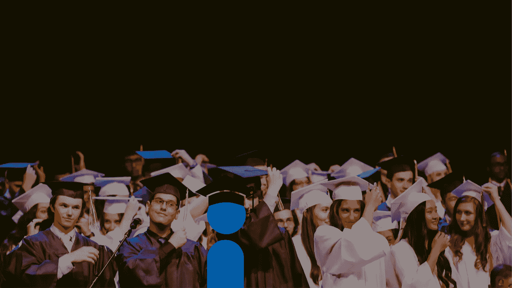
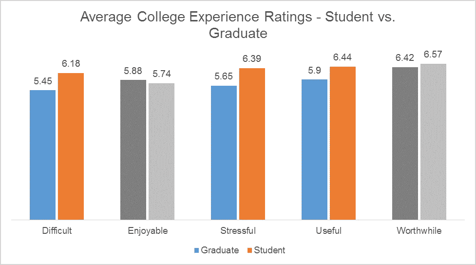
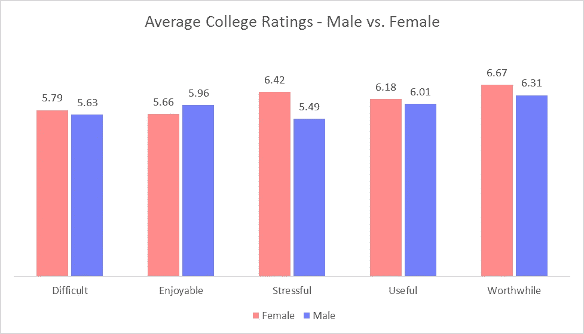
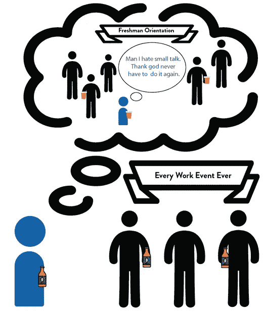
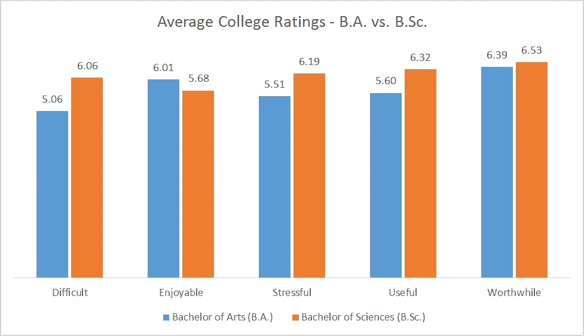

# 大学记忆会随着时间变好吗？

> 原文：<https://towardsdatascience.com/like-wine-does-college-memories-improve-over-time-9136ebfb6d4e?source=collection_archive---------3----------------------->

## 大学真的那么棒吗，还是事后看来只是如此？

# 毕业季

5 月，全国各地的学生大学毕业。我在脸书的博客上充斥着帽子和礼服的自拍照、给家长的感谢信，以及对人们在学校时光的冗长反思。

呃。

我回到了大学时代——友谊、聚会，偶尔还有学习。

大学是一段神奇的时光，在这里你没有压力，没有责任，没有规则。日常生活中最困难的决定是晚餐是点披萨还是中餐。

或者是？

虽然大学现在看起来像是 4 年的假期，但我不确定当我入学时是否真的有这种感觉。当我熬夜到凌晨 2 点，把布莱克-斯科尔斯公式死记硬背的时候，我并不觉得大学有什么乐趣。当我拼命想找一份暑期实习时，我也没有感到特别没有压力。

我一直认为大学是我一生中最美好的时光，但当我开始反思我的大学经历时，我就不那么确定了。我开始想，我对大学的美好回忆有多少是因为大学真的很棒，又有多少是因为怀旧引发的回忆。

为了解决我的疑问，我决定进行一项调查。

# 耶，分析。

我招募了 317 名 4 年制本科项目的学生或毕业生。

除了典型的人口统计学问题(性别、年龄等。)，我问人们他们什么时候/是否毕业，他们获得了什么学位或正在攻读什么学位(文学士、理学士等)。).

我还要求人们将他们的大学经历与典型的大学经历在五个方面进行比较:快乐、压力、有用性和价值。对于每项指标，每个人都给出了 1 到 10 分的评分，10 分明显高于平均水平，1 分明显低于平均水平，5 分是大学经历的平均水平。这让我可以比较不同的维度，并为每个人提供相同的基准，无论他们何时毕业。

我调查的 317 人中，女性 137 人，男性 179 人，还有 1 人是“其他”。在这些回复中，107 人是在校学生(目前正在参加 4 年制本科项目或在过去 6 个月内毕业)，210 人是大学毕业生。

我结合使用 Python、Tableau 和优秀的老式 Excel，分析了这些回复。以下是研究结果:

# 人们认为他们是特殊的雪花，有着高于平均水平的大学经历。

所有五个维度的平均评分都高于 5 分，这是大学经历的基准。人们倾向于认为他们的大学经历高于平均水平，这并不奇怪，因为人们通常觉得他们在生活中高于平均水平。
“难度”指标最接近基准(平均评分:5.70)，而每个人都觉得自己的大学经历格外“值得”(平均评分:6.47)。

# 一旦你毕业了，大学似乎就没那么困难、压力和有用了。

大学生和毕业生之间的三个指标在统计上有所不同:“难度”、“压力”和“有用性”。大学生的平均评分不仅高于基准，也高于毕业生。

换句话说，如果你在大学，你倾向于认为你的经历比已经毕业的人更困难、更有压力、更有用。

为什么？

## 假设一:大学变难了。

一个可能的解释是，随着时间的推移，大学经历实际上已经发生了变化。现在的学生认为大学更困难、更有压力、更有用，因为大学更困难、更有压力、更有用。

这种影响在调查中得到了控制，因为每个人都给出了相对于“典型的大学经历”的评级。如果随着时间的推移，大学变得更具挑战性，人们对“典型的大学经历”的定义也会随之改变。因此，虽然这种影响是可能的，但它不会导致学生和毕业生之间的评分差异。

## 假设 2:改变大学记忆

另一种可能的解释是，人们对大学的记忆发生了变化。我们的记忆就像高年级学生参加上午 9 点的课程一样可靠。[研究表明，每当我们回忆起一件事的时候，我们的记忆就会发生变化](https://news.northwestern.edu/stories/2012/09/your-memory-is-like-the-telephone-game)，因此，也许有压力的记忆，比如大三生物期末考试，已经随着时间的推移变得柔和，改变了我们对大学经历的看法。

这个假设很难被完美地检验，但是如果记忆的改变已经显著地影响了大学毕业生的评分，你可能会期待不同的评分取决于他们毕业的时间。

我把大学毕业生分成两组——应届毕业生(毕业于 5 年或不到 5 年)和老毕业生(毕业于 10 年或 10 年以上)。然后我比较了他们的评分。

事实证明，这五个指标在统计上没有什么不同。因此，尽管我们的记忆被扭曲了，但这并不是收视率差异背后的主要驱动力。

## 假设 3:改变视角

第三种可能是毕业后人们对大学的视角发生了变化。改变的不是大学记忆，而是我们如何判断这些记忆。

大多数大学生几乎没有全职工作、支付账单或抚养家庭的经验。正因为如此，大学期间的每一个项目、作业和考试似乎都是一项艰巨的任务。

毕业时，毕业生意识到大学比“现实生活”更容易。因此，大学毕业生倾向于认为大学压力更小，更难，更有用，因为他们的标准已经提高了。

支持这一假设的一个指标是，在过去三年内毕业的人给大学的“难度”评级明显低于现在的学生(6.18 比 4.95)。三年的时间不足以让大学经历发生巨大变化，人们的记忆也不太可能被严重扭曲。这表明，在现实世界中呆上几年已经影响了人们对“困难”真正含义的定义。

# 大学和你记忆中的一样愉快，也值得每年 4 万美元的学费。

大学生和大学毕业生有两个相似的评价——快乐和有价值。我们认为我们享受大学生活的程度和我们实际享受大学生活的程度相当接近。阿瑟·罗斯有句名言“我爱大学”，显然，你永远不会忘记这句话。

虽然一旦人们毕业，有用性就会下降，但价值却不会下降。事实上，对于学生和毕业生来说,“有价值”相对于其他指标得分最高。显然，你是否会用你在莎士比亚哲学 101 中学到的东西并不影响你是否认为大学是值得的。

# 不同的人有不同的评价

比较男性和女性的评价，女性发现大学比男性压力更大，而“难度”在统计上没有差异。因此，学业似乎不是大学里唯一的压力来源——参加过新生入学迎新会的人都不会感到惊讶。

我也比较了不同的大学专业。大多数人要么追求文学学士，要么追求理学学士，所以我专注于这两个学位。两个学位都认为大学同样值得，但文学学士更有趣:更高的乐趣，更低的难度，更低的压力。这也不会让任何一个上过工程学课并在黑板上看到外语开发的人感到惊讶。

# 我需要一杯啤酒。

所以大学的某些方面在毕业后有所提高，而其他方面保持不变。有一件事是肯定的，当你可以的时候享受大学生活。这么多电影都是关于大学的，而几乎没有电影是关于保住一份工作并获得稳定收入的，这是有原因的。

有机会通过挖掘每个维度来建立这个调查:是什么让大学变得愉快？是什么让大学变得艰难？在兄弟会聚会上认识脸书的某个人后，在加他们为好友之前，应该等待多长时间？

但是现在，我想我需要一盏明亮的灯，打个盹。

# 你可能喜欢的其他文章

如果你喜欢这篇文章，请访问[**LateNightFroyo.com**](http://latenightfroyo.com/)，阅读关于爱情、生活等话题的话题。

[什么时候去参加聚会比较合适？](https://www.latenightfroyo.com/archive/2017/10/14/289d7z2zo3kbxp00dsg4am34uha0gf)

[如何走出去？](https://www.latenightfroyo.com/archive/2017/4/30/how-to-get-out-of-going-out)

[多年轻才算年轻到不能约会？](https://www.latenightfroyo.com/archive/2016/10/2/how-young-is-too-young)