# 2016 年总统选举数据与各种任意选择的数据的线性相关性

> 原文：<https://towardsdatascience.com/linear-correlations-of-2016-presidential-election-data-to-various-arbitrarily-chosen-data-f909e532ffb6?source=collection_archive---------18----------------------->

## 出于好奇(和无聊)，我收集了总统选举投票的数据，并将它们与各种类型的死亡率、性传播疾病、免疫率、犯罪活动和教育分数相关联。

请记住，这些图表和摘要代表了一种相当简单的统计分析，单个自变量的线性回归通常不足以解释因变量。但是，现在是凌晨 3 点，我喝了太多咖啡，无法入睡——不管怎样，让我们找点乐子吧！数据在状态级别上进行分析(N_max = 50)。

除非另有说明，所有示例都适用于具有单个独立变量的简单线性模型(直接参见下文)。具有缺失数据的实例已从分析中排除。


**Figure 1**.: A mathematical representation of a simple linear model with a single independent variable.

## 恶性肿瘤死亡率(每 10 万人)与投票给特朗普的人数(%):


**Figure 2.**: A scatterplot relating age adjusted mortality rate due to malignant neoplasms (i.e. cancer, in incidents per 100,000) to percentage of people voting for Trump in each state.

```
R²_adj = 0.21
p_F = 0.0004824 ***
p_t[𝝱0] = 0.856997
p_t[𝝱1] = 0.000482 ***
```

有趣的是，将癌症导致的死亡率数据与特朗普的选票联系起来，会产生一种相对较弱(见 R _adj)但似乎很重要(见 p_F)的关系。这个特定模型中的异常值似乎是 NC、UT 和 WI。这种关系不适用于克林顿选民。

## 心脏病死亡率(每 10 万人)与投票给特朗普的人数(%)


**Figure 3.**: A scatterplot relating age adjusted mortality rate due to heart disease (in incidents per 100,000) to percentage of people voting for Trump in each state.

```
R²_adj = 0.2553
p_F = 0.0001084 ***
p_t[𝝱0] = 0.020797 *
p_t[𝝱1] = 0.000108 ***
```

这个模型显示了相关的迹象。虽然相关性很弱，但也相当重要。该模型中的异常值也出现在 NC、UT 和 WI 中。

## 机动车事故死亡率(每 10 万人)与投票给特朗普的人数(%)

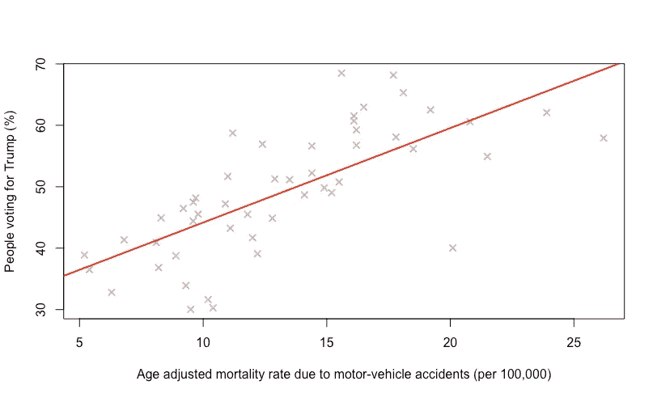

**Figure 4.**: A scatterplot relating age adjusted mortality rate due to motor-vehicle accidents (in incidents per 100,000) to percentage of people voting for Trump in each state.

```
R²_adj = 0.4948
p_F = 7.376 * 10^(-9) ***
p_t[𝝱0] = 2.79 * 10^(-12) ***
p_t[𝝱1] = 7.38 * 10^(-9) ***
```

这是一个意想不到的结果。有机动车事故问题的州似乎在 2016 年支持特朗普。这一次，相关性实际上处于中等范围。事实上，当用克林顿选票替代特朗普选票时，可以观察到类似的密切关系(但方向相反)。


**Figure 5.**: A scatterplot relating age adjusted mortality rate due to motor-vehicle accidents (in incidents per 100,000) to percentage of people voting for Clinton in each state.

```
R²_adj = 0.3971
p_F = 5.648 * 10^(-7) ***
p_t[𝝱0] < 2 * 10^(-16) ***
p_t[𝝱1] = 5.65 * 10^(-7) ***
```

进一步考察特朗普选民的模型，Breusch-Pagan ( `p = 0.1193`)和 Score test ( `p = 0.1449`)表明数据中不存在异方差。夏皮罗-维尔克(`p = 0.6651`)、科尔莫戈罗夫-斯米尔诺夫(`p = 0.8544`)和安德森-达林(`p = 0.4715`)正态性检验都表明数据来自正态分布。德宾-沃森检验(`p = 0.89`)表明误差不相关。

因此，我们或许可以有把握地预测某个州在 2016 年总统选举中的投票情况，只需使用机动车事故死亡率。或者，我们可以利用各州的投票记录来预测它们的机动车事故死亡率。

## 自杀死亡率(每 10 万人)与投票给特朗普的人数(%)

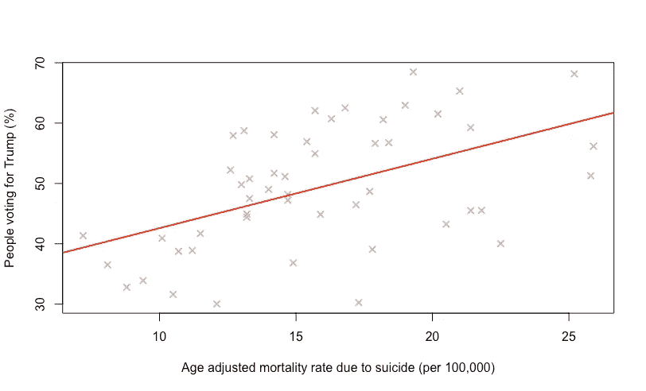

**Figure 6.**: A scatterplot relating age adjusted mortality rate due to suicide (in incidents per 100,000) to percentage of people voting for Trump in each state.

```
R²_adj = 0.24
p_F = 0.0001811 ***
p_t[𝝱0] = 2.26 * 10^(-8) ***
p_t[𝝱1] = 0.000181 ***
```

该模型还显示出显著相关性的迹象，尽管在支持特朗普的州和自杀死亡率之间存在微弱的相关性。相反，支持克林顿的州显示出较低的死亡率——甚至更合适。

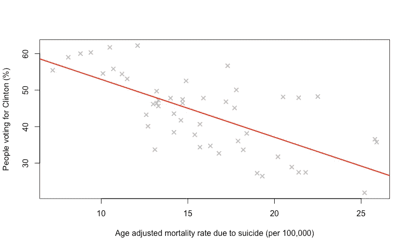

**Figure 7.**: A scatterplot relating age adjusted mortality rate due to suicide (in incidents per 100,000) to percentage of people voting for Clinton in each state.

```
R²_adj = 0.4636
p_F = 3.196 * 10^(-8) ***
p_t[𝝱0] < 2 * 10^(-16) ***
p_t[𝝱1] = 3.2 * 10^(-8) ***
```

对 Trump 投票模型运行诊断会产生以下结果:

```
Breusch-Pagan p = 0.1763463                 | No heteroskedasticity!
Score test p = 0.08569949                   | No heteroskedasticity!
Shapiro-Wilk p = 0.2942                     | Normal distribution!
Kolmogorov-Smirnov p = 0.8451               | Normal distribution!
Anderson-Darling p = 0.3797                 | Normal distribution!
Durbin-Watson p = 0.704                     | Uncorrelated errors!
```

## 凶杀死亡率(每 10 万人)与投票给特朗普的人数(%)

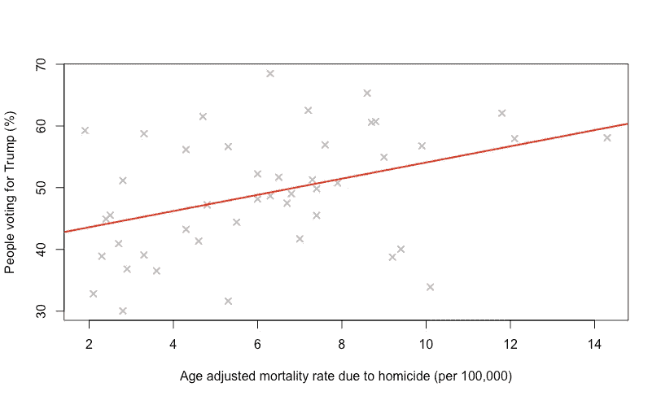

**Figure 8.**: A scatterplot relating age adjusted mortality rate due to homicide (in incidents per 100,000) to percentage of people voting for Trump in each state.

```
R²_adj = 0.1366
p_F = 0.007208 **
p_t[𝝱0] = 2.61 * 10^(-16) ***
p_t[𝝱1] = 0.00721 **
```

这个模型显示，杀人道德率和特朗普支持度之间的相关性很弱。然而，参数估计似乎产生了一个非常好的 t 检验统计量。可能有影响的异常值是 HI、LA 和 TX。

## 药物中毒死亡率(每 10 万人)与投票给特朗普的人数(%)

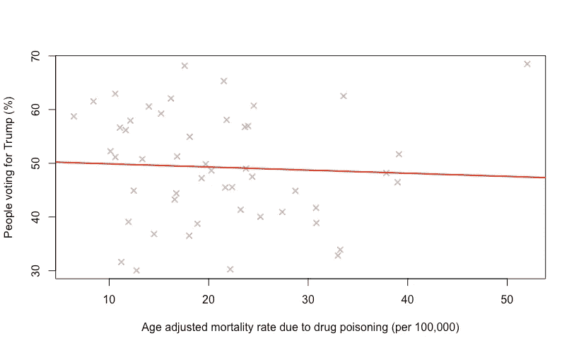

**Figure 9.**: A scatterplot relating age adjusted mortality rate due to drug poisoning (in incidents per 100,000) to percentage of people voting for Trump in each state.

```
R²_adj = 0.0179
p_F = 0.7115
p_t[𝝱0] < 2 * 10^(-16) ***
p_t[𝝱1] = 0.711
```

在 2016 年选举中支持特朗普的州与药物中毒死亡率之间既没有显著也没有明显的相关性。

## 关于死亡率的结论

与支持克林顿的州相比，2016 年支持特朗普的州似乎因各种原因而倾向于遭受高死亡率。最突出的例子是与机动车辆和自杀有关的死亡。这一明显规律的一个显著例外是药物中毒死亡率——这是两个变量之间没有显著或明显相关性的唯一例子。

## 婴儿死亡率(每 1，000 名活产婴儿)与投票给特朗普的人数(%)

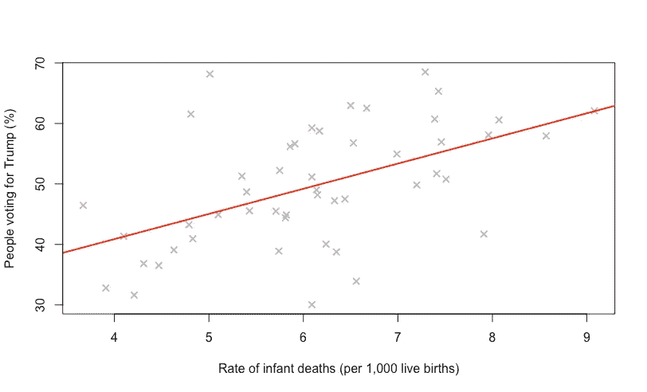

**Figure 10.**: A scatterplot relating rate of infant deaths (per 1,000 live births) to percentage of people voting for Trump in each state.

```
R²_adj = 0.256
p_F = 0.0001239 ***
p_t[𝝱0] = 0.000297 ***
p_t[𝝱1] = 0.000124 ***
```

当谈到特朗普的支持率和婴儿死亡率时，似乎支持特朗普的州的婴儿死亡率也略高。尽管这种关系很重要，但相对较弱，两个变量之间只有轻微的相关性。

## 非西班牙裔黑人婴儿死亡率(每 1，000 名活产婴儿)与投票给特朗普的人的比率(%)

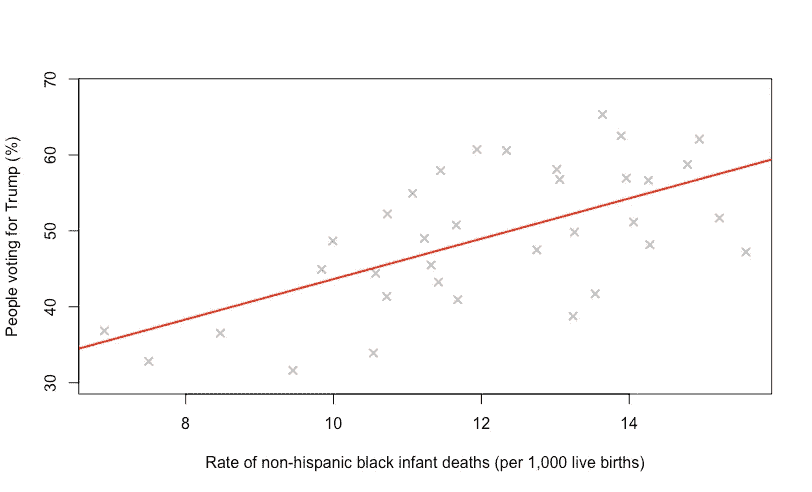

**Figure 11.**: A scatterplot relating rate of non-hispanic black infant deaths (per 1,000 live births) to percentage of people voting for Trump in each state.

```
R²_adj = 0.3689
p_F = 6.537 * 10^(-5) ***
p_t[𝝱0] = 0.0225 *
p_t[𝝱1] = 6.54 * 10^(-5) ***
```

当我们只研究非西班牙裔黑人婴儿死亡的例子时，相关性更高，模型总体上更适合。如预期的那样，在这个模型上运行诊断程序会产生相当不错的结果。

```
Breusch-Pagan p = 0.4146038                 | No heteroskedasticity!
Score test p = 0.2699911                    | No heteroskedasticity!
Shapiro-Wilk p = 0.3525                     | Normal distribution!
Kolmogorov-Smirnov p = 0.8966               | Normal distribution!
Anderson-Darling p = 0.5787                 | Normal distribution!
Durbin-Watson p = 0.44                      | Uncorrelated errors!
```

不出所料，支持克林顿的州的趋势正好相反:


**Figure 12.**: A scatterplot relating rate of non-hispanic black infant deaths (per 1,000 live births) to percentage of people voting for Clinton in each state.

```
R²_adj = 0.3361
p_F = 0.0001565 ***
p_t[𝝱0] = 2.85 * 10^(-12) ***
p_t[𝝱1] = 0.000156 ***Breusch-Pagan p = 0.5336099                 | No heteroskedasticity!
Score test p = 0.3860135                    | No heteroskedasticity!
Shapiro-Wilk p = 0.2888                     | Normal distribution!
Kolmogorov-Smirnov p = 0.4213               | Normal distribution!
Anderson-Darling p = 0.2453                 | Normal distribution!
Durbin-Watson p = 0.514                     | Uncorrelated errors!
```

## 西班牙裔婴儿死亡率(每 1，000 名活产婴儿)与投票给特朗普的人的比率(%)

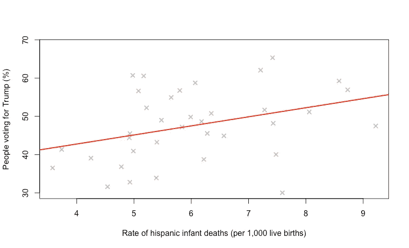

**Figure 13.**: A scatterplot relating rate of hispanic infant deaths (per 1,000 live births) to percentage of people voting for Trump in each state.

```
R²_adj = 0.09937
p_F = 0.03432 *
p_t[𝝱0] = 1.74 * 10^(-5) ***
p_t[𝝱1] = 0.0343 *
```

在 2016 年大选中支持特朗普的州与拉美裔婴儿死亡率之间存在疏忽的关系。

## 关于婴儿死亡率的结论

根据死亡率数据，婴儿死亡率也趋向于更高的特朗普支持率。在非西班牙裔黑人婴儿死亡率方面尤其如此，这种关系非常明显，模型拟合得非常好。

## 衣原体感染率(每 10 万人)与投票给特朗普的人数(%)

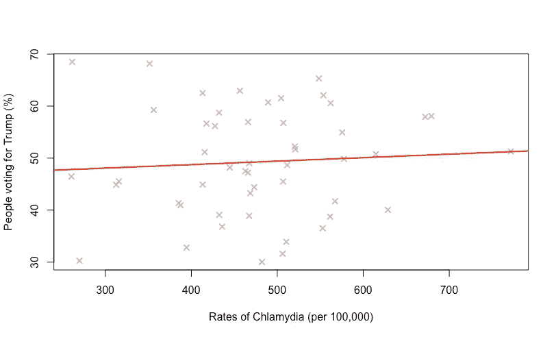

**Figure 14.**: A scatterplot relating rates of Chlamydia (per 100,000) to percentage of people voting for Trump in each state.

```
R²_adj = 0.01594
p_F = 0.6329
p_t[𝝱0] = 1.7 * 10^(-8) ***
p_t[𝝱1] = 0.633
```

特朗普的支持度和衣原体感染率之间似乎没有明显或显著的关系。

## 淋病率(每 10 万人)与投票给特朗普的人(%)

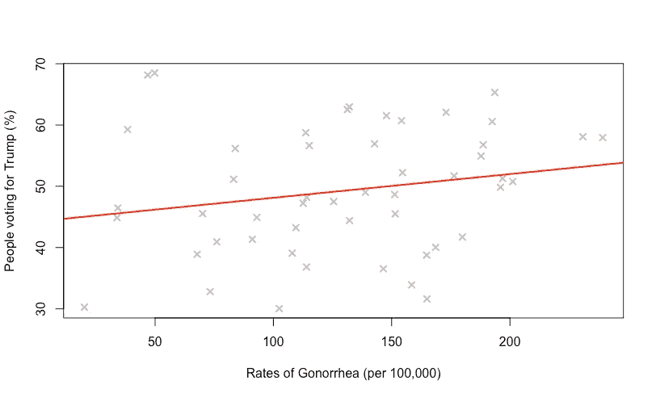

**Figure 15.**: A scatterplot relating rates of Gonorrhea (per 100,000) to percentage of people voting for Trump in each state.

```
R²_adj = 0.02107
p_F = 0.1582
p_t[𝝱0] = 1.13 * 10^(-15) ***
p_t[𝝱1] = 0.158
```

特朗普的支持率和淋病发病率之间似乎也没有明显或显著的关系。

## 梅毒发病率(每 10 万人)与投票给特朗普的人(%)


**Figure 16.**: A scatterplot relating rates of Syphilis (per 100,000) to percentage of people voting for Trump in each state.

```
R²_adj = 0.04053
p_F = 0.08614
p_t[𝝱0] < 2 *10^(-16) ***
p_t[𝝱1] = 0.0861
```

特朗普的支持率和梅毒发病率之间似乎也没有明显或显著的关系。

## 关于性传播疾病的结论

性传播疾病和特朗普的支持率之间似乎没有明显的联系。

## 19-35 个月儿童的估计 MMR 疫苗接种覆盖率(%)与投票给特朗普的人(%)

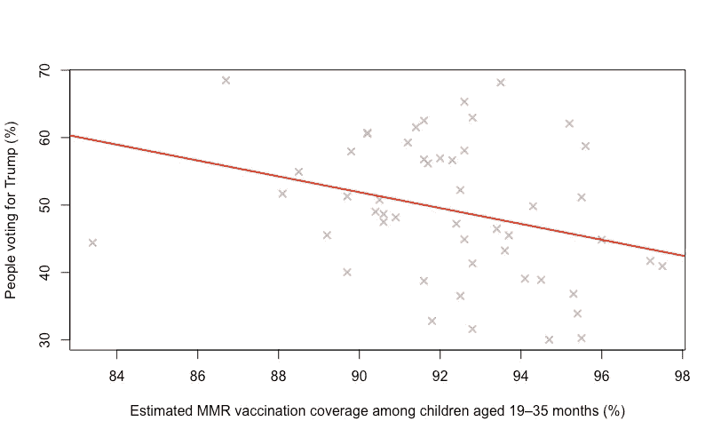

**Figure 17.**: A scatterplot relating estimated MMR vaccination coverage among children aged 19–35 months (%) to percentage of people voting for Trump in each state.

```
R²_adj = 0.07459
p_F = 0.03083 *
p_t[𝝱0] = 0.00221 **
p_t[𝝱1] = 0.03083 *
```

在不太理想的拟合模型上存在非常小的相关性，表明特朗普支持度和 MMR 疫苗接种覆盖率之间存在潜在的负相关性。

## 19-35 个月儿童的 DTaP 疫苗接种覆盖率(%)与投票给特朗普的人群(%)

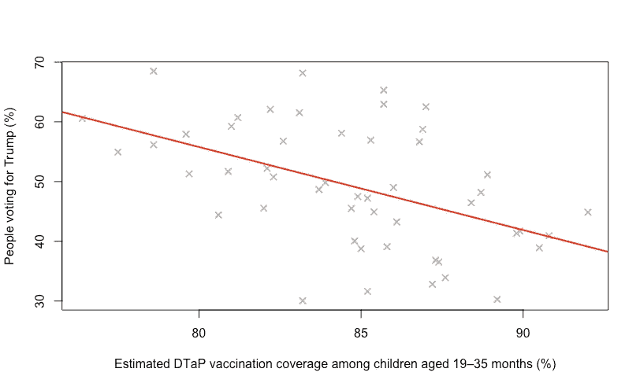

**Figure 18.**: A scatterplot relating estimated DTaP vaccination coverage among children aged 19–35 months (%) to percentage of people voting for Trump in each state.

```
R²_adj = 0.2246
p_F = 0.0003003 ***
p_t[𝝱0] = 1.33 * 10^(-6) ***
p_t[𝝱1] = 3 * 10^(-4) ***
```

有适度的证据表明，各州在 2016 年总统大选中支持特朗普，并降低了 DTaP 免疫的覆盖率。模型诊断似乎没有发出任何危险信号。

```
Breusch-Pagan p = 0.6658235                 | No heteroskedasticity!
Score test p = 0.6299109                    | No heteroskedasticity!
Shapiro-Wilk p = 0.7211                     | Normal distribution!
Kolmogorov-Smirnov p = 0.7435               | Normal distribution!
Anderson-Darling p = 0.6068                 | Normal distribution!
Durbin-Watson p = 0.296                     | Uncorrelated errors!
```

## 19-35 个月儿童中 HepB 疫苗接种覆盖率(%)与投票给川普的人群(%)


**Figure 19.**: A scatterplot relating estimated HepB vaccination coverage among children aged 19–35 months (%) to percentage of people voting for Trump in each state.

```
R²_adj = 0.05479
p_F = 0.05585
p_t[𝝱0] = 0.1628
p_t[𝝱1] = 0.0558
```

没有明显或显著的证据表明 HepB 疫苗接种覆盖率与 2016 年总统选举中对特朗普的支持之间存在关系。

## 19-35 个月儿童 HepA 疫苗接种覆盖率(%)与投票给特朗普的人群(%)

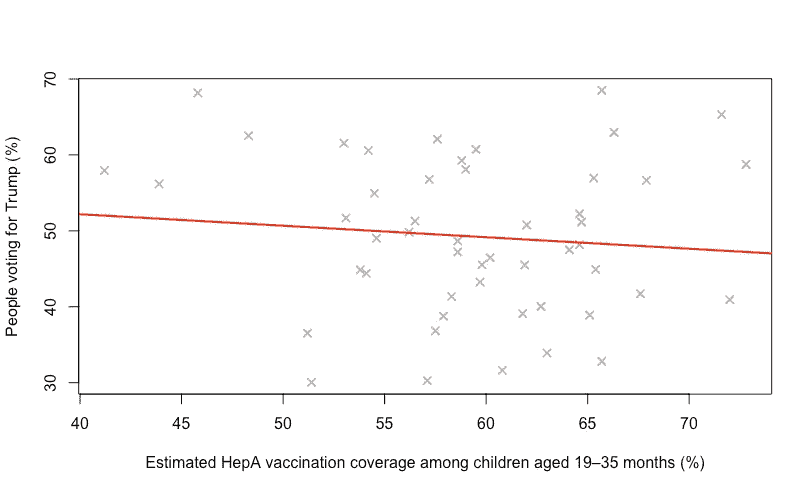

**Figure 20.**: A scatterplot relating estimated HepA vaccination coverage among children aged 19–35 months (%) to percentage of people voting for Trump in each state.

```
R²_adj = 0.01044
p_F = 0.4857
p_t[𝝱0] = 4.1 * 10^(-5) ***
p_t[𝝱1] = 0.486
```

就像 HepB 的情况一样，HepA 数据也缺乏与 2016 年总统选举数据的关系。

## 19-35 个月儿童轮状病毒疫苗接种覆盖率(%)与投票给特朗普的人群(%)

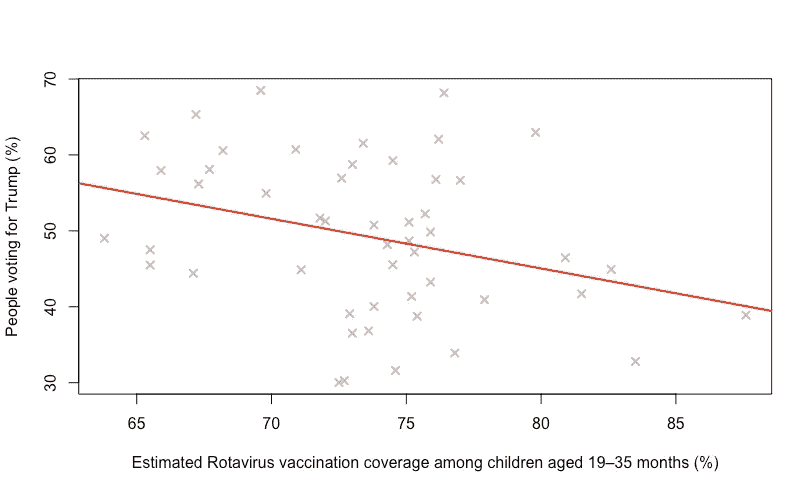

**Figure 21.**: A scatterplot relating estimated Rotavirus vaccination coverage among children aged 19–35 months (%) to percentage of people voting for Trump in each state.

```
R²_adj = 0.08274
p_F = 0.02417 *
p_t[𝝱0] = 2.22* 10^(-5) ***
p_t[𝝱1] = 0.0242 *
```

虽然这是一个可以接受的拟合，但这两个变量之间的相关性太小，无法做出任何推断。

## 关于疫苗接种的结论

除了 DTaP 疫苗接种覆盖率之外，所有疫苗接种覆盖率都没有随着特朗普的支持数据而变化。另一方面，DTaP 疫苗接种覆盖率似乎与特朗普支持率成反比。

## 暴力犯罪率(每 10 万人)与投票给特朗普的人的比率(%)

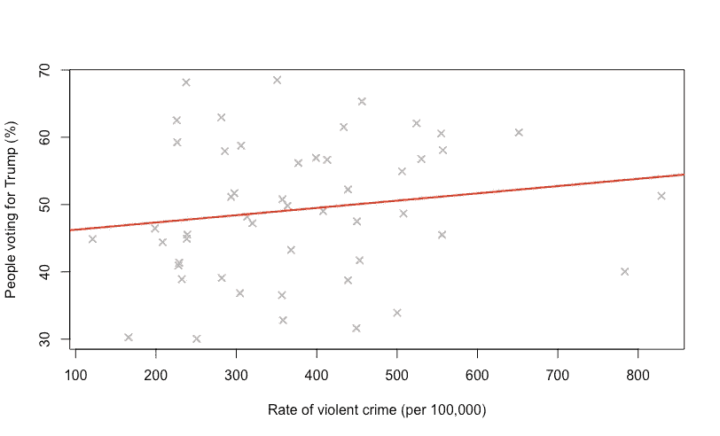

**Figure 22.**: A scatterplot relating rate of violent crime(per 100,000) to percentage of people voting for Trump in each state.

```
R²_adj = 0.009291
p_F = 0.4624
p_t[𝝱0] = 5.1 * 10^(-13) ***
p_t[𝝱1] = 0.462
```

这两个变量之间没有明显的联系。

## 谋杀和非过失杀人的比率(每 10 万人)与投票给特朗普的人的比率(%)

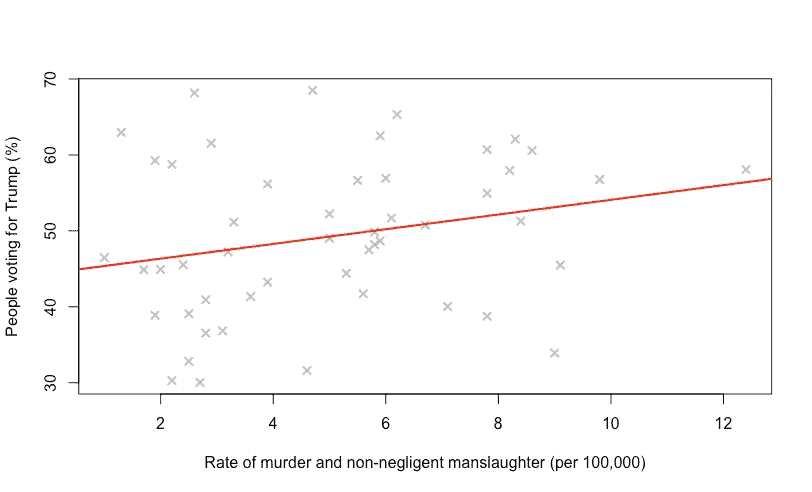

**Figure 23.**: A scatterplot relating rate of murder and non-negligent manslaughter (per 100,000) to percentage of people voting for Trump in each state.

```
R²_adj = 0.04231
p_F = 0.08158
p_t[𝝱0] < 2 * 10^(-16) ***
p_t[𝝱1] = 0.0816
```

这两个变量之间没有明显的联系。

## 强奸率(每 10 万人)与投票给特朗普的人(%)

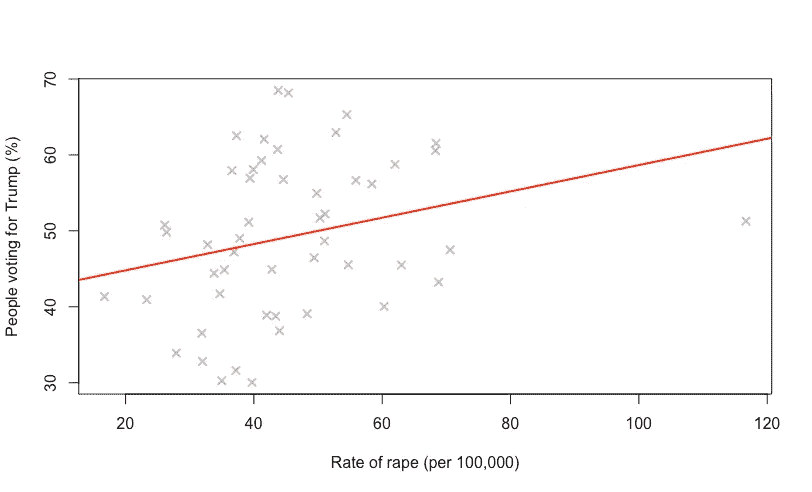

**Figure 24.**: A scatterplot relating rate of rape (per 100,000) to percentage of people voting for Trump in each state.

```
R²_adj = 0.05454
p_F = 0.05627
p_t[𝝱0] = 8.62* 10^(-13) ***
p_t[𝝱1] = 0.0563
```

这两个变量之间没有明显的联系。

## 抢劫率(每 10 万人)与投票给特朗普的人(%)

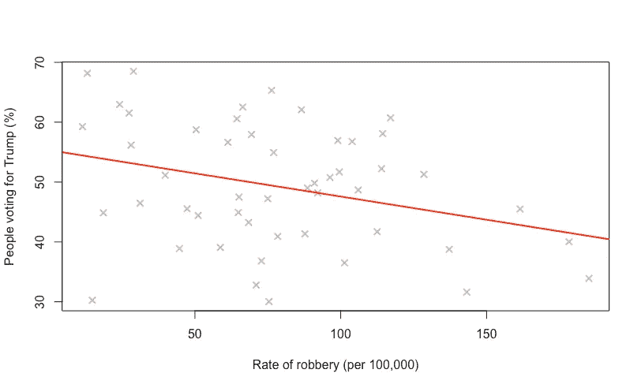

**Figure 25.**: A scatterplot relating rate of robbery (per 100,000) to percentage of people voting for Trump in each state.

```
R²_adj = 0.07853
p_F = 0.02741 *
p_t[𝝱0] < 2 * 10^(-16) ***
p_t[𝝱1] = 0.0274 *
```

尽管模型拟合良好，但这两个变量之间没有明显的联系。

## 严重袭击率(每 10 万人)与投票给特朗普的人(%)

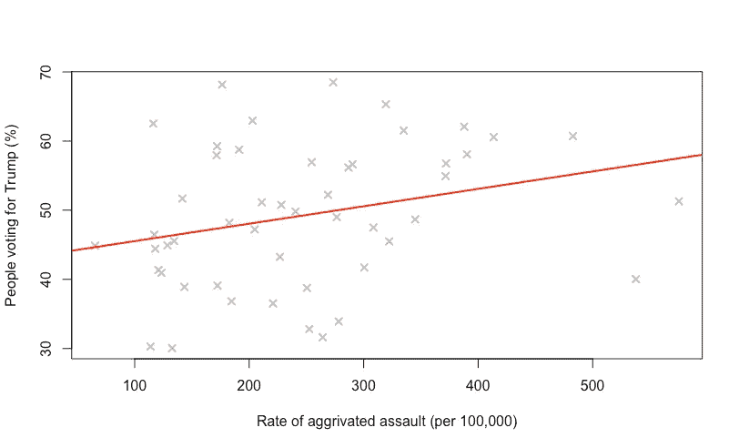

**Figure 26.**: A scatterplot relating rate of property crime (per 100,000) to percentage of people voting for Trump in each state.

```
R²_adj = 0.05783
p_F = 0.05096
p_t[𝝱0] < 2 * 10^(-16) ***
p_t[𝝱1] = 0.051
```

这两个变量之间没有明显的联系。

## 财产犯罪率(每 10 万人)与投票给特朗普的人的比率(%)

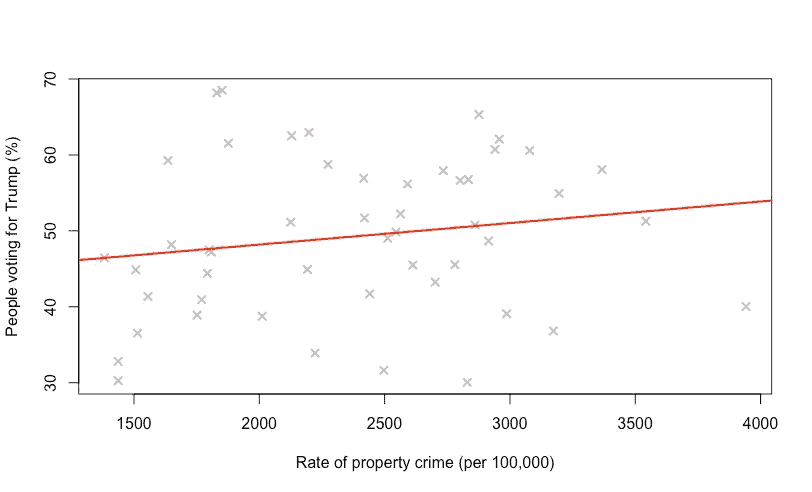

**Figure 27.**: A scatterplot relating rate of property crime (per 100,000) to percentage of people voting for Trump in each state.

```
R²_adj = 0.008801
p_F = 0.2368
p_t[𝝱0] = 2.45 * 10^(-9) ***
p_t[𝝱1] = 0.237
```

这两个变量之间没有明显的联系。

## 入室盗窃率(每 10 万人)与投票给特朗普的人(%)

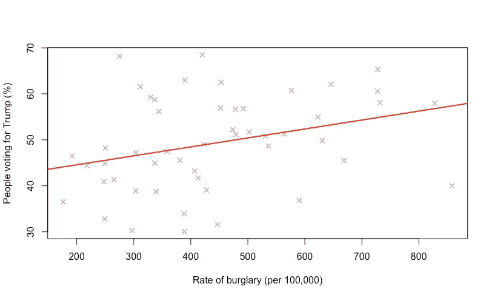

**Figure 28.**: A scatterplot relating rate of burglary (per 100,000) to percentage of people voting for Trump in each state.

```
R²_adj = 0.08126
p_F = 0.02526 *
p_t[𝝱0] = 1.1 * 10^(-13) ***
p_t[𝝱1] = 0.0253 *
```

尽管模型拟合良好，但这两个变量之间的相关性太低，无法对它们之间的关系做出结论。

## 盗窃率(每 10 万人)与投票给特朗普的人的比率(%)


**Figure 29.**: A scatterplot relating rate of larceny-theft (per 100,000) to percentage of people voting for Trump in each state.

```
R²_adj = 0.0008896
p_F = 0.3121
p_t[𝝱0] = 3.96 * 10^(-8) ***
p_t[𝝱1] = 0.312
```

这两个变量之间没有明显的联系。

## 机动车辆盗窃率(每 10 万人)与投票给特朗普的人的比率(%)


**Figure 30.**: A scatterplot relating rate of motor-vehicle theft (per 100,000) to percentage of people voting for Trump in each state.

```
R²_adj = 0.01918
p_F = 0.7815
p_t[𝝱0] < 2 * 10^(-16) ***
p_t[𝝱1] = 0.781
```

这两个变量之间没有明显的联系。

## 关于暴力和财产犯罪的结论

暴力和财产犯罪与 2016 年总统选举中对特朗普的支持之间似乎没有关系。

## WalletHub 教育程度和教育质量得分(1-100)与投票给特朗普的人(%)

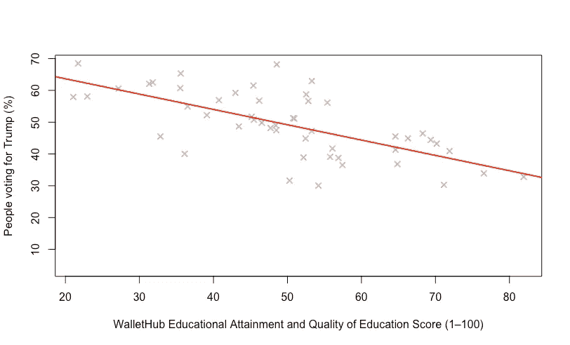

**Figure 31.**: A scatterplot relating WalletHub Educational Attainment and Quality of Education Score (1–100) to percentage of people voting for Trump in each state.

```
R²_adj = 0.4414
p_F = 8.66 * 10^(-8) ***
p_t[𝝱0] < 2 * 10^(-16) ***
p_t[𝝱1] = 8.66 * 10^(-8) ***
```

有相对证据表明，各州在 2016 年总统大选中支持特朗普，并降低了教育程度和教育质量。模型诊断似乎没有发出任何危险信号。

```
Breusch-Pagan p = 0.7193591                 | No heteroskedasticity!
Score test p = 0.7333875                    | No heteroskedasticity!
Shapiro-Wilk p = 0.6670                     | Normal distribution!
Kolmogorov-Smirnov p = 0.9474               | Normal distribution!
Anderson-Darling p = 0.5443                 | Normal distribution!
Durbin-Watson p = 0.812                     | Uncorrelated errors!
```

根据这些结果，对特朗普的热情似乎与教育程度和教育质量成反比。

# 最终总结

1.  特朗普的热情与教育程度和教育质量呈负相关。
2.  特朗普热情与 DTaP 疫苗接种覆盖率负相关。
3.  特朗普的热情与非西班牙裔黑人婴儿和整体婴儿死亡率正相关。
4.  特朗普的热情与恶性肿瘤、心脏病、机动车事故、自杀和凶杀死亡率呈正相关。
5.  克林顿的热情与自杀死亡率呈负相关。
6.  特朗普的热情与性传播疾病之间，或者特朗普的热情与暴力和财产犯罪之间，不存在明显的联系。

# 来源:

1.  联邦选举委员会(2017 年)。2016 年联邦选举:美国总统、美国参议院和美国众议院的选举结果。
2.  徐，J.Q .，墨菲，S.L .，科查内克，K.D .，巴斯蒂安，b .，阿里亚斯，E. (2018)。死亡人数:2016 年最终数据。国家生命统计报告，67(5)。国家健康统计中心。
3.  疾病控制和预防中心(2017 年)。2016 年性传播疾病监测。亚特兰大:美国卫生与公众服务部。
4.  罗森，L.M .，巴斯蒂安，b .，华纳，m .，可汗，d .，崇，Y. (2017)。药物中毒死亡率:美国，1999-2016 年。国家健康统计中心。
5.  Hill，H. A .，Elam-Evans，L. D .，Yankey，d .，Singleton，J. A .，& Dietz，V. (2016)。19-35 个月儿童的疫苗接种覆盖率——美国，2015 年。MMWR。发病率和死亡率周报，65(39)，1065–1071。
6.  美国司法部联邦调查局。(2018).美国的犯罪，2017。
7.  贝尔纳多河(2018)。2018 年美国受教育程度最高和最低的州。钱包枢纽。

```
.CSV and .description files available [here](http://www.franjoivankovic.com/2018/12/09/linear-correlations-of-2016-presidential-election-data-to-various-arbitrarily-chosen-data)!
```