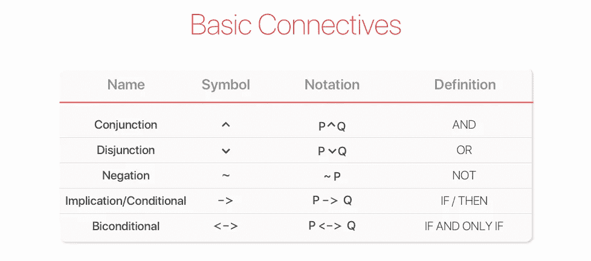

# 逻辑理论—基本符号

> 原文：<https://towardsdatascience.com/logic-theory-basic-notation-d8cf44cb297b?source=collection_archive---------15----------------------->

## 第二部分——简要介绍连接词、蕴涵和量词

逻辑理论的起源始于一个*论证*的概念。大多数逻辑教科书都包含一个开放的、核心的论点定义，听起来很像下面这样:

> *一个论点包含一个或多个特殊的陈述，称为* ***前提*** *，作为一个理由来相信一个进一步的陈述，称为结论，是真实的*

前提是逻辑理论的原子:一切都是由它们构成的。前提是一个声明性的陈述，即*必须*严格地评估为真或假。单个前提被称为**原始前提** — *美国有 50 个州*(这是正确的)。将多个前提连接在一起形成一个**复合前提** — *美国有 50 个州***迈阿密今天下雪了*(这是假的)。如何连接多个语句？就像你在前面的例子中看到的，使用你已经熟悉的操作符，但是需要它们自己的语言语法。*

## *连接词*

*类似于数学的其他分支，前提有它们自己的一套基本运算符(加、减等)。在逻辑理论中，**五个**基本逻辑连接词，统称为 ***连接词*** ，填补了这个角色。它们总结在下表中，假设字母 **P** & **Q** 代表两个原始前提:*

**

*如果您接触过任何级别的编程，那么很有可能对上表有所了解。这是因为连接词是普通语言语法的核心&几乎总是为每个连接词指定一些特殊字符(&& = and，| = or，等等……)。*

*五个连接词中的哪一个用作两个前提之间的逻辑连接符，根据被修改的前提的真值来确定复合陈述的总真值。这里有一个重要的原则，乍一看似乎有悖常理，但值得一提:当分析复合语句时，没有必要知道 P & Q 实际上说了什么，只需要知道这些部分是真还是假。*

## *含义*

*在这五个连接词中，有一个立即值得进一步研究——蕴涵，也就是 if-then 语句。蕴涵是 P → Q 的标准形式的连接词，其中 P 被称为假设(或前因)，Q 被称为结论(或后果)。*

*虽然隐含具有上面定义的标准形式，但是还有其他三种常见的条件类型值得回顾。以下四个条件句简单却很常见&通过将条件句与所介绍的核心连接词结合起来，形成了强大的复合陈述:*

**

*条件本身是一个复合前提，也就是说，它严格地评估为真或假。对于任何蕴涵，就像任何其他连接词一样，复合前提的真值由其两个独立前提的真值决定。与上面介绍的定义相对应，例如，当假设为假时，蕴涵为*真*，当结论为真时，蕴涵为*或*；这就只剩下一种方式让一个蕴涵为假:当假设为真时，结论为假。*

*如果这看起来像是要在精神上跟踪很多东西，就像我一样，那么请放松&请放心，在不久的将来，强大的工具会让分析复杂的条件像遵循蓝图一样简单。我们将使用的主要工具是一个漂亮的逻辑 101 工具，名为 ***真值表*** 。然而，在我们进入真值表之前，让我们快速绕道，填补我们基本逻辑理论符号知识的最后一个缺口。检查一个特殊的场景——以下陈述是前提吗？*

****x 大于十****

## *量词*

*根据我们在开篇段落中引入的严格定义，前提*必须*评估为真或假——语句*不能*是不明确的或开放式的。这意味着变量，就像我们从代数开始就习惯看到的那样，在逻辑理论中是一个禁忌；至少没有一些修改。*

*上面加粗的语句是*而不是*被认为是一个前提，因为 ***x*** 可能是 5 或 25，使得语句为真或为假，但目前都不是。然而，这并不意味着我们必须从我们的工具集中删除变量。这里的*是*利用变量的一种方式；这个过程叫做 ***量化*** ，这是一种在逻辑中标注未知变量界限的巧妙方法。看看下面的更新语句，这是前提吗？*

****为所有 x，x 大于一百****

*现在我们已经定义了变量的*宇宙*、 *o* r 域，这个陈述不再含糊不清——它现在是一个前提，因为它评估为绝对*假。*这种“for all x”的用法在逻辑理论中被称为应用一个 ***量词。*** 量词主要有两种。第一个，我们刚刚看到的，被恰当地命名为 ***全称量词。*** 由一个倒过来的“a”所口述，∀很容易记住它代表**一个** ll 或宇宙内每一个可能的实例所作的陈述。检查第二处改动:*

****存在一个大于一百的 x****

*再一次，在不移除变量的情况下，我们找到了一种方法，通过应用一个量词，将一个陈述转换成一个前提，因为这个陈述现在严格地评估为*真*。这第二类量词被称为 ***存在量词*** 。由一个反过来的“e”表示，∃，它通常读作“存在”或“有”这两个量词总结如下:*

**

## *在真值表上*

*现在，基本符号已经过时了，是时候通过真值表跳到基本的应用形式了。在下一部分，我们将首先从定义逻辑中的等价开始；为了使用真值表来分析我们介绍的四个条件中的哪一个(如果有的话)是彼此相等的。在检查了几个示例语句后，我们将最终进入逻辑理论的核心:证明。*

****来源****

*[逻辑:形式推理的理论](https://amzn.to/31wqm0D)
[数学的基础](https://amzn.to/2H3rb9E)*