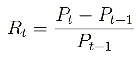
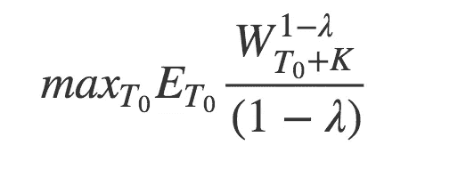
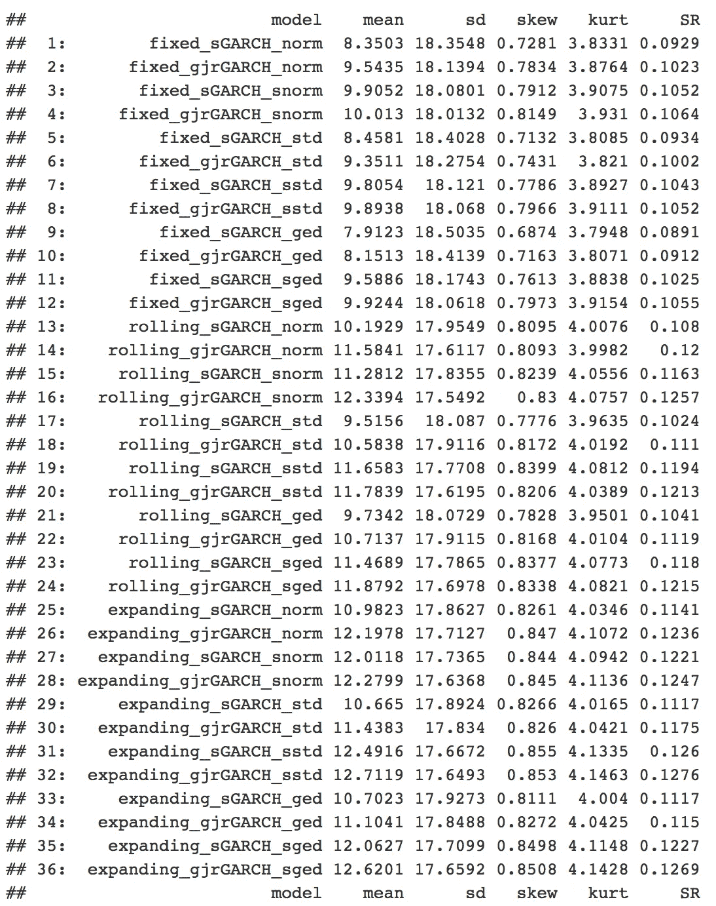
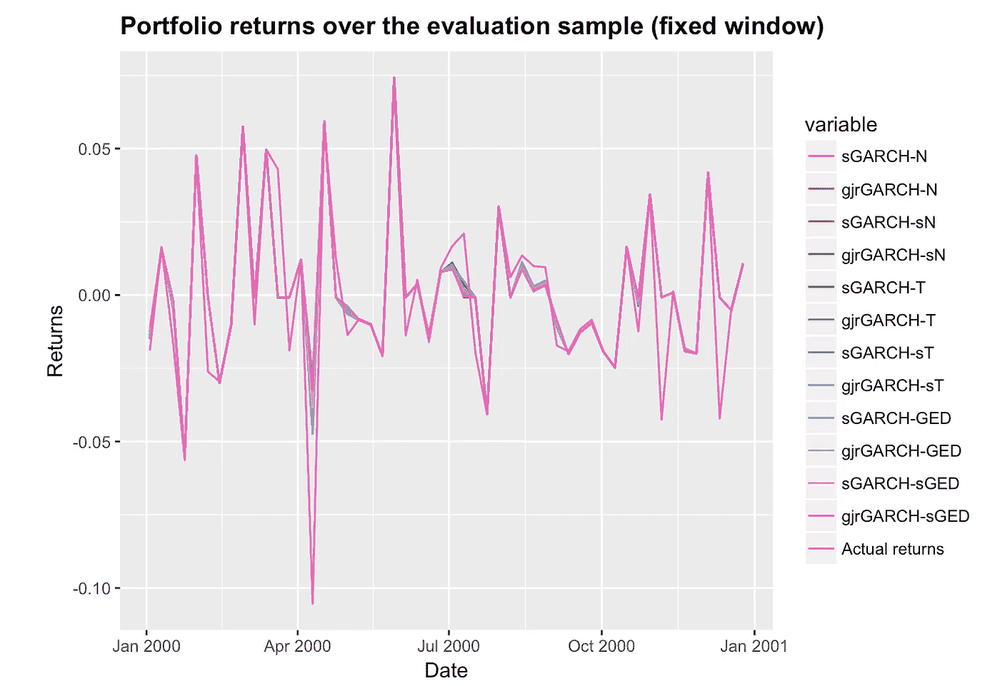
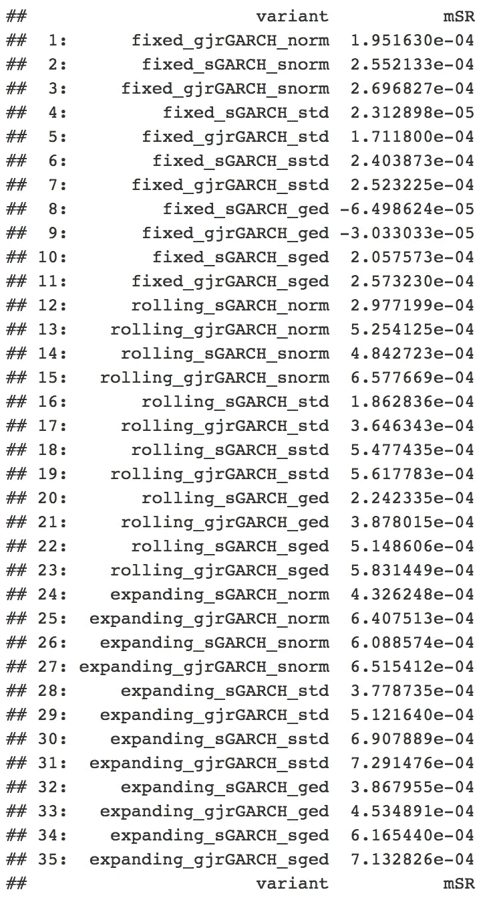

# 基于 GARCH 模型的长期资产配置策略——R

> 原文：<https://towardsdatascience.com/long-term-asset-allocation-strategies-based-on-garch-models-a-simulation-exercise-in-r-24e5b71b1d0b?source=collection_archive---------6----------------------->

在这篇文章中，我想分享我在量化金融领域做的一个模拟练习的结果。我所遵循的方法是基于金融模型的(因此，一些定量金融知识肯定会使它更容易理解)，但是，对于专注于数据科学的人来说，这篇文章可能会很有趣，因为我展示了一个如何使用并行蒙特卡罗模拟来预测股票价格的示例。

在这个练习中，我建立了一个基于资产价格预测的简化资产配置策略。为了预测资产价格，我使用了条件波动率模型，其中的自回归成分决定了回报过程的条件均值部分。

我只在媒体上发布一个缩略版本。我强烈推荐阅读我在 GitHub 上分享的更详细的“论文”(以及参考资料)。

# 1.方法学

## 数据生成过程

在量化金融中，处理资产回报是很常见的，可以定义为

其中 *P* 代表资产价格， *t* 是时间指数。以下等式表示实验中的数据生成过程:

随着

条件均值方程(第一个方程)由具有一阶滞后的自回归过程控制，条件方差方程是 Glosten、Jagannathan 和 Runkle (1993)的 GJR-GARCH 模型。它是 Bollerslev(1986 年)著名的 [GARCH](https://en.wikipedia.org/wiki/Autoregressive_conditional_heteroskedasticity) (广义自回归条件异方差 **)** 模型的扩展，具有考虑正负创新对方差影响不同的情况的额外优势。换句话说，参数 *alpha* 衡量积极创新的效果，而 *alpha + gamma* 用于消极创新的情况。GARCH 模型是通过将 GJR-GARCH 的 *gamma* 设置为 0 得到的。

数据生成过程基于奥尔巴克(2013)提供的规范。然而，这个实验使用他的规范集中于股票收益的点预测和相关的方差，而没有建模更高的矩(偏度和峰度)。

在此分析中，GARCH 和 GJR-GARCH 模型均被考虑在内，并考虑了新息的以下分布( *z_t* ):正态分布(N)、偏态分布(SN)、 *t* (T)、偏态分布- *t* (ST)、广义误差分布(GED)及其偏态分布(SGED)。

此外，我采用了三种评估方法:固定、滚动和扩展窗口方法。对于固定模型，我在估计样本上估计 GARCH 模型，并在整个样本外预测中使用相同的参数集。在滚动方法中，我滚动长度等于整个估计样本的窗口，一次一个周期，而在扩展窗口方法中，我简单地扩展估计样本。

总之，固定窗口方法总是使用相同的数据集，滚动窗口使用相同数量但来自不同时段的数据，而扩展窗口使用最大量的数据。因此，我调查了 GARCH 模型类型、新息分布和估计变量的总共 36 种组合。

## 模拟样本路径

我通过模拟选定股票收益的长度为 *K* 周期的 *N* 条样本路径来解决长期资产配置问题。我遵循插入式方法，*，即*，我是在分布参数已知的假设下操作的。为了获得这些(以及初始化模拟所需的时间 *T_0* 新息和条件方差等变量),我使用 MLE 估计所有规格的选定 GARCH 模型，并实施估计的参数以从选定的分布中生成随机新息。更准确地说，我生成了 *N * K* 随机新息，其中范围 *K* 从 1 到 52，取决于模拟的时间点。

## 动态资产分配问题

在这个实验中，我只选择了一个股票指数，并以 1%的网格步长将权重限制在 0%到 100%之间，这是由于使用数值方法时的维数灾难。随着当今计算能力和云解决方案的快速增长，将其扩展到多资产框架应该不成问题。然而，我会关注研究论文，目前只关注单一风险资产。

因为建模无风险利率不是这个项目的目标，所以我让它随着时间的推移保持不变，并且等于估计期间无风险利率的平均值(它是-0.0819%)。

此外，我假设投资者面临的投资期限为 *K* 期，他的分配期开始于时间 *T_0* 。他使用估计样本(截至时间点 *T_0* 的数据)估计一个考虑的模型，并指定他的最优投资组合权重 *w_{T_0}* 。然后，他进行到时间段 *T_0 + 1* ，因此在滚动/扩展窗口改变信息集的情况下，能够用更新的估计样本重新估计所考虑的模型。通过在时间上前进一个周期，他的投资范围减少到 *K - 1* 。在时段 *T_0 + K - 1* 中，他的范围等于 1，并且他可以使用直到该点的所有可用数据来根据估计方法选择他的最后分配权重。通过所述过程获得的组合权重序列 *K* 导致一个最终财富值 *w_{T_0 + K}* 。我遵循类似于 Barberis (2000)提出的方法。投资者的偏好由 CRRA(常数相对风险厌恶)幂效用函数描述。初始财富归一化为 1。我直接优化幂效用函数来获得最优权重。

请注意，投资者的问题可以描述为最大化以下等式:

这意味着投资者从时间 *T_0* 开始，最大化终端财富(W)总体决策。

近似条件期望的一种方法是采用跨路径样本均值:

然而，在这种情况下，这是不可能的，因为不同的路径具有不同的模拟预测变量，这又意味着不同的条件期望。使用的预测变量是:条件方差和滞后模拟回报由于自回归结构的条件平均方程。根据 Brandt 和 van Binsbergen (2007)，我使用跨路径 OLS 回归来近似条件期望。跨路径样本均值可用于算法的最后一步。关于后向递归资产配置策略步骤的更详细描述，请参考 Brandt 和 van Binsbergen (2007)的论文。

## 为长期投资者评估不同规格的表现

*先验*，我预计具有更复杂创新分布的模型和/或使用滚动/扩展窗口的模型将优于简单模型。因此，我通过与所考虑的模型中的基准模型进行比较来衡量模型的性能。作为一项比较措施，使用了以下修正夏普比率(mSR)

其中*m0*和*sigma 0*是基准规格的平均收益和波动率，下标 *p* 是指比较中更复杂的规格。这种方法的一个缺点是它没有考虑投资组合收益的高阶矩(偏度，峰度)。换句话说，不考虑非正态分布的影响。

# 2.R 中的解析部分

## 加载和操作数据

在这个练习中，我使用了标准普尔 500 指数回报，这是一个美国最大的 500 家上市公司的市值加权指数。我之所以选择它，是因为美国市场在全球市场资本总额和交易量中所占的比例是最大的市场，因此它不太可能通过极端行为来推动结果，而这种极端行为可能会在更奇特的数据中出现。

我使用`tseries`包中的`get.hist.quote()`函数从雅虎财经下载每周收盘价。

从下载的价格，我计算简单的回报。

除了退货系列，我还需要一些外部数据，*，即*。，无风险利率和通货膨胀。对于无风险利率，我采用联邦基金利率。我还使用 FRED 数据库中的 CPI(消费者价格指数)数据来调整通货膨胀的回报。你也可以在我的 GitHub 上找到这些数据。

我将数据集分成两个子样本:估计样本(覆盖 1988-1999 年，共有 626 个观察值)和评估样本(2000 年，有 52 个观察值)。

下一步是将无风险和通货膨胀的频率从每月一次改为每周一次。

最后，我需要考虑退货系列中的通货膨胀。

## 汇总统计数据

要注意的第一个重要方面是，评估样本的年化平均回报率为负。在此期间也有较高的方差。这两个特征都会影响资产配置策略的表现。负偏度和过度峰度(高阶矩)符合资产收益的程式化事实，*即*，资产收益的分布不是高斯分布，可以用厚尾、尖峰(过度峰度效应)、负偏态分布来表征。然而，Jarque-Bera 正态性检验只在估计样本的情况下证实了这一假设。回报中也有一些序列相关性的证据(也是平方回报)。平方收益的相关性意味着二阶矩的时间变化，这也符合资产收益的程式化事实。

## 运行模拟

在运行模拟之前，我需要准备一个可能组合的网格。这三个类别包括:

*   模型类型:GARCH 或 GJR-GARCH
*   新息分布:高斯分布、偏态高斯分布、 *t* 、偏态 *t* 、广义误差分布和偏态 GED
*   估计类型:固定/滚动/扩展窗口

对于 GARCH 模型的估计，我使用了`rugarch`包，它包含了所有必要的 GARCH 规范(GJR 变量，以及创新的多重分布)。由于这些计算相当繁重和耗时，我使用`doParallel`和`foreach`并行运行它们。我做的另一个假设是关于投资者的风险厌恶水平——我只考虑风险厌恶系数`lambda = 5`不太厌恶风险的投资者。当然，通过在函数调用中更改参数值，可以很容易地获得其他参数值的结果。为了确保结果稳定，我对每个配置都进行了`n = 100000`模拟。

## 分析结果

本节介绍模拟实验的结果。由于大量的估计变量，我将不包括 GARCH 模型的估计系数。相反，我把重点放在投资组合回报和各种规格之间的比较上。

获得模拟结果后，我计算已实现投资组合回报的汇总统计数据(均值、标准差、偏斜度、峰度和夏普比率)。

人们可以观察到，年化平均投资组合回报是积极的，在绝大多数情况下，高于最简单的高斯创新和固定窗口方法的 GARCH 模型。此外，在大多数情况下，年化标准差低于基准情况，夏普比率高于基准。

下图显示了模拟投资组合回报随时间的演变。对该图的分析得出结论，使用不同的模型规格导致分配策略的某种相似的性能。然而，在一些时期，可以观察到不同的投资组合回报。值得注意的是，通过遵循源于 GARCH 模型的策略，投资者能够获得比单纯投资标准普尔 500 指数(如 2000 年 4 月)更低的负回报。因此，减少了损失。因为关于滚动/扩展窗口估计类型的图可以类比地解释，所以我不在这里附加它们。

最后一步是评估基于更先进模型的资产配置策略如何优于简单的基准。为此，我选择了一个具有固定窗口的高斯 GARCH 模型作为最简单的模型，并将它作为基准。在修正的夏普比率的帮助下完成了对优异性的评估，并且结果呈现在下表中。

可以观察到，当将更复杂的模型规格与简单的基准进行比较时，就修正的夏普比率而言，性能几乎总是更好。固定窗口估计类型和 GED 分布式创新的少数案例表现比基准差，但没有明确的迹象表明其背后的原因。

# 3.结论

在这个练习中，我研究了投资者是否能从使用不同规格的 AR(1) — (GJR)GARCH 模型准确预测股票收益(以标准普尔 500 指数为例)中获益。因此，我假设投资者的无风险利率和风险厌恶水平不变。实证结果表明，在某些情况下，通过修改夏普比率，使用更复杂的单变量模型会导致更有利可图的资产配置策略。例如，与基准模型相比，具有偏斜 *t* 分布和扩展窗口估计的(GJR-)GARCH 具有最好的表现。

进一步工作的一些想法:

*   向实验中添加更多资产
*   向条件均值方程添加额外的外生变量(额外来自自回归分量)
*   检查在不同的模型中使用相同的资产配置框架(包含许多可能影响股票价格的变量的回归模型)是否会导致更好的资产配置

这个简短的实验到此结束。如果你对这个问题有任何想法，请告诉我。和往常一样，完整的 R 代码，以及更详细的“研究论文”版本可以在我的 [GitHub](https://github.com/erykml/asset_allocation_garch) 上找到。

我最近出版了一本关于使用 Python 解决金融领域实际任务的书。如果你感兴趣，我在[贴了一篇文章](/introducing-my-book-python-for-finance-cookbook-de219ca0d612)介绍这本书的内容。你可以在亚马逊或者 Packt 的网站上买到这本书。

**参考文献:**

*   Barberis，N. (2000)回报可预测时的长期投资，金融杂志，55(1)，225-264。
*   t . bollerslev(1986)广义自回归条件异方差，计量经济学杂志，31(3)，307–327。
*   Glosten，l .，Jagannathan，R. & Runkle，D. (1993)股票名义超额收益的期望值和波动性之间的关系，金融杂志，48，1779-1801。
*   奥尔巴克，A. (2013)时变高阶矩密度预测:模型置信集方法，预测杂志，32(1)，19–31。
*   范宾斯卑尔根，J. H .和 M. W .勃兰特(2007 年)。通过递归优化投资组合权重或价值函数解决动态投资组合选择问题,《计算经济学》, 29(3–4)，355–367。