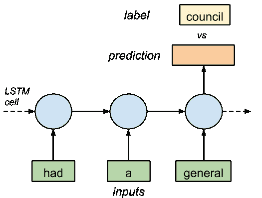
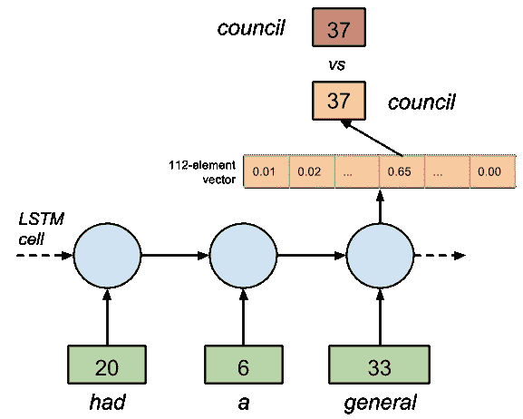

# 使用张量流的 LSTM 示例

> 原文：<https://towardsdatascience.com/lstm-by-example-using-tensorflow-feb0c1968537?source=collection_archive---------0----------------------->

在深度学习中，递归神经网络(RNN)是一个神经网络家族，擅长从序列数据中学习。已经找到实际应用的一类 RNN 是长短期记忆(LSTM ),因为它对长期依赖的问题是稳健的。解释 LSTM 的文章和参考资料并不缺乏。推荐的两个参考文献是:

Goodfellow 等人的《深度学习》一书的第十章。艾尔。

[克里斯·奥拉解读 LSTM 网络](http://colah.github.io/posts/2015-08-Understanding-LSTMs/)

也不缺乏好的库来构建基于 LSTM 的机器学习应用。在 GitHub 中，谷歌的 [Tensorflow](https://www.tensorflow.org/) 在撰写本文时已经有超过 50，000 颗星，这表明它在机器学习从业者中非常受欢迎。

似乎缺少的是关于如何基于 LSTM 构建易于理解的 Tensorflow 应用程序的良好文档和示例。这是这篇文章背后的动机。

假设我们想训练 LSTM 使用一个简单的小故事[伊索寓言](http://www.taleswithmorals.com/)来预测下一个单词:

> 很久以前，老鼠们开了一个全体会议，考虑采取什么措施来智取它们共同的敌人——猫。有些人这样说，有些人那样说，但最后一只年轻的老鼠站起来说，他有一个建议，他认为会满足的情况。你们都会同意，他说，我们的主要危险在于敌人向我们逼近的狡猾和奸诈的方式。现在，如果我们能收到一些她接近的信号，我们就能轻易地逃离她。因此，我斗胆提议买一个小铃铛，用丝带系在猫的脖子上。通过这种方式，我们应该总是知道她在哪里，当她在附近时，我们可以很容易地退休。这个提议得到了普遍的掌声，直到一只老老鼠站起来说，这一切都很好，但是谁来给猫系上铃铛呢？老鼠们面面相觑，谁也不说话。然后老老鼠说，很容易提出不可能的补救措施。

清单 1。一个来自伊索寓言的小故事，有 112 个独特的符号。单词和标点符号都被认为是符号。

如果我们将来自 3 个符号作为输入和 1 个标记符号的文本的正确序列输入给 LSTM，最终神经网络将学会正确预测下一个符号(图 1)。



图一。具有三个输入和一个输出的 LSTM 单元。

从技术上讲，LSTM 输入只能理解实数。将符号转换为数字的一种方法是根据出现的频率为每个符号分配一个唯一的整数。例如，在上面的文本中有 112 个独特的符号。清单 2 中的函数用以下条目构建了一个字典["，":0 ] [ "the" : 1 ]，…，[ "council" : 37 ]，…，[ "spoke" : 111 ]。还生成反向字典，因为它将用于解码 LSTM 的输出。

```
**def** build_dataset(words):
    count = collections.Counter(words).most_common()
    dictionary = dict()
    **for** word, _ **in** count:
        dictionary[word] = len(dictionary)
    reverse_dictionary = dict(zip(dictionary.values(), dictionary.keys()))
    **return** dictionary, reverse_dictionary
```

清单 2。建立字典和反向字典的功能。

类似地，预测是唯一的整数，标识预测符号的反向字典中的索引。比如预测是 37，预测的符号其实是“理事会”。

输出的生成听起来可能很简单，但实际上 LSTM 为下一个由 softmax()函数归一化的符号生成一个 112 元素的预测概率向量。具有最高概率的元素的索引是符号在反向字典中的预测索引(即一个热码向量)。图 2 显示了这个过程。



图二。每个输入符号被其分配的唯一整数替换。输出是识别反向字典中预测符号的索引的独热向量。

该应用程序的核心是 LSTM 模型。令人惊讶的是，在 Tensorflow 中实现非常简单:

```
**def** RNN(x, weights, biases):

    *# reshape to [1, n_input]* x = tf.reshape(x, [-1, n_input])

    *# Generate a n_input-element sequence of inputs
    # (eg. [had] [a] [general] -> [20] [6] [33])* x = tf.split(x,n_input,1)

    *# 1-layer LSTM with n_hidden units.* rnn_cell = rnn.BasicLSTMCell(n_hidden)

    *# generate prediction* outputs, states = rnn.static_rnn(rnn_cell, x, dtype=tf.float32)

    *# there are n_input outputs but
    # we only want the last output* **return** tf.matmul(outputs[-1], weights[**'out'**]) + biases[**'out'**]
```

清单 3。具有 512 单位 LSTM 单元的模型

最棘手的部分是以正确的格式和顺序输入。在这个例子中，LSTM 以 3 个整数的序列为食(例如 int 的 1x3 向量)。

常数、权重和偏差是:

```
vocab_size = len(dictionary)
n_input = 3*# number of units in RNN cell* n_hidden = 512*# RNN output node weights and biases* weights = {
    **'out'**: tf.Variable(tf.random_normal([n_hidden, vocab_size]))
}
biases = {
    **'out'**: tf.Variable(tf.random_normal([vocab_size]))
}
```

清单 4。常数和训练参数

在训练过程中，在每一步，从训练数据中检索 3 个符号。这 3 个符号被转换成整数以形成输入向量。

```
symbols_in_keys = [ [dictionary[ str(training_data[i])]] **for** i **in** range(offset, offset+n_input) ]
```

清单 5。符号到 int 的向量作为输入

训练标签是来自 3 个输入符号之后的符号的独热向量。

```
symbols_out_onehot = np.zeros([vocab_size], dtype=float)
symbols_out_onehot[dictionary[str(training_data[offset+n_input])]] = 1.0
```

清单 6。一键向量作为标签

在重新调整以适合提要字典后，优化运行:

```
_, acc, loss, onehot_pred = session.run([optimizer, accuracy, cost, pred], feed_dict={x: symbols_in_keys, y: symbols_out_onehot})
```

清单 7。训练步骤优化

累积准确度和损失以监控训练的进度。50，000 次迭代通常足以达到可接受精度。

```
...
Iter= 49000, Average Loss= 0.528684, Average Accuracy= 88.50%
['could', 'easily', 'retire'] - [while] vs [while]
Iter= 50000, Average Loss= 0.415811, Average Accuracy= 91.20%
['this', 'means', 'we'] - [should] vs [should]
```

清单 8。每次训练的样本预测和准确性数据(1000 步)

成本是使用 RMSProp 以 0.001 的学习率优化的 label 和 softmax()预测之间的交叉熵。在这种情况下，RMSProp 的性能通常优于 Adam 和 SGD。

```
pred = RNN(x, weights, biases)

*# Loss and optimizer* cost = tf.reduce_mean(tf.nn.softmax_cross_entropy_with_logits(logits=pred, labels=y))
optimizer = tf.train.RMSPropOptimizer(learning_rate=learning_rate).minimize(cost)
```

清单 9。损失和优化器

LSTM 的精确度可以通过附加层来提高。

```
rnn_cell = rnn.MultiRNNCell([rnn.BasicLSTMCell(n_hidden),rnn.BasicLSTMCell(n_hidden)])
```

清单 10。改进的 LSTM

现在，有趣的部分。让我们通过反馈预测的输出作为输入中的下一个符号来生成一个故事。这个示例输出的输入是“had a general ”,它预测正确的输出是“council”。“理事会”作为新输入的一部分反馈给“总理事会”，以预测新的输出“到”，以此类推。令人惊讶的是，LSTM 创造了一个莫名其妙的故事。

```
had a general council to consider what measures they could take to outwit their common enemy , the cat . some said this , and some said that but at last a young mouse got
```

清单 11。示例故事生成的故事。被截断为最多 32 个预测。

如果我们输入另一个序列(例如“老鼠”，“老鼠”，“老鼠”)，但不一定是故事中的序列，另一个叙事就会自动产生。

```
mouse mouse mouse , neighbourhood and could receive a outwit always the neck of the cat . some said this , and some said that but at last a young mouse got up and said
```

清单 12。故事中找不到带有序列的输入。

实际的示例代码可以在这里找到[。示例文本文件是](https://github.com/roatienza/Deep-Learning-Experiments/blob/master/Experiments/Tensorflow/RNN/rnn_words.py)[这里的](https://github.com/roatienza/Deep-Learning-Experiments/blob/master/Experiments/Tensorflow/RNN/belling_the_cat.txt)。

最终注释:

1.  使用 int 对符号进行编码很容易，但是单词的“含义”却丢失了。Symbol to int 用于简化关于使用 Tensorflow 构建 LSTM 应用程序的讨论。Word2Vec 是将符号编码为矢量的更优方式。
2.  输出的一键向量表示是低效的，尤其是当我们有一个真实的词汇量时。牛津词典有超过 17 万个单词。上面的例子有 112 个。同样，这只是为了简化讨论。
3.  这里使用的代码是受 [Tensorflow-Examples](https://github.com/aymericdamien/TensorFlow-Examples/blob/master/examples/3_NeuralNetworks/recurrent_network.py) 的启发。
4.  本例中的输入数是 3，看看使用其他数字(例如 4、5 或更多)时会发生什么。
5.  每次运行代码可能会产生不同的结果和预测能力，因为准确性取决于参数的初始随机值。更高的训练步数(超过 150，000)可以获得更好的精度。预计每次运行也会有不同的字典。
6.  Tensorboard 在调试中非常有用，尤其是在判断代码是否正确构建了图形时。
7.  尝试使用另一个故事，尤其是使用不同的语言。