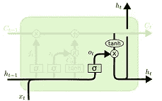
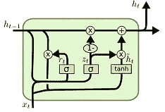

# LSTM——实际应用的金块

> 原文：<https://towardsdatascience.com/lstm-nuggets-for-practical-applications-5beef5252092?source=collection_archive---------2----------------------->

*keras functional API 中的代码示例*

**什么是 LSTM？**

LSTM 代表长短期记忆，意思是短期记忆在长时间内保持在 LSTM 细胞状态。LSTM 通过克服 simpleRNN 架构中典型的消失梯度问题实现了这一点。

**LSTM 的记忆单位和细胞状态是什么？**

LSTMs 是递归网络，其中每个神经元由一个 ***存储单元*** 代替。存储单元包含一个具有循环自连接的实际神经元。记忆单元内那些神经元的激活被称为 LSTM 网络的 ***细胞状态*** 。

**那么 LSTM 是如何维持其细胞状态和隐藏状态的呢？**

随着更多的新信息输入到 LSTM，LSTM 的门控结构允许它学习三个基本的东西(即，在每个时间步，存储单元接收来自其他存储单元的输入，并计算以下内容)

Cell state of LSTM

*   需要保留的记忆(即，保留多少神经元先前的激活)。该信息在 ***单元状态*** 中更新
*   由于新信息的到来，它的内存需要更新多少(也就是说——将多少输入转发给实际的神经元——注意，这些信息也在 ***细胞状态*** 中得到更新

Hidden state computed from its cell state

*   下一个时间步需要读取多少内存(也就是说，需要输出多少激活)。正如我们从下图中看到的，我们计算内存单元的输出，方法是获取其状态，应用激活函数，然后将结果乘以表示输出多少激活的输出门。来自所有存储单元的输出向量是 LSTM 网络的输出。这就是通常所说的***LSTM 的隐藏状态。*** 简单来说——细胞状态和隐藏状态不过是利用神经元的权重、偏置和激活计算出来的向量。

GRU ( outputs its memory state directly)

顺便提一下，在类似的 GRU 网络中，存储单元直接输出它们的状态。

我们在定义 LSTM 时指定的超参数是 ***存储单元数量(也称为单元大小)*** 。

我们可以在任何时间步长从 LSTM 获得以下输出——当前单元格状态、当前隐藏状态及其当前隐藏状态作为其当前输出。我们在 Keras 中这样做的方法是指定—

*   *return_states = True* 用于获取单元格状态和隐藏状态
*   *return_sequences = True* 用于获取当前时间步的输出

*some_LSTM = LSTM(256，return_sequences=True，return _ state = True)* ***输出，隐藏 _ 状态，单元格 _ 状态*** *= some_LSTM(输入)*

要送入 LSTM 的输入数组应该是三维的。让我们在将几行句子输入到 LSTM 的上下文中来看这个问题，其中每个句子都是单词的集合，句子的大小可以是固定的/可变的。

*   第一个维度是我们语料库中的句子数量。
*   第二维指定时间步长的数量。在这种情况下，时间步长可以被视为特定句子中的单词数*(假设每个单词都被转换为一个向量)*。否则可以是句子中的字符数*(假设每个字符都转换成一个向量)*。还要注意，这可以是固定长度或可变长度，因为每个句子可以有不同数量的单词/字符。我们可以通过在任何需要的地方用零填充所有的序列来使这个长度固定。
*   第三维指定特征的数量。例如，它可以是语料库中的单词数，或者在我们进行字符级翻译的情况下，它可以是字符数。

但是当我们定义 LSTM 的输入形状时，我们只将其定义为 2D，而不是 3D — ***我们没有指定样本的数量或批次大小*** 。我们只指定时间步长的数量和特征的数量。在 keras 中，我们将其定义为—

*   ***输入(shape=(nb_timesteps，nb_features))。如上所述，nb_timesteps 可以对应于输入数组的固定或可变序列长度。如果我们希望它是一个可变长度，那么我们指定这个为 ***None。*** 那样的话，就要 ***输入(shape=(* None *，nb_features))。******

当时间步长的数量为 ***无、*** 时，LSTM 将动态展开时间步长，直到到达序列的末尾。这是典型的涉及编码器-解码器网络的神经机器翻译架构。

我们可以在输入时用初始状态初始化 LSTM。这也是典型的编码器-解码器架构，其中解码器 LSTM 需要用最终的编码器单元状态和隐藏状态进行初始化。在这种情况下，我们将 ***intial_state*** 参数与输入一起传递。

*   *解码器 _LSTM(解码器 _ 输入，初始 _ 状态=编码器 _ 状态)*