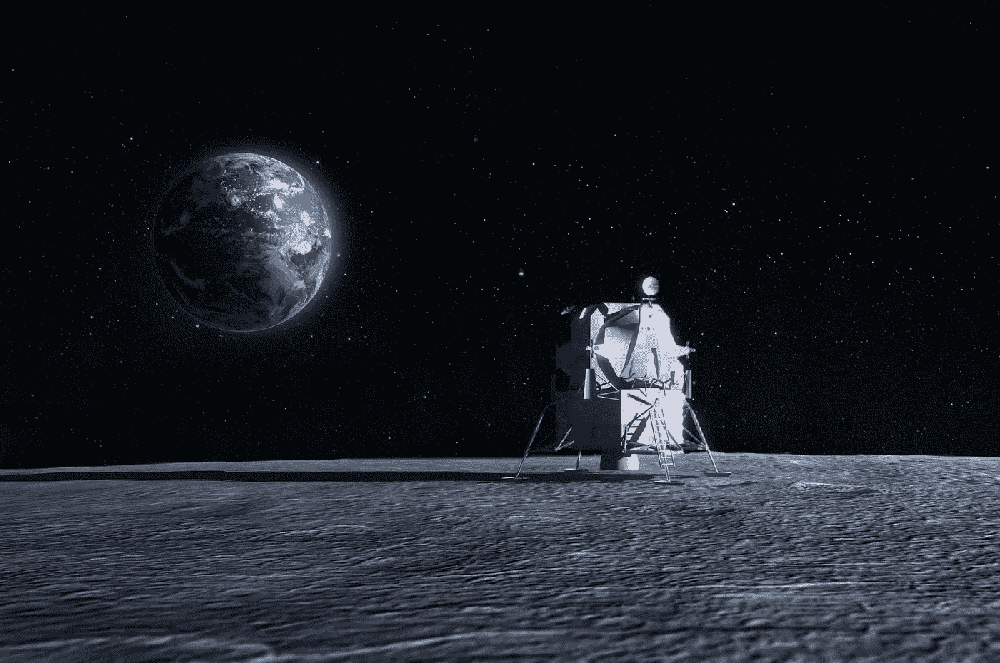
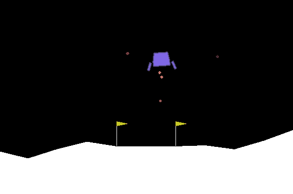
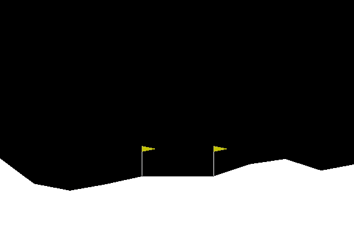
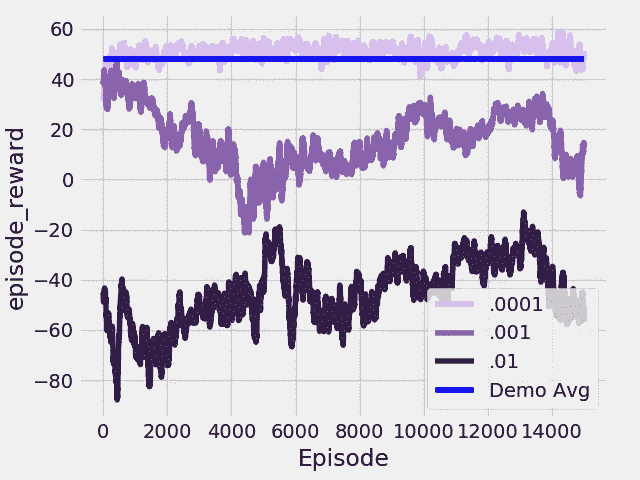
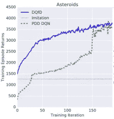
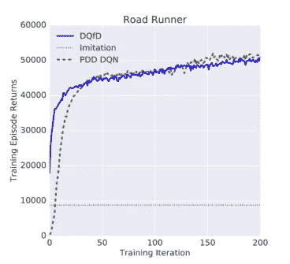

# 演示中的登月

> 原文：<https://towardsdatascience.com/lunar-landings-from-demonstrations-27b553b00ce2?source=collection_archive---------10----------------------->

深度强化学习算法在许多问题上取得了显著的成果，这些问题曾经被认为在没有人类直觉和创造力的帮助下无法解决。RL 代理可以在没有任何事先指导的情况下学习掌握像[象棋](https://arxiv.org/abs/1712.01815)和[复古视频游戏](https://www.cs.toronto.edu/~vmnih/docs/dqn.pdf)这样的任务——通常超过甚至最伟大的人类专家的表现。但是这些方法效率很低，并且依赖于在取得任何进展之前从数百甚至数千次完全失败中学习。当任务简单或可以模拟时，这是我们可以负担得起的奢侈品，如 Atari 屏幕或棋盘，但至少是 RL 相对较短的现实世界应用程序列表的部分原因。例如，让自动驾驶算法通过将一辆真正的汽车撞上一堵真正的墙来学习，可能需要 1000 次迭代才能弄清楚刹车的作用，或者通过撞毁前 500 次来学习着陆火箭，这将是极其危险、昂贵和时间效率低下的。

如果我们能够快速度过灾难性失败的早期阶段，让代理从第一次尝试就开始在真实世界中学习，那就太好了。一种方法是让代理在任务的模拟版本中度过它的失败阶段，其中它的行为不会产生后果。这很好，但大多数应用程序没有完美的模拟器，将学习从简化的类似游戏的环境转移到现实世界会带来许多问题(源于神经网络没有我们喜欢给它们的信用那样好的概括，并且经常不能理解两个领域之间的微妙差异)。然而，许多任务确实有近乎完美的控制者的例子——一个可以提供演示数据来指导代理尽早并经常成功的专家。

这就是 [*深度 Q-示范学习*](https://arxiv.org/abs/1704.03732) *中给出的解决方案。他们的算法是一种叫做 DQfD 的深度 Q 网络(DQN)的模仿学习变体。*

DQfD 的工作原理是在标准 TD 误差的基础上增加一个模拟损耗。在*预训练* *阶段，*代理从专家的演示中取样转换，并被激励在任何给定状态下复制专家的动作。

The large-margin classification loss used to push the agent’s actions towards the expert. *l(ae, a) is a zero matrix with positive entries where the agent chooses an action that the expert did not recommend.*

一旦预训练完成，代理开始自己与环境交互，生成自己的转换并探索更大的状态空间。因此，损失是监督、单步和*n*-步 TD 误差的组合。这是这项技术相对于其他模仿学习方法的真正优势；大多数模仿者只是希望成为演示者的淡化版本，但 DQfD 将学习加速到专家的水平，然后利用标准 DQN 的成功，试图超越这一基准。

代理将自己的经验和专家的经验一起存储在重放缓冲区中，使用[优先经验重放](https://arxiv.org/abs/1511.05952)来使演示的权重高于自己的数据。在每一个训练步骤中，它都按照优先级进行采样，确保将自生成过渡的模仿损失设置为 0。当重放缓冲区填满时，它只覆盖自己的数据，而演示则保持不变。

# 示例:月球着陆器中更安全的初始控制

我们可以用一个玩具问题来思考这个研究方向可能产生的潜在影响。

LunarLander-v2

LunarLander Gym 环境要求一个装备有主、左、右侧引擎的航天器在一个被随机生成的地形包围的目标区域着陆。状态空间是连续的，是ℝ⁸中的一个向量，有一个离散的动作空间{什么都不做，左引擎，右引擎，主引擎}。回报是到目标的距离、速度和燃油消耗的函数，着陆成功或不成功都有一个正(或负)常数。

**起动性能**

这里的想法是使用可用于训练新的 ML 代理的专家控制器，并且在大多数真实世界应用中，这将意味着使用人类专家。但它也可能是另一个人工代理，在这种情况下，是一个优先双决斗(PDD) DQN 给予足够的时间来训练:

Prioritized Double Dueling performance over the first 15k episodes. Note that the reward is modified from the raw environment using a log scale that overcomes some of the shortcomings of DQN’s reward clipping approach. (See the DQfD paper for details).

虽然它的最终性能可能足够好，但 PDD DQN 花费了前几千次尝试将着陆器粉碎。这是处于试错优化问题核心的探索/开发冲突的产物。该实验使用了一种*e*-贪婪方法，该方法将贪婪(当前最佳)行为的概率指定为:

Where |A(s)| is the size of the action space

根据以下因素选择次优措施:

这保证了探索…和彻底的失败。这就是演示数据如此有价值的原因:DQfD 可以快速了解专家的政策，而无需自己去摸索。代替从 1.0 开始的退火的ε值，我们可以使用一个仅仅 0.01 的常量值，这让它探索刚好足以超过演示者的性能。

DQfD 从它与“真实”环境的第一次交互中成功着陆——绕过了伴随成千上万次重复失败而来的所有障碍。预训练阶段的采样效率也非常高:初始差距是在大约 50k 的演示样本上仅进行 15k 预训练步骤的结果。即使是雅达利上使用的大型卷积网络，也只需要 750k 步。

DQfD in action

这种方法带来的一个挑战是，在预训练过程中，演示内容往往会过多。此时，网络开始牺牲其在整个输入空间中进行归纳的能力，以支持训练集中特定示例的高准确性。从语音识别到语言建模和图像分类，这几乎是每个监督学习应用中的一个问题。显而易见的答案是扩大训练集，在大数据世界中，大多数时候这就像听起来那么简单。但是我们不太可能有同样源源不断的数据用于模仿学习，尤其是当我们需要人类示范者的时候；这些数据并不便宜。DQfD 必须找到另一个答案，这是一个精心调整的数量 [l2 正则化](/l1-and-l2-regularization-methods-ce25e7fc831c)，惩罚大的权重变化，以努力防止网络在演示集的损失中追逐每个局部最小值。

l2 regularization over the first 15K episodes

这里，调整正则化项，而其他超参数是固定的。高系数导致*不适合*，损害初始性能并减缓/破坏整体学习进度，而适当调整的值让网络紧密结合演示数据，而不会在有机会驾驶着陆器时崩溃。

# **样品效率和难探索问题**

Pretraining length makes almost no difference on a problem of this difficulty; DQfD learns the expert’s actions in as few as 15 thousand steps.

月球着陆器是使用 DQfD 几乎瞬间解决相对简单的探索问题的一个例子，但它也可以用于在真正的回报信号很少时通过给网络一些东西来最小化，从而在传统方法无望的问题上取得进展。这实际上是这篇文章的主要焦点，在像 *Pitfall 这样的游戏上运行测试！*和*英雄。*事实上，一种更先进的算法叫做 [Ape-X DQfD](https://arxiv.org/abs/1805.11593) 是第一个完成著名的艰苦探索游戏*蒙特祖马的复仇的 RL 代理。*

(Video originally posted [here](https://www.youtube.com/watch?list=PLnZpNNVLsMmOfqMwJLcpLpXKLr3yKZ8Ak&time_continue=17&v=-0xOdnoxAFo) on YouTube)

*(* [*有趣读一读有多大关系*](https://medium.com/@awjuliani/on-solving-montezumas-revenge-2146d83f0bc3) *)*

这种 TD/模仿混合技术的另一个影响是它加速训练周期的能力。预训练阶段可以从每次训练中节省数百万个时间步和几个 GPU 小时，这将超过超参数网格搜索或扫描大型问题集(就像 [ALE](https://github.com/mgbellemare/Arcade-Learning-Environment) 中的所有 60 款 Atari 游戏)。例如，论文发现，在他们测试的 Atari 游戏上，DQfD 比 DQN 节省了大约*8300 万*帧。

DQfD saving millions of timesteps in Asteroids

一个足够大的重放缓冲区将把模仿损失推到接近 0，基本上将 DQfD 降低到一个超采样效率的 DQN。DeepMind 甚至表明，该算法可以快速启动人类演示，并且仍然足够灵活，可以转向它从零开始时会发现的非人类策略——这意味着这种方法甚至可以在已知演示者的策略不太完美的情况下工作。

Agents typically beat Road Runner using a very non-human gameplay strategy. DQfD uses human demonstrations to increase learning speed, but is still able to find that ‘exploit’. (Demo data average was ~20k.)

你也可以让重放缓冲覆盖演示，在这种情况下，你会有一个更复杂版本的[重放缓冲峰值](https://arxiv.org/abs/1608.05081)技术。

你可以在 Github 上访问这个项目[的源代码。](https://github.com/jakegrigsby/lunarDQfD)

— — — — — — — — — — — — — — — — — — — — — — — — — — — — — —

*由* [*杰克·格雷斯比*](https://twitter.com/__jakegrigsby__) *同* [*休·琼斯*](https://twitter.com/hughjonesiv)

弗吉尼亚大学骑士机器学习

[www.cavml.com](http://www.cavml.com)