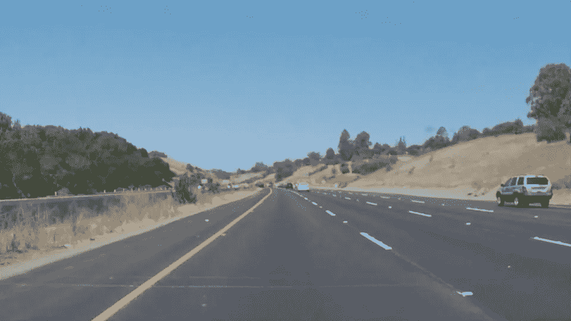
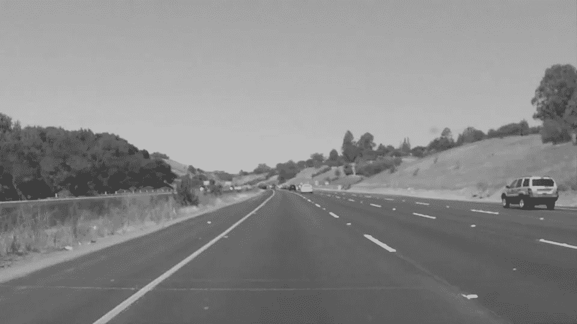
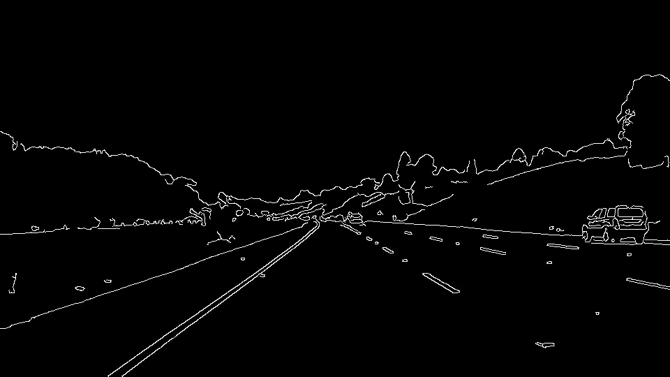
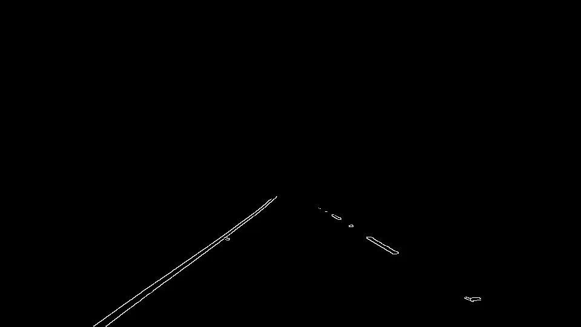
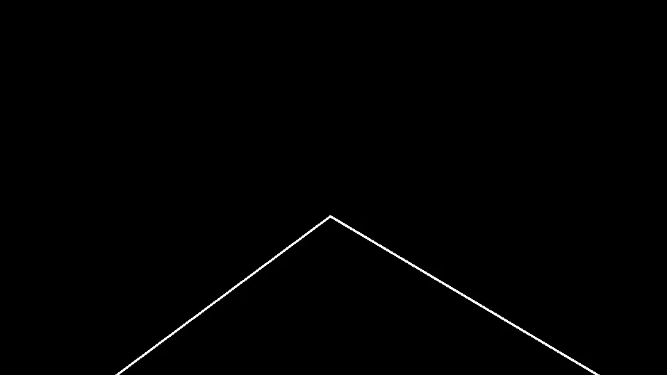

# M2M 第 185 天:我试图直观地解释自动驾驶汽车算法是如何工作的

> 原文：<https://towardsdatascience.com/m2m-day-185-my-attempt-to-intuitively-explain-how-this-self-driving-car-algorithm-works-7422eb2b135e?source=collection_archive---------7----------------------->

> 这篇文章是为期 12 个月的加速学习项目[月掌握](https://medium.com/@maxdeutsch/m2m-day-1-completing-12-ridiculously-hard-challenges-in-12-months-9843700c741f)的一部分。今年五月，[我的目标是打造无人驾驶汽车的软件部分](https://medium.com/@maxdeutsch/m2m-day-182-attempting-to-build-a-self-driving-car-809fab9e4723)。

[昨天](https://medium.com/@maxdeutsch/m2m-day-184-how-to-hack-your-way-through-someone-elses-code-905c44048323)，我想出了如何在道路的前向图像中识别车道线。嗯……我至少知道了如何运行能做到这一点的代码。


The output from yesterday

老实说，我不明白代码实际上是如何工作的，所以今天我试图改变这一点。

下面是我昨天使用的主要代码块。特别是，我复制了主要的*函数*，这个函数叫做**“draw _ lane _ lines”**。基本上，函数是一个代码块，它接受一些输入(在本例中是一张*照片*)，以某种方式操作输入，然后输出操作(在本例中是*车道线*)。

这个主函数使用了一些在代码中其他地方定义的其他*辅助函数*，但是这些辅助函数大多只是使用我昨天下载的库中的预制函数(例如 OpenCV)的稍微干净的方式。

```
def draw_lane_lines(image): imshape = image.shape

   ** # Greyscale image**
    greyscaled_image = grayscale(image)

    **# Gaussian Blur**
    blurred_grey_image = gaussian_blur(greyscaled_image, 5)

   ** # Canny edge detection**
    edges_image = canny(blurred_grey_image, 50, 150)

    **# Mask edges image**
    border = 0
    vertices = np.array([[(0,imshape[0]),(465, 320), (475, 320), 
    (imshape[1],imshape[0])]], dtype=np.int32)
    edges_image_with_mask = region_of_interest(edges_image, 
    vertices)

    **# Hough lines**
    rho = 2 
    theta = np.pi/180 
    threshold = 45    
    min_line_len = 40
    max_line_gap = 100 
    lines_image = hough_lines(edges_image_with_mask, rho, theta,  
    threshold, min_line_len, max_line_gap) **# Convert Hough from single channel to RGB to prep for weighted**
    hough_rgb_image = cv2.cvtColor(lines_image, cv2.COLOR_GRAY2BGR)

    **# Combine lines image with original image**
    final_image = weighted_img(hough_rgb_image, image)

    return final_image
```

粗体注释是对*图像处理流水线*主要部分的描述，这基本上意味着这是为了输出车道线而对输入图像顺序执行的七个操作。

今天，我的目标是了解这七个步骤中的每一个都做了什么，以及为什么要使用它们。

实际上，我只关注前五个，它们输出车道线的数学表示。最后两个操作只是创建了视觉效果，因此我们人类可以在视觉上欣赏数学(换句话说，当自动驾驶汽车实际消耗输出的数据时，这些步骤是不必要的)。

因此，基于我今天的研究，我现在将试图解释以下图像处理事件的顺序:**输入图像→ 1。灰度图像，2。高斯模糊，3。Canny 边缘检测，4。遮罩边缘图像，5。霍夫线→车道线输出**

# 输入图像

这是开始的输入图像。



重要的是要记住，图像只不过是一堆排列成矩形的像素。这个特殊的矩形是 960 像素乘 540 像素。

每个像素的值是红色、绿色和蓝色的某种组合，由三个一组的数字表示，其中每个数字对应一种颜色的值。每种颜色的值可以从 0 到 255，其中 0 表示完全没有颜色，255 表示 100%强度。

例如，白色表示为(255，255，255)，黑色表示为(0，0，0)。

因此，这个输入图像可以用 960 x 540 = 518，400 个三元组数字来描述，范围从(0，0，0)到(255，255，255)。

现在这个图像只是一个数字的集合，我们可以开始使用 *math* 以有用的方式操作这些数字。

# 1.灰度图像

第一个处理步骤是将彩色图像转换为灰度，有效地将彩色空间从三维降级为一维。只在一维上操作图像更容易(也更有效):这一维是像素的“暗度”或“强度”，0 代表黑色，255 代表白色，126 代表某种中间灰色。

凭直觉，我认为灰度过滤器只是一个将红色、蓝色和绿色值平均在一起得到灰度输出的函数。

举个例子，这是原始照片中天空的颜色:


它可以在 RGB(红、绿、蓝)空间中表示为(120，172，209)。

如果我将这些值平均在一起，我得到(120 + 172 + 209)/3 = 167，或者灰度空间中的这个颜色。


但是，事实证明，当我使用上述函数将这种颜色转换为灰度时，实际输出的颜色是 164，这与我使用简单的平均方法生成的颜色略有不同。


虽然我的方法本身并不“错误”，但常用的方法是计算一个更符合我们眼睛感知颜色的*加权平均值*。换句话说，由于我们的眼睛有比红色或蓝色受体更多的*绿色受体*，绿色的值应该在灰度函数中占更大的权重。

一种常见的方法，称为色度转换，使用这种加权和: *0.2126 红色+ 0.7152 绿色+ 0.0722 蓝色。*

通过灰度过滤器处理原始图像后，我们得到以下输出…



# **2。高斯模糊**

下一步是模糊图像使用*高斯模糊*。

通过应用轻微的模糊，我们可以从图像中移除最高频率的信息(也就是噪声)，这将为我们提供“更平滑”的颜色块，以便我们进行分析。

同样，高斯模糊的基本数学是非常基本的:模糊只是取更多像素的平均值(这种平均过程是一种类型的*内核卷积*，对于我将要解释的内容来说，这是一个不必要的花哨名称)。

基本上，要生成模糊，您必须完成以下步骤:

1.  选择照片中的像素并确定其值
2.  查找所选像素的局部相邻像素的值(我们可以任意定义这个“局部区域”的大小，但它通常相当小)
3.  取原始像素和相邻像素的值，并使用某种加权系统对它们进行平均
4.  用输出的平均值替换原始像素的值
5.  对所有像素都这样做

这个过程本质上是在说*“让所有的像素和附近的像素更相似”*，直观上听起来像是模糊。

对于高斯模糊，我们简单地使用*高斯分布*(即钟形曲线)来确定上面步骤 3 中的权重。这意味着像素离所选像素越近，其权重就越大。

无论如何，我们不想让图像变得太模糊，但只要足够让我们可以从照片中移除一些噪声即可。以下是我们得到的结果…


# **3。Canny 边缘检测**

现在我们有了一个灰度和高斯模糊的图像，我们将试着找到这张照片中所有的边缘。

边缘仅仅是图像中值突然跳跃的区域。

例如，在灰色道路和虚白线之间存在清晰的边缘，因为灰色道路可能具有类似 126 的值，白线具有接近 255 的值，并且在这些值之间没有逐渐过渡。

同样，Canny 边缘检测滤波器使用非常简单的数学方法来寻找边缘:

1.  选择照片中的像素
2.  确定所选像素左侧和右侧像素组的值
3.  取这两组之间的差值(即从另一组中减去一组的值)。
4.  将所选像素的值更改为步骤 3 中计算的差值。
5.  对所有像素都这样做。

所以，假设我们只看到了所选像素左边和右边的一个像素，并想象这些是值:(左像素，所选像素，右像素)= (133，134，155)。然后，我们将计算左右像素之间的差值，155–133 = 22，并将所选像素的新值设置为 22。

如果所选像素是边缘，则左右像素之间的差值将更大(接近 255)，因此在输出的图像中将显示为白色。如果所选像素不是边缘，差值将接近 0，并显示为黑色。

当然，您可能已经注意到，上述方法只能找到垂直方向的边缘，因此我们必须执行第二个过程，比较所选像素上方和下方的像素，以处理水平方向的边缘。

这些差异被称为*梯度*，我们可以通过本质上使用毕达哥拉斯定理来计算*总梯度*，以*相加*来自垂直和水平梯度的单独贡献。换句话说，我们可以说*总梯度=垂直梯度+水平梯度*。

所以，比如说垂直渐变= 22，水平渐变= 143，那么总渐变= sqrt(22 +143 ) = ~145。

输出看起来像这样…


Canny 边缘检测滤波器现在又完成了一步。

Canny 边缘检测过滤器并不仅仅显示所有边缘*而是试图识别重要边缘*。**

*为此，我们设置了两个阈值:高阈值和低阈值。假设高门槛 200，低门槛 150。*

*对于任何值大于高阈值 200 的*总梯度*，该像素自动被视为边缘并转换为纯白(255)。对于任何小于低阈值 155 的总渐变，该像素自动被视为“不是边缘”，并转换为纯黑色(0)。*

*对于 150 到 200 之间的任何渐变，只有当像素直接接触另一个已经被计为边缘的像素时，该像素才被计为边缘。*

*这里的假设是，如果这个*软边*连接到*硬边*，那么它很可能是同一个对象的一部分。*

*在对所有像素完成这个过程后，我们得到一个看起来像这样的图像…*

**

# ***4。掩模边缘图像***

*下一步非常简单:创建一个遮罩，消除照片中我们认为没有车道线的所有部分。*

*我们得到了这个…*

**

*这似乎是一个相当激进和放肆的面具，但这是目前在原始代码中写的。所以，继续前进…*

# ***5。霍夫莱恩斯***

*最后一步是使用*霍夫变换*找到车道线的数学表达式。*

*霍夫变换背后的数学比我们上面做的所有加权平均的东西稍微复杂一点，但仅仅是一点点。*

*这是基本概念:*

*直线的等式是 y = mx + b，其中 m 和 b 是常数，分别表示直线的斜率和直线的 y 截距。*

*本质上，为了使用霍夫变换，我们确定 m 和 b 的一些二维空间。此空间代表我们认为可能为车道线生成最佳拟合线的 m 和 b 的所有组合。*

*然后，我们在 m 和 b 的空间中导航，对于每一对(m，b ),我们可以为 y = mx + b 形式的特定线确定一个方程。此时，我们希望*测试*这条线，因此我们找到照片中位于这条线上的所有像素，并要求他们*投票*这是否是对车道线的良好猜测。如果像素是白色的(也就是边的一部分)，它会投“是”，如果是黑色的，它会投“否”。*

*获得最多投票的(m，b)对(或者在这种情况下，获得最多投票的两对)被确定为两条车道线。*

*这是霍夫变换的输出…*

**

*我跳过了这一部分，霍夫变换不是使用公式 y = mx + b 来表示直线，而是使用极坐标/三角式表示，使用 *rho* 和 *theta* 作为两个参数。*

*这种区别不是非常重要(对我们的理解来说)，因为空间仍然是二维参数化的，逻辑完全相同，但这种三角表示法确实有助于解决我们无法用 y = mx + b 方程表达完全垂直线的事实。*

*无论如何，这就是为什么在上面的代码中使用了 *rho* 和 *theta* 的原因。*

# *最终输出*

*我们结束了。*

*程序输出两个参数来描述两条车道线(有趣的是，这些输出被转换回 m，b 参数化)。该程序还提供了每条车道线端点的坐标。*

## *车道线 1*

*斜率:-0.740605727717；截距:6640 . 666866666667*

*第一点:(475，311)第二点:(960，599)*

## *车道线 2*

*coef:-0.740605727717；截距:6640 . 666866666667*

*第一点:(475，311)第二点:(0，664)*

*将这些线叠加在原始图像上，我们看到我们已经使用基本的数学运算有效地识别了车道线。*

**

> *阅读[下一篇文章](https://medium.com/@maxdeutsch/m2m-day-186-this-exercise-helped-me-realize-something-im-focusing-on-the-wrong-thing-128d99c18f22)。阅读[上一篇文章](https://medium.com/@maxdeutsch/m2m-day-184-how-to-hack-your-way-through-someone-elses-code-905c44048323)。*

## *Max Deutsch 是一名痴迷的学习者、产品制造者、为期[个月以掌握](http://MonthToMaster.com)的试验品，以及 [Openmind](http://OpenmindLearning.com) 的创始人。*

## *如果你想跟随 Max 长达一年的加速学习项目，请确保跟随[这个媒介账户](https://medium.com/@maxdeutsch)。*