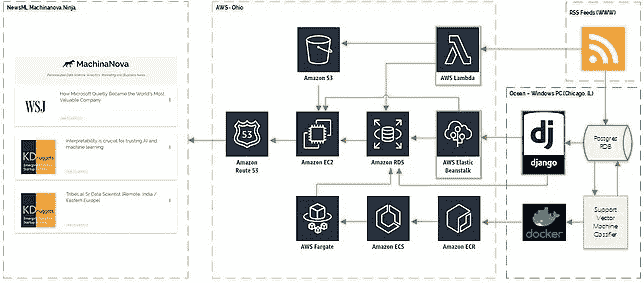
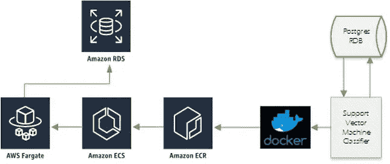

# MachinaNova:一个个人新闻推荐引擎

> 原文：<https://towardsdatascience.com/machinanova-a-personal-news-recommendation-engine-d465cbed3661?source=collection_archive---------12----------------------->

MachinaNova Logo

几个月前，我订购了一个叫做 Paper.li 的工具，我可以把它添加到我的网站上。它的承诺是“收集相关内容，并把它发送到你想去的任何地方”——这正是我早上工作时需要的。

让我解释一下…我喜欢我的早晨惯例。它包括吃早餐、喝咖啡和坐下来浏览数字新闻和内容的丛林。我的目标:带着我还没有的珍闻出现在新闻丛林的另一边；希望我打算吃的一些咖啡和百吉饼能在我嘴里落地。

说真的，我点击了几十个书签，浏览了标题，最终还是屈服于点击疲劳。每天早上，我都会看久经考验的《哈佛商业评论》 …因为它们每次都很棒。

如果 Paper.li 照他们说的做了，我的日常工作时间就会减少，我终于可以享受我的百吉饼了，而不是把它往我脸上推。我需要这个解决方案！

*The image above is a real picture of a portion of the bookmarks saved on my Google Chrome browser.*

**新闻聚合现实:它烂透了百吉饼。**

坦白地说，李的方案很糟糕。它在推荐文章方面很有效；但是它们很少有趣。通常，被推荐的文章都是推广个人项目的博客帖子或推文，我很少能找到任何可以应用到我职业生涯中的真正内容。

李(以及其他新闻聚合网站——看看你，Flipboard，Medium 和其他所有解决方案)是糟糕的。它只是不适合我想读的内容。如果你不是像我一样的完美主义者，这很好…

然而，我是一个完美主义者…

我有能力解决这个问题。

是时候建造 [MachinaNova](https://www.courtneyperigo.com/machinanova) 了。

**MachinaNova，新闻机|解决方案概述**

MachinaNova 是一个应用程序，它可以找到我感兴趣的新闻，并以我每天都可以阅读的格式呈现出来。这就引出了一个问题…它怎么知道我想读什么？

这是一个神奇的新闻推荐系统。

嗯，其实是我训练的识别我喜欢的文章的软件。我将把解决方案分解成几个部分，这样就容易理解了，但是在高层次上，MachinaNova 是一个推荐系统。

就我而言，MachinaNova 预测了我通过阅读“喜欢”一篇文章的可能性。除了预测之外，它还会产生一个置信度得分，告诉我有多确信我会喜欢这篇文章。每天，它都会呈现根据可信度排序的前 12 篇“赞”文章。

解决方案相对简单，而且非常有用。我已经用了几个星期了——我喜欢它！

MachinaNova 查看文章的来源、标题和摘要来预测“喜欢”或“不喜欢”

**谢谢你，机械诺娃！你其实知道我喜欢什么。**

为了理解文章的内容，MachinaNova 使用自然语言处理来阅读文章。我一会儿会谈到这是什么，但是把它想象成我在早晨例行公事中可能做的事情。我浏览来源，阅读标题，也许还有文章的摘要。在我的日常生活中，如果我不喜欢某篇文章，我会继续看下一篇；如果我喜欢，我可能会点击阅读。唯一不同的是，MachinaNova 可以在几秒钟内阅读和评分数千篇文章。

我很嫉妒…我一年可能会读几千篇文章…人工智能正在接管。

**MachinaNova，新闻机器|采集新闻**

为了建立 MachinaNova，我需要做的第一件事就是抓取我喜欢的文章。幸运的是，有一种预置的方法可以轻松地从网络上获取新闻。RSS 源。RSS 源是新闻提供商提供的服务，允许快速分发他们的内容。在 RSS 提要中，您可以找到诸如文章名称、作者、链接、图片等内容。

为了捕获有价值的 RSS 数据，我构建了一个 Python 脚本来调用我最喜欢的 RSS 提要，并将信息存储在我的本地机器 Ocean 上的数据库中。(海洋这个名字是因为它的 3TB 固态硬盘。)

海洋自 2018 年 6 月以来一直愉快地捕捉文章。在撰写本文时，我的本地数据库包含来自华尔街日报、芝加哥论坛报和哈佛商业评论等来源的 20，000 多篇文章。

作为最终 MachinaNova 解决方案的一部分，我需要在 Amazon Web Services 上复制 Postgres 数据库。我还需要在 AWS Lambda 中复制我的 Python 脚本，并使用 Cloudwatch 服务从 RSS 提要中获取数据，并将它们存储在我的 Amazon Postgres RDS 解决方案中。

与此同时，Lambda 还将来自 RSS 提要的徽标存储在亚马逊 S3 中，这样 MachinaNova web 应用程序就可以将这些图像作为源呈现给最终用户。

在我将 Python 脚本和 Postgres dB 迁移到 AWS 之后，我的本地 Python 脚本于 2018 年 10 月初退役。

**MachinaNova，新闻机器|网络应用**

在构建了捕获新闻文章的方法之后，我需要告诉我的应用程序我喜欢和不喜欢哪些文章。在我的本地计算机(Ocean)上，我构建了一个 Django 应用程序，它可以读取我存储在 Amazon RDS 中的文章。

这个 Django 应用程序，并没有对公众开放，它是一个界面，在我的电脑屏幕上显示一篇随机的未经训练的文章。在应用程序中，我可以看到两个按钮“喜欢”和“不喜欢”。如果我喜欢这篇文章，我会选择“喜欢”，如果不喜欢，我会选择“不喜欢”。在我的数据库中，0 代表“不喜欢”，1 代表“喜欢”

喝了几杯酒，经过几个晚上的打分，我已经根据自己的喜好训练出了大约 1200 篇文章。

现在，我们有了一个真正的数据科学项目的开端——机器学习！

**MachinaNova，新闻机器|机器学习**

这部分可以自成一篇。所以，我要把它保持在一个很高的水平。这是一个家庭友好的博客帖子。

记得我之前说过，我的解决方案可以使用自然语言处理来阅读文章。为此，MachinaNova 使用一种叫做[空间](http://spacy.io/)的解决方案来“阅读”每个单词(和标点符号)。) [Spacy](http://spacy.io/) 与生俱来的对单词在邻近的其他单词的上下文中的含义的理解(例如,“苹果”是一家公司，而不是一种水果，当伴随着其他商业单词时。)

使用 Spacy 和它的 NLP 功能，我建立了一个单词包模型，计算一篇文章、标题甚至来源中使用的单词数。然后，它会查看这些单词，并将其与我过去喜欢的文章的常用单词和字数的训练数据集进行比较。

**本质上，MachinaNova 会寻找那些与我以前喜欢的文章有相似文字的文章。**

为了给每篇文章打分，我使用了一种叫做支持向量机的算法，用核心技巧在“N”维中表示这些单词，以便在我“喜欢”和“不喜欢”的文章之间划出一条线。这在一开始还不错，但需要优化。为了优化算法，我使用了 TF-IDF(术语频率，逆文档频率)等其他技巧，甚至使用 n 元语法创建了一些短语。

还和我在一起吗？

一旦我的机器学习算法达到预期，我就使用 Docker、亚马逊 ECR、亚马逊 ECS 和使用亚马逊 Fargate 的自动缩放计算资源将其部署到 AWS。机器学习算法使用 Cloudwatch 和 Cron 调度在每天早上 5:45 运行。

**MachinaNova，新闻机器|用户界面和演示**

在这一点上，我们在 Amazon Web Services 上有一个数据库，每天更新数千篇新闻文章。现在是时候向最终用户展示这些信息了。

**我爱 Django，Jinja2 和 Materialize CSS！**

在这个项目中，我爱上了一个超级易用的软件，它允许我使用我最喜欢的语言 Python 来构建漂亮的 web 应用程序。解决方案 Django 创建了一个数据库，给了我一些安全特性，并允许我引入模板和 CSS 来使我的应用程序漂亮、更新并与我收集的数据集成。

所以，我建立的解决方案已经准备好了，可以在我的网站上找到，地址是[courtneyperigo.com/news](https://www.courtneyperigo.com/machinanova)；但肮脏的事实是，该解决方案实际上由亚马逊的 Route 53 安全托管在 [newsml.machinanova.ninja](https://newsml.machinanova.ninja/) 。

我很自豪完成了这个项目。它挑战我学习新工具，迫使我学习 AWS，并彻底击败了其他新闻推荐服务。

**吮吸面包圈、纸团的李！**

这个项目的代号是基多项目。因为一旦我完成了这样一个项目，我会奖励自己一个假期。看来我需要温习一下我的西班牙语。