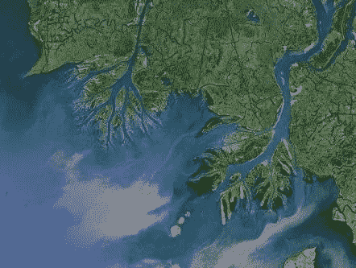
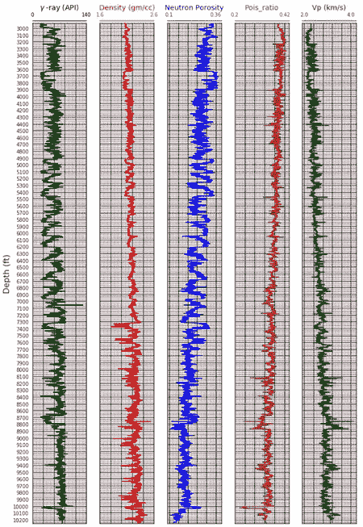
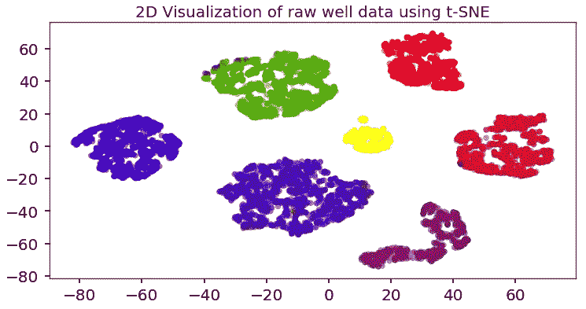
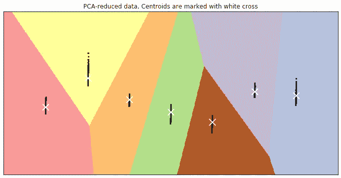
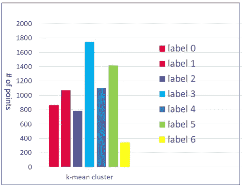
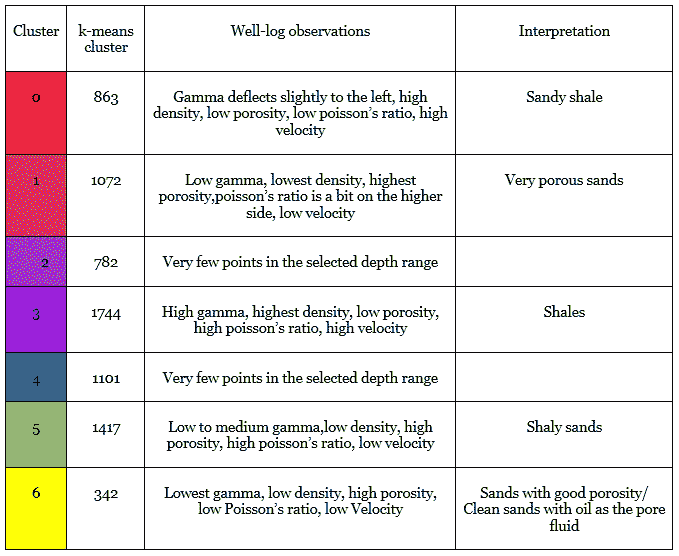

# 机器学习在地球物理测井数据中的应用

> 原文：<https://towardsdatascience.com/machine-learning-applied-to-geophysical-well-log-data-58ebb6ee2bc6?source=collection_archive---------7----------------------->

## 无监督学习是对地球物理测井中的岩性进行分类的一个很好的工具。

近年来，机器学习(ML)变得非常流行，许多行业都在将它应用于他们的数据集。本文是关于将最大似然法应用于测井数据，并了解最大似然法帮助学习井中岩性的方法。

An offshore drilling rig (courtesy: [https://unsplash.com/s/photos/oil-rig](https://unsplash.com/s/photos/oil-rig) available for download)

什么是测井记录？

测井记录是在井中记录的地下物理特性的单点测量，并随深度垂直变化。这些特性是随机的和非周期性的，取决于矿物成分或岩性、孔隙度、胶结和压实、流体的存在等因素。，显示了从海上区域记录的一套常规测井记录。每条测井曲线都显示了这些特性是如何随深度变化的。在这里，我们正在观察 500 万到 1600 万年前沉积在**的沉积物！！这难道不令人印象深刻吗！！**

**测井特性**

好的，现在有些测井像**伽马射线和泊松比**是极好的**岩性指标**，而其他像**密度和纵波速度测井**对于了解**岩石类型、孔隙流体类型以及沉积沉积物中的压力和压实趋势是有用的。**密度孔隙度，一种源自密度测井的物理性质，用于测量相同岩石类型或不同岩石类型的孔隙空间量。

沉积物通常由河流搬运并沉积在盆地中，因此岩性取决于风化的岩石类型以及河流携带沉积物通过的区域。此处所示的**测井记录来自河流三角洲系统**,该系统主要由砂层和页岩组成。常见的岩石类型有:

砂岩(储层)和页岩(非储层)

# **砂岩/砂**:由石英颗粒、长石、方解石、重矿物和其他岩石碎片组成的岩石。

页岩:由粘土矿物组成的岩石，其中一些具有放射性。

# **粉砂岩/淤泥**，一种由沙子和页岩组成的岩石也可能存在。

***特别提示* :** 如果没有 [Ramya Ravindranathan](https://www.linkedin.com/in/ramya-ravindranathan-5750733a/) ，这项研究就不可能完成。数据集和解释是她提供的。

Fluvial- Deltaic system (image used from [http://www.sepmstrata.org/page.aspx?pageid=72](http://www.sepmstrata.org/page.aspx?pageid=72))

对于不同的岩性，相对于地层边界的测井响应是不同的。较低的 GR、泊松比、密度、速度值和较高的孔隙度值是干净砂岩的特征。与砂相比，页岩的 GR 值更高。与砂岩相比，孔隙度极低，而密度、泊松比和速度值较高。淤泥的性质介于沙子和页岩之间。

Suite of well logs extending from 2800 ft to 10250 ft

这口井遇到的单个砂层范围为 10-150 英尺(3.04-45.72 米)，被厚或薄的页岩层隔开。砂的储层质量通过粘土百分比来衡量**。**最好的储层粘土含量最低。**如果能根据粘土含量来划分岩性就太好了。理想的情况是钻许多井来获得地下的清晰图像，但这是一件非常昂贵的事情，因为钻一口井要花费数十亿美元。**

**可靠地预测岩性成为储层描述的关键问题之一。**在实践中，结合**物理模型**、**局部地质** **知识**和经验，将大型地震和测井数据集简化为地球的低维模型*。不幸的是，这些简化的物理和地质假设在实践中并不总是正确的，这使得推断的模型**高度不确定和有偏差**。

这个问题可以用一般的机器学习模型来重新表述。因此，用一些算法来预测盆地中巨大井数据集的岩性将是一个好主意。

**利用井数据集的无监督学习**

用井数据集识别岩性是无标记数据无监督问题的一个典型例子。**无监督机器学习**用于测井记录，以获得可与井的**岩性相关的聚类。当推断的结构比原始数据维数低时，无监督方法特别有用。巧合的是，由地球科学工作流程生成的解释图像和地质图的维度远低于原始现场数据。**

这篇文章解释了以下因素。

无监督学习可以根据区域内的岩性对数据进行分类吗？

聚类是否与测井曲线特征变化的深度相匹配？

这里探讨的两个无监督学习任务是(a) **通过相似性将数据聚类成组。本研究中使用的 K-means 聚类**就属于这个类别**。**和(b) **降维**压缩数据，同时保持其结构和有用性，包括 **PCA** 和 **t-SNE** 。

数据集由各种测井记录组成，这些测井记录具有各种各样的单位。因此，在使用聚类算法之前，需要对数据集进行规范化。在这个问题中，有> 7000 个离散的深度点。

**k 均值聚类**用于创建数据点组，使得不同聚类中的点不相似，而一个聚类中的点相似。利用 **k-means 聚类**，测井数据点被分组为 *k* 组，定义不同的岩性。较大的 *k* 创建粒度更大的较小组，而较低的 *k* 意味着较大的组和较小的粒度。“肘”方法计算一系列聚类数的平均分数。折线图类似于一只手臂，而“肘”(曲线上的拐点)是最佳集群数量的良好指示。

在弯管图的当前分析中，拐点可以在 6°或 7°处。肘形图，很多时候，并不表明一个拐点，因此，进一步的验证是必不可少的。

**t-分布式随机邻居嵌入(t-SNE)** 是一种**非线性降维**技术，用于在二维或三维的低维空间中嵌入高维数据进行可视化。它通过二维或三维点对每个高维对象进行建模，以这种方式，相似的对象通过附近的点进行建模，而不相似的对象通过远处的点进行建模的概率很高。

t-SNE 算法将原始数据分为 7 类。轴是高维数据映射到二维时生成的数字。该图显示 SNE 霸王龙产生了明显的、分离良好的集群。配色方案是根据 k-mean 算法生成的标签。似乎来自 k-均值聚类的少数点与 t-SNE 聚类不一致(少数紫色点与绿色点分类在一起)。

映射到二维空间的 t-SNE 簇。根据标记的 k-均值聚类的颜色方案。

使用 PCA 对最佳聚类数进行最终验证。**主成分分析(PCA)** 是一种无监督的方法，它在保持数据集结构(方差)的同时降低了维数，从而降低了复杂性。它对数据进行旋转，使新轴的方差最大化。将高维数据投射到低维子空间(在 2-3 维中可视化。).

PCA 聚类将数据集聚类成 7 个类，并且类之间的边界是不同的。质心清晰可见。

PCA clusters mapped onto 2-D space

**提取标记聚类**

基于这三种聚类算法，测井曲线中的**最优聚类数为 7。**对七个聚类再次运行 k-means 方法，并生成聚类标签。该算法将相应的聚类标签分配给数据集中的所有深度点。

直方图显示了根据深度点绘制的 7 个聚类。直方图的颜色方案和标签现在用于绘制测井曲线和岩性(从聚类中生成)。解释表也有相同的配色方案和标签。

Histogram showing the distribution of points in cluster generated by k-means. The color scheme and labels of the match with the table

研究 k-means 算法的一个挑战是，如果初始状态不相同，那么簇的大小就会改变。大约有 10-15 个点不同，约占测井记录总点数的 0.2%。

**解读**

选择 7000 至 8500 英尺和 8500 至 10250 英尺两个深度范围进行解释和比较，看数据聚类是否与测井数据解释的岩性相匹配。该表总结了与测井特征和岩性相关的聚类标签。发现的主要端员岩性为砂岩和页岩，具有各种不同的分级岩性，如砂质页岩和泥质砂岩。在本研究区域，我们将具有良好孔隙度的干净砂层归类为良好储层组 1 和 6 ),一般来说，这种含有碳氢化合物(石油或天然气)的砂层在垂直柱中非常少，并且它们与聚类方法(组 6)具有良好的相关性，聚类方法表明这种点的数量非常少。页岩表现为非常粗的柱状，而集群(集群 3)显示的点数最多。有趣的是，聚类方法可以区分不同的岩性，如泥质砂岩(聚类 5)和砂质页岩(聚类 0)。这项研究似乎对区分潜在油藏和非油藏非常有用。

Well log data from 7000–8500 ft. Clusters are interpreted from k-means unsupervised learning

Well log data from 8500–10250 ft. Clusters are interpreted from k-means unsupervised learning

将最大似然算法集成到岩性分析中有用吗？

总之，这证明了最大似然法在解释大量测井资料方面有着广阔的应用前景。地球物理数据确实属于机器学习模型的范畴。无监督学习可以用于直接从数据中提取有用的信息。无监督学习方法确实将数据集分类到有用的簇中。当与深度匹配时，这些群集确实产生了有用的岩性，并提供了有用的岩石特征。

在未来的研究中，地质解释可以作为标签来训练分类器，并对相似的数据集进行预测。如果有足够的数据集，就有可能对地球物理问题进行更科学的基准测试。

我欢迎反馈和建设性的批评。可以通过 [LinkedIn](https://www.linkedin.com/in/tannistha-m-83588a45/) 联系到我。这项研究的代码可以在[这里](https://github.com/tannisthamaiti/ML_well_log)找到。

_______________________________________________________________

* Bougher，B. B. (2016 年)。*机器学习在地球物理数据分析中的应用*(不列颠哥伦比亚大学博士论文)。