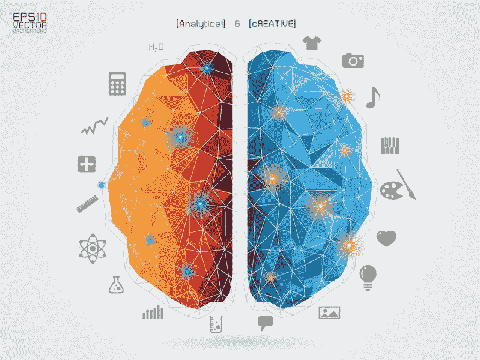

# 机器学习——艺术还是科学？

> 原文：<https://towardsdatascience.com/machine-learning-art-or-science-b660dc4db4a7?source=collection_archive---------0----------------------->

大数据的激增和确认偏差的挑战，导致数据科学家寻求一种方法来揭示隐藏的见解。在预测分析中，他们经常求助于机器学习来扭转局面。机器学习似乎是使用训练集处理大数据的理想候选。它还通过进行数据驱动的预测而享有浓厚的科学气息。但是机器学习真的没有偏见吗？我们如何更有意识地利用这个工具？

# 为什么机器学习是一门科学:

我们经常听到机器学习算法对数据进行学习和预测。因此，他们应该更少受到人为错误和偏见的影响。我们人类倾向于寻求对我们已经想到或相信的东西的确认，这导致了确认偏见，使我们忽略了与我们的理论相矛盾的事实，而过分强调了那些肯定理论的事实。

在机器学习中，数据教会我们，还有什么比这更纯粹的呢？当使用基于规则的算法或专家系统时，我们依靠专家来制定“正确的”规则。我们无法避免他/她的判断和立场渗透到这些规则中。对直觉的研究甚至可以更进一步说，我们希望专家的经验和观点影响这些规则——它们使他/她成为专家！

无论哪种方式，当我们使用机器学习算法从数据中自下而上工作时，我们似乎已经绕过了这种偏见。

# 为什么机器学习是一门艺术:

事实不是科学，数据也不是。我们发明科学理论来给出数据背景和解释。帮助我们区分因果关系和相关性。苹果落在牛顿头上是事实；引力是解释它的理论。但是我们如何提出这个理论呢？有没有科学的方法来预测灵光一现？

我们使用科学工具来测试假设，但我们不会以这种方式产生假设，至少不会产生体现创新思维的假设。另一方面，艺术需要一种富有想象力的技巧来表达和创造新事物。在行为分析中，它可以采取理性或非理性人类行为的形式。用户点击内容是事实；解释因果关系的理论可能是它回答了他/她正在寻找的问题，或者它与他/她基于以前的行为感兴趣的领域有关。

人类行为固有的模糊性，甚至更多我们的因果关系或动机，赋予了艺术在预测分析中尊贵的地位。机器学习是归纳的艺术。即使是无监督的学习也使用由人根据他/她的知识和创造力选择、调整和验证的客观工具。

# 薛定谔:

另一种方式是将机器学习视为艺术和科学。就像薛定谔的猫既活又死，佛教的*中道*，或者告诉我们光既是波又是粒子的量子物理学。至少在我们测量它之前……你看，如果我们使用科学工具来测量基于机器学习的模型的预测性，我们就同意科学的方法来给予我们的结论某种专业的验证。然而，如果我们专注于衡量潜在的假设，或表示或评估方法，我们会意识到模型只像它的创造者一样“纯粹”。

在行为分析中，很多都依赖于将人类行为解释为可量化的事件。这件作品源于艺术领域。当将行为分析与科学事实相结合时，正如在使用医学或健康研究时经常发生的那样，我们真正创造了一门艺术科学或科学艺术。我们再也不能将科学本质与行为培养分开。

# 实际实施

虽然这可能是一个有趣的哲学或学术讨论，这里的目的是帮助实用工具和技巧。那么，这对于开发基于机器学习的模型或依赖它们进行行为分析的人来说意味着什么呢(基于[我自己的经验](http://orensteinberg.com/about-us/)加上这篇文章作者的见解——如下)？

## 1.投资方法论

数据是不够的。叙述数据的理论给了它背景。你在表示、评估和优化这三个阶段做出的选择容易受到糟糕艺术的影响。因此，当需要机器学习模型时，在开发东西之前，请咨询各种专家，选择最适合你情况的方法。

## 2.垃圾进垃圾出

机器学习不是炼金术。这个模型不能把煤变成钻石。准备数据往往是艺术(或“黑色艺术”)多于科学。而且它占用了大部分时间…对你所依赖的模型中的内容保持批判性的关注，如果你是设计方，尽可能保持透明。记住，更多的相关数据比更聪明的算法更有效。

## 3.数据准备是特定领域的

没有办法完全自动化数据准备(即特征工程)。一些功能可能只有在与其他功能结合时才会增加价值，从而创造新的事件。通常，这些事件需要让产品或业务有意义，就像它们需要让算法有意义一样。请记住，功能设计或事件提取需要与建模完全不同的技能。

## 4.关键是整个链中的迭代

你收集原始数据，准备它，然后学习和优化，测试和验证，最后在产品或业务环境中使用。但这个循环只是第一次迭代。一个良好的算法通常会让你重新收集一个略有不同的原始数据，从另一个角度绘制曲线，以不同的方式建模、调整和验证它，甚至以不同的方式使用它。你在这个链条上培养合作的能力，尤其是涉及火星建模师和金星营销人员的地方，是关键！

## 5.小心做出你的假设

阿基米德说:“给我一根足够长的杠杆和一个支点，我可以撬动地球。”机器学习是一个杠杆，不是魔法。它依赖于感应。你在这个过程中的知识和创造性假设决定了你的立场。如果你选择了正确的杠杆(即方法论)，归纳科学将会处理剩下的事情。但决定交战规则的是你的艺术判断。

## 6.如果可以，获取实验数据

机器学习可以帮助预测基于训练数据集的结果。分割测试(又名 A/B 测试)用于测量因果关系，群组分析有助于分割和定制每个细分市场的解决方案。将来自分裂测试和群组分析的实验数据与机器学习相结合，可以证明比坚持其中一个更有效。你选择整合这两种科学方法的方式非常有创意。

## 7.污染警报！

不要让调整算法的艺术过程污染了你对其预测性的科学测试。记住保持训练集和测试集的完全分离。如果可能的话，在算法完全优化之前，不要向开发人员公开测试集。

## 8.国王死了，国王万岁！

这个模型(及其基础理论)只有在更好的模型出现之前才有效。如果你不想成为死亡之王，这是一个好主意，在上一个发布的那一刻开始开发下一代模型。不要把精力花在维护你的模型上；花在试图取代它上。你失败的时间越长，它就变得越强大…

## 概述

机器学习算法通常用于帮助做出数据驱动的决策。但是机器学习算法并不都是科学，尤其是应用于行为分析的时候。理解这些算法的“艺术”方面及其与科学方面的关系，可以帮助制作更好的机器学习算法，并更有效地使用它们。

______

我很高兴看到你的反馈。请在下面留下你的评论。

我要感谢[穆罕默德·欣达维](https://www.linkedin.com/in/mohamadhindawi)、[法比奥·莫里塔](https://www.linkedin.com/in/fabio-ohara-morita-725669)和[阿里尔·沙米尔](http://www.faculty.idc.ac.il/arik/site/index.asp)贡献了他们的见解，阿里尔·沙米尔向我推荐了佩德罗·多明戈斯关于这个主题的一篇有趣的论文

贡献者:

美国好事达保险公司数据科学副总裁穆罕默德·欣达维·FCAS 博士

Fabio Ohara Morita，巴西 Porto Seguro 保险公司技术总监(首席精算师)

Ariel Shamir，以色列 IDC Efi Arazi 计算机科学学院副院长教授

多明戈斯佩德罗。“关于机器学习需要知道的一些有用的事情。”*美国计算机学会的通信*55.10(2012):78–87。

*原载于 2016 年 12 月 2 日*[*orensteinberg.com*](http://orensteinberg.com/machine-learning-art-science/)*。*