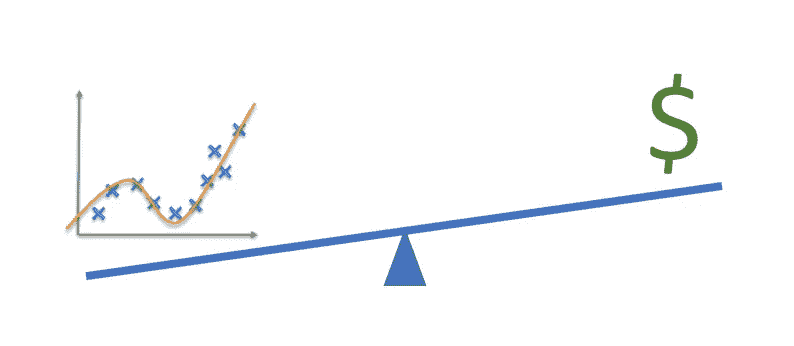

# 机器学习:平衡模型性能和商业目标

> 原文：<https://towardsdatascience.com/machine-learning-balancing-model-performance-with-business-goals-57eaa870ff66?source=collection_archive---------15----------------------->

这篇文章旨在为评估使用机器学习解决您的业务问题提供一些指导。

作为一名数据科学家，我非常渴望找到“最佳”模型——我的预测有多接近完美？然而，更多的时候，我努力争取的增量是不必要的。我优先考虑的成功标准并不总是业务优化的量化指标。

例如，如果我告诉你我的一个客户实现了一个准确率为 64.2%的模型，你可能会大吃一惊。然而，他们认为没有必要及时投资来改进模型。事实上，它有助于取代耗费数周时间的以手工为主(且不受欢迎)的工作流程。新的解决方案只花了几天时间，让团队有时间去做他们喜欢的更具挑战性的任务。

这篇文章将讨论评估机器学习模型的商业考虑。此外，它还提供了回归问题(预测数值)、分类问题(预测项目的类别)和建议的示例。

# 基线

基线是一个度量标准，表明您今天解决问题的成功程度。使用任何新解决方案的目标——无论是否有机器学习——都应该是改善这一点。

让我们考虑一下我上面提到的客户的情况…

例如:目前，员工手动完成这项任务需要 X 个小时，花费$Y。他们往往有 Z%的时间是正确的，但发现这项任务令人沮丧。

我们有三个可量化的指标:时间、成本和准确性。还有一个定性点表明当前的解决方案不受员工欢迎；在某些情况下，您甚至可能希望为此捕获一个可量化的指标。

*目标:创建一个解决方案，将这项任务从员工身上移除，让他们可以做自己喜欢的工作，提高员工满意度，同时节省时间和金钱。*

如上所述，企业认为模型准确性不如删除不必要的工作负载和节省时间重要。

因此，要理解一个模型是否适合生产，您需要考虑和平衡多个指标。我考虑的三个主要因素是:

> **1。性能**
> 
> 这表明解决方案在预测正确结果方面有多好。
> 
> 衡量标准本身因问题的类型而异。无论为机器学习模型选择哪一个，都应该用于计算性能基线。
> 
> **2。时间**
> 
> 这是完成任务所需的持续时间。
> 
> 对于基线，这是在没有机器学习模型的情况下需要多长时间；无论是使用替代软件解决方案还是手动方式。
> 
> **3。钱**
> 
> 这是任务的货币影响。
> 
> 对于基线，这可能与完成任务的成本或当前解决方案的销售额有关。

作为一名数据科学家，我经常非常关注性能，因为这是我可以控制的。然而，为了让我的模型用于生产，评估和交流这些其他量词是很重要的。然后，利益相关者可以做出明智的决定，决定是否继续我所构建的内容。

# **示例场景**

## 回归——预测房价

假设我们拥有一家房地产代理公司。该公司有很多股票，并希望探索机器学习是否可以帮助决定每栋房子的要价。

目前，一个人会阅读关于房产的文件，并根据该地区最近出售的其他类似房屋，对房子的价值做出明智的决定。然后，他们将根据自己的经验决定报价。

我们决定专注于建立一个预测房子价值的模型。然后，代理可以使用该模型的预测来决定合适的报价。

我们希望该模型能够发现与价格相关的特征的趋势和模式。然而，我们仍然意识到，它可能会错过人类可以捕捉到的细微差别，例如，财产的状况，这就是为什么在这种情况下，我们希望他们做出最终决定。

**表演**

*基线——代理商之前的预测与销售价格有多接近？*

*度量——平均绝对误差(MAE)、均方根误差(RMSE)*

我们应该计算当前的性能值——一个代理平均做出一个好的预测的能力——并与我们最好的模型的性能进行比较。

**时间**

*基线—代理进行预测需要多长时间？*

如果这对于我们的代理人来说是一项耗时的任务，并且使用机器学习模型可以使其明显更快，那么仅此一点就可以证明推进我们的模型是正确的。

**钱**

*基线—公司让代理人为房屋定价需要多少成本？错了要付出多大代价？*

最终，该机构希望赚最多的钱。如果投资机器学习模型会让公司付出成本，他们需要了解他们将在哪里省钱，或者他们可能在哪里赚钱。

## 分类—预测欺诈性银行活动

假设我们是一家社区银行，想要探索更好地防止欺诈活动的方法。

目前，我们有简单的规则来标记“可疑”交易，例如:超过特定的阈值金额，或在州外购买。对于每一笔被标记的交易，员工都要检查账户所有人的档案和以前的交易，以便更好地了解这是否不合常规。然后，他们运用自己的最佳判断，要么允许交易，要么在认为这是欺诈时采取适当的行动。

我们希望建立一个预测模型来更好地识别欺诈。该模型应减少我们的员工审查非欺诈交易的次数，同时确保我们捕捉到欺诈交易。

和前面的例子一样，我们仍然需要决定如何在生产中使用这个模型。一种选择是让员工参与进来，让他们仍然评估个人资料，但确保他们有更少的内容需要审查。或者，我们相信模型会直接进入流程的下一步:打电话给客户，验证交易是他们的。这是一个需要由企业做出的决定，但以下指标也可以帮助指导这一决定。

**性能**

*基线—标记为可疑的交易中有多大比例实际上是欺诈？有多少交易实际上是欺诈性的？*

*指标——准确度、精确度、召回率、F1 分数*

了解当今欺诈活动的识别能力，使我们能够与任何已建立的模型进行比较。企业应该评估可用的指标，并决定哪一个对他们最重要——准确性是最直观的，但不一定是最适合每个问题的。

**时间**

*基线—从交易发生到银行代理将其识别为欺诈之间有多长时间？代理人向客户确认交易是否有效需要多长时间？*

可能有机会使用模型来最大限度地减少代理处理此任务的时间。然而，推迟释放资金也可能产生后果。

**钱**

*基线——银行让欺诈交易通过需要多少成本？反过来说，跟进一个客户以确认他们的交易需要多少钱？*

欺诈显然会耗费企业的资金，但在每笔交易都与客户澄清之前，阻止释放资金是不可行的。了解这些相关成本可以让您做出适当的商业决策。

## 推荐—推荐图书

对于这个场景，我们拥有一个在线书店。我们有许多回头客，他们登录网页进行购买。我们有谁购买了什么的历史数据，以及用户为他们的购买提供的评级。我们希望利用信息更好地提出建议。

目前，我们计算每个流派的热门书籍:过去 30 天内最畅销的书籍。前 20 名作为推荐显示给用户。

我们希望根据顾客之前的购买和兴趣进行个性化定制，而不是纯粹根据销售额对每个顾客进行同样的预测。

由于我们有历史购买和评论，我们有明确和隐含的数据。评级是明确的数据:顾客告诉我们喜欢或不喜欢一件商品的程度。同时，购买数据是隐含的:购买商品意味着他们喜欢该产品，但这可能实际上并不成立。

**性能**

*基线——平均而言，顾客会购买多少本推荐书籍？被推荐书籍的平均评分是多少？*

*指标(隐含、购买)—召回、精确度、平均精确度(MAP)*

*指标(明确，评级)—平均绝对误差(MAE)，均方根误差(RMSE)*

当我们建立模型时，我们用历史数据评估它的性能。我们可能还希望在我们的用户子集上运行这个产品，以评估它在产品中的性能，这是 A/B 测试。

**时间**

*基线—当前推荐模型显示推荐需要多长时间？*

推荐过程已经自动化，但我们正在寻找替代它。由于算法的复杂性，一些推荐引擎可能具有更高的延迟(返回结果所需的时间),这应被视为不确定良好的用户体验。

**钱**

*基线——目前的建议能赚多少钱？*

在这里，我们试图赚更多的钱，而不是像前面的例子那样试图省钱。我们需要了解当前的财务提升来自于建议，这样我们就可以与我们期望模型实现的目标进行比较。