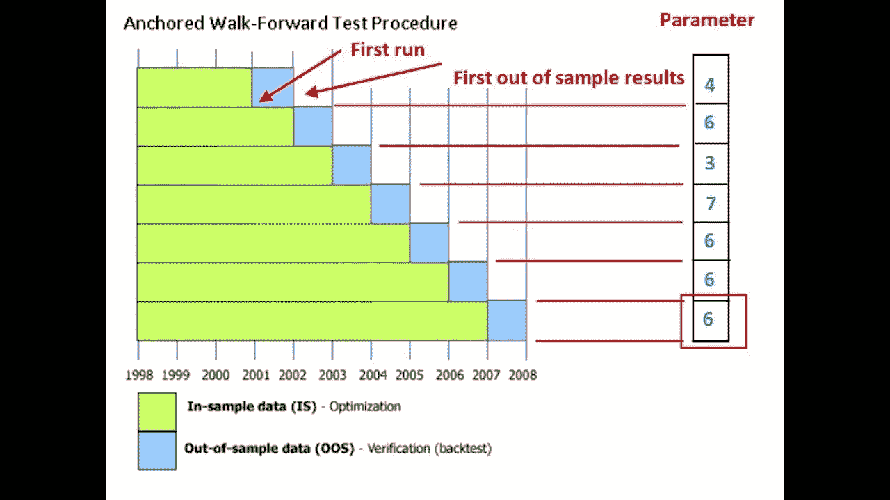
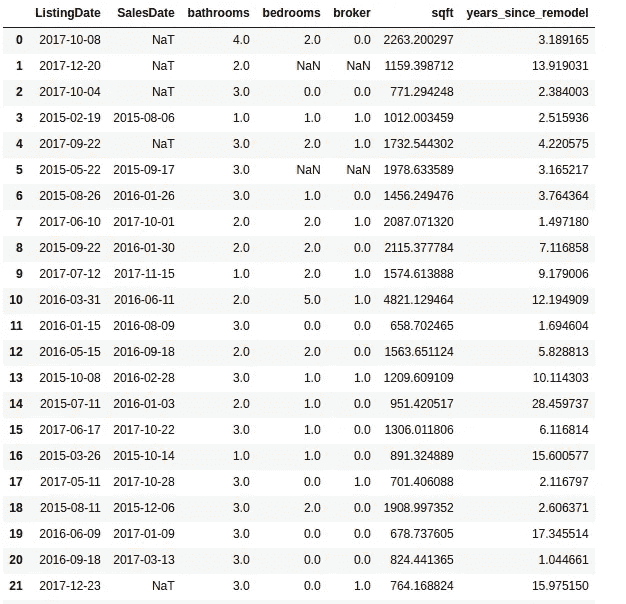
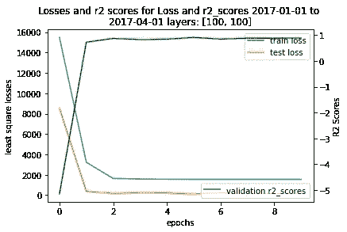
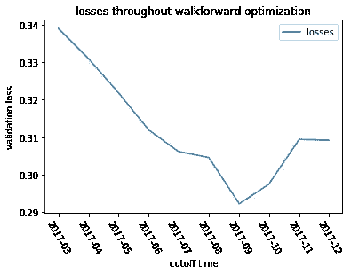
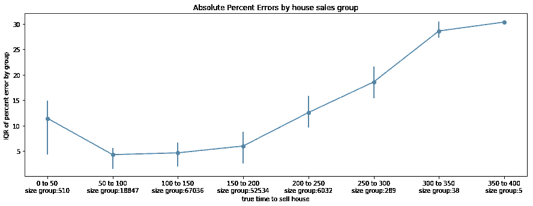
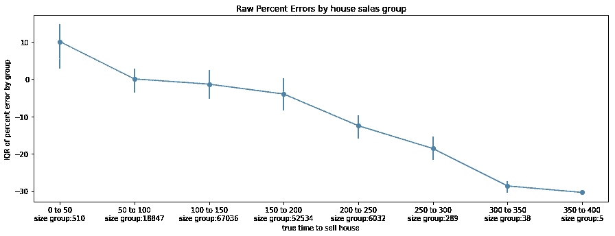

# 机器学习工程 1:房屋销售估算。

> 原文：<https://towardsdatascience.com/machine-learning-engineering-1-custom-loss-function-for-house-sales-estimation-95eec6b12457?source=collection_archive---------10----------------------->

Visualization of a Custom Loss Function

这篇博客文章将是如何作为机器学习(ML)工程师思考的第一课。我们将研究一个监督学习问题，重点是设计一个定制的损失函数。用这样的技巧思考，你会自信地获得一个入门级的 ML 工程师角色。

这篇博文假设你对现代 ML 有一个基本的了解。

非技术性的序言，请阅读[https://medium . com/@ leetandata/machine-learning-preamble-ba 69 BCA 4701d](https://medium.com/@leetandata/machine-learning-preface-ba69bca4701d)。

关于数学和数字代码的详细解释，从[https://medium . com/@ leetandata/neural-network-introduction-for-software-engineers-1611d 382 C6 aa](https://medium.com/@leetandata/neural-network-introduction-for-software-engineers-1611d382c6aa)开始

有关在 Windows 上安装 Python 进行机器学习的说明，请阅读:[https://medium . com/@ leetandata/basic-Python-setup-for-ml-for-Windows-users-aaadb 2 be 534 c](https://medium.com/@leetandata/basic-python-setup-for-ml-for-windows-users-aaadb2be534c)

# 问题介绍

眼下的问题是从模拟数据集中估算出售一套公寓所需的时间。

数据是上市日期、销售日期(如果公寓已经售出)、价格和公寓的数字特征。

## 回归快速回顾

回归将要素数据作为向量。每个数据点被定义为一些输入特征，例如关于房子的特征。回归模型使用这些特征来预测目标(它猜测 Yhat，这意味着从数据集中逼近真实的 Y 或目标)。该模型通过从数据集学习来训练自己，以最小化损失函数。

## 回到我们的具体问题

对于简单的回归问题，您的数据以包含要素 X 和目标值 y 的数据集的形式提供给您。您将数据集分为训练集和验证集，在训练集上训练模型，并在验证集上验证其性能。

公寓销售估算类似于简单的回归问题，但提出了 ML 必须考虑的四个错综复杂的问题:

*   首先，我们需要划分数据。我们将使用一些数据(称为训练数据)来训练我们的模型，并使用一些数据来验证我们训练的模型的性能。对于一般数据集，我们可以随机划分数据集。对于时间序列数据，我们可以将数据切碎，在截止日期之前对数据进行训练，并在截止日期之后对数据进行验证。这模拟了如果我们对过去进行训练，并发布它来实时预测未来，模型会做得有多好。与大多数时间序列问题相比，这对于该数据集来说很困难，因为每个样本都有两个时间戳，即上市日期和销售日期。
*   其次，我们并不总是知道正确的销售日期。对于尚未售出的公寓，我们知道它们的销售日期发生在数据集中的最后一次销售之后，但我们不知道最后一次销售是什么时候。如果有时我们只知道一个最小值而不知道真实值，我们如何创建我们的损失函数。
*   第三，我们注意到输入要素数据有缺失值。我们该怎么办？有人可能只是忘记列出卧室或浴室的数量或公寓的平方英尺。我们将探索处理这种复杂性的几种选择。
*   最后，用来评估我们模型的许多性能的最有意义的评估指标是什么？我们想使用一些标准的东西，如均方差或 T2 R2 系数，但是我们怎么能计算更大的值而不关心小的差异呢？例如，1 天和 5 天看起来差别很大，但是 81 天和 85 天应该被认为是非常准确的。在不知道还没卖出去的房子的真实价值的情况下，我们该怎么做呢？

# 1:培训/验证/测试步行前进优化

通常情况下，在机器学习中，我们会随机划分(具体数字会因问题而异)70%的数据用于训练模型，20%的数据用于验证性能，10%的数据用于测试发布性能。

我们反复地改变模型、训练和验证，直到我们的验证准确性达到最大。我们相信推广到新的看不见的数据的模型表现最好，所以我们利用在验证集上表现最好的模型。

最后，我们在测试集上评估一次，以估计我们的模型在现实世界中的推广程度。通过这种方式，我们可以构建复杂的模型来表示我们的数据，然后计算不会高估我们对其性能的估计的指标。

Walk Forward Optimization

在时间序列建模中，我们使用[前推优化](https://en.wikipedia.org/wiki/Walk_forward_optimization)，将时间序列分成许多时间截止点 T1、T2、T3 等。我们首先对 T1 之前的数据进行训练，并在 T1 和 T2 之间的时间段验证我们的性能。然后，我们将我们的训练数据集扩展到 T2，然后在 T2 和 T3 之间的时间段进行验证。因此，我们的整体验证性能指标是来自不同数据切片的平均验证性能，我们的测试集可以是数据的最后一个时间片，或者是从验证数据点中排除的不同时间片中的一些数据点。

但是，我们注意到每个时间步都有两个数据点:上市日期和销售日期。所以，如果我们训练到 T1，那么到那时我们实际上已经知道了什么？

在培训期间，我们将了解 T1 之前的所有列表。在这些公寓中，我们将隐藏 T1 之后的所有销售日期。

在验证过程中，我们需要验证在 T1 和 T2 之间售出的所有公寓，以及在 T2 之前上市但在 T1 之后才售出的所有房源。为了简化我们的验证集，我们验证了在 T1 之后销售、在 T2 之前上市的产品的性能。

以上是至关重要的，因为它允许我们使用所有可用的数据来训练和验证，但不要过于乐观，不允许我们自己欺骗和预见未来。避免数据泄露或作弊在机器学习中非常重要，因为数据泄露让我们相信我们的模型不切实际地准确。然后，我们可以发布我们的模型，并对它在新数据上的表现感到非常惊讶。

# 2:有意义的损失函数

让我们为问题提出一个合理的基线损失函数。我们关心出售公寓的时间和预测时间之间的差异，我们越是偏离，就越需要修正我们的预测。因此，我们可以提出均方误差(MSE)。但在某种程度上，如果一套公寓在 1 天内售出，而我们预测是 10 天，那么我们就比公寓在 81 年售出，而我们预测是 90 天的情况要差得多。因此，也许我们应该使用均方差百分比误差(MSPE)，其中我们根据我们预测的百分比来惩罚模型。这两者似乎都有道理，但既然我们都关心，就让我们取两者的几何平均值，并将其作为我们的损失函数，将两者都考虑在内。这不是业务可解释，但它是我们的**损失函数**，并不一定是我们的**评估度量**。我们稍后会谈到这一点。

那么，如果一套公寓卖不出去会怎么样呢？假设一套公寓在 T0 时上市，训练集截止到 T1，但该公寓在 T2 售出(或者从未售出)。在 T1，公寓仍未售出，我们假装看不到 T1 之后的未来，因此我们需要将公寓标记为“尚未售出”。那么我们如何利用这个数据点来改进我们的模型呢？

假设我们的模型预测公寓将在 T0 和 T1 之间出售。在这种情况下，我们知道模型是错误的，并且模型应该预测更大的数字，所以让我们假设在这种情况下真实值是定型数据集的结尾。

但是如果我们的模型预测的值大于 T1 呢？我们不知道这是太大还是太小，因为它正确地在我们的训练数据集结束后，所以我们不要在这种情况下给我们的模型一个损失函数。

通过这种方式，我们使用所有可用的数据，并使用有意义的损失函数优化我们的模型，以获得有商业价值的近似值，从而最小化百分比误差！

# 3:数据插补

有人忘了在我们的一些数据点上列出卧室或浴室的数量或公寓的平方英尺数。但我们是那些被随意遗忘或被有意忽略的人吗？

我们为每个特征创建额外的标志，来表示数据是否丢失，我们将这些标志输入到模型中，并填充丢失的值。

为了填充缺失的值，我们可以有一个独立的网络来学习预测值或其他自定义解决方案(这对于语言、图像或音频等结构化数据非常流行)，但对于我们的情况，让我们只手动输入日期。两种流行的方法是用所在字段的平均值替换缺失值，或者找到一些非常相似的公寓并用相似公寓的平均值替换缺失值。

我们称寻找相似的数据点为插补[K-最近邻(KNN)](https://www.ncbi.nlm.nih.gov/pmc/articles/PMC4959387/) 插补。其工作方式是，我们找到 K 个数据点，这些数据点最接近具有缺失特征的数据点。对于缺失的特征，我们取该特征的 K 个最近点值的平均值。

使用欧几里德距离来测量“最近邻”听起来很合理，但是如果一个要素的值在 0-1000 之间，而另一个要素的值在 0-1 之间呢？在这种情况下，具有大尺度的特征将比小特征更大地影响欧几里德距离。例如，x1，x2 = [600，0.1]可能比[580，0.2]更接近[590，0.9]，即使两者具有非常相似的 x1 值，而它们的 x2 值完全在范围的两端。

我们如何使所有特征对“最近邻”插补产生相似的影响？让我们通过首先缩放特征来标准化它们的影响，这样它们都具有均值 0 和标准差 1，这样每个特征对插补都有相同的影响！

# 4:评估指标

设计有意义的评估指标是任何 ML 项目最重要的任务之一。最能代表“这种模式学点商业有意义的东西”的数字有哪些？

一些工程师有一个坏习惯，坚持使用现成的指标，如均方差，或他们的预测和真实值之间的相关性。然后，他们将这些数字呈现给商业成员，这些商业成员会对这些毫无意义(理所当然)的技术术语感到沮丧。在我们的例子中，我们可以使用许多度量标准，比如时间对数的[皮尔逊相关系数](https://en.wikipedia.org/wiki/Pearson_correlation_coefficient)，但是这很难解释。

相反，让我们使用业务最简单的基线，[平均绝对百分比误差(MAPE)](https://en.wikipedia.org/wiki/Pearson_correlation_coefficient) ，它告诉我们您的预测和真实值之间的比率的平均绝对值。为了解释这一指标，0.1 的值平均表示与真实值相差 10%。值 0.2 表示与真实值的平均值相差 20%，例如与正确值的平均值相差 80%或 120%。这个度量不能是负数，0 代表完美。

但是未知的值呢？让我们用 MAPE 来表示我们知道其真实价值的值，让我们用另一个指标来表示未售出公寓中被正确归类为未售出公寓的百分比(销售日期预计超过数据集的末尾)。我们还可以通过假装在数据集的最后一天售出的公寓来替换未售出的公寓，并以此计算 MAPE，这将更容易解释，但不太准确。

## 对于评估指标，像业务人员一样思考

所以作为一个数学家，我们写了一个优化函数。接下来，我们编写了一个评估函数来构建可解释的结果。但这是理解我们表现的最有意义的方式吗？在这种情况下，答案是否定的，因为我们真的没有尝试去思考什么对我们的问题有意义。

我们计算了一个总结模型性能的指标。很棒？但是我们不应该总结的太全面！我们的数据给我们带来了影响我们性能的重要特性复杂性。一些公寓在**一周**后售出，一些在**一年**后售出。此外，一些公寓的价格高达数万**万**，一些高达数千万**万**。特别是因为我们的评估指标是误差除以实际销售时间，我们建议按实际销售时间区域对我们的准确度进行分组，并绘制这些值的平均值和[四分位间距](https://en.wikipedia.org/wiki/Interquartile_range)。

这样，我们可以问这样的问题“对于快速销售的房屋，我们大约打了 X1 折，但是对于我们将在市场上停留更长时间的房屋，我们大约打了 X2 折”。有了这些，商业人士和数学家都应该更乐意了解他们的模型是如何运行的。

# 转换点:从想法到代码

哇！以上内容很多。我们覆盖了

*   有意义的 train/val 前向优化循环
*   自定义损失函数
*   如何处理缺失的功能
*   有意义的评估指标和图形表示

我们现在已经完成了概念的提出，所以现在我们只需要实现上面的想法！

# 履行

让我们从一些导入开始，为评估指标的图像创建一个目录，并读入我们的数据集。

我们的数据在 Pandas 数据框架中，这很像 SQL 表。它的顶部如下图所示:

Pandas DataFrame Data Table

# 数据准备

现在我们都准备好了。现在让我们构建一个函数，让我们为我们的训练/测试分割切割数据。我们需要接受数据切片的可选开始日期和可选结束日期。

该函数分割整个数据集，只保留开始日期之后或结束日期之前的数据。这将有助于建立训练和验证数据集。

现在我们需要一个定标器来标准化我们的数据，为插补做准备。定标器从训练数据中学习如何归一化，并将这些归一化参数(平均值和标准偏差)应用于验证数据集。

我们还需要从我们的训练数据构建一个估算器，学习估算缺失值，并且我们需要能够将它应用于训练数据集和验证数据集。

上面的代码准备了我们模型的输入数据。

现在来说说我们的目标变量！我们的目标变量是公寓上市和售出之间的天数。当公寓尚未售出时，销售日期设置为当天，我们有一个已售出标志来表示公寓是否已经售出(我们稍后将使用这两个标志)

# 使用 Tensorflow 建模

我们的模型接受一些输入特征。它有占位符来接受每个数据点的值，售出(公寓是否售出)、x(输入要素)和 y(公寓售出前的天数)。

该模型使用神经网络([简单解释](https://medium.com/@leetandata/machine-learning-preface-ba69bca4701d)或[详细解释](https://medium.com/@leetandata/neural-network-introduction-for-software-engineers-1611d382c6aa))来预测公寓需要多长时间才能出售。然后，It 计算损失函数和评估指标，并构建优化器来最小化损失函数。

我们还创建列表来跟踪我们在整个训练过程中的表现，并计算其他损失函数，只是为了在教程中演示。

这里，我们为一个时期训练模型，这是为了将每个数据点看一次并最小化损失函数

我们通过在验证数据集上检查 MAPE 来验证我们的性能。

培训是一个时期的培训和验证我们表现的过程。我们多次调用这个过程来从数据集学习并跟踪我们的表现。

最后，让我们通过跟踪训练和验证损失，以及预测和实际情况之间的 r2 分数来可视化模型的性能。

上面生成了类似下面的图，x 轴是训练的时期，y 轴是损失和 r2 分数:

Sample of what our validation function creates

# 训练模型

太好了！现在，最后，让我们在一个训练集上进行训练，并在接下来的时间里进行验证。我们将使用上面定义的代码来分割数据集和训练模型。最后，让我们返回我们的最终性能，以便我们可以在向前优化过程中进行跟踪。

# 总结:我们做了什么？

1.  我们分割数据，

2.学会了根据训练集缩放和估算数据，

3.将缩放和估算应用于验证数据集，

4.定义我们的模型，训练我们的模型，然后

5.可视化的训练表现。

所有这些都是通过调用我们之前定义的函数来实现的。

# 向前优化

既然我们已经进行了培训和验证，让我们继续浏览数据集，在后续阶段进行培训和验证。

最后，让我们直观地了解一下整个过程中的前进优化性能。

这产生了关于前推优化切割的最终验证性能的曲线。

最后，下面是从第一个到最后一个截止点运行完整模型的代码，如代码部分开头所定义的。

## **按组标绘性能**

现在我们选择按销售持续时间分组，看看我们的误差百分比在组内如何变化。为了说明我们想要的最终输出(我们将在下面得到),我们提供了下面的图表:

这些图像是通过以下函数调用绘制的，每行一个图像

最后，在下面，我们给出了生成上述图像的代码。

# 总结

我们做到了！我们使用训练/验证分割来准备数据集，标准化输入数据，输入缺失值，将模型拟合到训练数据集，在验证数据集上进行验证，并在向前优化循环中完成整个结构！呜！

因此，现在我们已经准备好并且可行，我们可以在我们的完整数据集上训练我们的模型，并将其发布到世界上，我们对它在未来分类中的表现有一个预期(根据上述曲线，它的平均绝对百分比误差约为 30%)。

前言如果你有点迷路了，浏览了这篇文章，忘记了我们为什么要用机器学习以及我们在说什么:[https://medium . com/@ leetandata/Machine-Learning-前言-ba69bca4701d](https://medium.com/@leetandata/machine-learning-preface-ba69bca4701d)

数学重磅跟进:[https://medium . com/@ leetandata/neural-network-introduction-for-software-engineers-1611d 382 C6 aa](https://medium.com/@leetandata/neural-network-introduction-for-software-engineers-1611d382c6aa)

***本帖综合来源:***[https://github . com/leedtan/LeeTanData/blob/master/SimpleML _ house sales/house predictions . ipynb](https://github.com/leedtan/LeeTanData/blob/master/SimpleML_HouseSales/HousePredictions.ipynb)