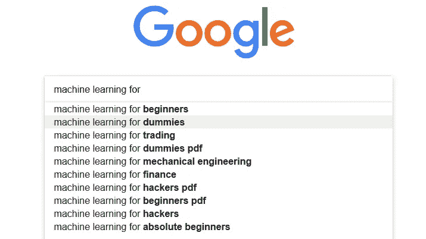
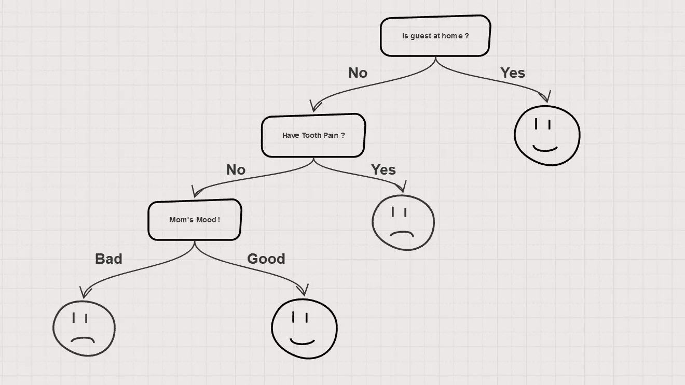

# 面向所有人的机器学习

> 原文：<https://towardsdatascience.com/machine-learning-for-everyone-46731056d0e6?source=collection_archive---------10----------------------->

What does that mean ?

这个标题回避了问题"*那是什么意思？*”。好吧，机器学习这个术语可能对你来说很陌生，但是人工智能怎么样，我打赌你听说过。首先，我们只能说机器学习是人工智能的一个子集，它已经在人工智能领域取得了很多进展。用关键词“机器学习”在谷歌上快速搜索会得到以下建议

machine learning for …

我就开门见山了。这是一系列的帖子，涵盖了**机器学习**最基本的算法之一，即**决策树。**现在，在你认为这是一个点击诱饵之前，让我告诉你这篇文章根本不会涉及任何**数学**！

# 管他呢，我为什么要看？

**人工智能**已经开始改变人类的日常生活方式。我们在网上出现的每一点都与一个人工智能元素有关。智能手机，智能手表，智能家居设备，语音助手([谷歌助手](https://assistant.google.com/)， [Siri](https://www.apple.com/in/ios/siri/) ， [Cortana](https://www.microsoft.com/en-in/windows/cortana) 等)都写满了 AI。

像 [Alexa](https://www.youtube.com/watch?v=UOEIH2l9z7c) 这样的语音助手可以在你说话时理解句子，并做出智能回答，并不断适应你的需求。现在，如果你对它们是如何工作的一点也不好奇，那么老实说，你不必跟着读下去。然而，如果你是，这是一个完美的开始。

人工智能是一个更广泛的目标，而机器学习是实现这一目标的手段。它是使用数据来学习行为和做出决策的方法的设计和研究。**决策树**是一种基本的 ML 算法。

这篇文章试图让你怀疑你在日常生活中一直在使用 ML 概念，尽管是潜意识的。

# 如何最好地阅读这篇文章

只是坐下来放松一下。这篇文章非常轻松，完全不涉及数学。事实上，我讲了一个 8 岁小孩想要更多巧克力的故事。感兴趣吗？跟着读。

Enough said, let’s get to it.

# 简的日记

简只是另一个聪明的 8 岁孩子，她喜欢'*'海绵宝宝'*，更重要的是 ***巧克力。*** 她每天都去她妈妈**玛丽**那里要巧克力，有时要不止一块。她母亲有时给她巧克力，有时不给*【没有人应该被拒绝巧克力* ☹️】。

简是一个好奇的女孩。她想提前知道她妈妈是否会答应她要巧克力的请求，甚至在问她之前。不知道该怎么办，她去找她的父亲**‘汤姆’**描述她的情况。汤姆被他宝贝女儿的好奇心所激发，想了一会儿。过了一段时间，他打电话给简，并送给她一本日记。他让简写下她向母亲要巧克力时的观察。

> 汤姆说“简，把你 10 天的观察记录在日记里，然后我们再进一步讨论”

Let’s do it!

# 第十一天

第十一天，简带着她的小日记本跑来找汤姆。她坐在她父亲旁边的床上说

> 我做到了，爸爸

“太好了”，汤姆回答道，然后开始打开日记本。

> 让我们看看你这里有什么

1.  早上我问妈妈要一块巧克力，她说不要。
2.  当我得到一块巧克力时，已经是晚上了。她似乎心情很好。
3.  梅姨走过来时，我要了一块巧克力。**明白了**。小菜一碟。
4.  甚至在我今天要巧克力之前，她就说不要。她很刻薄
5.  我牙痛，所以妈妈带我去看牙医。今天没有巧克力。
6.  由于牙痛，我甚至没有要巧克力。**没有巧克力**。
7.  她希望她能给我巧克力。但是我的牙齿会疼，所以不能吃巧克力。不过她很开心。
8.  大卫叔叔今天来了。尽管牙疼，我今天还是吃了一块巧克力。我猜是小狗脸起了作用。
9.  我早上又要了一块巧克力。为什么妈妈这么严格。**不凉**。
10.  过了这么多天，我今天看到妈妈唱歌了。我认为要一块巧克力是个好主意。**明白了**，耶。

> “日记写得很好，简”，汤姆说。

汤姆翻看日记，做了一个小表格，让简更清楚地查看数据。

汤姆:我看了你的日记，并根据你的观察做了一个简单的表格。你觉得我做的表对吗？

简:是的，爸爸。我觉得不错。

汤姆:现在让我们根据你的观察，试着想一想我们是否能预测得到巧克力的可能性。

简:好的，爸爸。

汤姆:那么告诉我，你认为你妈妈什么时候很有可能给你糖果。

**简:**爸爸，这很简单。**每当有客人来家里，妈妈会按要求给我一块巧克力。**

汤姆:太棒了。你的观察是正确的。现在让我们制作一个新的表格，去掉那些观察值。

汤姆:现在告诉我，她什么时候可能不给你巧克力？

简:我不确定爸爸，但是我想每次我牙痛的时候她都不会给我巧克力。

汤姆:**你说得对，简，虽然有一次她在你牙痛的时候给了你一块巧克力，但是在这种情况下，她很可能不会给你任何巧克力。**

汤姆:现在我们来看看更新后的表格。我将删除您牙疼并且没有吃巧克力时的所有观察结果。

简:这个看起来不错。哦，等等，我想到了。现在我得看看妈妈的情绪对她给我一块巧克力的影响。

汤姆:很好，继续努力。

简:所以看起来每当妈妈心情好的时候，她都会给我一块巧克力。

汤姆:太棒了，简，太棒了。现在，如果你能总结出你所学到的东西，我会给你一块巧克力。

简:当有客人来访时，我可能会得到一块巧克力。但是，如果没有客人，那就要看两件事了。首先，如果我牙痛，我很可能得不到任何巧克力。第二，如果我有一颗快乐的牙齿，那么就看妈妈给我一块巧克力的心情了。对不对，爸爸。

汤姆:来，拿着你的巧克力！

所以简是吃着巧克力长大的，因为她从 8 岁起就知道什么时候向妈妈要巧克力，而且成功率很高。

# 但是决策树在哪里呢？

好吧好吧，让我们用简的总结做一个决策树。

# 摘要

如果你一直读下去，你会发现决策树并没有那么糟糕。考虑到我们有一些数据，它们很容易建立。

我倾向于认为，人类的很多决策都是由这样的决策树或经验法则来决定的，这些决策树或经验法则是我们多年来根据各种经验建立起来的。例如，我们有一个经验法则，不要把手放在火里，因为我们很可能会受伤。

所以你看，机器学习只是在更大范围内玩。这是从更大的数据中挖掘意义，有更多的变量，解决的问题比“简会得到巧克力吗”复杂得多

> 你仍然不相信机器学习吗？