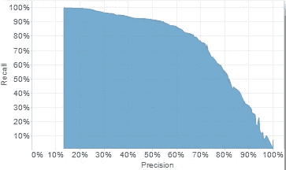

# 产品经理的机器学习第二部分——ML 技能

> 原文：<https://towardsdatascience.com/machine-learning-for-product-managers-part-ii-ml-skills-ce7c3cee3246?source=collection_archive---------1----------------------->

这是面向产品经理的机器学习系列的三个部分的继续。

[的第一个注解](/machine-learning-for-product-managers-part-i-problem-mapping-5436132c3a6e)关注的是什么问题最适合应用机器学习技术。这篇笔记将深入探讨在构建利用机器学习的产品时，项目经理需要哪些**额外技能**

正如我在第一部分中提到的，无论你是否在机器学习驱动的解决方案领域工作，项目经理所需的核心技能集都不会改变。产品经理通常使用五种核心技能——客户同理心/设计印章、沟通、协作、商业战略和技术理解。从事 ML 工作将继续利用这些技能。一个确实得到更多延伸的领域是技术理解，特别是机器学习领域。这并不是说，除非你有深厚的技术功底，否则你就不能成为 ML 项目经理。但是你确实需要了解机器学习系统是如何运作的，以便做出好的产品决策。你可以依靠你的工程师，或者通过书籍和课程巩固你的知识，但是如果你对系统没有很好的理解，你的产品可能会导致不好的结果。

# 算法有局限性

机器学习中使用的每种算法或技术都是针对某项任务进行优化的，并不总是能够考虑到现实世界情况所需要的各种细微差别。 **B *能够理解算法的影响和局限性，有助于你理解客户体验中存在的差距，并通过产品设计或选择其他 ML 技术来解决这些差距*** *。如果你是这个领域的项目经理，这是绝对必要的技能。* 我举几个例子吧。

## **数据偏差**

机器学习算法从数据中学习模式。因此，输入算法的数据质量决定了产品的成功。构建机器学习产品的首要挑战之一是确保数据代表将使用该产品的用户。

还记得谷歌把黑人的照片贴上大猩猩的标签吗？

***确保在数据中代表所有用户是产品成功的基础。***

有时，这些偏差可能存在，不是因为数据收集的错误，也是因为数据可用性的偏差。例如，当 IBM Watson 被训练学习语言时，它被输入了城市字典，它学会了说脏话。预期的结果是学习“礼貌”的人类语言，但相反，因为数据也有脏话，所以机器也学习了。因此，在重新训练 Watson 之前，需要清理数据。

再比如。与发展中国家相比，发达国家接入互联网的用户可能更多。因此，如果你建立模型，比如说基于互联网搜索的搜索行为，来自发达经济体的用户分布会更高。因此，当你对搜索模式进行建模时，对于那些不经常搜索的用户来说，比如说印度的首次上网用户，它可能不是很准确。认识到数据中的偏差将有助于你意识到这些算法可能对用户体验产生的意想不到的影响。

## **精确度和召回率的权衡**

最近，我和一个团队进行了交谈，这个团队和我的团队使用完全相同的预测产品，但是两个团队的目标不同。该产品提供了对不良行为的预测。我的团队关心的是确保只有坏演员，而没有好演员被系统过滤掉。我们希望每个优秀的演员都能使用这个功能。所以，我们关心精确度。另一个团队关心的是不允许坏演员使用该产品，即使这意味着一些好演员也被限制使用该产品。所以，他们关心回忆。[精确和召回](https://en.wikipedia.org/wiki/Precision_and_recall)总是相互权衡。如果你提高精确度，你的回忆就会降低，反之亦然。

弄清楚你的用例是否需要更强调精确性或回忆性，会改变工程师选择的模型的调整。因此，仔细考虑需要什么来解决用户问题是很重要的。类似于下图的权衡曲线用于检查与您正在使用的模型相关的指标。

Precision-Recall curve

根据问题的要求，模型可以调整到这个前沿的任何地方。有时，如果你需要改变边界本身，那么你可能需要选择不同的机器学习模型(这可能会带来其他限制)

## **冷启动问题**

机器学习算法需要数据才能进行模式识别。冷启动是一个用于汽车的术语，指发动机处于冷态，汽车可能无法发挥最佳功能。然而，一旦引擎启动并运行，你就可以开始了。类似地，当算法没有关于用户或物品的任何数据时，会出现冷启动问题，导致次优体验。

冷启动问题有两种类型

***基于用户的*** :这是用户第一次使用你的产品，机型对用户没有信号。以网飞为例。网飞根据您的观看历史向您推荐要观看的节目和电影。但是，你第一次使用网飞时，它没有关于你观看行为的数据，因此，算法很难预测你的观看偏好。

这个问题可以用几种方法解决。几个常见的是

1.  你提示用户从随机选择中选择几部最喜欢的电影来给你数据
2.  您可以使用关于用户的一些基本信号来提供最佳推荐，比如查看用户从哪里登录，并假设用户可能喜欢该位置的其他用户喜欢的电影。例如，如果您从加州登录，您可能会显示其他加州用户观看的前 10 个节目
3.  策展。你可能有一个手动策划的黄金集，比方说有史以来最受欢迎的电影，你可以作为一个开始体验来展示。

***基于项目的*** :这是当一个项目第一次被提供给你的用户，很难挑选给哪些用户看的时候。例如，当一部新电影进入网飞目录时，决定向谁推荐这部电影是很困难的，尤其是在这部电影的元数据很少的情况下。类似于基于用户的冷启动问题，这可以通过许多技术来解决。

1.  人工注释:你可以让人工用元数据来注释这个项目，给你关于它是什么的信号。例如，你可以把一部新电影添加到目录中，然后由一个专家小组对其进行分类。根据分类，您可以决定这部电影应该向哪一组用户播放。

2.算法上:通俗地说，算法技术的工作原理是向许多用户展示新项目，以了解他们的偏好，从而获得更多关于谁更喜欢这个项目的信号，并缩小用户群。如果你有兴趣深入这个话题，你可以看看这本关于[多臂强盗算法](https://en.wikipedia.org/wiki/Multi-armed_bandit)的入门书。

在异常检测中，冷启动问题会引发许多错误警报。例如，当一名新员工正在访问数据库系统时，ML 系统可能会认为他/她是入侵者，并可能发出假警报。当您在国外旅行或进行大额购物时，可能会遇到这种情况。渡过这一难关的方法是创建收集反馈(在行动之前或之后)的机制，以纠正误报，这将我带到下一节。

## **反馈回路**

由于算法并不完美，它们可能会做出错误的预测和模式识别。您需要在您的产品中创建一些机制来为算法提供反馈，这样它们就可以随着时间的推移提高准确性。这些反馈循环可能就像记录负面信号一样简单，例如，用户浏览新闻标题的速度与阅读时间。当算法出错时，你甚至可以通过让用户介入来提供更明确的反馈循环——拇指向下、划掉等等。或者当算法做得很好，允许用户竖起大拇指，分享，保存等。

## **探索 vs 利用**

让我们以上面网飞的例子来说明这个挑战。比方说，网飞的算法已经计算出我喜欢看足球。所以，我在我的推荐中看到与足球相关的电影、节目和纪录片。我看了一些，现在网飞向我展示了更多与足球相关的内容，这种循环还在继续。这里的算法是**利用**他们可用的信号——我喜欢足球，因此优化了它。然而，我对足球之外的许多内容很感兴趣。我也喜欢技术，但是网飞没有给我看任何与技术相关的内容。这被称为过滤泡沫，最近在媒体中。

为了给用户提供一个平衡的内容视图，系统应该定期向用户介绍那些偏好信号较少的项目，允许用户**探索**。新内容的引入可以是随机的(给我看几个瑜伽、美食、野生动物、科技节目)，也可以是习得的(比如其他更喜欢足球的用户，更喜欢美食纪录片)。

以上并不是算法所有局限性的详尽列表，因为随着新算法的出现，可能会有新的漏洞暴露出来。你可能会问——我怎么可能理解算法之间的差距，尤其是如果你不理解算法本身。这里是你戴上首相帽的地方。

1.  **向您的工程团队提供清晰的用例**。与您的工程团队一起浏览这些用例，解释这些用例的预期体验。这些用例应该包括产品的主要、次要和负面人物角色。一旦您的模型准备就绪，评估模型输出是否与这些用例的预期体验相匹配。
2.  **注重数据收集**。询问有关如何清理和组织数据的问题。这些数据能代表你的用户群吗？
3.  **使用产品解决方案填补空白。**如果模型输出不符合您的预期，找出您可以做什么来提高模型解释这些用例的能力，或者这些用例是否扩展了模型的机器学习能力，然后创建产品解决方案、过滤器等。来填补这些空白。