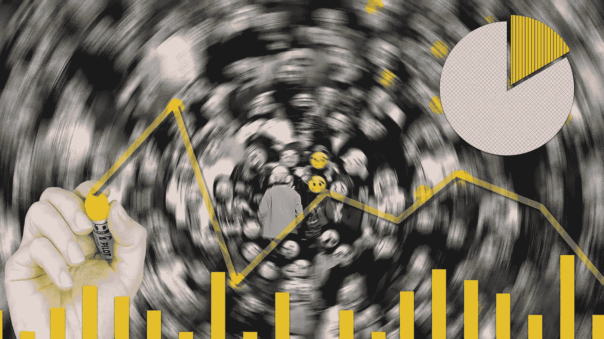

# 产品经理的机器学习第三部分——注意事项

> 原文：<https://towardsdatascience.com/machine-learning-for-product-managers-part-iii-caveats-79803a7548ef?source=collection_archive---------4----------------------->

这是面向产品经理的机器学习系列的三个部分的继续。

[的第一个注解](/machine-learning-for-product-managers-part-i-problem-mapping-5436132c3a6e)关注的是什么问题最适合应用机器学习技术。[的第二个注解](/machine-learning-for-product-managers-part-ii-ml-skills-ce7c3cee3246)谈到了当构建机器学习产品时，一个项目经理需要哪些额外的技能。本笔记将重点讨论**在构建 ML 产品时有哪些常见错误。**

这篇笔记的目的是向 ML 水平有限的人提供对常见陷阱的一般理解，以便您可以就这些问题与您的数据科学家和工程师进行对话。我不会在本说明中深入探讨这些问题。但是，如果你有问题，请评论。如果对这些领域中的一个更感兴趣，我可能会写一个单独的说明。

## **数据问题**

**无数据**:这似乎是显而易见的(甚至可能很好笑，我在一个关于 ML 的博客上提到了它)。然而，当我经营我的公司 PatternEQ 时，我们在那里向公司销售 ML 解决方案，我惊讶地发现有这么多公司想要使用 ML，并建立了“智能软件”战略，但没有任何数据。*没有数据就无法使用机器学习。*您要么需要贵公司收集的数据，要么可以通过与拥有数据的其他公司合作来获取公共数据或积累数据。没有数据，就没有 ML。句号。(在评估许多人工智能初创公司声称的工作时，这也是一个很好的过滤器。这些初创公司声称他们有一项很酷的人工智能技术，但没有数据来运行这些技术。)

**小数据**:今天发布的大多数 ML 技术都专注于大数据，并且倾向于在大数据集上工作良好。您也可以在小数据集上应用 ML，但是您必须非常小心，以便模型不受离群值的影响，并且您不依赖于过于复杂的模型。将 ML 应用于小数据可能会带来更多的开销。因此，应用统计技术而不是最大似然法来分析小数据集是非常好的。例如，大多数临床试验往往样本量较小，并通过统计技术进行分析，这些见解完全有效。

**稀疏数据**:有时候即使你有很多数据，你实际可用的数据可能还是稀疏的。比方说，在亚马逊上，你有数以亿计的购物者和数以千万计的商品可以购买。每个购物者只购买几百万种产品中的几百种，因此，你对大多数产品没有反馈。如果没有人或很少用户购买，这就使得推荐一个产品变得更加困难。当使用稀疏数据集时，您必须仔细考虑您所使用的模型和工具，因为现成的技术将提供低于标准的结果。此外，稀疏数据集的计算效率较低，因为大部分数据集是空的。

**高维数据:**如果你的数据有很多属性，即使是这些属性，模型也很难消费，它们也会占用更多的计算和存储资源。高维数据将需要被转换到小维空间，以便能够用于大多数 ML 模型。此外，在丢弃维度时，您需要小心，以确保您没有丢弃信号，而只是丢弃了冗余的维度。这就是特性选择非常重要的地方。

知道哪些维度对你想要的结果真正重要，这既是直觉的问题，也是统计学的问题。项目经理应该参与到与工程师/数据科学家的特性选择讨论中。这就是产品直觉发挥作用的地方。例如，假设我们试图预测一个视频有多好，虽然你可以通过查看用户观看了多少视频来了解视频的参与度，但你通过 UX 研究发现，用户可能会在视频播放时打开一个标签并切换到另一个标签。因此，观看时间与质量并不完全相关。因此，我们可能希望包括其他功能，如在播放视频时标签中是否有任何活动，以真正了解视频的质量。

**数据清洗**:你不能只是使用现成的数据，然后应用一个模型。ML 的成功很大程度上取决于数据的质量。就质量而言，我不仅仅指它的功能有多丰富，还指它清理得有多好。是否移除了所有异常值，是否对所有字段进行了规范化，数据中是否存在坏字段和损坏的字段-所有这些都可能决定模型的成败。就像他们说的，垃圾进垃圾出。

## **配合问题**

**过拟合**

为了解释过度拟合，我要讲一个有趣的故事。在 2007 年金融危机期间，出现了一次量化宽松崩盘。本来不应该关联的事件，结果却关联了，很多被认为不可侵犯的假设都被违背了。算法出了问题，三天之内，量化基金积累了巨大的损失。

2007 年金融危机期间，我在一家名为 D.E.Shaw 的量化对冲基金担任工程师。当时，D.E. Shaw 遭受的损失相对低于其他量化基金。为什么？其他量化基金较新，它们的算法是根据 2007 年之前的数据训练的，这些数据从未出现过下跌。因此，当价格开始暴跌时，模型不知道如何反应。另一方面，D.E. Shaw 在 1998 年曾面临俄罗斯卢布的类似暴跌。D.E. Shaw 也遭受了损失，但自那以后，它的算法一直在进行校准，以预测这种情况。因此，它的算法不会像其他公司那样崩溃。

这是一个过度拟合的极端情况。通俗地说，这些模型是针对后见之明而优化的，而不是针对远见。竞争对手的量化模型是基于只有在股市表现良好时才成立的假设进行训练的，因此，当崩盘发生时，他们无法预测正确的结果，最终做出错误的决定，从而导致更多的损失。

如何避免这种情况？确保您可以在各种数据上测试您的模型。此外，仔细看看你的假设。如果经济发生变化，用户行为发生变化，它们还会成立吗？这是我不久前写的一篇文章，它更多地讨论了管理假设的话题。

**欠适**

当您的模型对于它试图学习的数据来说过于简单时，会导致拟合不足。比方说，你试图预测购物者是否会购买蛋糕粉。蛋糕粉是可以自由购买的。诸如可支配收入、蛋糕粉价格、附近的竞争对手等因素。会影响预测。但是，如果您不考虑这些经济因素，如就业率、通货膨胀率以及其他杂货店的增长，而只关注 Safeway 内的购物行为，您的模型将无法准确预测销售额。

如何避免这种情况？这就是产品/客户直觉和市场理解派上用场的地方。如果你的模型表现不好，问问你是否已经收集了准确理解问题所需的所有数据。您能否从其他来源添加更多数据，以帮助更好地了解您试图建模的潜在行为？

## **计算成本**

构建 ML 产品时，一个被忽视的领域是机器学习的计算开销有多大。通过 AWS 和 Azure 等服务，你可以引导和建立机器学习能力。然而，在规模上，你需要做艰苦的数学计算，你愿意承担多少计算成本来为你的用户提供机器学习功能。基于成本，您可能需要权衡预测的质量。例如，您可能无法存储关于您的产品的所有数据。或者您可能无法提供最新的建议，不得不提前预计算，等等。了解您的工程团队如何权衡计算成本与 ML 精度/召回率等。将帮助您了解产品质量是否受到影响。