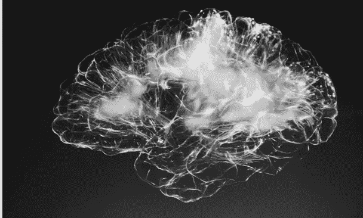
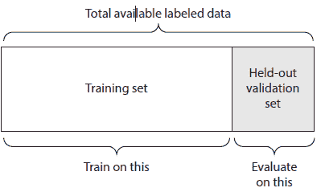
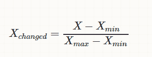
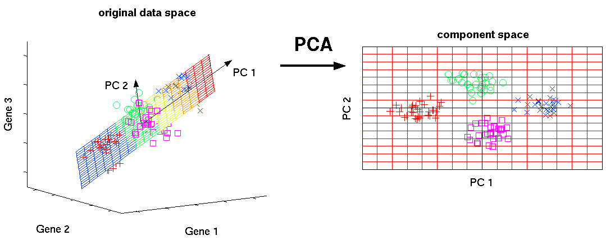
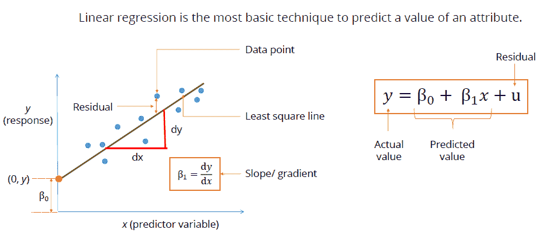
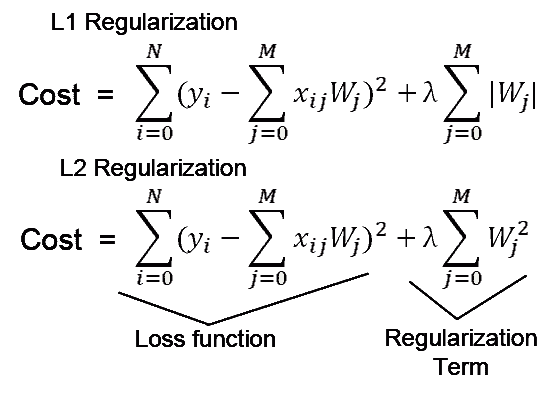
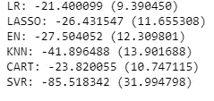
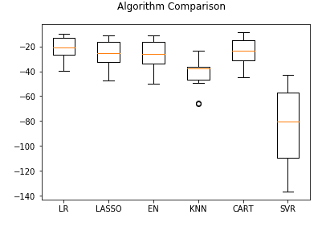
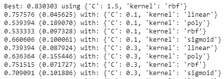

# 如何从零开始开发机器学习模型

> 原文：<https://towardsdatascience.com/machine-learning-general-process-8f1b510bd8af?source=collection_archive---------0----------------------->

在本文中，我们将深入研究开发机器学习模型的过程是如何完成的。将会有很多概念被解释，我们将会把其他更具体的概念留到以后的文章中。

具体来说，本文将讨论如何:

*   充分定义我们的问题(目标、期望的产出……)。
*   收集数据。
*   选择衡量成功的标准。
*   设置评估协议和可用的不同协议。
*   准备数据(处理缺失值、类别值……)。
*   正确分配数据。
*   区分过度适配和适配不足，定义它们并解释避免它们的最佳方法。
*   模型如何学习的概述。
*   什么是正则化，什么时候使用正则化比较合适。
*   开发一个基准模型。
*   选择一个合适的型号，并调整它以获得最佳性能。



Picture from [Unsplash](https://unsplash.com/photos/tEVGmMaPFXk)

# **解决机器学习问题的通用工作流**

# **1。恰当地定义问题**

首先，也是要做的最重要的事情之一，是找出什么是输入和预期输出。必须回答以下问题:

*   主要目标是什么？我们试图预测什么？
*   目标特征是什么？
*   输入数据是什么？有吗？
*   我们面临着什么样的问题？二元分类？聚类？
*   预期的改善是什么？
*   目标特征的当前状态是什么？
*   如何测量目标特征？

不是每个问题都可以解决，直到我们有了一个工作模型我们才可以做出某些假设:

*   给定输入，可以预测我们的输出。
*   我们现有的数据足以了解投入和产出之间的关系

请记住，机器学习只能用于记忆训练数据中存在的模式，因此我们只能识别我们以前见过的模式。当使用机器学习时，我们假设未来会像过去一样，但这并不总是正确的。

# 2.收集数据

这是机器学习模型真正发展的第一步，收集数据。这是一个关键的步骤，将级联模型有多好，我们得到的数据越多越好，我们的模型将表现得越好。

有几种收集数据的技术，比如 web 抓取，但是它们超出了本文的范围。

典型地，我们的数据将具有以下形状:


Table by Author

*注意:上表对应的是著名的 boston housing 数据集，这是一个经典的数据集，经常用于开发 siemple 机器学习模型。每行代表一个不同的波士顿社区，每列表示该社区的一些特征(犯罪率、平均年龄等)。最后一列表示该社区的房价中值，它是目标值，是将其他值考虑在内进行预测的值。*

# 3.选择衡量成功的标准:

彼得·德鲁克是哈佛大学的老师，也是《高效的管理者和自我管理》一书的作者，他有一句名言:

“如果你不能衡量它，你就不能改进它”。

如果你想控制某样东西，它应该是可以观察到的，为了取得成功，有必要定义什么是成功:也许是精确？准确性？客户保持率？

这个衡量标准应该与手头业务的更高层次目标直接一致。这也与我们面临的问题直接相关:

*   回归问题使用某些评估指标，如均方差(MSE)。
*   分类问题使用精度、准确度和召回率等评估指标。

在接下来的文章中，我们将深入探讨这些指标，考虑到所面临的问题，什么是最适合使用的，并学习如何设置它们。

# 4.设置评估协议

一旦目标明确，就应该决定如何衡量实现目标的进展。最常见的评估协议有:

## 4.1 维护延期验证集

这种方法是将数据的一部分分离出来作为测试集。

该过程将是用剩余部分的数据训练模型，用验证集调整其参数，最后在测试集上评估其性能。

将数据分成三部分的原因是为了避免信息泄露。这种方法的主要不便之处在于，如果可用数据很少，验证和测试集将包含很少的样本，以至于模型的调整和评估过程将无效。



Figure by Author

## 4.2 K 倍验证

K-Fold 包括将数据分成 K 个大小相等的分区。对于每个分区 I，用剩余的 K-1 个分区训练模型，并在分区 I 上对其进行评估

最终得分是获得的 K 分的平均值。当模型的性能明显不同于训练测试分割时，这种技术特别有用。


Figure by Author

## 4.3 带洗牌的迭代 K 倍验证

当可用数据很少，并且需要尽可能精确地评估模型时，这种技术特别有用(这是 Kaggle 竞赛的标准方法)。

它包括多次应用 K-Fold 验证，并且每次在将数据分成 K 个分区之前对其进行洗牌。最终分数是每次 K 倍验证结束时获得的分数的平均值。

这种方法在计算上非常昂贵，因为训练和评估模型的数量将是 1x K 倍。其中 I 是迭代次数，K 是分区数。

*注:在选择评估协议时，谨记以下几点至关重要:*

*   *在分类问题中，训练和测试数据都应该是具有代表性的数据，所以我们应该在分割数据之前对其进行洗牌，以确保它覆盖了数据集的整个范围。*
*   *当试图根据过去预测未来时(天气预测、股票价格预测……)，数据不应该被打乱，因为数据的顺序是一个至关重要的特征，这样做会造成时间上的泄露。*
*   *我们应该经常检查我们的数据中是否有重复，以便删除它们。否则，冗余数据可能会同时出现在训练集和测试集中，导致我们的模型学习不准确。*

# 5.准备数据

在开始训练模型之前，我们应该以一种可以输入机器学习模型的方式转换我们的数据。最常见的技术有:

## 5.1 处理缺失数据

在现实世界的问题中，丢失数据样本的某些值是很常见的。这可能是由于数据收集的错误、调查中的空白、测量不适用等等

缺失值通常用“NaN”或“Null”指示器表示。问题是大多数算法不能处理那些丢失的值，所以我们需要在将数据输入模型之前处理它们。一旦确定了它们，有几种方法可以处理它们:

1.  排除具有缺失值的样本或特征。(我们冒着删除相关信息或过多样本的风险)
2.  输入缺失值，使用一些预建的估计器，如 scikit learn 的 import 类。我们将拟合我们的数据，然后转换它来估计它们。一种常见的方法是将缺失值设置为其余样本的平均值。

## 5.2 处理分类数据

当处理分类数据时，我们使用序数和名词特征。有序特征是可以排序的分类特征(*布料尺寸:L < M < S* )。而名义特征并不暗示任何顺序(*布料的颜色:黄色、绿色、红色*)。

处理序数和名词性特征的方法有:

*   **映射顺序特征**:为了确保算法正确解释顺序特征，我们需要将分类字符串值转换成整数。我们经常会手动进行这种映射。例如:L:2，M:1，S:0。
*   **编码名义类别标签**:最常见的方法是执行一键编码，包括为名义特征列中的每个唯一值创建一个新的虚拟特征。示例:在颜色列中，如果我们有三个类:黄色、红色、绿色，并执行一次性编码，我们将得到三个新列，每个唯一的类一个。那么，如果我们有一件黄色衬衫，它将被采样为:黄色= 1，绿色= 0，红色= 0。这样做是为了确保算法的良好性能，因为它们在处理稀疏矩阵(低密度矩阵，具有许多 0 值)时更有效。


Figure by Author

## 5.3 特征缩放

这是预处理阶段的关键步骤，因为大多数机器学习算法在处理相同比例的特征时表现得更好。最常见的技术有:

*   归一化:是指将要素重新缩放到范围[0，1]，这是最小-最大缩放的一种特殊情况。为了标准化我们的数据，我们只需对每个要素列应用最小-最大缩放方法。



Figure by Author

*   标准化:它包括使特征列以平均值 0 为中心，标准偏差为 1，以便特征列具有与标准正态分布相同的参数(零平均值和单位方差)。这使得学习算法更容易学习参数的权重。此外，它保留了关于离群值的有用信息，并使算法对它们不太敏感。


Figure by Author

## 5.4 选择有意义的特征

正如我们将在后面看到的，导致机器学习模型过度拟合的主要原因之一是因为我们的数据中存在冗余，这使得模型对于给定的训练数据来说过于复杂，并且无法对看不见的数据进行很好的概括。

避免过度拟合的一个最常见的解决方案是降低数据的维数。这通常是通过主成分分析(PCA)减少数据集的特征数量来实现的，PCA 是一种无监督的机器学习算法。

PCA 根据特征之间的相关性识别数据中的模式。这种相关性意味着我们的数据中存在冗余，换句话说，数据的某些部分可以用其他部分来解释。

这种相关数据对于模型恰当地学习其权重并不重要，因此可以将其移除。可以通过直接删除某些列(特征)或者通过合并一些列并获得保存大部分信息的新列来删除它。我们将在以后的文章中更深入地探讨这种技术。



Figure by Author

## 5.5 将数据分成子集

一般来说，我们将把数据分成三部分:训练集、测试集和验证集。我们用训练数据训练我们的模型，用验证数据评估它，最后，一旦它可以使用，就用测试数据最后一次测试它。

现在，提出以下问题是合理的:为什么不只有两套，培训和测试？那样的话，过程就简单多了，只需要在训练数据上训练模型，在测试数据上测试就可以了。

答案是，开发一个模型包括调整它的配置，换句话说，为它们的超参数(不同于模型的参数——网络的权重)选择某些值。这种调整是通过从验证集得到的反馈来完成的，本质上是一种学习形式。

最终目标是该模型可以很好地对未见过的数据进行归纳，换句话说，根据在训练和验证时调整的内部参数，从新数据中预测准确的结果。

## **a)学习过程**

通过研究一种最简单的算法:线性回归，我们可以更深入地了解学习过程是如何完成的。

在线性回归中，我们被给定一些预测变量(解释变量)和一个连续的响应变量(结果)，我们试图找到这些变量之间的关系，使我们能够预测一个连续的结果。

线性回归的一个例子:给定 X 和 Y，我们拟合一条直线，使用一些方法估计样本点和拟合直线之间的系数(如普通最小二乘法和梯度下降),使距离最小化。然后，我们将使用学习到的截距和斜率(形成拟合线)来预测新数据的结果。



Figure by Author

直线的公式为 *y = B0 + B1x +u* 。其中 *x* 为输入， *B1* 为斜率， *B0* 为 y 截距， *u* 为残差， *y* 为位置 *x* 处的线值。

可用于训练的值是 *B0* 和 *B1* ，它们是影响线位置的值，因为仅有的其他变量是 x(输入)和 y，即输出(不考虑残差)。这些值( *B0* 和 *B1* )是预测函数的“权重”。

这些权重和其他称为偏差的参数将作为矩阵排列在一起(权重为 *W* ，偏差为 *b* )。

训练过程包括为每个训练矩阵初始化一些随机值，并尝试使用初始随机值预测输入数据的输出。开始时，误差会很大，但是将模型的预测与正确的输出进行比较，模型能够调整权重和偏差值，直到有一个好的预测模型。


Figure by Author

重复该过程，一次一个迭代(或步骤)。在每次迭代中，初始的随机线向理想的和更精确的线移动。

## b)过度装配和装配不足

当考虑模型的训练时，最重要的问题之一是优化和推广之间的紧张关系。

*   优化是调整模型以在训练数据上获得最佳性能的过程(学习过程)。
*   概化是模型在看不见的数据上表现得有多好。目标是获得最佳的泛化能力。

在训练开始时，这两个问题是相关的，训练数据的损失越低，测试数据的损失就越低。这发生在模型仍然不足的时候:仍然有学习要做，还没有对模型的所有相关参数建模。

但是，在对训练数据进行多次迭代之后，泛化能力停止提高，验证指标首先冻结，然后开始下降。该模型开始过度拟合:它已经很好地学习了训练数据，学习了过于特定于训练数据而与新数据无关的模式。


Figure by Author

有两种方法可以避免这种过拟合，获得更多的数据和正则化。

*   获得更多的数据通常是最好的解决方案，根据更多数据训练的模型自然会概括得更好。
*   当后者不可行时，就进行正则化，正则化是对模型可以存储的信息量进行调制的过程，或者是对允许保留的信息进行约束的过程。如果模型只能记住少量的模式，优化将使它专注于最相关的模式，从而提高泛化能力。

正则化主要通过以下技术完成:

1.  减少模型的规模:减少模型中可学习参数的数量，从而减少其学习能力。目标是在学习能力过多和不足之间找到一个平衡点。不幸的是，没有任何神奇的公式来确定这种平衡，它必须通过设置不同数量的参数和观察其性能来测试和评估。
2.  添加权重正则化:一般来说，模型越简单越好。只要它能很好地学习，一个更简单的模型就不太可能过度拟合。实现这一点的一种常见方法是通过强制其权重仅取小值来限制网络的复杂性，从而使权重值的分布规律化。这是通过向网络的损失函数添加与具有大权重相关联的成本来实现的。成本来自两个方面:

*   L1 正则化:代价与权重系数的绝对值(权重的 L1 范数)成比例。
*   l2 正则化:成本与权重系数(权重的 L2 范数)的值的平方成比例



Figure by Author

要决定哪一个应用于我们的模型，建议牢记以下信息并考虑我们问题的性质:


# 6.开发基准模型

这一步的目标是开发一个 benchamark 模型，作为我们的基线，在此基础上，我们将衡量一个更好、更协调的算法的性能。

基准测试要求实验具有可比性、可测量性和可重复性。强调最后一句话的可再现部分是很重要的。现在的数据科学库执行数据的随机分割，这种随机性必须在所有运行中保持一致。大多数随机生成器支持为此目的设置种子。在 Python 中，我们将使用随机包中的 random.seed 方法。

如在“https://blog . dominodatalab . com/benchmarking-predictive-models/”上找到的

> “将模型改进与简化的基线模型(如分类数据的 kNN 或朴素贝叶斯，或时间序列数据中某个值的 EWMA)进行比较通常很有价值。这些基线提供了对数据集可能的预测能力的理解。
> 
> 这些模型通常需要少得多的时间和计算能力来训练和预测，这使它们成为一个有用的交叉检查答案的可行性。kNN 和朴素贝叶斯模型都不可能捕捉复杂的交互。然而，它们将提供对基准模型预测能力的最小界限的合理估计。
> 
> 此外，本练习还提供了测试基准管道的机会。重要的是，基准管线为具有已知性能特征的模型提供稳定的结果。原始数据集上的 kNN 或朴素贝叶斯，或通过列居中或缩放进行的最低程度的操作，通常会提供弱但足够的学习器，其特征对于比较的目的是有用的。更复杂模型的特征可能不太为人所知，并被证明是具有挑战性的。"

# 7.开发更好的模型并调整其超参数

## 7.1 寻找好的模式

寻找一个好模型的最常见的方法之一是交叉验证。在交叉验证中，我们将设置:

*   我们将拆分数据的若干折叠。
*   评分方法(根据问题的性质而有所不同——回归、分类……)。
*   我们想检查一些合适的算法。

我们将把数据集传递给我们的交叉验证得分函数，并获得产生最佳得分的模型。这将是我们要优化的一个，相应地调整它的超参数。

```
**# Test Options and Evaluation Metrics**
num_folds = 10
scoring = "neg_mean_squared_error"**# Spot Check Algorithms**
models = []
models.append(('LR', LinearRegression()))
models.append(('LASSO', Lasso()))
models.append(('EN', ElasticNet()))
models.append(('KNN', KNeighborsRegressor()))
models.append(('CART', DecisionTreeRegressor()))
models.append(('SVR', SVR()))

results = []
names = []
for name, model in models:
    kfold = KFold(n_splits=num_folds, random_state=seed)
    cv_results = cross_val_score(model, X_train, y_train, cv=kfold,    scoring=scoring)
    results.append(cv_results)
    names.append(name)
    msg = "%s: %f (%f)" % (name, cv_results.mean(),   cv_results.std())
    print(msg)
```



```
***# Compare Algorithms***
fig = pyplot.figure()
fig.suptitle('Algorithm Comparison')
ax = fig.add_subplot(111)
pyplot.boxplot(results)
ax.set_xticklabels(names)
pyplot.show()
```



## 7.2 调整模型的超参数

机器学习算法有两种类型的参数。第一种类型是通过训练阶段学习的参数，第二种类型是我们传递给机器学习模型的超参数。

一旦确定了我们将使用的模型，下一步就是调整它的超参数，以获得可能的最佳预测能力。寻找超参数最佳组合的最常见方法称为网格搜索交叉验证。

该过程如下:

*   设置我们将评估的参数网格。为此，我们将创建一个字典，其中包含您想要测试的所有参数及其相应的一组值，以获得最佳性能
*   设置折叠数和随机状态以及计分方法。
*   使用选定的折叠数构建 K 折叠对象。
*   用选择的模型构建一个网格搜索对象，并对其进行拟合。

```
**# Build a scaler**
scaler = StandardScaler().fit(X_train)
rescaledX = scaler.transform(X_train)**# Build parameter grid**
c_values = [0.1, 0.3, 0.5, 0.7, 0.9, 1.0, 1.3, 1.5, 1.7, 2.0]
kernel_values = ['linear', 'poly', 'rbf', 'sigmoid']
param_grid = dict(C=c_values, kernel=kernel_values)**# Build the model**
model = SVC()
kfold = KFold(n_splits=num_folds, random_state=seed)
grid = GridSearchCV(estimator=model, param_grid=param_grid, scoring=scoring, cv=kfold)
grid_result = grid.fit(rescaledX, y_train)**# Show the results**
print("Best: %f using %s" % (grid_result.best_score_, grid_result.best_params_))
means = grid_result.cv_results_['mean_test_score']
stds = grid_result.cv_results_['std_test_score']
params = grid_result.cv_results_['params']
for mean, stdev, param in zip(means, stds, params):
    print("%f (%f) with: %r" % (mean, stdev, param))
```



该方法返回一组最适合当前问题的超参数。一旦它们被确定，我们的模型就可以使用了。因此，我们将对验证数据集进行适当的预测，并保存模型以备后用。

# 8.结论

通过这篇文章，我们已经讨论了很多重要的概念。虽然已经提供了它们的高层次概述，但是这对于获得关于如何以及何时应用所解释的方法的良好直觉是必要的。

我们将更深入地探索这些方法，因为它们将在下一篇文章中不断出现，以及它的 python 实现。

在下一篇文章中，我们将从第一种也是最常见的机器学习问题开始:回归。

*如果你喜欢这篇文章，那么你可以看看我关于数据科学和机器学习的其他文章* [*这里*](https://medium.com/@rromanss23) *。*

*如果你想了解更多关于机器学习、数据科学和人工智能的知识* ***请在 Medium*** *上关注我，敬请关注我的下一篇帖子！*