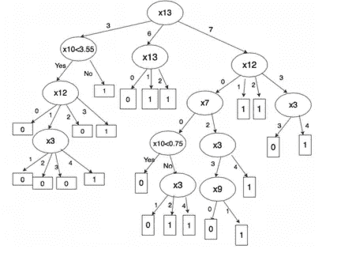
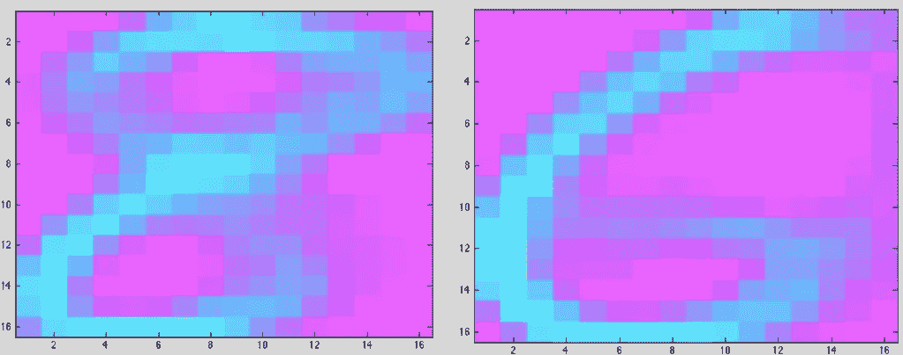

# 机器学习 I:一般观点

> 原文：<https://towardsdatascience.com/machine-learning-i-a-general-perspective-dee207dba335?source=collection_archive---------0----------------------->

一年多来，我一直在研究机器学习，我决定把我的知识放到互联网上，以帮助非计算机科学家了解这个热门领域的基础知识。我计划写一系列的帖子，这些将是关于算法背后的故事，而不是数学计算。通过这种方式，我的目标是给人以直觉。

让我们从它的定义和它与其他科学领域的关系开始。机器学习的目标是以一般方式识别数据集中的模式。在您识别出模式之后，您可以使用这些信息来建模数据、解释数据或者预测以前没有见过的新数据的结果。机器学习是人工智能的一个子领域，机器学习算法用于其他相关领域，如自然语言处理和计算机视觉。

一般来说，有三种类型的学习，它们是监督学习、非监督学习和强化学习。他们的名字实际上告诉了他们背后的主要思想。

在监督学习中，系统在数据输出的监督下进行学习，因此如果数据集包含输出信息，则首选监督算法。让我给你举个例子。让我们假设你有一家医疗统计公司，你有一个数据集，其中包含患者的特征，如血压、血糖、每分钟心率等。你还可以了解他们一生中是否经历过心脏病。通过训练机器学习算法，你的系统可以找到特征和患心脏病概率之间的模式。因此，您的算法可以预测新患者是否有患心脏病的风险，这样医生就可以采取预防措施，挽救一个人的生命。

A Decision Tree from one of my projects. x’s are features which are medical tests in this case and the 0,1 values in boxes represents existance of heart disease. As you can see, algorithm produced an interpretable tree.

如果您的数据不包含输出，并且您希望发现数据集中的聚类，则您更喜欢使用无监督算法。无监督学习的一个很好的例子是手写数字识别。在这个应用程序中，您知道应该有 10 个簇{0，1，2，3，4，5，6，7，8，9}，但是手写数字的问题是手写数字有无数种方法，每个人写数字的方式都不同。计算机如何理解手写的东西？在那里，你应该使用无监督的算法，如 K-means 或 EM 算法。你用这些算法所做的是，你从初始随机聚类均值开始，迭代地这些均值点收敛到真实的聚类均值。完成训练后，如果你将聚类的平均值可视化，你会发现它们看起来真的像数字。然后你用相应的数字标记这些簇，当计算机遇到一个新的手写数字时，算法用最接近它的平均值标记这个数字。

Visualized means for 8 and 6, from one of my projects

最后，我们来谈谈强化学习。让我们假设你想创造一个下棋的智能代理。在国际象棋中，你不能一个接一个地处理动作。你的代理应该考虑一系列的动作，然后决定采取一个行动，使效用最大化。因此，你的代理应该对自己下几盘棋，然后决定最好的行动。我们称这种类型的学习为强化学习，它通常用在游戏中。

这是非计算机科学家对机器学习的快速介绍，我想继续发表关于模式识别、人工神经网络、概率模型等的文章。当我有时间的时候。