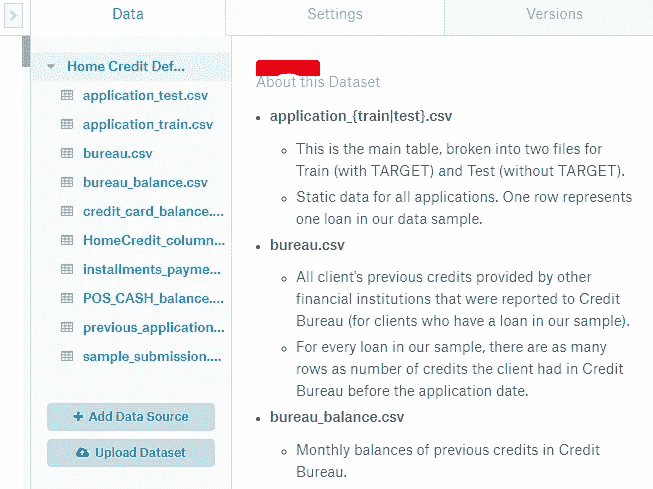
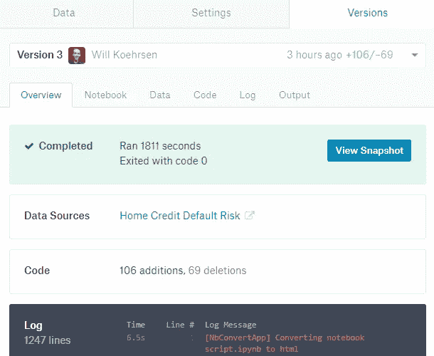
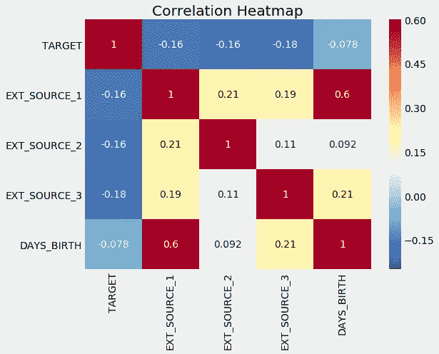
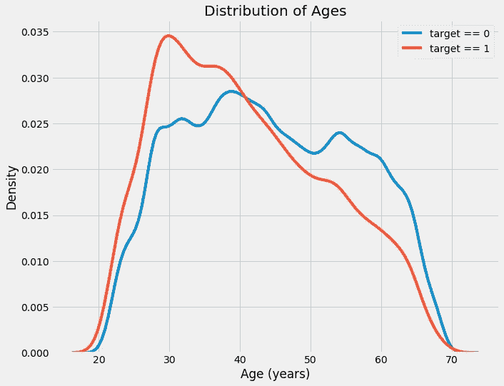
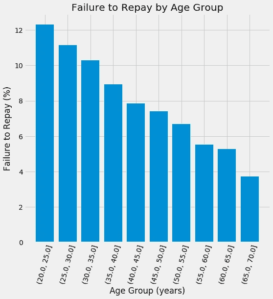
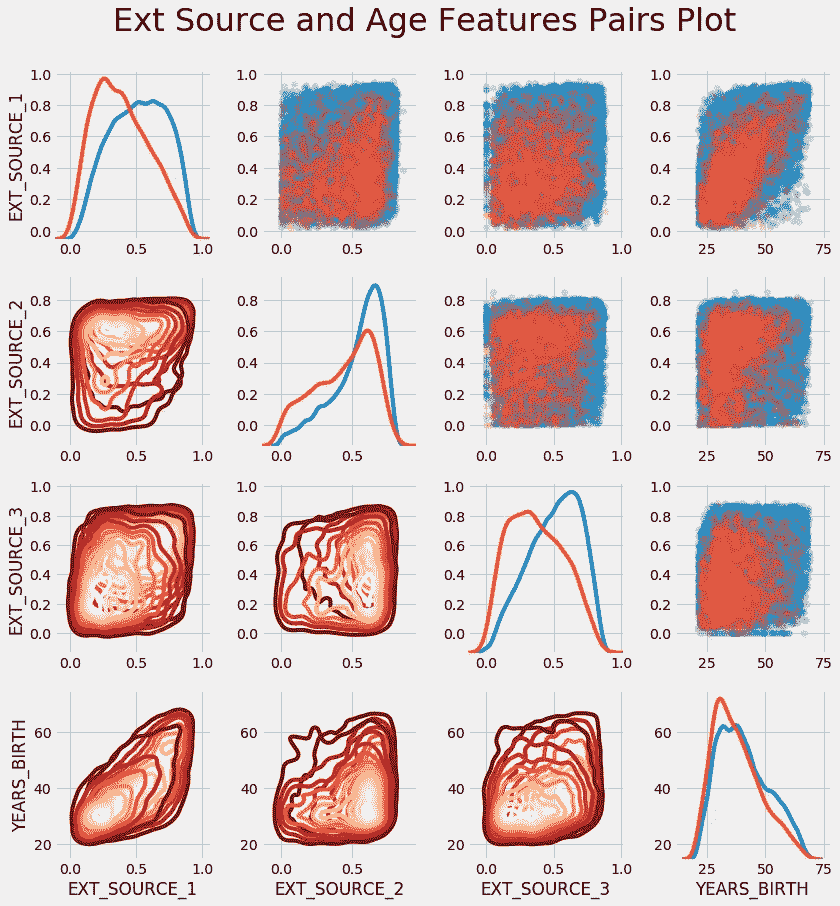
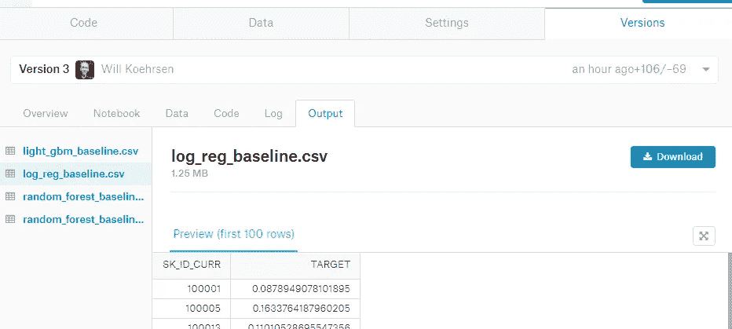

# 机器学习 Kaggle 竞赛第一部分:入门

> 原文：<https://towardsdatascience.com/machine-learning-kaggle-competition-part-one-getting-started-32fb9ff47426?source=collection_archive---------1----------------------->


## 学习 Kaggle 环境和入门笔记本

在数据科学领域，可用的资源几乎太多了:从 Datacamp 到 Udacity 到 KDnuggets，网上有成千上万的地方可以学习数据科学。然而，如果你喜欢一头扎进去，边干边学，Kaggle 可能是通过动手数据科学项目拓展你技能的最佳地点。

虽然它最初被称为机器学习竞赛的地方，但自称为“数据科学之家”的 [Kaggle](https://www.kaggle.com/) ，现在提供了一系列[数据科学资源](http://blog.kaggle.com/2018/04/03/q1-2018-product-update/)。尽管这一系列文章将关注一场竞赛，但有必要指出 Kaggle 的主要方面:

*   [**数据集:**](https://www.kaggle.com/datasets) 数以万计的各种不同类型和大小的数据集，你可以免费下载使用。如果您正在寻找有趣的数据来探索或测试您的建模技能，这是一个很好的去处。
*   [**机器学习竞赛:**](https://www.kaggle.com/competitions) 这些建模技能测试曾经是 Kaggle 的核心，是学习前沿机器学习技术和使用真实数据磨练您在有趣问题上的能力的绝佳方式。
*   [**学习**](https://www.kaggle.com/learn/overview)**:**Jupyter 笔记本中教授的一系列涵盖 SQL 到深度学习的数据科学学习曲目。
*   [**讨论:**](https://www.kaggle.com/discussion) 一个向 Kaggle 社区成千上万的数据科学家提问并获得建议的地方。
*   [**内核:**](https://www.kaggle.com/kernels) 运行在 Kaggle 的服务器上的在线编程环境，在这里你可以编写 Python/R 脚本，或者 Jupyter 笔记本。这些内核完全免费运行(你甚至可以添加一个 GPU ),并且是一个很好的资源，因为你不必担心在自己的计算机上设置数据科学环境。内核可用于分析任何数据集，参加机器学习竞赛，或完成学习轨迹。您可以从其他用户那里复制并构建现有的内核，并与社区共享您的内核以获得反馈。


The main aspects of Kaggle

总的来说，Kaggle 是一个学习的好地方，无论是通过更传统的学习途径还是通过比赛。当我想了解最新的机器学习方法时，我可以去看书，或者，我可以去 Kaggle，找到一个竞赛，看看人们在实践中如何使用它。就我个人而言，我觉得这更有趣，也是更有效的教学方法。此外，社区非常支持，总是愿意回答问题或提供项目反馈。

在这篇文章中，我们将重点关注一个 Kaggle 机器学习竞赛的开始:[家庭信用违约风险问题](https://www.kaggle.com/c/home-credit-default-risk)。这是一场相当简单的比赛，有一个合理大小的数据集(不能对所有比赛都这样说)，这意味着我们可以完全使用 Kaggle 的内核进行比赛。这大大降低了准入门槛，因为你不必担心你电脑上的任何软件，你甚至不必下载数据！只要你有一个 Kaggle 帐户和一个互联网连接，你就可以连接到一个内核并运行代码。

我计划在 Kaggle 和内核(一个 Python Jupyter 笔记本)上做整个比赛，这篇文章的[在这里](https://www.kaggle.com/willkoehrsen/start-here-a-gentle-introduction)可以找到。为了从本文中获得最大收益，创建一个 Kaggle 帐户来复制内核，然后点击 blue Fork Notebook 按钮。这将打开笔记本进行编辑，并在内核环境中运行。

# 竞争描述

[家庭信用违约风险竞赛](https://www.kaggle.com/c/home-credit-default-risk)是一项标准的监督机器学习任务，目标是使用历史贷款申请数据来预测申请人是否会偿还贷款。在训练期间，我们为我们的模型提供特征(描述贷款申请的变量)和标签(如果贷款已偿还，则为二进制 0，如果贷款未偿还，则为 1)，模型学习从特征到标签的映射。然后，在测试期间，我们向模型提供新一批应用程序的功能，并要求它预测标签。

本次比赛的所有数据都是结构化的，这意味着它们存在于整齐的行和列中——想象一个电子表格。这意味着我们不需要使用任何[卷积神经网络](http://cs231n.github.io/convolutional-networks/)(擅长处理图像数据)，这将给我们在真实世界数据集上的巨大实践。

[竞赛主办方 Home Credit](http://www.homecredit.net/about-us.aspx) ，是一家专注于服务无银行账户人群的金融提供商。预测应用程序是否会偿还贷款是一项至关重要的业务需求，Home Credit 开发了这项竞赛，希望 Kaggle 社区可以为这项任务开发一种有效的算法。这个比赛遵循大多数 Kaggle 比赛的一般想法:一家公司有数据和问题要解决，而不是(或除此之外)雇佣内部数据科学家来建立模型，他们设立一个适度的奖项，吸引整个世界贡献解决方案。一个由数千名技术娴熟的数据科学家(Kagglers)组成的社区然后免费研究这个问题，以得出最佳解决方案。就成本效益商业计划而言，这似乎是一个绝妙的主意！

# Kaggle 竞争环境

当你进入比赛主页时，你会看到这个:


下面是选项卡的快速浏览

*   **概述:**问题的简要描述、评估标准、奖品和时间表
*   **数据:**比赛所需的所有数据都不允许作为外部数据。你可以下载所有的数据，但我们不需要这样做，因为我们将使用一个可以连接到数据的 Kaggle 内核。
*   **内核:**你和其他竞争对手以前做过的工作。在我看来，这是竞赛最有价值的资源。您可以通读其他脚本和笔记本，然后复制代码(称为“分叉”)进行编辑和运行。
*   **讨论:**另一个有用的资源，你可以在这里找到来自竞赛主持人和其他参赛者的对话。这是一个提问和学习他人答案的好地方。
*   **排行榜:**谁在榜首，你站在哪里
*   **规则:**不是很有趣，但是很好理解
*   如果你决定组建一个团队，管理你的团队成员
*   **我的作品:**查看您之前提交的作品，并选择最终参赛作品

## 向他人学习的重要性

虽然它们被称为竞赛，但 Kaggle 机器学习活动实际上应该被称为“合作项目”，因为主要目标不一定是获胜，而是练习和向数据科学家同事学习。一旦你意识到与其说是打败别人，不如说是拓展自己的技能，你会从比赛中获得更多。当你注册 Kaggle 时，你不仅可以获得所有的资源，还可以成为拥有数千年集体经验的数据科学家社区的一员。

通过努力成为社区的积极分子来利用这些经历吧！这意味着从共享内核到在论坛上提问的任何事情。虽然公开你的工作可能会令人生畏，但我们通过犯错误、接受反馈和改进来学习，这样我们就不会再犯同样的错误。每个人都是初学者，社区非常支持所有技能水平的数据科学家。

在这种心态下，我想强调的是，与他人讨论并基于他人的代码进行构建不仅是可以接受的，而且是受到鼓励的！在学校，与他人合作被称为作弊，会让你得零分，但在现实世界中，这被称为合作，是一项极其重要的技能。

让你自己投入到比赛中的一个很好的方法是找到一个有人分享了一个很好的排行榜分数的内核，分叉这个内核，编辑它以尝试提高分数，然后运行它以查看结果。然后，将内核公开，这样其他人就可以使用你的工作。数据科学家不是站在巨人的肩膀上，而是站在成千上万为了所有人的利益而公开其工作的个人的背上。(抱歉说得太哲学了，但这就是我热爱数据科学的原因！)

# 通过第一个笔记本工作

一旦你对 Kaggle 的工作方式和如何在比赛中获得最大收益的哲学有了基本的了解，是时候开始了。在这里，我将简要概述我在一个内核中为家庭信用违约风险问题整理的一个 [Python Jupyter 笔记本，但是为了获得充分的好处，你会想要把这个笔记本放到 Kaggle 上并自己运行它(你不需要下载或设置任何东西，所以我强烈建议你去看看)。](https://www.kaggle.com/willkoehrsen/start-here-a-gentle-introduction)

当您在内核中打开笔记本时，您会看到这样的环境:


Kernel Notebook Environment

把这当成一个标准的 Jupyter 笔记本，审美略有不同。你可以像在 Jupyter 中一样编写 Python 代码和文本(使用 Markdown 语法)，并在 Kaggle 的服务器上完全在云端运行代码。然而，Kaggle 内核有一些 Jupyter Notebook 中没有的独特功能。点击右上角向左的箭头，展开内核控制面板，弹出三个选项卡(如果笔记本不是全屏的，那么这三个选项卡可能已经在代码旁边可见)。



在 data 选项卡中，我们可以查看内核所连接的数据集。在这种情况下，我们有完整的比赛数据，但我们也可以连接到 Kaggle 上的任何其他数据集，或者上传我们自己的数据并在内核中访问它。数据文件位于代码内的`../input/`目录中:

```
import os# List data files that are connected to the kernel
os.listdir('../input/')
```


Files connected to the kernel available in ../input/

设置选项卡让我们控制内核的不同技术方面。在这里，我们可以将 GPU 添加到我们的会话中，更改可见性，并安装环境中还没有的任何 Python 包。

最后，Versions 选项卡让我们看到代码的任何以前提交的运行。我们可以查看代码的变更，查看运行的日志文件，查看运行生成的笔记本，以及下载运行输出的文件。



Versions Tab

要运行整个笔记本并记录一个新版本，点击内核右上角的蓝色 Commit & Run 按钮。这将执行所有代码，向我们显示完整的笔记本(或者任何错误，如果有错误的话)，并保存运行期间创建的任何文件。当我们提交笔记本时，我们可以访问我们的模型做出的任何预测，并提交它们进行评分。

## 介绍性笔记本大纲

第一个笔记本是为了让你熟悉这个问题。我们以与任何数据科学问题相同的方式开始:理解数据和任务。对于这个问题，有 1 个主训练数据文件(包括标签)、1 个主测试数据文件和 6 个附加数据文件。在这第一个笔记本中，我们只使用主要数据，这将使我们得到一个体面的分数，但后来的工作将不得不纳入所有的数据，以便具有竞争力。

为了理解数据，最好离开键盘几分钟，通读问题文档，例如每个数据文件的[列描述。因为有多个文件，我们需要知道它们是如何链接在一起的，尽管对于第一个笔记本，为了简单起见，我们只使用主文件。通读其他内核也可以帮助我们熟悉数据以及哪些变量是重要的。](https://www.kaggle.com/c/home-credit-default-risk/data)

一旦我们理解了数据和问题，我们就可以开始为机器学习任务构建数据，这意味着处理分类变量(通过一键编码)，填充缺失值(插补)，并将变量缩放到一个范围。我们可以进行探索性的数据分析，比如找到与标签的相关性，并绘制这些关系。



Correlation Heatmap of Variables

我们可以在以后使用这些关系进行建模决策，例如包括使用哪些变量。(实现见笔记本)。



Distribution of Ages Colored by Label (left) and Rates of Default by Age Group (right)

当然，没有我最喜欢的图，即[对图](/visualizing-data-with-pair-plots-in-python-f228cf529166)，任何探索性的数据分析都是不完整的。



Pairs Plot of Features (red indicates loans that were not repaid in the kde and scatter plots)

在彻底探索数据并确保它可以被机器学习接受后，我们继续创建基线模型。然而，在我们进入建模阶段之前，我们必须了解竞争对手的性能指标。在 Kaggle 竞赛中，一切都归结为一个数字，即测试数据的度量。

虽然使用二进制分类任务的准确性可能有直观的意义，[这是一个糟糕的选择](/beyond-accuracy-precision-and-recall-3da06bea9f6c)，因为我们正在处理一个不平衡的类问题。根据 ROC AUC 或曲线下的[受试者操作特征曲线面积来判断提交的数据，而不是准确性。我让你对这一个](https://stats.stackexchange.com/questions/132777/what-does-auc-stand-for-and-what-is-it)做[研究，或者看笔记本上的解释。只知道越高越好，随机模型 0.5 分，完美模型 1.0 分。为了计算 ROC AUC，我们需要根据概率而不是二进制 0 或 1 进行预测。ROC](http://gim.unmc.edu/dxtests/roc3.htm) [随后将真阳性率与假阳性率](http://gim.unmc.edu/dxtests/roc2.htm)显示为阈值的函数，根据该阈值我们将实例分类为阳性。

通常我们喜欢做一个天真的基线预测，但是在这种情况下，我们已经知道随机猜测任务将得到 0.5 的 ROC AUC。因此，对于我们的基线模型，我们将使用稍微复杂一点的方法，[逻辑回归](https://machinelearningmastery.com/logistic-regression-for-machine-learning/)。对于二元分类问题，这是一个流行的简单算法，它将为未来的模型设置一个较低的标准。

在实现逻辑回归之后，我们可以将结果保存到 csv 文件中以供提交。提交笔记本后，我们写入的任何结果都将显示在“版本”选项卡上的“输出”子选项卡中:



Output from running the complete notebook

在此选项卡中，我们可以将提交的内容下载到我们的计算机上，然后上传到竞赛中。在本笔记本中，我们制作了四种不同的模型，得分如下:

*   逻辑回归:0.671
*   随机森林:0.678
*   具有构造特征的随机森林:0.678
*   光梯度推进机:0.729

这些分数并没有让我们接近排行榜的顶端，但它们为未来的改进留下了足够的空间！我们还可以了解仅使用单一数据源时的预期性能。

(不出意外，非凡的[渐变助推机](https://machinelearningmastery.com/gentle-introduction-gradient-boosting-algorithm-machine-learning/)(使用 [LightGBM 库](http://lightgbm.readthedocs.io/en/latest/Python-Intro.html))表现最好。这个[模型赢得了几乎所有的结构化 Kaggle 竞赛](https://brage.bibsys.no/xmlui/handle/11250/2433761)(其中数据是表格格式的)，如果我们想要认真竞争，我们可能需要使用这种模型的某种形式！)

# 结论

这篇文章和介绍性内核演示了 Kaggle 竞赛的基本开始。它并不意味着获胜，而是向您展示如何进行机器学习竞赛的基本知识，以及一些让您起步的模型(尽管 LightGBM 模型就像是从深水区跳下来)。

此外，我为机器学习竞赛阐述了我的哲学，即通过参与讨论、基于他人的代码构建和分享自己的工作来尽可能多地学习。刷新你过去的成绩是令人愉快的，但我认为做得好不是主要的焦点，而是学习新的数据科学技术的积极副作用。虽然这些被称为竞赛，但它们是真正的合作项目，欢迎每个人参与并磨练他们的能力。

还有大量的工作要做，但谢天谢地，我们不必独自去做。在后面的文章和笔记中，我们将看到如何在其他人的工作基础上构建更好的模型。我希望这篇文章(以及[笔记本内核](https://www.kaggle.com/willkoehrsen/start-here-a-gentle-introduction))给了你信心，让你可以开始在 Kaggle 上竞争，或者接手任何数据科学项目。

一如既往，我欢迎建设性的批评和讨论，可以通过 Twitter [@koehrsen_will 联系。](http://twitter.com/koehrsen_will)