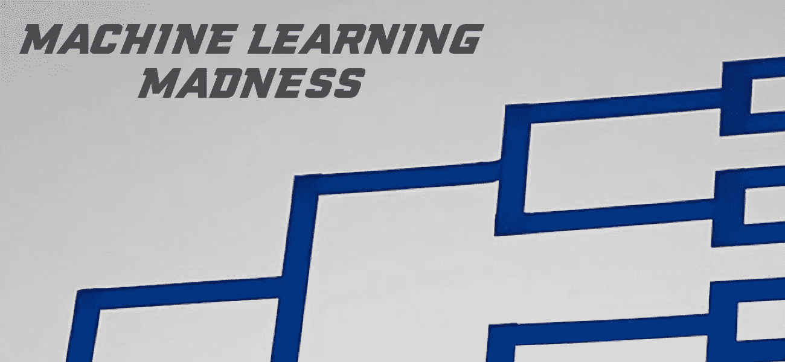
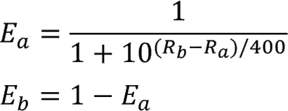
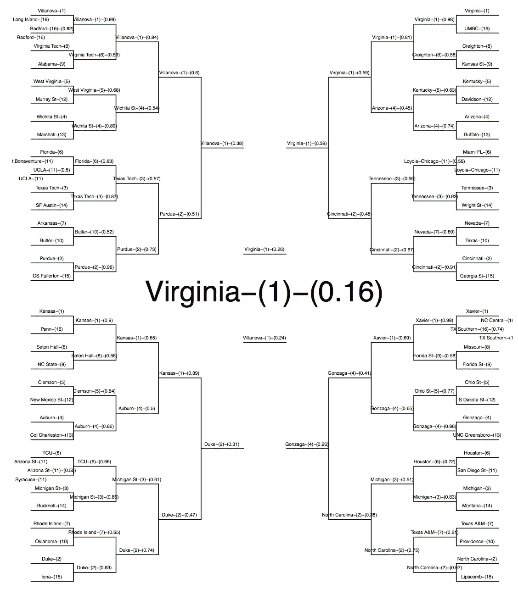

# 机器学习的疯狂:预测每一场 NCAA 锦标赛

> 原文：<https://towardsdatascience.com/machine-learning-madness-predicting-every-ncaa-tournament-matchup-7d9ce7d5fc6d?source=collection_archive---------8----------------------->

## 大舞蹈的概率模型、可视化和结果

又到了一年中的这个时候。三月疯狂来了，这意味着是时候填写你的括号了，当它不可避免地被你所有的朋友和家人看到时，你会很失望。

不过，也不全是坏消息。NCAA 级男子篮球锦标赛是本年度最激动人心的体育赛事之一，因为它伴随着冷门、灰姑娘和不可预测性。每年三月，数以百万计的篮球迷和非篮球迷都拿着他们的虚拟锐器参与这一现象，希望获得一个不可能的完美支架。有多不可能？鉴于你对篮球略知一二，教授们保守地认为你的胜算是 1280 亿分之一。

# 动机

感谢我的成长经历和在体育中心的成长经历，从我记事起，我就是一个狂热的大学篮球迷。每年我都期待着进行研究，有条不紊地填写一个括号。

然而，今年在收到一封关于即将到来的 Kaggle 比赛的电子邮件后，我决定第一次尝试模拟比赛，标题是:[谷歌云& NCAA 机器学习比赛](https://www.kaggle.com/c/mens-machine-learning-competition-2018)。如果你不熟悉 Kaggle，它被称为“数据科学&机器学习之家”。 [Kaggle](https://www.kaggle.com) 举办机器学习比赛，收集有趣的数据集，并提供指南来帮助你成长为一名数据科学家。

# 竞争

比赛的目标是利用过去的锦标赛结果来建立和测试模型，以便预测 2018 年 NCAA 第一组男子篮球锦标赛中所有可能比赛的结果。这些结果是通过概率计算得出的，例如，A 队有 55%的机会击败 b 队。然后，我们会对每个最终提交的作品进行评估，并使用一种称为对数损失的指标在公共排行榜上进行排名。如果您不熟悉日志损失，只需知道越小越好。对数的使用为自信和错误提供了极端的惩罚，如下面的公式所示:

# 方法

进入这个项目，我有一个大概的想法，我想用它做什么。话虽如此，我对前几年的类似项目做了一些研究，从中我发现了一些对我有用的见解。

首先，似乎很多模型都将逻辑回归作为它们的主要算法，这是因为它的概率性质和有效而简单的实现。第二，许多模型利用了其他广受好评的排名和评分系统，如肯·波默罗伊和 T2 的杰夫·萨格林。

利用以前的领域知识，以及这些来自研究的见解，我决定对其他模型采取类似的方法，同时做一些有趣的改变。我的高级方法可以分为几个步骤:

1.  收集旨在衡量给定团队质量的高绩效排名、分数和评级
2.  将这些指标汇编成一个综合得分，提供可靠的能力度量
3.  计算每场比赛中各队综合得分的差异
4.  对综合得分差异进行训练和测试逻辑回归，以预测未来的比赛

# 模型分解

按照这种方法，我的模型由两个不同的部分组成。每个部分都有独特的权重，用于生成每个团队的综合得分。查看以下可视化内容，了解各种输入的概述:

这些重量是在相互测试了几个变量之后选择的。在本文的其余部分，在最终模拟今年的锦标赛结果之前，我将更详细地介绍模型的每个部分。

# 平均选择排名分数

我发现最有用的资源之一是一个数据集，其中包含随着时间推移的[梅西综合排名](https://www.masseyratings.com/cb/compare.htm)。梅西排名是检查所有其他排名系统的目的地。我决定选择可用的最高性能系统，并平均计算分数。在为每个持续更新的系统拟合和测试单独的逻辑回归模型后，我发现表现最好的指标是[Sagarin](http://sagarin.com/sports/cbsend.htm)(SAG)[Pomeroy](https://kenpom.com)(POM)[Moore](http://sonnymoorepowerratings.com/m-basket.htm)(MOR)和 [Whitlock](http://sawhitlock.home.mindspring.com) (WLK)。

在编辑了这些排名的平均分数后，我单独对这个特征进行了拟合和测试，得到了-0.543 的对数损失，这比我的基线基于种子的模型和整体平均排名实现都有所改进。

# 标准化 Elo 评级

如果你曾经研究过体育预测背后的方法论，你可能会遇到一两次 Elo。Nate Silver 和他的团队是 Elo 的大力支持者，所以当我在 Kaggle 上看到 [Liam Kirwin 的实现](https://www.kaggle.com/lpkirwin/fivethirtyeight-elo-ratings)后，我不得不考虑以某种方式将它融入我的模型中。

如果你不熟悉 Elo 评级系统，这是一种计算零和游戏中玩家相对技能水平的迭代方法。你可能听说过它被用于国际象棋或其他棋盘/视频游戏，但只知道应用程序是无止境的。Elo 通常使用以下公式计算:

计算每支球队的 Elo 分数需要一些时间，因为该程序必须迭代每场比赛并调整相应球队的评级。一旦计算出来，基于 Elo 的逻辑回归模型也表现得相当好，其对数损失为-0.543，与选择排名模型的先前结果持平。

# 模型评估

一旦之前的两个分数都被收集，它们被重新调整到介于 0 和 1 之间。然后使用上述方法对他们进行加权，并随后汇编成每个团队的最终综合得分，最终用于我们的逻辑回归模型。使用交叉验证，该模型在训练数据上获得了-0.540 的对数损失，这比其自身的任何一部分都略有改善！

为了更好地了解综合得分，请根据以下指标查看今年锦标赛中排名前十的球队:

# 锦标赛模拟

所有这些都是好东西，但我们真正想看到的是所有这些分数和概率如何应用于今年的数据！多亏了扎克·梅尔令人敬畏的名为 [kaggleNCAA](https://github.com/zachmayer/kaggleNCAA) 的 R 包，这个任务相当容易完成。在用 1000 次模拟运行我的模型后，我得到了以下结果:

如你所见，从长远来看，我的模型预测最有可能的赢家是弗吉尼亚，有 16%的机会。一些有趣的选择还包括杜克大学(2)和冈萨加大学(4)作为进入四强的热门，很可能第一轮就被佛罗里达大学(9)和洛约拉-芝加哥大学(11)击败。

# 包扎

恭喜你能走到这一步！总的来说，我很高兴地说，承担这个项目使我成为一个更有能力的数据科学家。我也很兴奋能参加今年的比赛，最重要的是，我渴望为明年调整和改进我的模型！

**代码及完整 Jupyter 笔记本见我的** [**Github**](https://github.com/conordewey3/Kaggle-March-Madness-Machine-Learning-2018) **。**

## 感谢阅读，并祝所有参加今年三月疯狂的有抱负的支架学家好运！

感谢阅读！如果你喜欢这篇文章，请继续向鼓掌按钮展示你的爱。对更多的帖子感兴趣吗？请务必[关注我](https://twitter.com/cdeweyx)并订阅下面的[我的简讯](https://www.conordewey.com/)以接收任何新内容。想了解更多关于我和我在做什么，请查看我的网站。