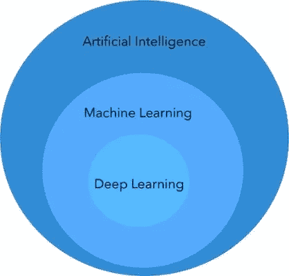
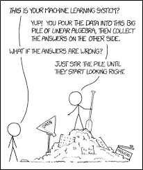

# 机器学习与深度学习

> 原文：<https://towardsdatascience.com/machine-learning-vs-deep-learning-62137a1c9842?source=collection_archive---------5----------------------->

人工智能包含非常广泛的范围。你甚至可以将 Dijkstra 的最短路径算法视为人工智能。然而，有两类人工智能经常被混淆:机器学习和深度学习。这两者都是指数据的统计建模，以提取有用的信息或进行预测。在本文中，我们将列出这两种统计建模技术不同的原因，并帮助您进一步构建对这些数据建模范例的理解。

# 概观

机器学习是一种统计学习方法，其中数据集中的每个实例都由一组特征或属性来描述。相比之下，术语“深度学习”是一种从原始数据中提取特征或属性的统计学习方法。深度学习通过利用具有许多隐藏层的神经网络、大数据和强大的计算资源来实现这一点。这些术语似乎有些可互换，但是，使用深度学习方法，算法会自动构建数据的表示。相比之下，数据表示在机器学习算法中被硬编码为一组特征，需要进一步的处理，如特征选择和提取(如 PCA)。

这两个术语与另一类被称为基于规则的系统的经典人工智能算法形成了鲜明对比，在基于规则的系统中，每个决策都是以类似于统计模型的方式手动编程的。

在机器学习和深度学习中，有许多不同的模型，分为两个不同的类别，有监督的和无监督的。在无监督学习中，k-Means、层次聚类和高斯混合模型等算法试图学习数据中有意义的结构。监督学习涉及与数据集中的每个实例相关联的输出标签。该输出可以是离散的/分类的或实值的。回归模型估计实值输出，而分类模型估计离散值输出。简单的二元分类模型只有两个输出标签，1(正)和 0(负)。被认为是**机器学习的一些流行的监督学习算法:**有线性回归、logistic 回归、决策树、支持向量机、神经网络，还有 k 近邻等非参数模型。

# 数据量

机器学习和深度学习都能够处理大规模的数据集，然而，机器学习方法对小数据集更有意义。例如，如果你只有 100 个数据点，决策树、k 近邻和其他机器学习模型对你来说将比在数据上拟合深度神经网络更有价值。这是由于下一个话题的差异，可解释性。

# **可解释性**

对深度学习方法和机器学习算法的许多批评，如支持向量机或(也许，因为你至少可以可视化组成输出的成分概率)，朴素贝叶斯，是因为它们难以解释。例如，当卷积神经网络在狗与猫的问题中输出“猫”时，似乎没有人知道它为什么这样做。相比之下，当您使用机器学习技术对电子健康记录或银行贷款数据集等数据进行建模时，理解模型预测的推理要容易得多。

可解释性的一个最好的例子是决策树，你可以沿着树的节点进行逻辑测试，直到你做出一个决定。另一种具有高解释性的机器学习算法是 k-最近邻算法。这不是参数学习算法，但仍然属于机器学习算法的范畴。这是非常有可解释性的，因为你很容易为自己推理类似的例子。

# **结论**

总之，上图是对深度学习和机器学习区别的最好概括。一个具体的例子是考虑原始数据形式，如图像中的像素或音频中的正弦波。机器学习方法很难从这些数据中构建语义特征。因此，深度学习方法在这些模型中占主导地位。深度学习还带来了比经典机器学习方法更多的细微差别和无法解释的现象。请告诉我这篇文章是否有助于框定你对机器学习相比深度学习的理解，谢谢你的阅读！

# [CShorten](https://medium.com/@connorshorten300)

Connor Shorten 是佛罗里达大西洋大学计算机科学专业的学生。对人工智能、计算机视觉、软件工程和生物信息学感兴趣。