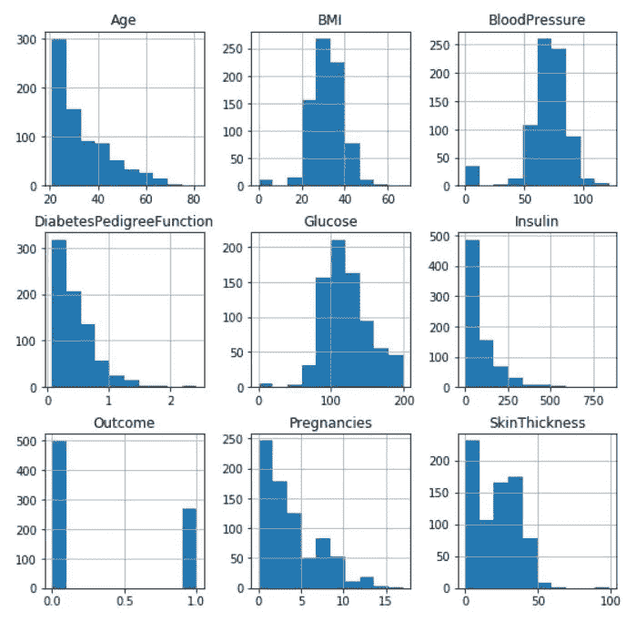
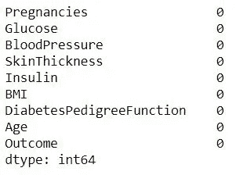
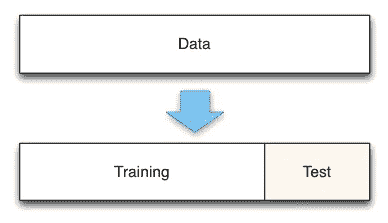
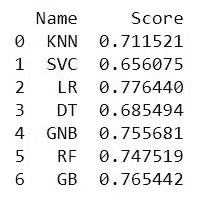

# 糖尿病数据的机器学习工作流程:第 1 部分

> 原文：<https://towardsdatascience.com/machine-learning-workflow-on-diabetes-data-part-01-573864fcc6b8?source=collection_archive---------1----------------------->

> “医疗环境中的机器学习可以帮助显著增强医疗诊断。”

本文将描述如何利用与糖尿病相关的数据来预测一个人是否患有糖尿病。更具体地说，本文将重点关注如何利用机器学习来预测糖尿病等疾病。在本系列文章结束时，您将能够理解数据探索、数据清理、特性选择、模型选择、模型评估等概念，并以实际的方式应用它们。

# 什么是糖尿病？

[糖尿病](https://www.niddk.nih.gov/health-information/diabetes)是一种当血糖水平变高时发生的疾病，最终会导致其他健康问题，如心脏病、肾病等。糖尿病主要是由于食用高度加工食品、不良消费习惯等引起的。据[世卫组织](http://www.who.int/mediacentre/factsheets/fs312/en/)报道，这些年来糖尿病患者的数量一直在增加。

# 先决条件

*   Python 3。+
*   蟒蛇(Scikit Learn，Numpy，Pandas，Matplotlib，Seaborn)
*   朱庇特笔记本。
*   对监督机器学习方法的基本理解:特别是分类。

# **第 0 阶段—数据准备**

作为一名数据科学家，我们遇到的最乏味的任务是获取和准备数据集。即使这个时代有大量的数据，仍然很难找到一个合适的数据集来解决你试图解决的问题。如果找不到任何合适的数据集，您可能需要创建自己的数据集。

在本教程中，我们不会创建自己的数据集，相反，我们将使用由 UCI 机器学习资源库(著名的机器学习数据集资源库)提供的名为“ [**皮马印第安人糖尿病数据库**](https://github.com/LahiruTjay/Machine-Learning-With-Python/blob/master/datasets/diabetes.csv) ”的现有数据集。我们将使用上面提供的**糖尿病数据集**执行机器学习工作流。

# **第一阶段—数据探索**

当遇到一个数据集时，首先我们应该分析并"**了解**"这个数据集。这一步对于熟悉数据、了解潜在特征以及确定是否需要清理数据是必要的。

首先，我们将导入必要的库，并将数据集导入 Jupyter 笔记本。我们可以观察数据集中提到的列。

```
%matplotlib inline
import pandas as pd
import numpy as np
import matplotlib.pyplot as plt
import seaborn as snsdiabetes = pd.read_csv('datasets/diabetes.csv')
diabetes.columns 
```

*指数(['妊娠'，'血糖'，'血压'，'皮肤厚度'，'胰岛素'，
，'身体质量指数'，'糖尿病患者血糖'，'年龄'，'结果']，
dtype= '对象')*

> 重要提示:需要注意的是，上述数据集仅包含有限的特征，而实际上有许多特征在起作用。

我们可以使用熊猫的 **head()** 方法来检查数据集。

```
diabetes.head()
```


Fig — Diabetes data set

我们可以使用 panda Dataframes 的“shape”属性找到数据集的维度。

```
print("Diabetes data set dimensions : {}".format(diabetes.shape))
```

*糖尿病数据集维度:(768，9)*

我们可以观察到数据集包含 768 行和 9 列。*结果*是我们将要预测的列，表示患者是否患有糖尿病。1 表示该人是糖尿病患者，0 表示该人不是。我们可以确定，在 768 人中，500 人被标记为 0(非糖尿病)，268 人被标记为 1(糖尿病)

```
diabetes.groupby('Outcome').size()
```


Fig— Class distribution

数据可视化是数据科学的一个重要方面。这有助于理解数据，也有助于向他人解释数据。Python 有几个有趣的可视化库比如 Matplotlib，Seaborn 等。

在本教程中，我们将使用构建在 matplotlib 之上的 pandas 可视化工具来查找要素的数据分布。



Fig— Data distribution

我们可以使用下面的代码分别为这两个响应绘制直方图。(此处未显示图像。)

```
diabetes.groupby(‘Outcome’).hist(figsize=(9, 9))
```

# 阶段 2—数据清理

机器学习工作流程的下一个阶段是数据清理。被认为是工作流程的关键步骤之一，因为它可以决定模型的成败。机器学习中有一句谚语**“更好的数据胜过更好的算法”**，这表明更好的数据会给你带来更好的结果模型。

在数据清理过程中，有几个因素需要考虑。

1.  重复或不相关的观察。
2.  数据标签错误，同一类别出现多次。
3.  数据点缺失或为空。
4.  意外的异常值。

> 在本教程中，我们不会详细讨论数据清理过程。

由于我们使用的是标准数据集，我们可以有把握地假设因素 1、2 已经处理过了。意外的异常值要么有用，要么有潜在的危害。

## 缺失或空数据点

我们可以使用下面的 pandas 函数找到数据集的任何缺失或空数据点(如果有的话)。

```
diabetes.isnull().sum()
diabetes.isna().sum()
```

我们可以观察到数据集中没有数据点丢失。如果有，我们应该相应地处理它们。



Fig — Observe missing data

## **意外异常值**

当分析直方图时，我们可以发现在一些列中有一些异常值。我们将进一步分析这些异常值，并确定我们可以做些什么。

**血压:**通过观察数据我们可以看到，血压有 0 个值。很明显，数据集的读数似乎是错误的，因为一个活人的舒张压不可能为零。通过观察数据，我们可以看到值为 0 的 35 个计数。

```
print("Total : ", diabetes[diabetes.BloodPressure == 0].shape[0])Total :  35print(diabetes[diabetes.BloodPressure == 0].groupby('Outcome')['Age'].count())Outcome
0    19
1    16
Name: Age, dtype: int64
```

**血浆葡萄糖水平:**即使空腹后血糖水平也不会低至零。因此，零是无效的读数。通过观察数据，我们可以看到值为 0 的 5 个计数。

```
print("Total : ", diabetes[diabetes.Glucose == 0].shape[0])Total :  5print(diabetes[diabetes.Glucose == 0].groupby('Outcome')['Age'].count())Total :  5
Outcome
0    3
1    2
Name: Age, dtype: int64
```

**皮褶厚度:**对于正常人来说，皮褶厚度不可能小于 10 mm 最好为零。值为 0: 227 的总计数。

```
print("Total : ", diabetes[diabetes.SkinThickness == 0].shape[0])Total :  227print(diabetes[diabetes.SkinThickness == 0].groupby('Outcome')['Age'].count())Outcome
0    139
1     88
Name: Age, dtype: int64
```

身体质量指数:不应该是零或接近零，除非这个人真的体重不足，这可能会危及生命。

```
print("Total : ", diabetes[diabetes.BMI == 0].shape[0])Total :  11print(diabetes[diabetes.BMI == 0].groupby('Outcome')['Age'].count())Outcome
0    9
1    2
Name: Age, dtype: int64
```

**胰岛素:**在极少数情况下，一个人可以没有胰岛素，但通过观察数据，我们可以发现总共有 374 个计数。

```
print("Total : ", diabetes[diabetes.Insulin == 0].shape[0])Total :  374print(diabetes[diabetes.Insulin == 0].groupby('Outcome')['Age'].count())Outcome
0    236
1    138
Name: Age, dtype: int64
```

以下是处理无效数据值的几种方法:

1.  忽略/删除这些情况:这在大多数情况下实际上是不可能的，因为这将意味着丢失有价值的信息。在这种情况下，“皮肤厚度”和“胰岛素”列意味着有许多无效点。但它可能适用于“身体质量指数”、“葡萄糖”和“血压”数据点。
2.  放入平均值:这可能对一些数据集有效，但是在我们的例子中，把平均值放入血压列会给模型发送一个错误的信号。
3.  避免使用特性:对于模型来说，不使用具有大量无效值的特性是可能的。这可能对“皮肤厚度”有效，但很难预测。

在数据清理过程结束时，我们得出结论，这个给定的数据集是不完整的。由于这是机器学习的演示，我们将对给定的数据进行一些小的调整。

我们将删除“血压”、“身体质量指数”和“葡萄糖”为零的行。

```
diabetes_mod = diabetes[(diabetes.BloodPressure != 0) & (diabetes.BMI != 0) & (diabetes.Glucose != 0)]print(diabetes_mod.shape)(724, 9)
```

# 第 3 阶段—特征工程

特征工程是将收集的数据转换为更好地代表我们试图解决的模型问题的特征的过程，以提高模型的性能和准确性。

特征工程从现有特征中创建更多的输入特征，并组合多个特征以生成更直观的特征来输入模型。

***“特征工程使我们能够突出重要的特征，并便于将问题领域的专业知识带到桌面上来。尽管提供了许多输入特征，它还允许避免过度拟合模型”。***

我们试图解决的问题领域需要许多相关的特性。由于数据集已经提供，并且通过检查数据，我们不能在这一点上进一步创建或删除任何数据。在数据集中，我们有以下特征。

> 怀孕'，'葡萄糖'，'血压'，'皮肤厚度'，'胰岛素'，'身体质量指数'，'糖尿病谱系功能'，'年龄'

通过粗略的观察，我们可以说“皮肤厚度”不是糖尿病的指标。但是我们不能否认在这一点上它是不可用的。

因此，我们将使用所有可用的功能。我们将数据集分成特征和我们将要预测的响应。我们将把特征分配给 X 变量的**，把响应分配给 y 变量**的**。**

```
feature_names = ['Pregnancies', 'Glucose', 'BloodPressure', 'SkinThickness', 'Insulin', 'BMI', 'DiabetesPedigreeFunction', 'Age']X = diabetes_mod[feature_names]
y = diabetes_mod.Outcome
```

通常，特征工程在选择模型之前执行。然而，对于本教程，我们遵循不同的方法。最初，我们将利用数据集中提供给模型的所有功能，我们将再次讨论功能工程，以讨论所选模型的功能重要性。

这篇文章很好地解释了[特征工程](https://elitedatascience.com/feature-engineering-best-practices)。

# 阶段 4—型号选择

模型选择或算法选择阶段是最令人兴奋的，也是机器学习的核心。在这个阶段，我们选择最适合手头数据集的模型。

首先，我们将使用默认参数计算一组给定分类模型的**“分类准确度(测试准确度)”**，以确定哪个模型在糖尿病数据集上表现更好。

我们将为笔记本导入必要的库。我们导入 7 个分类器，即**K-最近邻、支持向量分类器、逻辑回归、高斯朴素贝叶斯、随机森林和梯度提升**作为最佳分类器的竞争者。

```
from sklearn.neighbors import KNeighborsClassifier
from sklearn.svm import SVC
from sklearn.linear_model import LogisticRegression
from sklearn.tree import DecisionTreeClassifier
from sklearn.naive_bayes import GaussianNB
from sklearn.ensemble import RandomForestClassifier
from sklearn.ensemble import GradientBoostingClassifier
```

我们将使用默认参数初始化分类器模型，并将它们添加到模型列表中。

```
models = []models.append(('KNN', KNeighborsClassifier()))
models.append(('SVC', SVC()))
models.append(('LR', LogisticRegression()))
models.append(('DT', DecisionTreeClassifier()))
models.append(('GNB', GaussianNB()))
models.append(('RF', RandomForestClassifier()))
models.append(('GB', GradientBoostingClassifier()))
```

> 例:通常用 Scikit learn 训练模型如下。
> 
> KNN = KNeighborsClassifier()
> KNN . fit(X _ train，y_train)

## 评估方法

通常的做法是避免对相同的数据进行训练和测试。原因是模型的目标是预测**样本外数据**，模型可能过于复杂，导致**过度拟合**。为了避免上述问题，有两个预防措施。

1.  训练/测试分割
2.  k 倍交叉验证

我们将为**训练/测试拆分**导入*“train _ test _ split”*，为 ***导入*“cross _ val _ score】k 倍交叉验证**** *。【accuracy _ score】*是评估训练/测试拆分方法中模型的准确性。

```
from sklearn.model_selection import train_test_split
from sklearn.model_selection import cross_val_score
from sklearn.metrics import accuracy_score
```

我们将执行上述方法，以找到性能最佳的基础模型。

## **训练/测试分割**

这种方法将数据集分成两部分:一个**训练集**和一个**测试集**。**训练集**用于训练模型。**测试装置**用于测试模型，评估精度。

> **优点:**但是，训练/测试分割仍然有用，因为它的**灵活性和速度**
> 
> **缺点:**提供样本外精度的**高方差估计**



Fig — Train/Test Split

**用 Scikit 学习进行训练/测试分割:**

接下来，我们可以将特征和响应分成训练和测试部分。我们对样本进行分层(在此过程中，每个响应类别在每个部分中的比例应该相等)。

```
X_train, X_test, y_train, y_test = train_test_split(X, y, stratify = diabetes_mod.Outcome, random_state=0)
```

然后，我们在一个循环中拟合每个模型，并使用*“accuracy _ score”*计算各个模型的精确度。

```
names = []
scores = []for name, model in models:
    model.fit(X_train, y_train)
    y_pred = model.predict(X_test)
    scores.append(accuracy_score(y_test, y_pred))
    names.append(name)tr_split = pd.DataFrame({'Name': names, 'Score': scores})
print(tr_split)
```


Fig — Train/Test Split Accuracy Scores

## **K 倍交叉验证**

这种方法将数据集分成 **K 个等分**(“折叠”)，然后使用 1 个折叠作为**测试集**，其他折叠的并集作为**训练集**。然后测试模型的准确性。该过程将遵循上述步骤 K 次，每次使用不同的折叠作为测试集。该工序的平均测试精度**为测试精度。**

> **优点:**更精确的样本外精度估计。更“有效”地使用数据(每个观察结果都用于训练和测试)
> 
> **缺点:**比训练/测试分割慢得多。


Fig— 5-Fold cross validation process

> **在计算能力不匮乏的情况下，最好使用这种方法。从现在开始我们将使用这种方法。**

**使用 Scikit Learn 进行 K 倍交叉验证:**

我们将继续进行 K-Fold 交叉验证，因为它更准确，并能更有效地利用数据。我们将使用 10 倍交叉验证来训练模型，并计算模型的平均准确度。“cross_val_score”提供了自己的训练和精度计算接口。

```
names = []
scores = []for name, model in models:

    kfold = KFold(n_splits=10, random_state=10) 
    score = cross_val_score(model, X, y, cv=kfold, scoring='accuracy').mean()

    names.append(name)
    scores.append(score)kf_cross_val = pd.DataFrame({'Name': names, 'Score': scores})
print(kf_cross_val)
```



Fig — K-Fold Cross Validation Accuracy Scores

我们可以使用 seaborn 来绘制准确度分数

```
axis = sns.barplot(x = 'Name', y = 'Score', data = kf_cross_val)
axis.set(xlabel='Classifier', ylabel='Accuracy')for p in axis.patches:
    height = p.get_height()
    axis.text(p.get_x() + p.get_width()/2, height + 0.005, '{:1.4f}'.format(height), ha="center") 

plt.show()
```


Fig — Accuracy of Classifiers

我们可以看到逻辑回归、高斯朴素贝叶斯、随机森林和梯度推进比其他方法表现得更好。从基础水平上，我们可以观察到逻辑回归比其他算法表现更好。

> 在基线时，逻辑回归设法实现了 77.64 %的分类准确度。这将被选为下一阶段的主要候选项目。

# 摘要

在本文中，我们讨论了基本的机器学习工作流程步骤，如使用 Scikit Learn 库进行数据探索、数据清理步骤、特征工程基础知识和模型选择。在下一篇文章中，我将更多地讨论特征工程和超参数调整。

# 更新

您可以在下面的链接中找到本系列的第 2 部分。

[](/machine-learning-workflow-on-diabetes-data-part-02-11262b7f7a5c) [## 糖尿病数据的机器学习工作流程:第 2 部分

### 在本系列的上一篇文章中，我们讨论了关于糖尿病数据集的机器学习工作流。还有…

towardsdatascience.com](/machine-learning-workflow-on-diabetes-data-part-02-11262b7f7a5c) 

创建这篇文章的源代码可以在下面找到。

[](https://github.com/LahiruTjay/Machine-Learning-With-Python/blob/master/Machine%20Learning%20Workflow%20on%20Diabetes%20Data.ipynb) [## LahiruTjay/用 Python 学习机器

### 这个库包含了各种用 Python 完成的机器学习的例子。

github.com](https://github.com/LahiruTjay/Machine-Learning-With-Python/blob/master/Machine%20Learning%20Workflow%20on%20Diabetes%20Data.ipynb) 

如果你对这篇文章有任何问题，请不要犹豫，在下面留言或者给我发电子邮件:lahiru.tjay@gmail.com

希望你喜欢这篇文章。干杯！！！