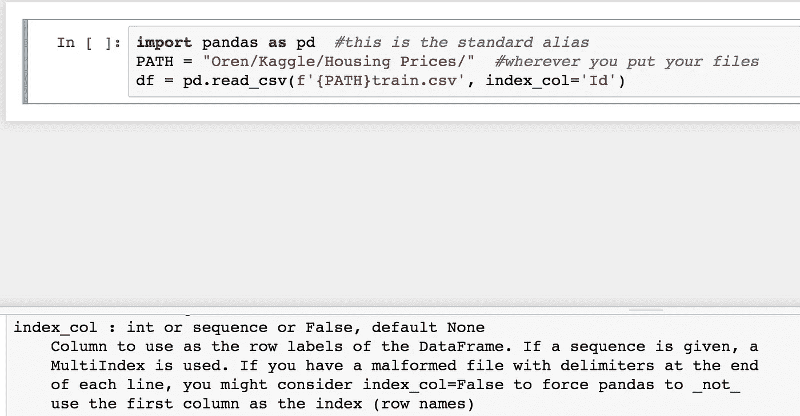
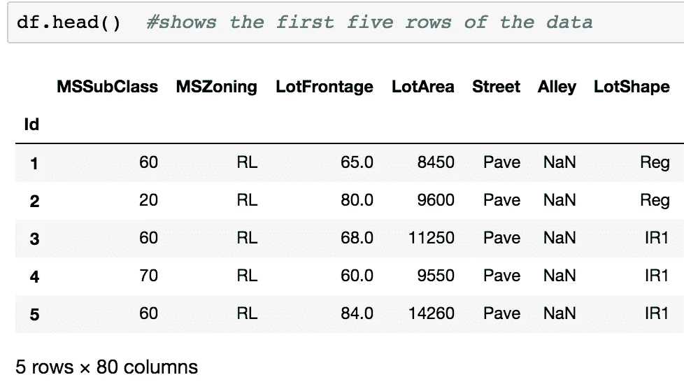
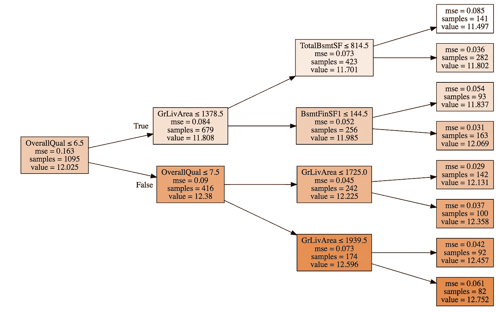

# 机器学习从零到英雄:第一次在 Kaggle 上竞争所需的一切，循序渐进！

> 原文：<https://towardsdatascience.com/machine-learning-zero-to-hero-everything-you-need-in-order-to-compete-on-kaggle-for-the-first-time-18644e701cf1?source=collection_archive---------1----------------------->


Taken from [https://xkcd.com/552/](https://xkcd.com/552/).

我最近偶然看到了瑞秋·托马斯关于写下你所学的东西的重要性和价值的文章，以及 T2 关于为什么以及如何写的建议，因此我决定听从他们的建议，写一篇文章(这是有史以来第一次！).

这篇文章将讲述我希望在一年前就知道的一切，当时我第一次决定学习更多关于数据科学的知识——它是为任何对数据科学感兴趣的人准备的，无论是作为一种爱好还是作为一种潜在的职业。先学习 MOOC 并了解一些基本的 Python 知识将有助于你从本文中获得最大收益，但这并不是必须的。这篇文章不是为了展示什么令人印象深刻的东西(对不起，妈妈、爸爸和潜在的雇主)，而是为了复习基础知识，帮助初学者有一个良好的开端。

**涵盖话题:**

1.  引言。
2.  Kaggle 概述。
3.  建立自己的环境。
4.  预测房价竞赛综述。
5.  加载和检查数据。
6.  我们的模型:决策树、偏差-方差权衡和随机森林的解释。
7.  预处理数据。
8.  把所有的东西放在一起然后提交。


# 介绍

现在网上有几个高质量的机器学习教程和 MOOCs 是免费的。一年前，我疯狂阅读了 Udacity 的《ML 简介》( Intro to ML )( T7 ),我发现它非常平易近人，对初学者非常友好，它很好地向我介绍了基本的 ML 概念、几种流行的算法和 scikit-learn 的 API。学完课程后，很兴奋能学到更多东西，但又觉得有点失落。

在进行了一些研究后，我决定接下来最好的事情是查看一下 [Kaggle](https://www.kaggle.com/) ，这是一个受欢迎的谷歌拥有的预测建模竞赛平台。没有什么比通过实践亲自动手学习更好的了！

第一次在 Kaggle 上竞争是令人生畏的，并且经常令人沮丧(获得一个像样的分数更是如此！)，所以这篇文章将关注如何参加你的第一场比赛，并利用 Kaggle 最大限度地提高你的个人成长和成功。

# Kaggle —概述


House Prices competition landing page.

如果您已经非常熟悉 Kaggle，请随意跳到下一部分。否则:

最适合初学者的两个 Kaggle 比赛(也是作为 Kaggle 版本的“教程”)是[泰坦尼克号](https://www.kaggle.com/c/titanic)(预测生存—二进制分类问题)，和[房价](https://www.kaggle.com/c/house-prices-advanced-regression-techniques)(预测价格—回归问题)。虽然我强烈建议在这两方面都进行检验和竞争，但本文将重点讨论后者。然而，大部分内容是通用的，同样适用于其他 Kaggle 竞赛和数据科学问题，所以如果你喜欢，可以随意选择泰坦尼克号或其他一些竞赛！

*   在每个竞赛的“概述”选项卡上，您可以看到一些关于竞赛及其数据集的背景信息、对提交内容进行评分的评估标准(因竞赛而异)以及特定于竞赛的常见问题。
*   在数据选项卡上，您可以看到数据的简要描述。我们将需要三个文件:`train.csv`、`test.csv`和`data_description.txt`(这是至关重要的，因为它包含了数据的更详细的描述)——把它们放在一个你可以容易访问的文件夹中。
*   “讨论”选项卡就像一个特定于比赛的论坛——但是，不要低估它！在流行的跑步比赛中，它通常包含有价值的信息，因为比赛条款有时要求参与者公开分享他们在讨论板上使用的任何外部信息。例如[数据泄露](https://www.kaggle.com/wiki/Leakage)很难避免和处理，在比赛中偶尔发生。一方面，充分利用它对于获得最高分和赢得比赛至关重要，但另一方面，包含数据泄漏的模型对于任何实际目的和比赛的组织者来说通常都是无用的，因为它们包含“非法”信息。通常，一个勤奋的参与者会在讨论板上公开分享泄漏的信息，以平衡竞争环境并消除其竞争优势。除此之外，Kagglers 们经常分享信息，共同努力学习和成长为一个社区。在排行榜上排名靠前的人有时会分享他们的成功方法(通常是在比赛开始时或结束后)。
*   内核选项卡基本上是讨论板的应用的、基于代码的版本，在我看来是初学者要探索的最重要的选项卡。任何人都可以分享任何脚本或笔记本，连接到任何数据集或比赛，并完成文档，解释，可视化和输出，每个人都可以浏览，投票，复制和粘贴，甚至完全在他们的浏览器中运行！前面提到的两个竞赛都有许多有趣的、漂亮的、非常成功的内核，我强烈建议在亲自尝试过之后再去浏览它们。尽管这是一个相对较新的功能，Kaggle 仍在不断改进内核，甚至有一场 [$100，000 的竞赛正在以“仅内核”模式](https://www.kaggle.com/c/mercari-price-suggestion-challenge)进行。然而，内核常常令人不知所措，缺乏概念上的解释，或者假设有先验知识。换句话说，他们经常展示什么是有效的，但有时不是**他们如何**到达那里或者**为什么**它有效。

# 建立我们自己的环境

我强烈推荐使用 Python 3.6，并在 Jupyter Notebook 环境中使用任何与数据科学相关的东西(最流行的发行版称为' [Anaconda](https://www.anaconda.com/download/) '，包括 Python、Jupyter Notebook 和许多有用的库)。然后，您可以随时通过在终端中键入`jupyter notebook`来启动环境(或者通过 Anaconda GUI)。否则，这里显示的一切都可以在 Kaggle 网站上的私有内核中完成(完全在您的浏览器中)，这本质上与 Jupyter 笔记本相同。

在我们开始之前，一些重要的 Jupyter 笔记本提示:

*   您可以开始键入任何方法名称，然后点击“Tab”来查看所有可能选项的列表。
*   类似地，选择任何一种方法并按几次“Shift-Tab”将会在你的笔记本中打开它的文档。
*   在任何语句前输入`%time`并执行单元格将会打印出执行需要多长时间。
*   类似地，在任何语句前键入`%prun`并执行单元格，将通过 Python 的代码分析器运行该语句并打印结果。

关于“魔法”命令的完整列表，请参考[文档](http://ipython.readthedocs.io/en/stable/interactive/magics.html)。前进！

# 预测房价的逐步指南

## 目标概述

这是一个监督学习问题——这意味着我们有一个训练集，它包括许多观察值(行)和关于它们的各种信息(列)。其中一列是我们希望能够预测的，通常称为“目标”变量或“因变量”，在分类问题中有时也称为“标签”或“类别”。在我们的情况下，这是销售价格(惊喜惊喜)。其他列通常被称为“独立”变量，或“特征”。我们也有一个测试集，其中也有许多观察值，除了目标变量之外，列完全相同，目标变量将会丢失，我们的工作是预测。因此，理想情况下，我们希望建立一个模型，该模型可以基于训练集学习自变量和因变量之间的关系，然后使用该知识尽可能准确地预测测试集的因变量(或目标变量)。由于目标变量是连续的——销售价格，它可以取任何值——这个问题被称为“回归”问题。

## 加载数据并查看一下

现在我们已经有了一个 Jupyter 笔记本，我们要做的第一件事是将数据加载到 Pandas 数据框架中。 [Pandas](http://pandas.pydata.org/pandas-docs/stable/) 是一个流行而强大的库，它处理 Python 中与数据分析相关的一切，DataFrame 是它用来存储数据的对象的名称。



Opening documentation by hitting ‘Shift-Tab’ a few times.

最后一行使用方便的 Python 3.6 字符串格式将我们从 Kaggle 下载的 CSV 文件(代表“逗号分隔值”，这是一种常见的格式，也可以用任何标准软件如 Excel 直接查看)加载到 Pandas DataFrame 中。既然你会经常用到`read_csv`，我建议现在浏览一下它的[文档](https://pandas.pydata.org/pandas-docs/stable/generated/pandas.read_csv.html)。一般来说，如果你不止一次遇到任何方法——浏览它的文档是一个好习惯，如上所述，你也可以直接在笔记本上这样做！第一次加载并查看 DataFrame 时，我注意到数据集中的第一列是`Id`,表示数据集中该行的索引，而不是一个实际的变量。因此，在将数据加载到 DataFrame 时，我回过头来将`index_col=’Id’`作为一个参数传递，以确保 Pandas 将它用作索引，而不是将其视为一个列并在它之前添加一个新的索引列——看看阅读文档是如何变得方便的？

现在，让我们看看训练集是什么样的！



A peek into the training set DataFrame.

如我们所见，`Id`现在被正确应用。此外，训练集总共有 80 列(不包括`Id`)，其中 79 列是自变量，1 列是因变量。因此，我们期望测试集只有 79 列(独立变量)，事实确实如此——现在就去检查吧！

这些数字和字符串中的大多数对我们来说还没有多大意义，敏锐的观察者会注意到“Alley”列的值可疑地全部是“NaN”(代表“不是数字”)，这意味着这些值是缺失的。别担心，我们最终会解决这个问题的。

下一步是开始考虑我们想要使用什么样的模型。因此，让我们从数据中休息几分钟，谈论一下[决策树](http://scikit-learn.org/stable/modules/tree.html#tree)(当应用于回归问题时，有时被称为‘回归树’)。事后我再来说数据，请大家多多包涵！

# 建模的简要说明

## 决策树介绍

这里的基本思想很简单，当学习训练数据(通常称为“拟合”训练数据)时，回归树搜索所有独立变量，然后搜索每个独立变量的所有值，以找到将数据分成两个相似组的最佳变量和值(在数学术语中，树总是选择将两个结果节点的加权平均方差最小化的拆分)， 然后计算每个组的分数(基于选择的度量)和**因变量**的平均值。 然后，该树递归地重复这个过程，直到不再有需要执行的拆分(除非明确指定了 max_depth，如下图所示)。树的最后一级的每个节点被称为“叶子”，并且每个节点与到达该叶子的组中的所有观察值的因变量的平均值相关联。

顺便提一下，这是一个“贪婪”算法的很好的例子——在每次分割时，它都会检查所有选项，然后选择当时看起来最好的选项，希望最终获得一个整体良好的结果。在将树拟合到训练数据之后，我们希望为其预测因变量的值的任何观察都必须遍历树，直到它到达一个叶子(一个结束节点)，然后它被赋予该叶子的相应因变量的值。



A visualized example from our dataset, with max_depth set to 3 for ease of visualization.

让我们仔细看看这里显示的树:在每个节点中，第一个元素是该节点的分裂规则(自变量及其值)，第二个元素是该节点中所有观测值的[均方误差(MSE)](https://en.wikipedia.org/wiki/Mean_squared_error) ，第三个元素是该节点中的观测值数量('样本')—组的大小。最后一个元素“值”是我们的目标/因变量“销售价格”的自然对数。正如我们所看到的，似乎在每个节点进行局部最佳分裂的贪婪方法确实通常会随着树的扩展而降低 MSE，并且每个叶子都有相关的“销售价格”值。

## 偏差-方差权衡

让我们回想一下我们在监督学习中的目标。一方面，我们希望我们的模型能够在拟合训练数据时捕捉自变量和因变量之间的关系，以便能够做出准确的预测。但是，模型预测因变量所需的数据必然不同于模型的训练数据。在我们的例子中，它是 Kaggle 测试集。因此，我们希望我们的模型能够捕捉自变量和因变量之间的**一般**关系，以便它能够推广到看不见的数据并进行良好预测。这有时被称为“[偏差——方差权衡](https://en.wikipedia.org/wiki/Bias%E2%80%93variance_tradeoff)”。


Bias —Variance Tradeoff

如果我们的模型没有从训练集中学习到足够的信息，那么它将具有很高的偏差，通常称为“欠拟合”，这意味着它没有捕捉到训练集中可用的所有信息，因此它的预测不会那么好。然而，如果我们的模型对我们的训练数据学习得太好，它将捕获训练集中自变量和因变量之间的特定关系，而不是一般关系，这将具有很高的方差，通常称为“过度拟合”，因此它将很难推广到看不见的数据，其预测也不会很好。显然，我们必须在模型的偏差和方差之间寻求平衡。

## 决策树过度拟合

想象一下，我们为我们的训练集拟合一棵回归树。这棵树会是什么样子？正如您可能猜到的那样，它将继续分裂，直到每片叶子中只有一个观察点(因为在该点没有更多的分裂可以执行)。换句话说，该树将为训练集中的每个观察值构建唯一的路径，并将为路径末端的叶子提供与其相关联的观察值的相关值。

如果我从我的训练集中删除因变量，并让我的树预测训练集中每个观察值的因变量值，会发生什么？正如您可能想象的那样，它会做得非常完美，基本上达到 100%的准确性和 0 MSE，因为它已经学习了与训练集中的每个观察值相关联的因变量值。

然而，如果我要求树预测未被训练的未被观察的因变量值，它可能会表现不佳，因为任何未被观察的观察结果最终都会从为训练集中的单个特定观察结果构建的叶子中被分配一个因变量值。这就是‘过拟合’的例子。有可能篡改树的参数以减少过度拟合——例如，限制树的 max _ depth——但事实证明有更好的解决方案！

## 解决方案——随机森林

在 ML 中，我们经常设计元模型，将几个较小模型的预测结合起来，以生成更好的最终预测。这通常被称为[‘集合’](https://en.wikipedia.org/wiki/Ensemble_learning)。具体来说，几个决策树通常以一种集成方法组合在一起，称为[‘Bootstrap Aggregating’，或简称为‘Bagging’](https://en.wikipedia.org/wiki/Bootstrap_aggregating)。由此产生的元模型被称为[【随机森林】](http://scikit-learn.org/stable/modules/ensemble.html#random-forests)。

随机森林简单但有效。当适合训练集时，会构建许多决策树，就像上面的一个决策树一样-只有每棵树适合数据的随机子集(“bootstrap sample”，意思是从整个数据集替换而成)，并且在每次分裂时只能考虑独立变量(“特征”)的随机子集。然后，为了生成新观察的预测，随机森林简单地对其所有树的预测进行平均，并将其作为预测返回。

但是等等，柳文欢！我们所做的就是建造许多较弱的树，然后取它们的平均值——为什么会这样呢！？

嗯，简单的回答是它非常有效，如果你对统计解释感兴趣，你应该试着多读一些关于随机森林的书。我不太擅长统计学，但我会尝试给出一个基本的解释 bootstrap 采样和特征子集旨在使树尽可能不相关(尽管它们仍然基于相同的数据集和特征集)，允许每棵树发现数据中略有不同的关系。这导致它们的平均值比任何单一的树具有更小的方差——更小的过拟合——因此总体上具有更好的泛化和预测能力。

更简单地说，对于一个看不见的观察，每个决策树预测观察结束的叶子的因变量值，这意味着在特定的树空间中最相似的训练集观察的值。正如我们所记得的，每棵树都是根据不同的数据以不同的方式构建的，因此每棵树都会以不同的方式定义相似性，并预测不同的值，因此对于给定的看不见的观察值，所有树的平均值基本上是训练集中与它有些相似的许多观察值的平均值。

此属性的一个结果是，当测试集与训练集有些相似(在相同的值范围内)时，随机森林非常擅长预测，这是通常的情况，但当测试集与训练集在某些基本方面不同(不同的值范围)时，它们在预测方面就很糟糕，例如在时间序列问题中(训练集来自一个时间段，而测试集来自不同的时间段)。

因为在我们的例子中，测试集和训练集具有相同的值范围，所以我们应该可以开始了！

# 回到比赛

## 强制预处理

在我们开始随机森林滚动之前，还有最后一件事要做。不幸的是，虽然随机森林理论上能够处理分类特征(非数字，所以是字符串)和缺失数据，但 [scikit-learn 实现](http://scikit-learn.org/stable/modules/generated/sklearn.ensemble.RandomForestRegressor.html#sklearn.ensemble.RandomForestRegressor)不支持这两者。现在，我们将使用`[pd.interpolate()](https://pandas-docs.github.io/pandas-docs-travis/generated/pandas.DataFrame.interpolate.html#pandas.DataFrame.interpolate)`填充缺失值，然后使用`[pd.get_dummies()](https://pandas.pydata.org/pandas-docs/stable/generated/pandas.get_dummies.html)`将分类特征转换为数字特征，这使用了一种称为“一键编码”的方案。这个想法很简单——让我们想象一个有 *n* 个可能值的分类变量。然后，该列被分成 *n* 个单独的列，每个列对应于**一个**原始值(本质上相当于 is _ value？对于每一个原始值)。每个观察值之前都有一个分类变量的字符串值，现在在对应于旧字符串值的列中有一个 *1* ，在所有其余的列中有一个 *0* (这被称为“One-Hot”)。

我们现在准备构建一个模型，使其适合训练数据，使用它在测试集上进行预测，并将预测提交给 Kaggle！

## 将所有这些放在一起并提交结果

这是将我们的模型预测提交给 Kaggle 所需的全部代码——大约 20 行！我运行了这段代码，然后将结果提交给 ka ggle——分数是 0.14978，目前大约是 63%。5 分钟的编码一点都不差！我们可以在这里看到随机森林的威力。

```
import pandas as pd
from sklearn.ensemble import RandomForestRegressorPATH = "Oren/Kaggle/Housing Prices/"  #where you put the filesdf_train = pd.read_csv(f'{PATH}train.csv', index_col='Id')
df_test = pd.read_csv(f'{PATH}test.csv', index_col='Id')target = df_train['SalePrice']  #target variabledf_train = df_train.drop('SalePrice', axis=1)df_train['training_set'] = True
df_test['training_set'] = Falsedf_full = pd.concat([df_train, df_test])df_full = df_full.interpolate()
df_full = pd.get_dummies(df_full)df_train = df_full[df_full['training_set']==True]
df_train = df_train.drop('training_set', axis=1)df_test = df_full[df_full['training_set']==False]
df_test = df_test.drop('training_set', axis=1)rf = RandomForestRegressor(n_estimators=100, n_jobs=-1)
rf.fit(df_train, target)preds = rf.predict(df_test)
my_submission = pd.DataFrame({'Id': df_test.index, 'SalePrice': preds})
my_submission.to_csv(f'{PATH}submission.csv', index=False)
```

## 说明

在将训练集和测试集加载到单独的数据帧中之后，我保存了目标变量，然后将其从数据帧中删除(因为我想在数据帧中只保留自变量，即特征)。然后，我向训练集和测试集添加了一个新的临时列(`'training_set'`)，以区分它们，这样我现在就可以将它们连接起来(将它们放在同一个数据帧中)，以后再将它们分开。然后，我继续将它们连接起来，填充缺失的值，并通过一键编码将分类特征转换为数字特征。如前所述，当训练集和测试集具有相似的值时，随机森林(以及一般情况下的大多数算法)工作得更好，因此每当我修改任何东西时，我都会尝试一起修改这两个集。否则，`interpolate`可能会为训练集和测试集填充不同的值，`get_dummies`可能会以两种不同的方式对同一分类特征进行编码，这将导致更差的性能。然后，我再次将它们分开，去掉临时列，使用我计算机的所有 CPU 核心(`n_jobs=-1`)创建一个有 100 棵树的随机森林(一般来说，树越多，结果越好，但训练需要的时间也越多)，使用我的训练集拟合它，使用拟合的随机森林预测我的测试集的目标变量，将结果和它们各自的`Id`放在一个数据帧中，并保存到一个 CSV 文件中。然后我去了 Kaggle 上的比赛页面并提交了 CSV 文件。瞧啊。

## 下一步是什么？

在接下来的文章中，我们将深入探讨这一竞争，并讨论可视化，这是一种更好的预处理、特征工程、模型验证和超参数调整的方法。作为家庭作业，尝试学习更多关于这些主题的知识，也许阅读一两个 Kaggle 内核，看看你是否可以提高分数并进入前 50%，或者提交你对[泰坦尼克号](https://www.kaggle.com/c/titanic)比赛的预测。

## 推荐资源

*   文档！熊猫[和](https://pandas.pydata.org/pandas-docs/stable/) [Scikit-Learn](http://scikit-learn.org/stable/documentation.html) 都有大量的文档和许多有趣的讨论。
*   要了解更多关于 Kaggle 成功故事的信息，我推荐 [Kaggle 博客](http://blog.kaggle.com/)，在那里他们经常采访竞赛获胜者，询问他们的方法和途径。
*   对于数据帧的详细摘要，我推荐查看[熊猫-摘要](https://github.com/mouradmourafiq/pandas-summary)和[熊猫-简介](https://github.com/pandas-profiling/pandas-profiling)。
*   对于更高级的随机森林用法的精彩解释，我推荐[对随机森林的直观解释](/intuitive-interpretation-of-random-forest-2238687cae45)。
*   所有相关的 Reddit:[r/machine learning](https://www.reddit.com/r/MachineLearning/)， [r/learnmachinelearning](https://www.reddit.com/r/learnmachinelearning/) ， [r/datascience](https://www.reddit.com/r/datascience/) 。

## 承认

*   我要感谢 Udacity 令人难以置信的[ML 简介](https://www.udacity.com/course/intro-to-machine-learning--ud120)课程，它第一次向我介绍了这个神奇的世界。
*   我要感谢[fast . ai](https://medium.com/u/ee56d0bac1b7?source=post_page-----18644e701cf1--------------------------------)的[瑞秋·托马斯](https://medium.com/u/ee56d0bac1b7?source=post_page-----18644e701cf1--------------------------------)和[杰瑞米·霍华德](https://medium.com/u/34ab754f8c5e?source=post_page-----18644e701cf1--------------------------------)教会了我 90%关于机器学习和深度学习的知识。说真的， [fast.ai](http://fast.ai) 太神奇了，快去看看吧。除了有趣的博客，他们目前正在免费提供关于深度学习和计算线性代数的顶级 MOOC，不久他们的机器学习 MOOC 也将向公众发布(这一 MOOC 是本文的灵感来源)。如果有人对 ML MOOC 特别感兴趣并且迫不及待，请给我发电子邮件。