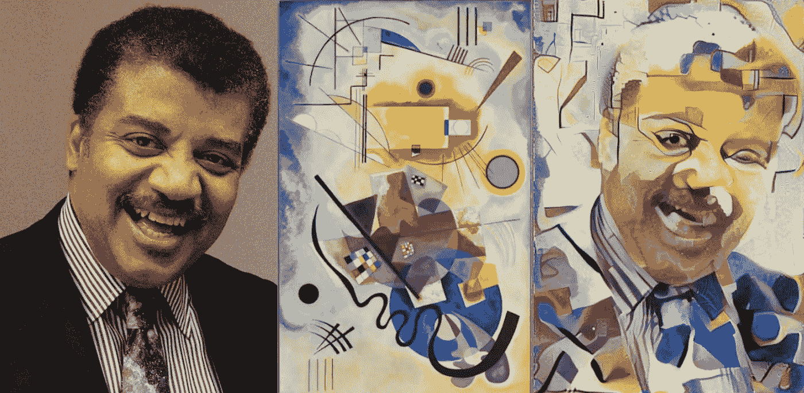

# 莎士比亚英语的机器翻译

> 原文：<https://towardsdatascience.com/machine-translation-to-shakespearian-english-189c8690b252?source=collection_archive---------4----------------------->

## 写作风格转换的尝试

## 背景

如果你一直在关注深度学习的最新发展，你可能会遇到 [*艺术* *风格转移*](https://harishnarayanan.org/writing/artistic-style-transfer/) *。*这是一种使用图像 A 的内容，以图像 b 的风格创建新图像的技术。例如，下面是从康定斯基的一幅画到尼尔·德格拉斯·泰森的一张照片的风格转换结果。



Source: [https://research.googleblog.com/2016/02/exploring-intersection-of-art-and.html](https://research.googleblog.com/2016/02/exploring-intersection-of-art-and.html)

深度学习在转移言语风格方面也取得了成功。给定一个一分钟的某人说话的音频剪辑， [Lyrebird](https://lyrebird.ai/demo/) 能够捕捉到那个人的说话风格，并通过模仿他的声音让他说任何话。

## 动机

我很好奇风格转移是否也适用于书面文字。这个想法是将英语句子打扮成不同作者的风格，无论是华丽的诗歌还是生硬的散文，同时保留其意义。互联网搜索没有找到任何方法，但我发现我可以让神经机器翻译(NMT)适应我的目的。

我不是在两种不同的语言之间翻译，而是训练一个神经网络从现代英语翻译成莎士比亚的英语。训练数据是莎士比亚的戏剧和在 sparknotes.com 和 enotes.com 可以得到的相应的现代英语翻译。

## 结果

我把这个翻译应用到泰勒·斯威夫特的新歌《看你让我做了什么》标题翻译过来就是“你让我做了什么？”这是古老的莎士比亚风格，忠实地保留了原来的意思。这是这首流行歌曲完整的第一节和翻译。

```
Song lyrics                        | Shakespeare translation I do not like your little games.   | i do not like your little dry .
Do not like your tilted stage.     | do not like thy mind .                          
The role you made me play.         | the offence you made me .     
Of the fool, no, I do not like you.| no , no , i am not like you .                   I don't like your perfect crime.   | i do so much as thou art .                      
How you laugh when you lie.        | how thou dost lie .                 
You said the gun was mine.         | you say the seas was mine .                     
Isn't cool, no, I don't like you.  | no cool , no , i protest you .
Oh, look what you made me do       | o , look you , look you , what                              >                                    you make me do ?
Look what you made me do           | what thou hast made me do ? 
```

## 方法

谷歌研究博客 5 个月前发表了一篇文章[介绍了一个教程，展示了如何在 Tensorflow 中构建一个高质量的翻译模型。用他们的话说，](https://research.googleblog.com/2017/07/building-your-own-neural-machine.html)

> 本教程旨在使这个过程尽可能简单，从 NMT 的一些背景知识开始，通过代码细节来构建一个普通的系统。然后深入到注意力机制[3，4]，这是让 NMT 系统处理长句的一个关键因素。最后，本教程详细介绍了如何复制谷歌 NMT (GNMT)系统[5]中的关键特性，以便在多个 GPU 上进行训练。

谷歌兑现了自己的承诺，提供了一个易于理解的教程。假设您有硬件，只需执行几个 python 脚本就可以得到翻译模型。使用它们的默认值，我训练的翻译模型是一个 2 层 LSTM seq2seq 模型，具有 128 维隐藏单元、丢失和注意机制。以下是我从解释 NMT 如何工作这一节中得到的关键信息。

1.  他们的方法是将整个句子作为一个翻译单位。这与基于短语的翻译不同，基于短语的翻译将句子拆分成短语并独立翻译。因为它考虑整个句子，所以它可以在具有长期依赖性的部分上表现得更好，比如性别一致。
2.  他们使用编码器-解码器架构。在*编码*步骤中，网络构建了一个“思维向量”,它将源语言中的单词编码成句子的意思。在*解码*步骤*、*中，“思维向量”被一次一个单词地投射到目标语言。递归神经网络(RNN)用于编码器和解码器，这是顺序数据的自然选择。


Encoder and decoder RNNs. <s> marks the boundary between encoding and decoding. Source: [https://github.com/tensorflow/nmt](https://github.com/tensorflow/nmt)

3.如果你认为上面的图表有太多的箭头，你并不孤单。对于长句来说更糟，单一固定大小的隐藏状态成为信息瓶颈，性能受到影响。一种解决方法是使用*注意机制*在目标单词和源单词之间建立直接的快捷连接。注意力通过编码的源向量上的加权分布来捕捉，该加权分布指示与目标单词的相关性。


Attention mechanism. Source: [https://github.com/tensorflow/nmt](https://github.com/tensorflow/nmt)

## 结论

莎士比亚的译者远非完美，但如果数据可用，这是一个潜在的写作风格转换的途径。它需要用两种不同的写作风格来表达相同内容的两个语料库，这是对可用风格数量的一个主要限制。真正的写作风格转变的过程从来都不是一帆风顺的。