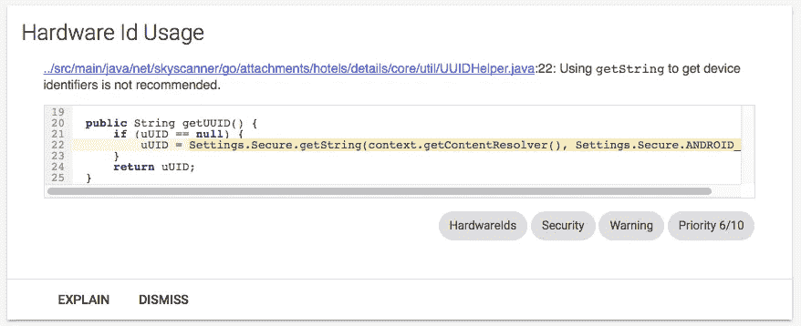

# 神奇的虫子和在哪里可以找到它们

> 原文：<https://towardsdatascience.com/magical-bugs-and-where-to-find-them-3177a066a3db?source=collection_archive---------5----------------------->

*作者加博尔·巴科斯*

Magical bugs and where to find them

每个人都想尽可能快。开发功能，然后立即发货，同时获得反馈，收集发现并改进一切。我们 Skyscanner 的移动开发团队也喜欢这样操作，但正如林哥·斯塔尔曾经唱过的，“你知道这来之不易。”

我们的代码库正在快速增长(现在没有外部依赖的 iOS 代码为 496，682 行，没有 XML 的 Android 代码为 526，076 行)。而且，我相信你知道，更大的代码库不支持快速迭代。因此，我们的发布周期变得更慢，并且在从开发分支中分离出来之后，需要花费更多的时间来创建稳定的发布候选版本

# 寻找解决方案

有两种可能的方法来构建静态代码分析系统。

1.  **被动方式**:当你在收集信息，然后试图根据你的发现采取行动。然而，这是一种特别的方法，因为它只是简单地分析项目，所以并不总是完全完整的。作为一种提供系统概述的方式，这是很有用的，但是如果有太多的问题或者项目太大，数据可能是压倒性的，并且最终是无用的。
2.  **主动方式**:当你故意寻找问题时，如果有任何违反，你就破坏了这种构建。但是它必须集成到构建过程中，否则开发人员可能会忽略它。例如，如果在创建拉请求的集成期间出现问题，那就太晚了。给出一个清晰而直接的信号是至关重要的。

在理想情况下，这两种方法可以而且应该共存。换句话说，扫描整体健康状况，如果有违规，就中断构建。我们尝试这样做，首先扫描，然后分析项目，但最终有太多的问题，我们无法制定行动要点。甚至不知道从哪里开始，所以我们放弃了这种方法，采用了一种主动的静态代码分析系统。你可以在下面找到主动方法的确切流程。

Flow of the active approach we took

首先，我们只关注 iOS 和 Objective C。我们从 OCLint 等可用选项中选择 Clang 作为我们的框架，因为这是编译器，它已经指出了开箱即用的问题。Clang 带有一个广泛的诊断框架，并有一个广泛的警告标志列表。为了利用这一点，需要为项目修改编译器标志。有一个预定义的警告集已经打开，但我们可以启用新的警告或警告组，最终我们可以将这些警告升级为错误。

修复我们自己的域是范围，所以我们排除了第三方库，只关注我们的内部组件，导致 43 个模块需要配置相同的规则集。我们创建了一个简单的脚本来修改 xcconfig 文件中的“Other C Flags”部分，用于那些模块的目标配置，以及我们希望提升为错误的相关警告数组。如果需要手动更改，可以在 Xcode 的 Targets/Build Settings/Other C Flags 路径中找到它。有了这种方法，开发人员可以专注于错误标记，而不必知道脚本是如何工作的。每个错误应该看起来像下面的模式-Werror= <warning flag="">。所以这些字符串需要添加到配置中。从技术上讲，我们迭代相关的构建目标，并以编程方式将构建的警告标志添加到构建配置中。使用这种方法，Xcode 项目文件在目标和模块之间是一致的。</warning>

# 执行

正如我已经提到的，我们在应用程序中有超过 9000 个警告，当我们启用“每个警告都是错误”标志(-Wall)时，结果是压倒性的。显然，我们无法处理这么多的错误。所以我们创建了一个编译器已经指出的警告列表——这是我们要整理的第一组规则。比如 Clang deprecated-declarations 警告，它指出 Objective-C 方法声明中的 C 样式参数是不推荐使用的。或者 Android ObsoleteLayoutParam，如果给定的 layout_param 不是为给定的布局定义的，则表明该问题，这意味着它不起作用。

五个团队自愿修复所有这些问题，所以我们每周组织一次警告消除会议，每个团队一个人参加四个小时。这段时间过程变化很大。我们挑选了 2-3 个错误，并逐一启用和修复它们。显然，在有些情况下，修复不是一个选项，所以在这些情况下，我们抑制了错误，但这是我们采取的最后一个选项。最大的问题是修复之前修复的问题，以阻止多米诺骨牌效应。

这里我想强调一下反馈回路的重要性。我们尝试了各种错误可视化的方法，比如只签入一种构建类型，或者只在 CI 时间签入，或者在特定的构建时间签入特定的规则集。最终，在构建时启用的所有东西都赢了，因为开发人员及时收到了反馈，而且一点也不麻烦(尽管我们认为可能会有麻烦)。此外，在开发期间检查代码是不够的。在 CI 期间也必须对其进行检查。我们很幸运在编译器中内置了诊断系统——两者都是免费的——但是 CI 时间错误可视化需要一个工具。为此，我们使用了 [Danger](http://danger.systems/) 插件，这是一个非常棒的工具，可以在创建合并请求时自动执行各种操作。从技术上讲，我们创建了一个关于编译器错误的日志，然后 Danger 对它进行解析，并发回一条关于构建健康的消息，因此我们能够将合并请求中存在的问题作为一条注释来查看。

一旦我们在 iOS 上实现了坚如磐石的框架，我们就转向了我们的 Android 应用。幸运的是，Android 自带了一个简单的静态代码分析工具，叫做 Android Lint。它是开发工具链的一部分，可以作为命令行工具使用，也集成在 Android Studio 中。基本上有一个 lint.xml，您可以在其中修改问题的严重性，您需要做的只是从 gradle 构建脚本启动 lint 检查器。

该工具会生成一份非常详细的报告，说明问题是什么、在哪里找到问题以及问题的严重性。由于描述和元数据非常清晰地阐明了问题，问题的分析变得更快更容易。此外，由于存在问题优先级，所以更容易知道先解决什么，然后再解决什么。可以计算一个警告熵，并配置构建脚本在这个熵变得更高时停止。有了这个功能，最终有可能自然地消除每一个警告。然而，由于我们侧重于主动警告删除，因为我们不需要这个功能。

Hradware ID Usage

# 未来计划

经过六周的努力，我们启用了 54 个错误警告标志，涵盖了我们所有的 9000 个 Objective-C 编译器警告。因为这是多个团队的努力，对公司文化也有影响。开发人员开始为新发现的问题添加标记，并自己修复这些问题。最初，修复缺陷和重构代码并不是一项受欢迎的任务。例如，有一种情况是，需要对一个模块进行完全重组。所以我们意识到保持团队精神对系统本身同样重要。我们不仅试图促进进展，还试图充分参与每一次迭代。

对于 Android，我们遵循之前的流程。因此，我们创建了一个问题列表，然后将它们一个接一个地提升到错误级别，然后修复它们。项目中的默认警告要少得多，因此我们在 5 周内修复了 1658 个警告，这导致了 52 个问题类型的使用。Android Studio 使用自己的 lint 规则集，可以单独配置。让这些 linters 相互同步是很重要的，以便在开发时而不仅仅是构建时看到新的规则集。

从我们之前的十二个版本中，有五个按时结束了；它们在预定的一周内推出。有了静态代码分析支持的一些过程变更，六个中有五个是准时的，所以我们的发布时间改进了很多，因为稳定期的问题减少了很多。

我们不会就此止步。我们计划在系统中添加新的标志，我们打算删除剩余的非客观警告，并达到零状态。一旦我们到达那里，我们将试验“零警告策略”，即没有拉请求可以与错误旁边的警告合并。也有其他工具可以试验，比如从脸书推断。更不用说符号执行是一个有待发现的广阔的新领域。o 我们将继续我们的旅程，找到那些讨厌的缺陷，使我们的应用程序更容易和更安全。

我们对未来寄予厚望。

# **喜欢你听到的吗？与我们合作**

我们在 Skyscanner 以不同的方式做事，我们正在全球办事处寻找更多的工程团队成员。看看我们的 [Skyscanner 职位](https://www.skyscanner.net/jobs/)寻找更多空缺。

# 关于作者

我叫 Gabor Bakos，是一名移动开发人员，在布达佩斯的应用支持团队工作。我们试图让我们的开发人员的生活更容易，代码质量是我多年来一直关注的一个领域。工作之外，我是一个真正喜欢游戏的 Crossfit 爱好者，也是我 3 岁的 sheltie Merlin 的理想训狗师。

Gabor Bakos