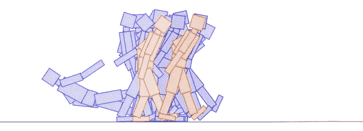
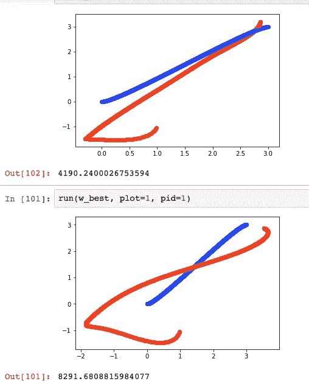

# 让机器人学会移动，第一部分——进化算法

> 原文：<https://towardsdatascience.com/making-a-robot-learn-how-to-move-part-1-evolutionary-algorithms-340f239c9cd2?source=collection_archive---------4----------------------->

## 自然如何激发工程。

这是一系列文章的第一部分。来个简短的介绍， [*看我的介绍帖*](https://medium.com/towards-data-science/making-a-robot-learn-of-to-move-intro-2bcf3c3330df) *。你可以在* [*这个 GitHub 库*](https://github.com/normandipalo/intelligent-control-techniques-for-robots) *上找到这个项目的代码。*

技术和工程从大自然的伟大设计中获取灵感并不罕见。在这篇文章中，我将谈论**遗传**或**进化** **算法**，它们在机器人学以及更广泛的计算机科学中的作用。进化算法的灵感来自于**进化**和**自然** **选择**的自然过程。进化论是一个广为人知的理论，它解释了动物如何适应周围的环境，发展特殊的身体特征，使它们更适合那个环境。当父母混合他们的基因产生后代时，就会发生这种情况。基因也经历随机变化:这意味着新一代的生物可以发展出新的特殊特征，使它们更适应环境。适者生存解释了那些动物倾向于活得更长，繁衍后代，产生具有相同进化基因的新一代。

我们如何利用这个迷人的想法？进化算法基于相同的概念。

假设你有一个问题，你想找到一个解决方案。每一个可能的解决方案都是由一系列参数组成的。我们接着定义一个**适应度** **函数**， *h* ( *w* )。该函数定义了我们的解决方案有多好，即我们的参数组合。给定初始随机解，我们如何找到更好的解？正如进化所建议的，我们**选择**和**组合**最好的解决方案，找到一个与两者共享参数的新方案。在这之后，我们在那些参数中做一个小的随机**突变**。我们重复这些步骤几次，找到新一代的解决方案，并测量这些解决方案使用适应度函数的效果。在一些迭代选择之后，遗传组合和随机变异将产生具有非常高性能的解。很神奇，对吧？

An iteration of a genetic algorithm.

这些算法可以用来为机器人设计一个控制器，即使我们没有关于机器人的物理信息，也可以使机器人高精度地移动。

先简单介绍一下任务:**轨迹** **跟踪**是机器人操作手的常见任务。我们希望手臂的每个关节都及时遵循预定义的轨迹。问题是，我们不知道在这些关节上使用哪个扭矩来使它们精确地遵循这个轨迹，因为由于动力学耦合，移动一个关节可能会干扰另一个关节的运动。那么，我们如何找到一个函数来定义机器人的**当前** **状态**，每个关节的期望运动，以及在该状态下实现该运动所需的**扭矩**之间的映射呢？数学上定义为 *f* ( *状态*，*加速度* *期望* ) - > *τ，*，通常由逆动力学模型得到。举个例子，想象一下:你有一个由三个关节组成的机器人手臂。每个关节都有一个特定的角度，假设每个关节都是 0 度。在时间步 *t+1，*你的期望轨迹希望角度为-1，0，1。因此，你希望第一个有一个负的角加速度，第二个零加速度，第三个正加速度。要实现这一点，你需要提供哪些扭矩作为输入？有人会说，一个负一，零，一个正一。但这并不容易:由于动力学耦合，如果其他关节移动，第二个关节也会移动，所以即使加速度为零，你也需要一个扭矩来平衡动力学效应！

用一系列参数逼近任何非线性函数的一种方法是使用**神经**网络**网络**。神经网络可以用一系列权重来逼近任何类型的函数，进行矩阵乘法并使用非线性。但是，我们如何找到正确的权重/参数来实现我们想要的功能呢？通常，使用**梯度** **下降**算法训练神经网络，如**反向传播**。在我们的例子中，问题在于网络的误差是不可微的:这意味着，当它在输入中接收当前状态和期望的加速度时，它输出特定的扭矩。但是我们不知道应该给系统多大的扭矩。我们没有在经典监督学习中用于计算梯度下降的真实值。这意味着我们不知道如何调整我们的参数，我们不知道通常使用****偏导数使误差更小**找到的正确方向。**

****

**An example of a neural network.**

> ****选择**最优解，**结合**和**进化**参数，**测试**新解，保存最优解**

**这就是进化算法变得非常有用的地方。如上所述，我们可以通过计算机器人的轨迹与期望的轨迹相距多远(基本上，我们在每个时间步长对位置误差的范数进行积分)来了解解决方案有多好(即，我们输出期望扭矩的网络的参数)，然后我们可以组合并随机变异最佳性能参数组合的参数，即**基因**。在每一次迭代中，我们创造新的解决方案，进化出最好的解决方案。然后，我们在机器人身上运行这个遗传控制器，让它跟随我们的轨迹，计算总误差。如果误差比以前低，我们有一个新的最佳解决方案，我们存储并试图进一步发展！每次迭代的步骤都是一样的:**选择**最佳解，**合并**和**进化**参数，**测试**新解，存储最佳解。这样，通过遗传进化，我们找到了神经网络的最佳权重集，从而以生物启发的方式进化出了神经控制器。**

**有趣的是，一个只有两个隐藏层和大约 80 个神经元的小型神经网络如何能够在大约 50 次迭代中，通过进化算法演变成强大的控制器，而不需要计算一次导数。机器人因此一步一步地进化，发现移动和跟随轨迹的新方法。**

**在这里，我展示了一个期望的轨迹(蓝色)，以及机器人如何使用经典的 **PD 控制器**，或者使用**遗传进化神经网络控制器**(红色)来跟随它。注意后者不同的有趣行为。机器人在错误的位置和错误的速度下启动，向相反的方向前进，所以控制器必须转弯。**

****

**Genetic controller (up) and classic PD controller (down) trying to follow a trajectory, starting with an error both in position and velocity. Notice how the total error (the real value under the pictures) is an half with the evolved controller.**

**在这篇文章中，我简要描述了我和我的一个同事如何开发一个机器人的神经控制器，使用生物启发的算法，允许它以精确的方式移动，甚至不知道它自己的动态模型。你可以在这个 GitHub 仓库中找到这个项目的所有代码。**

**在接下来的文章中，我将展示使用新方法实现相同结果的其他技术。请随意评论或询问任何问题！**