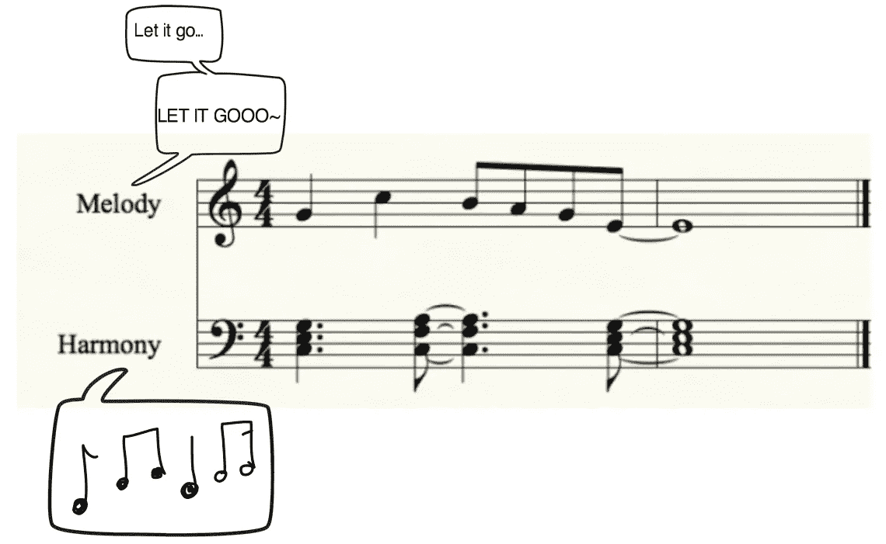
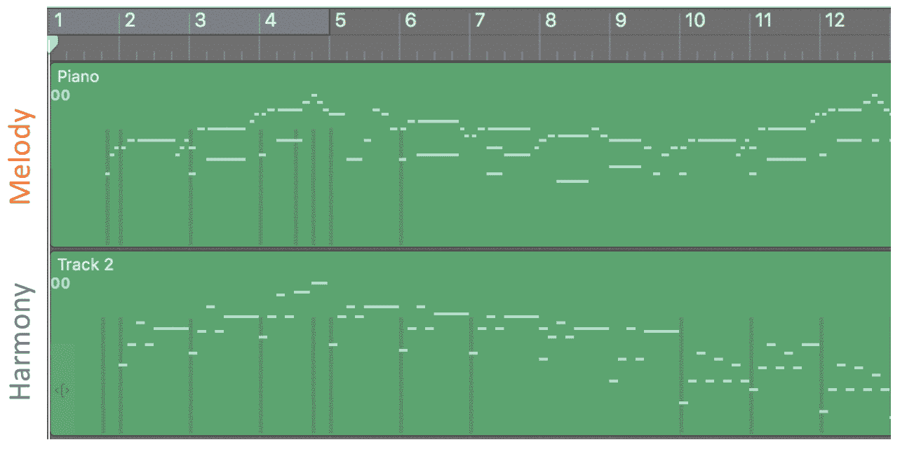
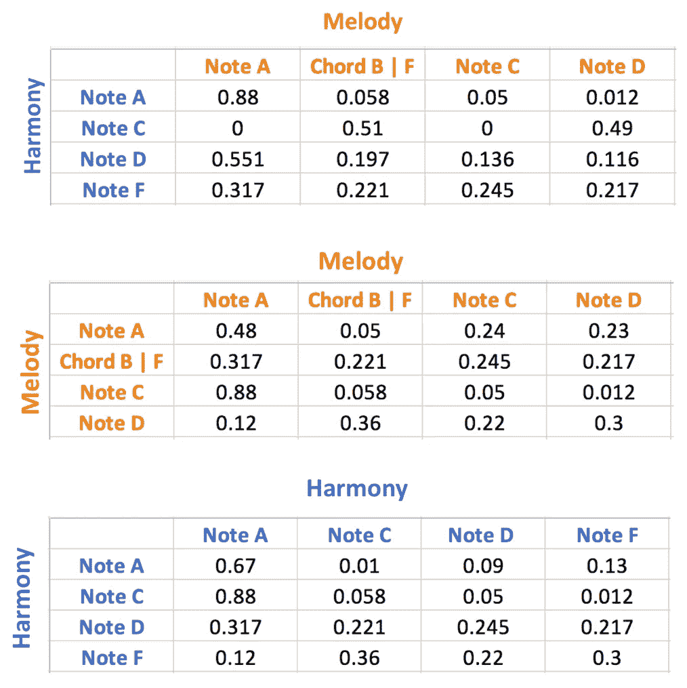
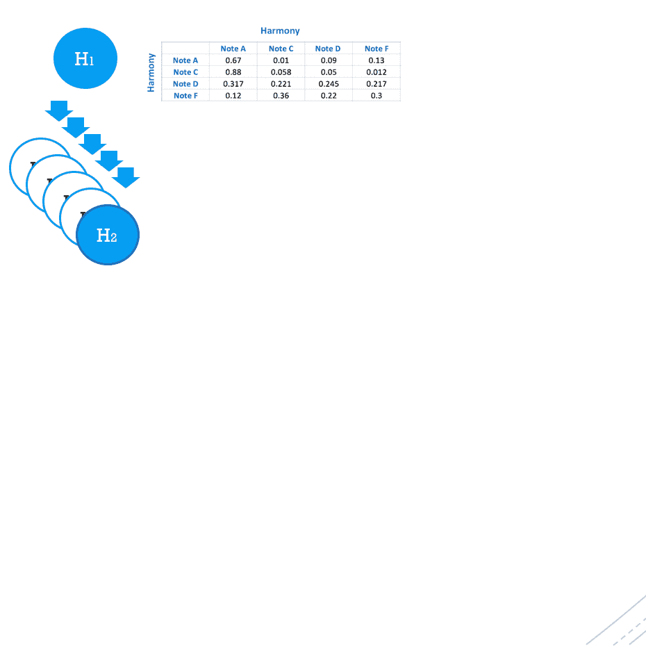
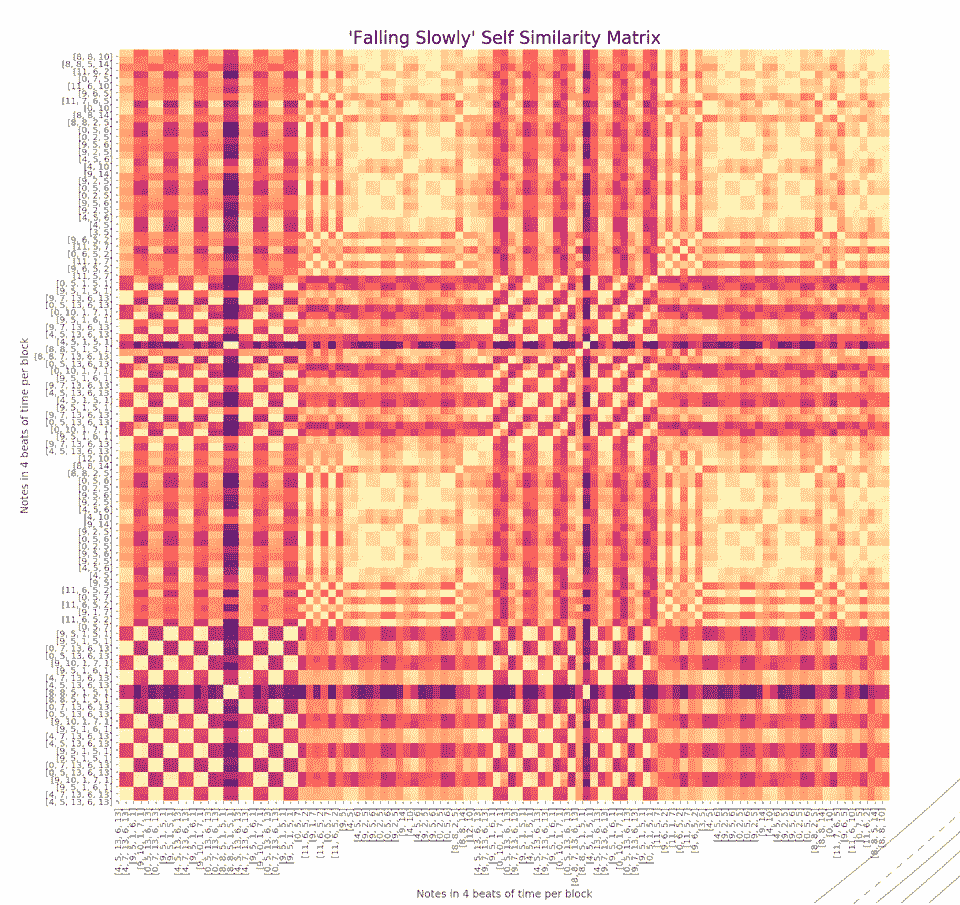
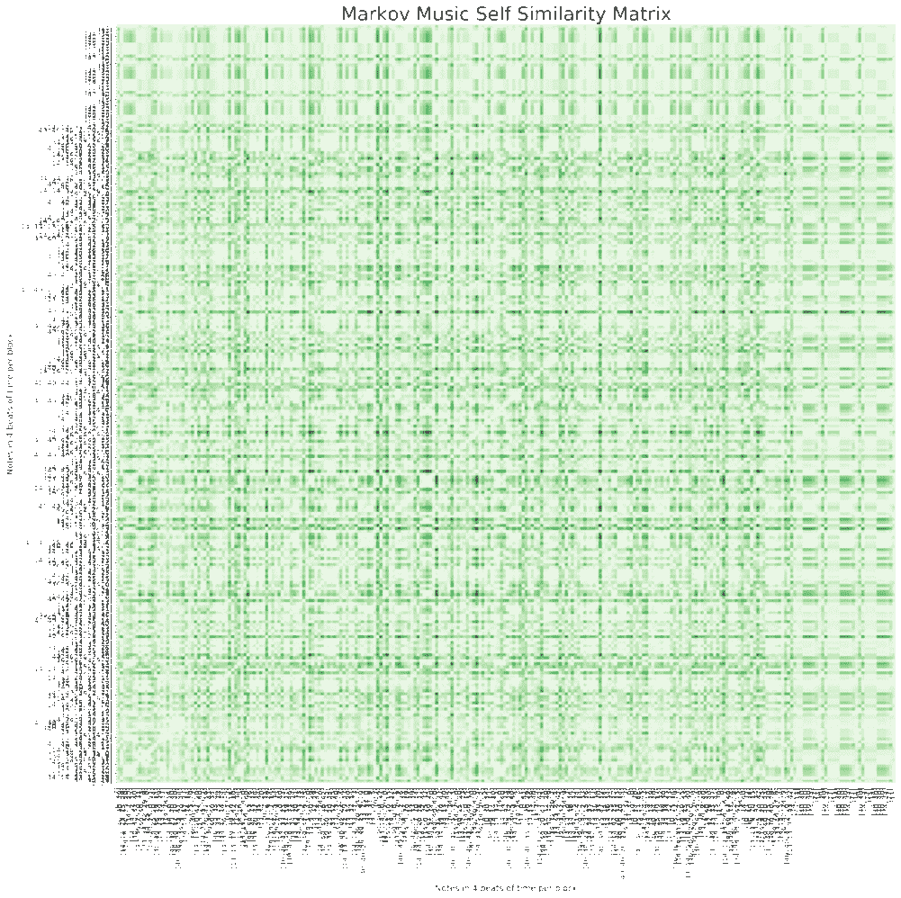
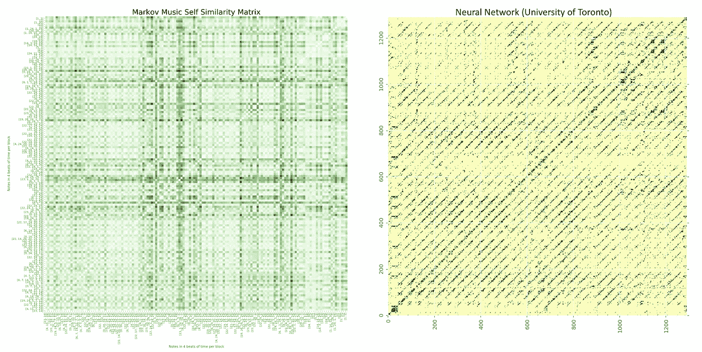
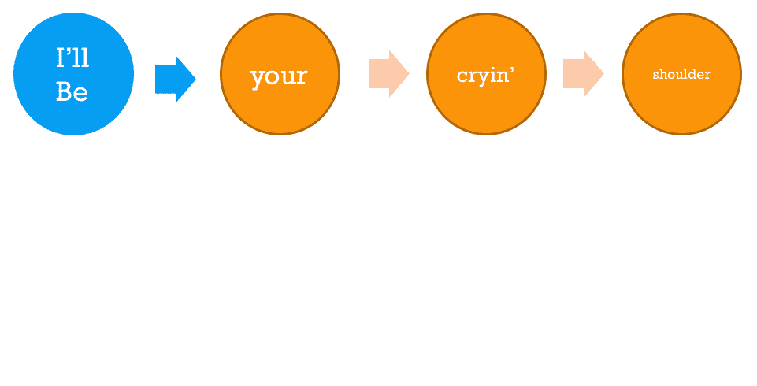

# 制作音乐:当简单概率胜过深度学习

> 原文：<https://towardsdatascience.com/making-music-when-simple-probabilities-outperform-deep-learning-75f4ee1b8e69?source=collection_archive---------5----------------------->

When a simple contestant competes against a deep army.

# 概述:我是如何发现一个利用深度学习制作音乐的问题，并通过创建自己的原创模型来解决的。

# 概述

> ***问题*** *:我是如何发现使用深度学习技术生成流行音乐的问题的。*
> 
> ***解决方案:*** *我如何构建了一个原创的音乐制作机器，它可以媲美深度学习，但解决方案更简单。*
> 
> ***评价:*** *我是如何创造出一个评价指标，能够从数学上证明我的音乐比深度学习的音乐“听起来更像流行”。*
> 
> ***一般化*** *:* *我是如何发现一种方法来一般化我自己的模型，应用于创作音乐以外的情况。*

*也请查看该项目的 YouTube 版本:*

> 编辑:我已经关闭了网站(EC2)，因为我必须继续支付费用。

# 笑点是

我做了一个简单的概率模型来生成流行音乐。有了客观的衡量标准，我可以说这个模型产生的音乐听起来更像流行音乐，而不是一些由深度学习技术产生的音乐。我是怎么做到的？我这样做，部分是因为我把注意力集中在我认为流行音乐的核心:和声和旋律之间的统计关系。

Melody is the vocals, the tunes. Harmony is the chords, the chord progression. In the piano, the melody is played by the right hand, and the harmony by the left.

# 问题是

在深入探讨他们的关系之前，我先来定义一下问题。我开始这个项目的简单愿望是利用深度学习(外行人称之为“人工智能”)创作流行音乐。这很快让我想到了 LSTMs(长短期记忆单元)，这是一种特殊版本的递归神经网络(RNN)，在生成文本和制作音乐方面非常受欢迎。

 [## 如何在 Keras 中使用 LSTM 神经网络生成音乐

### 使用 LSTM 神经网络创作音乐的介绍

towardsdatascience.com](/how-to-generate-music-using-a-lstm-neural-network-in-keras-68786834d4c5) 

但是随着我对这个主题了解的越来越多，我开始质疑应用 rnn 和它们的变体来产生流行音乐的逻辑。这个逻辑似乎是基于对(流行)音乐内部结构的几个假设，我并不完全同意。

一个具体的假设是和声和旋律之间的独立关系(以上是对两者的描述)。

以多伦多大学 2017 年的出版物为例:*来自 Pi 的歌曲:流行音乐一代的音乐似是而非的网络*(初航等)*。*在这篇文章中，作者明确地“假定……和弦是*独立的*给定的旋律”(3，斜体是我的)。基于这一规范，作者建立了一个复杂的多层 RNN 模型。旋律有自己的生成音符层(键和按键层)，它独立于和弦层。除了独立性之外，这种特殊的模式还决定了一代人在旋律上的和谐。这只是意味着和声依赖于音符生成的旋律。

Hang Chu, et al.’s stacked RNN model. Each layer is responsible for addressing different aspect of a song.

这种建模对我来说感觉很奇怪，因为它似乎不太接近人类创作流行音乐的方式。就我个人而言，作为一名受过古典音乐训练的钢琴家，在没有首先考虑和声音符的情况下，我绝不会考虑写下旋律音符。这是因为和声音符定义和限制了我的旋律音符。很久以前，Axis of Awesome 在他们曾经风靡一时的 YouTube 视频中展示了这个想法。

Video demonstrating how different pop melodies are all dependent on the same four chords.

他们的视频展示了西方流行音乐的一个定义属性:和声，或那四个和弦，强烈地决定了旋律将会是什么。在数据科学语言中，我们可以说条件概率调节和解决了和声和旋律之间的统计关系。这是因为旋律音符自然地依赖于和声音符。因此，有人可能会认为和声音符在本质上限制并允许在特定的歌曲中选择旋律音符。

# 解决方案

我喜欢构建自己的解决方案来解决复杂的问题。因此，我决定构建自己的模型，以自己的方式捕捉音乐数据丰富的底层结构。我开始这样做的时候，关注的是支配不同种类音符之间关系的预定概率命运。一个例子就是我上面提到的——和声和旋律之间的“垂直”关系。

## (处理)数据

对于数据，我使用了 20 首不同的 midi 格式的西方流行歌曲(完整的歌曲列表可以在这里找到:[www.popmusicmaker.com](http://www.popmusicmaker.com))。

使用 music21 python 库，我基于马尔可夫过程对这些 midi 文件进行了大量(但不完全)处理。这使我能够提取输入数据中不同类型音符之间的统计关系。具体来说，我计算了音符的转移概率。这基本上意味着，当音符从一个音符过渡到下一个音符时，我们可以得到该过渡发生的概率。(下面有更深入的解释)

midi: a digitized version of a song.

首先，我提取了和声音符和旋律音符之间的“垂直”转换概率。我还根据数据集计算了旋律音符之间所有的“水平”转换概率。我也为和声音符完成了这个任务。下图展示了音乐数据中不同类型音符之间的三种不同过渡矩阵的示例。

Transition Probabilities, examples. Top: between Harmony and Melody notes — Middle: between Melody notes — Bottom: between Harmony notes

## 模型

使用这三个概率矩阵，我的模型将遵循这些简单的方向。

> 1.从数据中随机选择一个和声音符。
> 
> 2.使用上面看到的第一个概率矩阵，根据那个和声音符选择一个旋律音符。
> 
> 3.使用上面看到的第二个概率矩阵，根据旋律音符选择一个旋律音符。
> 
> 4.重复步骤 3，直到某一截止线。

Steps 1–4.

> 5.使用第三概率矩阵基于先前的和声音符选择新的和声音符。
> 
> 6.重复步骤 1-4，直到某一截止线。

Steps 5–6.

这是这 6 个简单步骤的一个具体例子。

1.  机器随机选择和声音符 F。
2.  和声音符 F 有 4 个旋律音符可供选择。使用第一转移矩阵，它可能选择旋律音符 C，因为旋律音符 C 具有相对高的可能性(24.5%的机会被选择)。
3.  旋律音符 C 将转向第二过渡矩阵以选择下一个旋律音符。它可能会选择旋律音符 A，因为它的概率很高(88%)。
4.  步骤 3 将继续生成新的旋律音符，直到预设的截止线。
5.  和声音符 F 将转到第三个过渡矩阵来选择下一个和声音符。它可以基于它们相对高的可能性选择和声音符 F 或和声音符 C。
6.  将重复步骤 1-4，直到某个预设的截止线。

以下是通过这种架构产生的流行音乐的例子(来自[www.popmusicmaker.com](http://www.popmusicmaker.com)):

# 估价

现在到了困难的部分——如何评估不同的模型。毕竟，我的文章声称简单概率可以胜过神经网络。但是我们如何从一个神经网络模型评估我的模型呢？怎么才能客观的宣称我的音乐“更像流行”而不是人工智能制作的音乐？

要回答这个问题，我们首先要问的是，最初到底是什么定义了流行音乐。我已经给出了第一个定义:和声和旋律之间的统计关系。但是流行音乐还有另一个定义元素。这就是为什么流行音乐有一个清晰的开头、中间和结尾(引子、独唱、过渡、合唱、结尾等等)。)在一首歌曲中重复多次。

例如，“让它去吧，让它去吧，不能再让它回来了…”是在音乐的中间部分，而不是开始和结束。这一段在歌曲中重复了三次。

考虑到这一点，我们可以使用所谓的自相似矩阵。简单地说，自相似矩阵从数学上直观地显示了歌曲的开头、中间和结尾。下面是歌曲的一个自相似矩阵，*从电影里慢慢落下*一次。

Each tiny block represents every note played in four beats of time in the song. Each big block in 45 degree angle represents a segment of a song.

第一个蓝色集群代表歌曲的开始部分，而下一个黄色集群代表该歌曲的另一个片段。第一个和第三个聚类由于它们的(自)相似性而具有相同的阴影。第二个和第四个聚类由于其自身(相似性)而被相同地着色。

我做了 20 个这样的自相似矩阵，是我用来作为输入数据的 20 首流行歌曲。然后我让我的机器尽可能忠实地复制它们的结构(平均)(更多细节，请在评论中提问！).

# 结果

结果很说明问题。在自相似矩阵之前，我的机器产生的声音没有内部重复结构。但是在复制了输入数据的结构之后，你可以在我生成的音乐中看到这些边界，如下所示。

Before and after utilizing the self-similarity matrix.

与此相比，多伦多大学神经网络产生的流行音乐的自相似矩阵看起来是这样的:

这就是你如何比较和评估不同的模型——基于它们的自相似矩阵的边界！

# 一般化

我想解决的最后一个问题是泛化。通过概括，我问:我们如何才能概括我的数据驱动音乐模型，以便它可以应用于制作流行音乐以外的情况？换句话说，有没有另一个人造发明与我的流行音乐制作机有着相同的架构？

经过深思熟虑，我发现还有一种人类文化创造的数据内部也有这种结构——那就是流行歌词！

举个例子*我将是*爱德华·麦肯。它的一个片段是这样的:

> 我将是你哭泣的肩膀
> 我将是爱情的自杀
> 当我长大后我会变得更好
> 我将是你生命中最大的粉丝

让我们分解歌词，使用机器学习中相同的生成上下文。我们可以将“I'll be”作为语言模型中的第一个输入单词。这个二元模型会用来生成‘你的’，生成‘哭’，导致‘肩膀’。

接下来是一个非常重要的问题:下一句话的第一个词(另一个‘我会是’)是否依赖于最后一个词‘肩膀’？换句话说，第一句的最后一个字和下一句的第一个字有关系吗？

对我来说，答案是否定的。由于这个句子以‘should’结尾，下一个单词是基于前一个单词‘I’ll be’生成的。这是因为每个句子的第一个词被故意重复，表明每个句子的第一个词之间存在类似的条件关系。这些第一个单词成为下一个单词序列的触发点。

我发现这是一个令人着迷的发现。流行音乐和流行歌词似乎都将这种架构作为其数据的内部结构！是不是超级迷人？

你可以访问我的网站[www.popmusicmaker.com](http://www.popmusicmaker.com)来创作流行音乐和流行歌词。

这个项目的 github 在这里:【https://github.com/haebichan/PopMusicMaker 

如果您有任何问题，请随时联系我@【hj2444.columbia.edu 