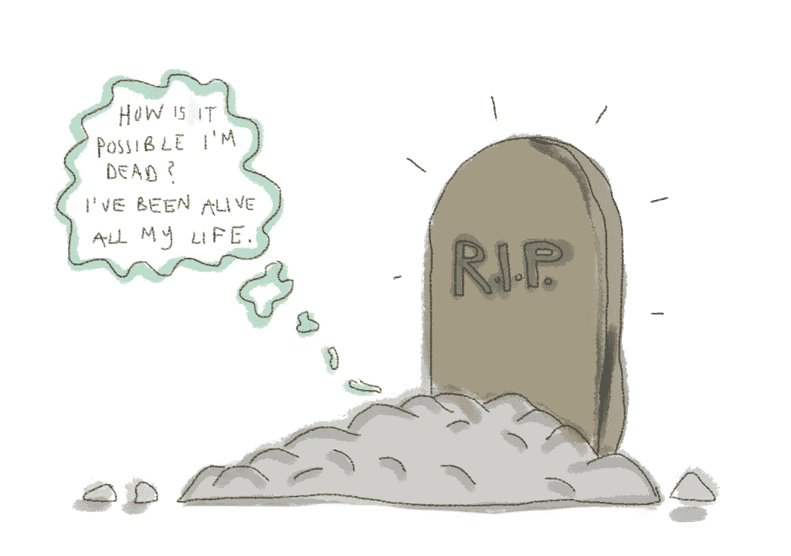

# 人类计划，上帝大笑:计划谬误

> 原文：<https://towardsdatascience.com/man-plans-god-laughs-the-planning-fallacy-ea9bcacc16f4?source=collection_archive---------1----------------------->

## 所以你打算看完整篇文章？让我想想…

从前，有一个男孩和一个女孩。他们在悉尼歌剧院有个约会。她像往常一样迟到了——意想不到的事情发生了——她无法立即找到她 100 种化妆品中的一种。(其他时候她找不到其他的，所以结果一样总是不一样。)

by [Jovana Đukić](https://www.instagram.com/jovanadukic/)

在等待的时候，他谷歌了关于这部歌剧的有趣事实来打动她。这是他在[维基百科](https://en.wikipedia.org/wiki/Sydney_Opera_House#Completion_and_cost)上找到的:

> “悉尼歌剧院原定 4 年，预算 700 万澳元。它最终花了 14 年才完成，耗资 1.02 亿澳元。”

“太酷了！”他想。她听后也这么说。在接下来的几个月里，他们经常使用同一个短语，所以他们决定结婚。(她喜欢他有趣的事实，他喜欢她迟到——所以他有足够的时间去发现它们。)

他与父亲离婚的固执的母亲警告他，他们有 33%到 50%的机会离婚。“不是我们，妈妈。我们非常相爱。”“当然，因为我和你父亲是出于仇恨才结婚的。”

他们还是结婚了，而且比一些婚姻做得更好。

> “没有什么能把我们分开。我们可能会再结婚十年。”——伊丽莎白·泰勒，在她和理查德·伯顿宣布离婚的五天前

但比大多数婚姻都糟糕。确切的说，比他们中的 67%到 50%还要差。

她得到的结婚礼物是一个可以存放化妆品的盒子。结果她不再迟到了；所以这家伙没时间去找有趣的事实。谁想在一段婚姻中，最有趣的事实是对你离婚的预测？

“不是我！”她抓起盒子扔在地板上。那天，盒子和婚姻都破裂了。

# 规划谬误

人们总是迟到，项目花费数百万而不是数千，战争花费数年而不是数月，为什么我妈妈总是带着满满一袋子杂货回家，不管她打算买什么？是规划谬误！

计划谬误的概念是由诺贝尔奖获得者丹尼尔·卡内曼和他的同事阿莫斯·特沃斯基首先提出的。它描述了过于乐观的计划和预测

*   不切实际地接近最佳情况
*   可以通过参考类似案例的统计数据进行改进。

by [Jovana Đukić](https://www.instagram.com/jovanadukic/)

在他的书《思考，快与慢》中，卡尼曼描述了下面的预测故事。他和他的同事正在设计一本在高中教授判断和决策的教科书。在一年中每周会面一次后，他们已经取得了一些进展:写了几个章节，构建了一个教学大纲的大纲，并进行了一些示范课程。

他们只是在讨论如何估计不确定的量，所以卡尼曼提议每个人在完成课本之前写下他们对持续时间的估计。结果集中在两年左右。

然后卡尼曼转向课程专家(两人估计和其他人一样)问他:“构建一个课程通常需要多长时间？”

“七到十年。更不用说之前几乎有一半的群体放弃了，”他回答道。

卡尼曼进一步挖掘道:“与其他群体相比，我们有多优秀？”

“略低于平均水平，”课程专家说。过了一会儿，他扬起眉毛，意识到他的估计有矛盾。低于平均水平的群体如何超过其他人三年以上？

它可以，但假设它会是愚蠢的。

出现这种差异是因为他使用了两种不同的计划策略。当写下他的估计时，他在脑海中搜寻信息*，试图想象未来。后来，在卡尼曼的帮助下，他根据来自*世界之外的*的类似情况的统计数据做出了预测。*

# 内部视图

这是一个小组成员写下他们的评估的策略。该战略关注我们的具体情况，并在我们的经验中寻找证据。这是推断——假设现有的趋势将会继续。有一个问题:

> "未来不再是过去的样子了"—约吉·贝拉

“这种(过于乐观的预测)的原因是，我们通过压缩可能的不确定状态的范围(通过减少未知的空间)来低估不确定性，”纳西姆·尼古拉斯·塔勒布在他的畅销书《黑天鹅》中解释道。换句话说，我们低估了我们所不知道的。在卡尼曼的情况下，这些可能是更复杂的章节，疾病，官僚问题…数百件你甚至无法想象的事情。

> "意外总是朝着一个方向推进:更高的成本和更长的完成时间."—纳西姆·尼古拉斯·塔勒布

任务越长、越复杂、越独特，预测就越难。想想最基本的，从椅子上站起来。如果你不想再坐着了，你可以预测你什么时候会站起来——除非你的朋友喜欢用胶水恶作剧。

另一边是战争。每场战争都有自己的属性:人员、地形、天气、战术、技术。它们通常持续多年(尽管预测时间较短)。更多的时间意味着更多意想不到的机会。如果日本可以预测他们核武器的发展，他们会攻击美国吗？

即使在今天，战争预测也悲惨地失败了。布什政府低估了伊拉克战争费用超过 30 倍；目前的支出约为 2 万亿美元(最初为 600 亿美元)，并且还在增长。

如果说从内心深处可以学到什么，那就是霍夫施塔特定律:

> "它总是比你想象的要长，即使你把霍夫施塔特定律考虑在内."道格拉斯·霍夫施塔特

# 外面的景色

使用类似项目的统计信息是解决规划谬误的方法。一般来说，你会面临和其他人一样多的意想不到的麻烦。

称为参考类预测的方法是由 [Flyvbjerg](https://papers.ssrn.com/sol3/papers.cfm?abstract_id=2238013) 提出的。它包含三个步骤，我在其中添加了卡内曼故事中的实际例子:

1.  **确定一个合适的参考班**:其他课程项目。
2.  **获取参考类的统计数据，生成基线预测** : 7 到 10 年，40%失效率。
3.  **利用案件具体信息调整基线预测**:有没有证据表明我们组比其他组好/差？

卡尼曼的团队用了八年时间完成了这个项目，接近最快的项目。那些年，很多事情都变了:他不再是这个团体的一员，对教授决策也没什么兴趣。教科书从来没有出现在学校的长凳上。

在某些情况下，我们已经在某种程度上使用了外部视图。想想寿命预测。通常使用平均寿命，并根据生活方式、遗传和健康状况增加或减少几年。一个人不会看着自己的经历宣布:“我感觉很好，我还没有死，根据这个证据，我会永远活着。”

by [Jovana Đukić](https://www.instagram.com/jovanadukic/)

# 乐观偏见

规划谬误还有一个偏见；乐观偏见。总结如下:

> “我们中的大多数人认为世界比实际情况更好，我们自己的属性比实际情况更好，我们采纳的目标比他们可能实现的目标更容易实现。”—丹尼尔·卡内曼

我们不对称地感知事件。我们把成功归因于我们的技能，把失败归因于运气不好。但只针对我们自己和与我们密切相关的人，而不是其他人——这创造了[虚幻的优越感](https://en.wikipedia.org/wiki/Illusory_superiority)。

[研究人员](https://80000hours.org/2012/11/do-you-think-you-re-better-than-average/#fn:4)发现，90%的司机认为自己比普通司机强，大多数学生认为自己比普通学生更聪明。按照这种逻辑，我们为什么不能成为成功的人呢？

因为每个人都认为自己有点特别，但这并不能让任何人特别。

> “你有没有注意到，开车比你慢的人是白痴，比你快的人是疯子？”—乔治·卡林

这个刚刚单身的男人出去喝啤酒来治愈他受伤的心灵。他想赢回他的乐观(偏见，但他不承认)。当他转向投篮时，他打偏了。他对未来并不乐观，反而对过去感到悲伤。朋友们还没来得及阻止他(他们正忙着检查手机)，手机已经到了他手里。

“我 miz u；“d”是开始把破裂的婚姻粘在一起的信息。(她睡着了，所以没有立即回应——我们都知道谁喜欢等待。)

然而，他们不需要把化妆盒粘在一起。他买下它作为他们再生爱情的标志——这是让她再次说“太酷了”的东西。

对他们来说，“哦，太酷了”离说“我愿意”不远了。

他们计划好了，上帝笑了。

*原载于 2017 年 12 月 29 日* [*新锐*](https://issuu.com/newedgemagazine/docs/newedge_09) *。*