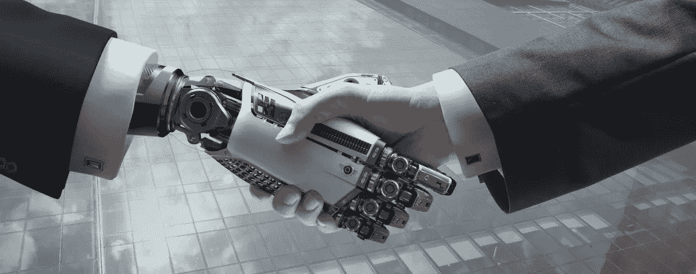

# 人与机器:理解人工智能的危险

> 原文：<https://towardsdatascience.com/man-vs-machine-understanding-the-perils-of-artificial-intelligence-eb3caf9ce6b0?source=collection_archive---------2----------------------->

当谈到人工智能(AI)的话题时，世界显然分成了两派:一派强烈认为人工智能是件好事，另一派强烈否认这一点。双方都有合理的论据。我个人在这个问题上的观点仍然是，赞成和反对的观点都与环境有关——谁在开发它，用于什么应用，在什么时间框架内，为了什么目的？没有明确的黑与白。这也意味着，随着人工智能领域的进一步发展，有机会主动识别、隔离和解决风险。

这有助于理解争论的双方。所以让我们试着仔细看看反对者说了什么。最常引起争论的担忧可分为三大类:

**A.** **大规模失业**:这可能是在人工智能背景下强调的所有风险中最切实、最广为人知的。技术和机器代替人类做某些类型的工作并不新鲜。我们都知道，由于技术的发展，整个职业正在减少，甚至消失。工业革命也导致了大规模的失业。

然而，尽管人们担心就业，但在过去的 3-4 个世纪里，人们普遍承认，这些技术进步通过创造新的途径、降低价格、增加工资等方式，大大弥补了短期的就业损失。

然而，今天的故事非常不同。请考虑以下情况:

*   越来越多的经济学家不再相信，从长期来看，技术会对整体就业产生积极影响。
*   仅在过去十年中，中低技能工作的流失在几个领域都很严重——令人不安的事实是，这些工作大多不是受到人工智能的影响，而只是受到自动化的影响——人工智能的影响预计会更大。
*   多项研究预测技术进步将导致大规模失业，包括 2016 年的一份联合国报告称，预计发展中国家 75%的工作将被机器取代。

失业，尤其是大规模的失业，是一件非常危险的事情，常常会导致大范围的社会动荡。因此，人工智能在这一领域的潜在影响需要非常仔细的政治、社会学和经济学思考，以有效地应对它。

奇点:奇点的概念是人们想象中只能在未来科幻小说中看到的东西之一。然而，从理论上说，今天这是一个真正的可能性。简而言之，奇点是指人类文明中的一个点，当人工智能达到一个临界点，超过这个临界点，它就会进化为一种超越人类认知能力的超级智能，从而对我们今天所知的人类存在构成潜在威胁。

虽然围绕机器智能爆炸的想法是一个非常中肯和广泛讨论的话题，但与技术驱动的失业不同，这个概念仍然主要是理论性的。围绕这一思路的两个主要问题尚不明确，即

*   这个临界点在现实中真的能达到吗？
*   如果是的话，在中短期内可能发生吗？

**C.** **机器意识**:与前两点不同，这两点可以被视为与人工智能进化相关的风险，机器意识方面或许最好被描述为一个伦理难题。这个想法涉及将类似人类的意识植入机器的可能性，使它们超越*‘思维’*的领域，进入*‘感觉、情感和信念’*的领域。

这是一个复杂的话题，需要深入研究哲学、认知科学和神经科学的融合。“意识”本身可以有多种解释，集合了过多的属性，如自我意识、心理状态的因果关系、记忆、经验等。要让机器达到类似人类的意识状态，需要复制人脑中神经层面发生的所有活动——这绝不是一项简单的任务。

如果要实现这一目标，就需要世界运作模式的转变。当今社会是一个完善的、结构化的系统，它指导着人们相互交往的方式。这个系统将需要一个重大的重新定义，以纳入与人类共存的具有意识的机器，以及两者之间的相互关系。这在今天听起来有些牵强，但像这样的问题需要现在就思考，以便能够影响我们在人工智能和机器意识方面的发展方向，而事情仍然处于“设计”阶段。

虽然以上都是中肯的问题，但我相信它们不一定会超过人工智能的优势。当然，有必要系统地解决它们，控制人工智能发展的路径，并将不利影响降至最低。在我看来，最大和最迫在眉睫的风险实际上是第四项，在讨论人工智能的陷阱时，并不经常被考虑在内。

**D.** **寡头:**或者换个说法，*控制*的问题。由于人工智能的本质——它需要在技术和科学上的巨大投资——现实中只有少数组织(私人或政府)能够以可扩展的方式跨越一系列广泛的应用程序，将人工智能纳入主流。

除此之外，开发人工智能最重要的组成部分之一是持续的反馈和学习，这来自于拥有最大量的数据来获得反馈或学习。这是一个自我实现的良性循环——你拥有的数据越多，你的人工智能平台就越好，导致更多用户采用你的人工智能平台，而你获得更多数据进行更多学习。你认为谁会赢得这场比赛？同样，只有少数组织可能做到。无论小型新贵有多聪明，他们都没有多少空间与这些公司大规模竞争。

鉴于我们生活的巨大部分可能将由人工智能机器来控制，那些控制这种“智能”的人将对我们其他人拥有巨大的权力。所有熟悉的短语*‘权力越大，责任越大’*将有全新的含义——处于普遍可用的人工智能应用前沿的组织和/或个人可能比历史上最专制的独裁者拥有更多权力。这是一个真实的危险，它的某些方面已经成为人们关注的领域，比如围绕隐私的讨论。

总之，像人类历史上所有重大变革事件一样，人工智能肯定会产生广泛深远的影响。但是经过仔细的深思熟虑，这些问题是可以解决的。从短期到中期来看，人工智能在改善我们生活方面的优势可能会超过这些风险。任何广泛触及人类生活的重大概念，如果处理不当，都会带来巨大的危险。我能想到的最好的类比是宗教——如果引导不当，它可能会构成比任何技术进步都更大的威胁。