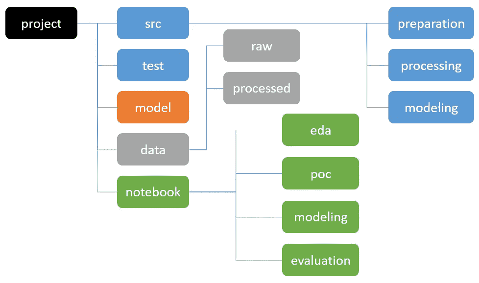

# 在早期管理您的数据科学项目结构。

> 原文：<https://towardsdatascience.com/manage-your-data-science-project-structure-in-early-stage-95f91d4d0600?source=collection_archive---------3----------------------->

Jupyter Notebook(或 Colab，databrisk 的 Notebook 等)为在短时间内建立一个项目提供了一个非常有效的方法。我们可以在笔记本中创建任何 python 类和函数，而无需重新启动内核。有助于缩短等待时间。它适合于小规模的工程和实验。然而，这可能不利于长期增长。

“white and multicolored building scale model” by [Alphacolor 13](https://unsplash.com/@duck58cth?utm_source=medium&utm_medium=referral) on [Unsplash](https://unsplash.com?utm_source=medium&utm_medium=referral)

看完这篇文章，你会明白:

*   什么时候我们需要一个定义良好的项目文件夹结构？
*   模块化
*   建议

# 什么时候我们需要一个定义良好的项目文件夹结构

*概念证明(PoC)*

直觉上，速度是我们进行概念验证(PoC)时的主要考虑因素。在之前的一个项目中，我探索了文本摘要技术是否可以应用到我的数据科学问题中。我不打算为我的 PoC 构建任何“美丽”或“结构”,因为我不知道它是否有用。

换句话说，我使用“快速和肮脏”的方式来进行 PoC，因为没有人关心它是否结构良好或性能是否得到优化。从技术角度来看，我可能会在笔记本内部创造功能。好处是我不需要处理任何外部化文件(例如加载其他 python 文件)。

*包装解决方案*

“four brown gift boxes on white surface” by [Caley Dimmock](https://unsplash.com/@caleydimmock?utm_source=medium&utm_medium=referral) on [Unsplash](https://unsplash.com?utm_source=medium&utm_medium=referral)

在多次运行 PoC 后，应确定解决方案。由于多种原因，代码重构从此刻开始是必要的。它不仅组织得很好，而且有利于实现更好的预测。

# 模块化

“editing video screengrab” by [Vladimir Kudinov](https://unsplash.com/@madbyte?utm_source=medium&utm_medium=referral) on [Unsplash](https://unsplash.com?utm_source=medium&utm_medium=referral)

首先，你必须让你的实验可重复。当你最终确定(至少是初始版本)时，你可能需要与其他团队成员一起工作来组合结果或构建一个系综模型。其他成员可能需要**检查和审查你的代码**。如果他们不能复制你的作品，这不是一个好主意。

另一个原因是超参数调整。我不关注早期阶段的超参数调整，因为它可能会花费太多的资源和时间。如果解决方案得到确认，那么在启动预测服务之前，应该是寻找更好的超参数的好时机。**不仅在嵌入层的维度上调整神经网络中神经元的数目，还可以进行不同的架构**(例如比较 GRU、LSTM 和注意机制)或其他合理的改变。因此，模块化您的处理、培训、度量评估功能是管理这种调整的重要步骤。

此外，你需要**将你的代码运送到不同的集群**(比如 Spark，或者自建分布式系统)进行调优。由于一些原因，我没有使用 [dist-keras](https://github.com/cerndb/dist-keras) (分布式 keras 培训库)。我自己构建了一个简单的集群来加速分布式训练，同时它可以支持 Keras、scikit-learn 或任何其他 ML/DL 库。将实现打包成 python 而不是 notebook 会更好。

# 建议

在交付了几个项目后，我重温了论文和项目结构模板，并遵循敏捷项目管理策略。我将塑造我的项目结构如下风格。它使我在每个项目迭代或冲刺中拥有组织良好的项目和更少的痛苦。

Rounded rectangle means folder. python code, model file, data and notebook should be put under corresponding folder.

**src**

存储服务于多种场景的源代码(python、R 等)。在数据探索和模型训练过程中，我们必须为特定目的转换数据。在线预测期间，我们也必须使用相同的代码来传输数据。因此，它更好地将代码从笔记本中分离出来，以服务于不同的目的。

*   准备:数据摄取，例如从 CSV、关系数据库、NoSQL、Hadoop 等检索数据。我们必须一直从多个来源检索数据，所以我们最好有一个专门的数据检索功能。
*   处理:作为源数据的数据转换并不总是符合模型的需要。理想情况下，我们有干净的数据，但我从来没有得到它。你可能会说我们应该让数据工程团队帮助我们进行数据转换。但是，**在学习数据下，我们可能不知道自己需要什么**。一个重要的要求是离线训练和在线预测都应该**使用相同的流水线来减少未对准**。
*   建模:建模，如解决分类问题。它不仅包括模型训练部分，还包括评估部分。另一方面，我们必须考虑多模型场景。典型的用例是集成模型，如结合逻辑回归模型和神经网络模型。

***测试***

在 R&D，数据科学侧重于建立模型，但并不确保在意想不到的情况下一切正常。但是，如果将模型部署到 API，这将是一个麻烦。此外，测试用例保证向后兼容的问题，但它需要时间来实现。

*   断言 python 源代码的测试用例。更改代码时确保没有 bug。自动化测试是成功项目的一个基本难题，而不是使用手工测试。假设测试用例有助于验证代码更改不会破坏以前的用法，团队成员将有信心修改代码。

***型号***

用于存储本地使用的二进制(json 或其他格式)文件的文件夹。

*   仅在此存储中间结果。对于长期来说，它应该单独存储在模型库中。除了二进制模型，您还应该存储模型元数据，如日期、训练数据的大小。

***数据***

用于存储实验子集数据的文件夹。它包括原始数据和临时使用的处理过的数据。

*   raw:存储从“准备”文件夹代码生成的原始结果。我的做法是存储一个本地子集副本，而不是不时地从远程数据存储中检索数据。它保证您有一个静态数据集来执行其余的操作。此外，我们可以将数据平台不稳定问题和网络延迟问题隔离开来。
*   已处理:为了缩短模型训练时间，保存已处理的数据是一个好主意。它应该从“处理”文件夹中生成。

***笔记本***

存储所有笔记本，包括 EDA 和建模阶段。

*   eda:探索性数据分析(又名数据探索)是为后面的步骤探索您所拥有的东西的一个步骤。对于短期的目的，它应该显示你探索了什么。典型的例子是显示数据分布。长期存放时，应集中存放。
*   poc:由于某些原因，你不得不做一些 PoC(概念验证)。它可以在这里临时展示。
*   建模:笔记本包含您的核心部分，其中包括模型建立和培训。
*   评估:除了建模，评估是另一个重要的步骤，但很多人并不知道。为了获得产品团队的信任，我们必须展示模型有多好。

# 拿走

要访问项目模板，您可以访问这个 [github](https://github.com/makcedward/ds_project_template) repo。

*   前述对**中小型数据科学项目**有好处。
*   对于大型数据科学项目，它应包括其他组件，如**特征库和模型库**。以后会为这部分写博客。
*   **根据你的情况修改了**。

# 关于我

我是湾区的数据科学家。专注于数据科学、人工智能，尤其是 NLP 和平台相关领域的最新发展。你可以通过[媒体博客](http://medium.com/@makcedward/)、 [LinkedIn](https://www.linkedin.com/in/edwardma1026) 或 [Github](https://github.com/makcedward) 联系我。

# 参考

[微软数据科学项目模板](https://github.com/Azure/Azure-TDSP-ProjectTemplate)

[Cookiecutter 数据科学目录结构](https://drivendata.github.io/cookiecutter-data-science/)