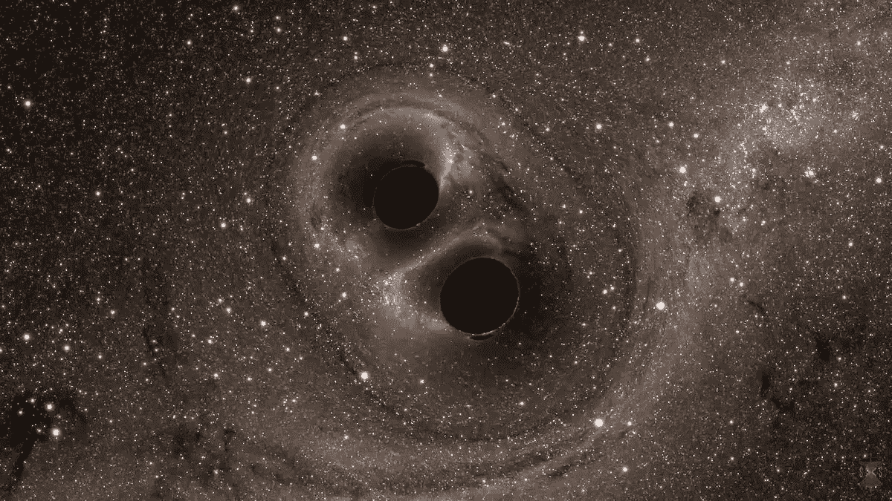

# 流形学习:背后的理论

> 原文：<https://towardsdatascience.com/manifold-learning-the-theory-behind-it-c34299748fec?source=collection_archive---------11----------------------->

流形学习已经成为几何，尤其是微分几何在机器学习中的一个令人兴奋的应用。但是，我觉得算法背后有很多被忽略的理论，理解它将有助于更有效地应用算法( [**见此**](https://github.com/VivekPa/NeuralNetworkStocks) )。

我们将从什么是流形学习以及它在机器学习中的应用开始这个相当长的论述。流形学习仅仅是使用高维数据的几何属性来实现以下事情:

1.  聚类:找到相似点的组。给定{X1，…，Xn}，构造一个函数 f : X 到{1，…，k}。两个“接近”的点应该在同一个簇中。
2.  降维:在低维空间中投影点，同时保留结构。给定 R^D 的{X1，…，Xn}，构造一个函数 f : R^D 到 R^D，其中 d
3.  半监督、监督:给定标记点和未标记点，建立一个标记函数。给定{(X1，Y1)，…，(Xn，Yn)}，建立 f : X 到 y。两个“接近”的点应该有相同的标签。

其中“接近”的概念使用数据的分布被进一步细化。有几个框架可以实现这一点:

1.  概率观点:密度缩短了距离
2.  聚类视点:连通区域中的点共享相同的属性
3.  流形观点:距离应该“沿着”数据流形测量
4.  混合版本:两个“接近的”点是那些通过穿过高密度区域的短路径连接的点

我们要讨论的第一个概念是拉普拉斯正则化，它可以在监督和半监督学习中用作正则化器，并通过投影到拉普拉斯的最后一个特征向量来进行降维。

让我们理解拉普拉斯在这个上下文中的意思。拉普拉斯仅仅是度矩阵(这是对每个顶点上有多少条边的度量)减去邻接矩阵(这是对各个顶点如何相互连接的度量)。现在我们已经准备好开始理解第一种方法:拉普拉斯正则化

## 拉普拉斯正则化

正则化在减少过度拟合和确保模型不会变得太复杂方面非常有用。使用拉普拉斯算子来正则化扩展了首先在吉洪诺夫正则化中使用的思想，吉洪诺夫正则化应用于再生核希尔伯特空间(RKHS)。

我们不需要深入 RKHS 的细微差别，但我们肯定需要了解的主要结果是，在 RKHS，对于函数空间 X 中的每个函数 X，在核中存在唯一的元素 K_x，它允许我们为每个函数定义一个范数||f||表示 RKHS 中函数的复杂性(机器学习情况下的学习映射函数)，我们可以使用它来正则化算法。所以问题会变成

这种正则化叫做外在正则化。现在拉普拉斯正则化增加了另一个称为内在正则化的正则化，它考虑了流形的内在几何并使用它来正则化算法。如何定义正则化子有几种选择，但大多数定义都围绕着流形上的梯度。我们希望正则化器惩罚那些不必要的复杂函数(当数据密集时)。换句话说，我们希望函数在数据密集时是光滑的，这也意味着当数据的边际概率密度较大时，函数在流形上的梯度必须较小。这被形式化为

如果我们可以直接计算这个积分，那将是非常棒的，但与大多数机器学习概念一样，实现它需要使用可用数据进行某种形式的估计。在这种情况下，我们需要将数据点视为图上的点，并基于某种距离概念将它们连接起来。这通常是通过实现某个函数并施加一个条件来实现的，如果距离(使用该函数导出)小于某个特定值，则这两个点用一条边连接。一个这样的函数是标准高斯函数:

现在我们需要一个估计积分的方法。进行完整的推导会使这篇文章太长，所以我将概述涉及的主要思想:使用斯托克斯定理和拉普拉斯近似拉普拉斯-贝尔特拉米算子的事实，我们可以推导出大量数据点的积分的近似。因此，正则化可以估计为

其中 f 是数据处的函数的向量值，n 是数据点的数量(标记的和未标记的)。所以现在要解决的最后一个问题变成了

与其他核方法一样，主要缺点是希尔伯特空间可能是无限维的，如果正则化不能显式地找到，就不可能在空间中搜索解。因此，对正则化(严格单调递增的实值函数)施加某些条件，并使用著名的表示定理，我们可以将期望的函数分解成权重为α的有限维空间，使得

现在我们只需要在有限维空间中搜索α的值来求解我们想要的函数。

与 L1 或 L2 正则化相比，这是一种更复杂的正则化，但它与数据的几何关系非常密切，这似乎有助于确保模型不会过度拟合。

## 拉普拉斯特征映射

拉普拉斯特征映射使用与上述正则化类似的推理，只是它应用于维数减少而不是正则化。我们首先生成一个图，图中的顶点是数据点，并且连接了相距特定距离(准确地说是欧几里得距离)且距离较小的点。然后添加权重，通常是根据热核。最后，计算特征值和特征向量，并且使用最小的特征向量将数据空间嵌入到 m 维空间。形式上，

解决这个特征向量问题

现在，我们可以将数据投影到前 m 个特征向量 f1…fm 上，从而有效地降低数据的维数。

## 结论

概括地说，我们介绍了什么是流形学习，其中利用数据的几何来使算法更有效(通过减少过拟合或维数)。接下来，我们特别讨论了两个过程，拉普拉斯正则化和拉普拉斯特征映射。它们都基于图论和微分几何，理解它们背后的理论将有助于了解何时部署哪个过程以及某些数据结构如何影响这些过程的效率。