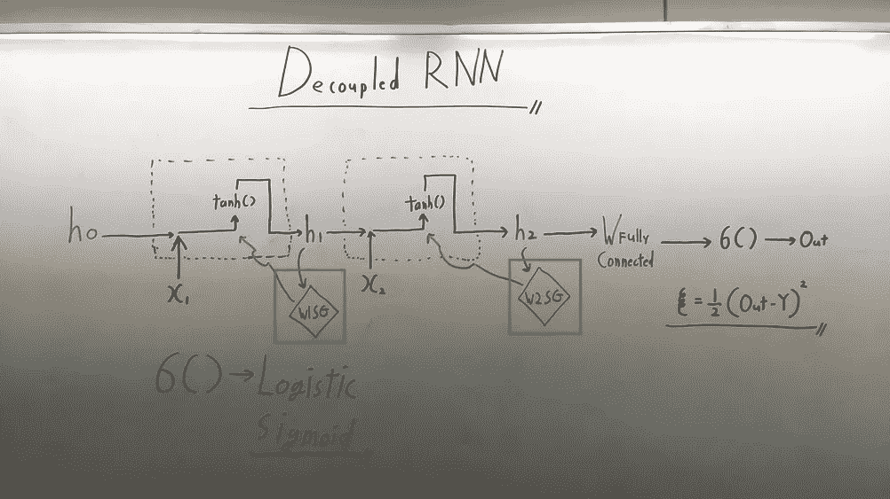
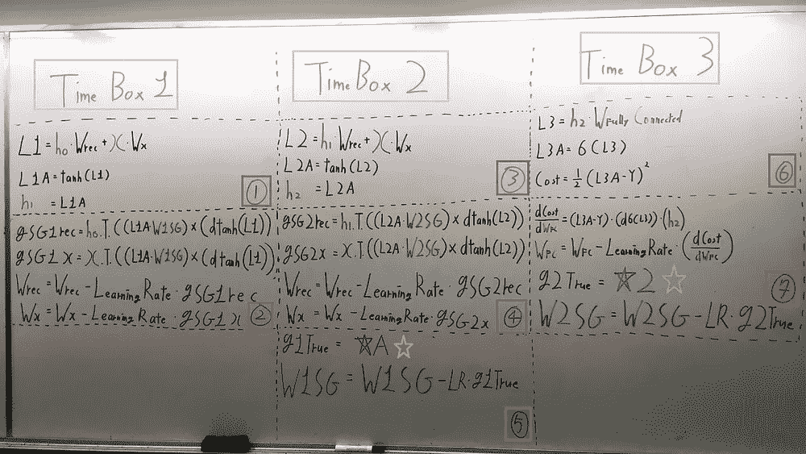
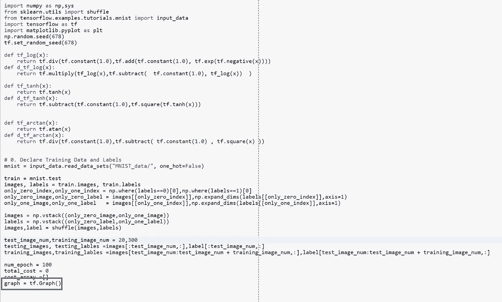
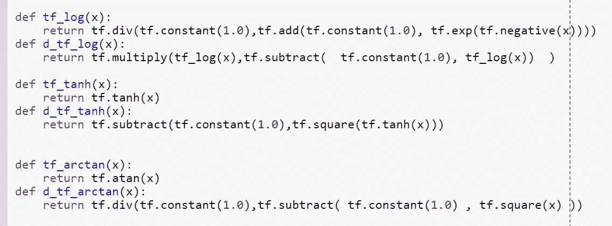
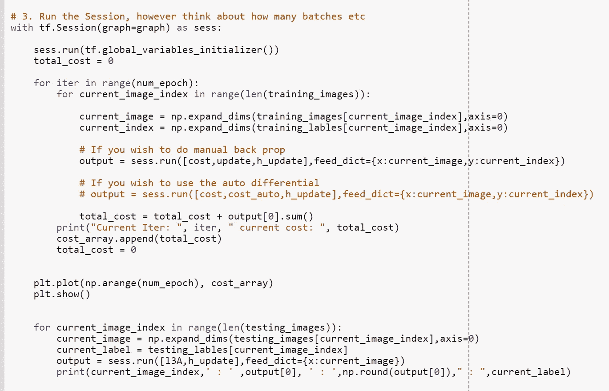
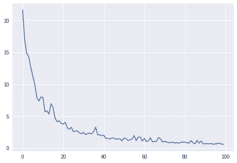
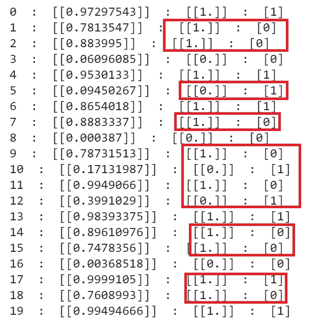

# 带 TensorFlow 的手动回推:解耦递归神经网络，从 Google Brain 修改 NN，用交互代码实现。

> 原文：<https://towardsdatascience.com/manual-back-prop-with-tensorflow-decoupled-recurrent-neural-network-modified-nn-from-google-f9c085fe8fae?source=collection_archive---------7----------------------->


Photo from Pixel Bay

我喜欢 Tensorflow 及其执行自动微分的能力，但这并不意味着我们不能执行手动反向传播，即使在 Tensorflow 中。对我来说，建立一个神经网络也是一种艺术形式，我想掌握它的每一个部分。所以今天，我将在 TensorFlow 中使用手动反向传播实现简单分类任务的解耦 RNN。并与自动微分模型进行了性能比较。

解耦神经网络最初是在本文中介绍的[使用合成梯度解耦神经接口](https://arxiv.org/abs/1608.05343)请阅读。我还在解耦的 RNN 上实现了 Numpy 版本的[。](https://medium.com/swlh/only-numpy-decoupled-recurrent-neural-network-modified-nn-from-google-brain-implementation-with-7f328e7899e6)

最后，请注意这篇文章，我将更加关注 Tensorflow 的实现与 Numpy 的实现有何不同。并说明我喜欢 Tensorflow 实现的原因。

**网络架构/前馈/反馈传播**



如上所述，网络架构与 RNN 的 Numpy 版本以及前馈/反馈传播操作完全相同。所以我就不深入了。

**数据准备\超参数声明**



同样，我们将仅对 0 和 1 图像执行简单的分类任务。没什么特别的，但是请看屏幕截图的最后一行，我们正在创建我们的默认图，以便首先制作网络图和训练。(绿色方框区域)

**原因一:数学方程实现**



Numpy 版本和 TF 版本之间的一个关键区别是每个等式是如何实现的。例如，下面是我如何在 Numpy 中实现 Tanh()的导数。

```
def d_tanh(x):
   return 1 - np.tanh(x) ** 2
```

然而，在 Tensorflow 中，我会像下面这样实现它。

```
def d_tf_tanh(x):
    return tf.subtract(tf.constant(1.0),tf.square(tf.tanh(x)))
```

乍一看，这可能有点奇怪，但我个人更喜欢张量流的数学符号，主要原因是它让你在实现每个方程之前真正思考。

**原因 2:迫使你思考独立的组件是如何组合在一起的。**


Hyper Parameter Declaration Part

以上只是声明权重和学习率的部分，仅此而已。张量流迫使你专注于每个部分。


Network Architecture

以上部分迫使我思考网络架构，它让我专注于每一层。并让我思考我添加到网络中的每一层的效果。比如这一层会有怎样的整体效果？如何执行反向传播？？这是这层的最佳选择吗？



最后，以上是培训部分，在这一部分，我可以专注于培训我的网络。我被迫只考虑我的训练的批量大小以及许多其他事情，只与训练有关。

**原因 3:自动微分之间的切换和比较**


如上所述，在声明成本函数的同时，我也可以声明优化方法。所以现在我可以自由地使用自动微分或手动反向传播。


我可以只注释掉输出的一部分，而不注释另一部分。

**训练与结果:人工反向传播。**


左图是每个训练循环的成本，右图是 20 个测试集图像的结果。现在让我们看看自动微分的结果。

**训练和结果:自动分化。**



我用的是学习率为 0.1 的随机梯度下降。就速度而言，它快得惊人。我认为代码首先被编译，也许这就是原因。然而，我很监督，它没有做好测试图像。

**交互代码**


*我转移到 Google Colab 获取交互代码！所以你需要一个谷歌帐户来查看代码，你也不能在谷歌实验室运行只读脚本，所以在你的操场上做一个副本。最后，我永远不会请求允许访问你在 Google Drive 上的文件，仅供参考。编码快乐！*

要访问[交互代码，请点击此链接](https://colab.research.google.com/drive/1S1rCnk4NR9D6hYUuZnKlr1ObaqoQyEjd)。

**遗言**

尽管我很喜欢 tensorflow 的自动微分功能，但我认为仅仅依靠框架来训练模型并不是一个好主意。对我来说，建立神经网络是一种艺术形式，我想掌握它的每一个部分。

如果发现任何错误，请发电子邮件到 jae.duk.seo@gmail.com 找我。

与此同时，请在我的 twitter [这里](https://twitter.com/JaeDukSeo)关注我，并访问[我的网站](https://jaedukseo.me/)，或我的 [Youtube 频道](https://www.youtube.com/c/JaeDukSeo)了解更多内容。如果你感兴趣，我也在这里做了解耦神经网络[的比较。](https://becominghuman.ai/only-numpy-implementing-and-comparing-combination-of-google-brains-decoupled-neural-interfaces-6712e758c1af)

**参考文献**

1.  贾德伯格，m .，Czarnecki，W. M .，奥辛德罗，s .，维尼亚尔斯，o .，格雷夫斯，a .，& Kavukcuoglu，K. (2016)。使用合成梯度的去耦神经接口。 *arXiv 预印本 arXiv:1608.05343* 。
2.  Seo，J. D. (2018 年 02 月 03 日)。Only Numpy:解耦递归神经网络，修改自 Google Brain 的 NN，实现用…2018 年 2 月 05 日检索自[https://medium . com/swlh/only-Numpy-Decoupled-Recurrent-Neural-Network-modified-NN-from-Google-Brain-Implementation-with-7f 328 e 7899 e 6](https://medium.com/swlh/only-numpy-decoupled-recurrent-neural-network-modified-nn-from-google-brain-implementation-with-7f328e7899e6)
3.  阿洛尼博士(未注明)。丹·阿洛尼的博客。检索于 2018 年 2 月 5 日，来自 http://blog.aloni.org/posts/backprop-with-tensorflow/