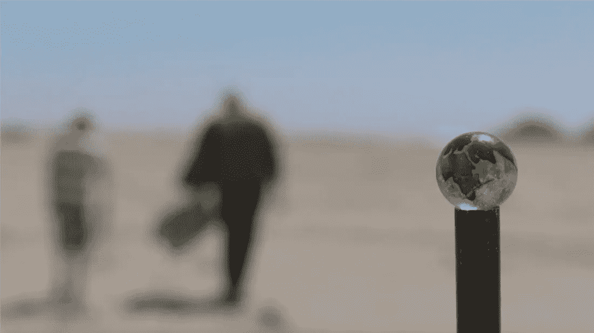
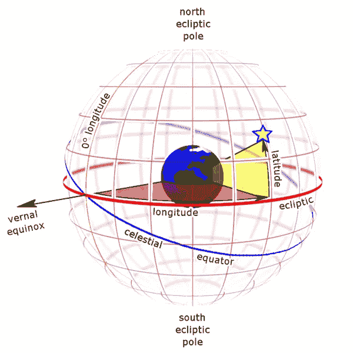
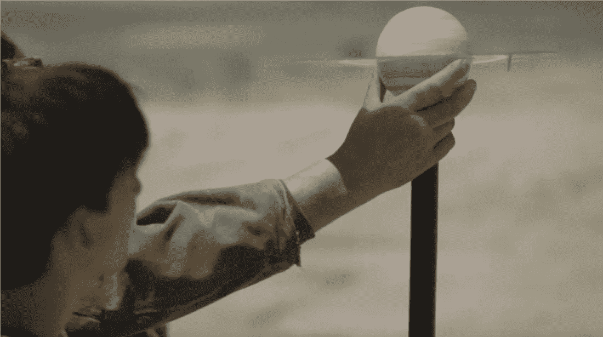
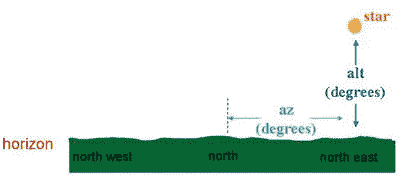
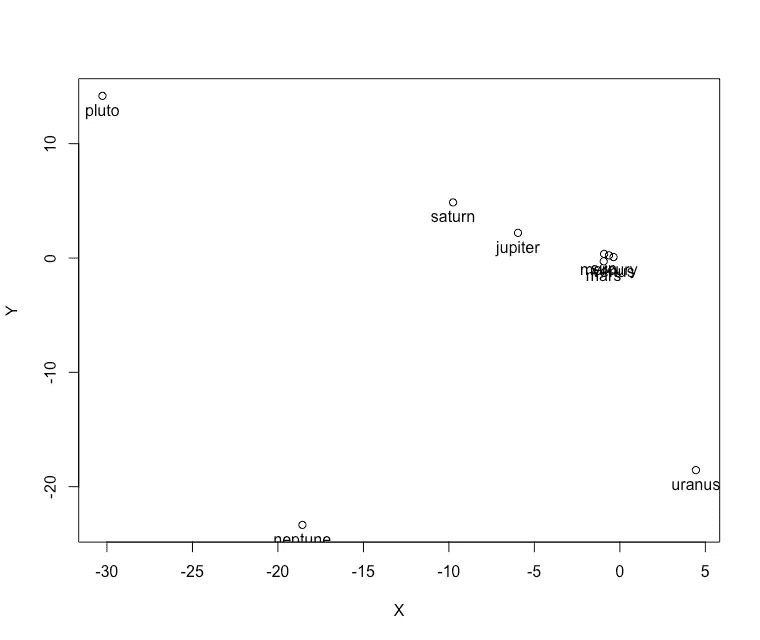

# 将太阳系映射到你附近的某个地方——这是一个 NatGeo 的火星启发的闪亮网络应用程序

> 原文：<https://towardsdatascience.com/map-the-solar-system-to-a-place-near-you-a-natgeos-mars-inspired-shiny-web-app-a5f7f010ffac?source=collection_archive---------18----------------------->

我最近晋升为父亲。这就是为什么我目前正在休 5 个月的育儿假(感谢出色的团队@ [store2be](https://medium.com/u/d89c64b8c0f8?source=post_page-----a5f7f010ffac--------------------------------) 的配合！).每天早上 5 点左右，我和儿子一起离开卧室去厨房，这样他的妈妈就可以睡上两个小时。正是在这些清晨时分，我最近在网飞观看了[国家地理研究所的火星](https://www.nationalgeographic.com/tv/mars/)，这启发了我一个小的“数据科学”项目。

# 沙漠中真实比例的太阳系

在《火星救援》第一季的前几集里，年轻的本·索耶(Ben Sawyer)——注定要去火星的宇航员之一——和他的父亲一起走进沙漠，把弹珠放在棍子上，这样弹珠的大小就会和我们太阳系中行星的大小相匹配，它们之间的距离就会和相同比例的行星之间的距离相匹配。



The Earth the size of a marble. Source: National Geographic (2016).

这启发我开始了一个项目，用 R 构建一个闪亮的 web 应用程序，让我将太阳系映射到给定位置周围的真实世界。也许有一天，我会和我的儿子一起讲述本·索耶和他父亲的故事(如果他对这种事情感兴趣的话)。

表面上看，这很容易做到。只要“获得太阳系的鸟瞰图”并缩小距离和尺寸。但是等等——行星在移动。太阳系的鸟瞰图到底会是什么样子？

**我最初的计划是:**

*   在某个坐标系中找到一个行星的 x-y 坐标数据集，该坐标系确实以这种方式存在，并且
*   将这些 x-y 坐标转换成纬度和经度测量值，以将行星的坐标映射到地球上的某个区域。

# 空间坐标系统

在谷歌搜索了一番后，我偶然发现了美国国家航空航天局的数据。它提供了从 1959 年到 2019 年我们太阳系中行星的位置。这取决于你选择的坐标系:

*   太阳黄道
*   日光惯性
*   太阳黄道图和日光图

当然可以。里面没有 x 或 y。只是一些介于 0 和 360 之间的纬度/经度变量。也许这和半径上的度数有关？所以我去试着理解这些坐标系到底是什么。这里没有速赢。

# (太阳)黄道坐标系



A visualisation of the Earth ecliptic coordinate system.

多亏了[维基百科](https://en.wikipedia.org/wiki/Ecliptic_coordinate_system)，我了解到黄道坐标系可以有它的*“原点[……]可以是太阳或地球的中心，它的主要方向是朝向春分点(北分点)，它有一个右手惯例。”*对于包括我在内的我们这些不知道“春分(北)点”是什么意思的人来说，春分是指人们可以想象的穿过地球赤道的平面在春天穿过太阳中心的时刻(记住，地球的轴是向着太阳倾斜的)。这种情况在九月再次发生，然后被称为南分日。[这张来自维基百科的图片](https://en.m.wikipedia.org/wiki/File:Ecliptic_grid_globe.png)让我明白了一些事情:

# 日光惯性坐标系

这是一个坐标系统，基本上就像我们在地球上的经纬度系统，但映射到太阳上。如果你对阅读更多感兴趣，你可以从 [NASA 这里](https://omniweb.gsfc.nasa.gov/coho/helios/plan_des.html)或者[这里](http://www.mssl.ucl.ac.uk/grid/iau/extra/local_copy/coordinates.pdf)找到信息。我很快放弃了使用它(因为我不能足够快地理解它)，但也可以随意探索它。

# 月亮太阳 R 包

在读入任何数据之前，我决定至少快速检查一下是否有任何 R 包可用于行星绘图。幸运的是，原来有一个，Lukasz Komsta 的叫做 [*moonsun*](https://cran.r-project.org/web/packages/moonsun/moonsun.pdf) 。答对了。

在最初走进一条死胡同之后(见摘录)，它证明允许我做我想做的事情，为我提供所有太阳系行星在地球黄道坐标中的经度数据，并基于给定的日期，以及行星的距离。因为计划是将行星映射到一个平坦的球面上，所以我忽略了行星黄道坐标中的纬度。

这样，我就拥有了绘制所有八大行星，加上冥王星和太阳的位置所需的一切。

```
#Getting ecliptic latitude and longitude coordinates from a call to the planets() function in the moonsun package and its outputplanets_today <- data.frame(
                      as.ecc(planets(show.moon = FALSE)), 
                      dist = planets(show.moon = FALSE)$dist
                      )planets_today#Output:
#                             long          lat  dist
# 2018-11-24-Sun     241* 41'  2''  0*  0'  0''  0.99
# 2018-11-24-Mercury 247* 55' 57'' -1* 54' 26''  0.69
# 2018-11-24-Venus   205* 59' 15''  0* 12'  2''  0.37
# 2018-11-24-Mars    333* 46' 13'' -2* 35' 33''  0.97
# 2018-11-24-Jupiter 242* 51' 16''  0* 39' 57''  6.35
# 2018-11-24-Saturn  276* 35' 28''  0* 32' 55'' 10.87
# 2018-11-24-Uranus   29* 49' 35'' -1* 27' 12'' 19.05
# 2018-11-24-Neptune 342* 42' 11'' -1*  1' 54'' 29.77
# 2018-11-24-Pluto   280* 46' 14''  2* 28' 57'' 33.38
```

# 将行星的坐标映射到地球表面

现在，基于角度方向和距离测量，目标是找到行星在地球上的位置坐标，给定某种比例因子。为了做到这一点，我偶然发现了 [*geosphere*](https://cran.r-project.org/web/packages/geosphere/geosphere.pdf) 包，其中就包含了这样一个功能。

destpoint()函数将起始位置、以北纬 0 度为参考的方向角和以米为单位的距离作为输入，并返回您将到达的坐标。瞧啊。

```
#Pick the location of Earth as a starting point, e.g. the Mojave desert
startingLocationLng <- -115.7863069
startingLocationLat <- 35.0992539#Get angles between Earth and the planets as seen from a top-down-view from the ecliptic north to south pole
planetsAngles <- (-1) * (as.numeric(as.ecc(planets(show.moon = FALSE))$lat) - 360)#Get the distances (in AU and converted to 1 AU = 1,000 m)
planetsDistances <- planets(show.moon = FALSE)$dist * 1000newCoords <- **destPoint**(c(startingLocationLng, startingLocationLat), planetsAngles, planetsDistances)
```

# 太阳系绘图应用程序

有了可用的核心组件，所有需要做的就是使用 R 和 RStudio 将这些东西编织在一个基本的闪亮的 web 应用程序中。最终应用的截图可以在下面看到。


The Solar System Mapper web application, built with R & Shiny.

该应用程序提供以下功能:

*   设置观察的日期
*   选择地球的位置
*   选择将天体距离转换为地球距离的比例

基于这些输入，它将计算天体在地图上的位置。它还将为您提供“原始”数据(如坐标和行星大小，单位为厘米)，您需要这些数据才能像本·索耶和他的父亲一样真正走进这个世界。



*有趣的补充说明:*根据本·索耶和他爸爸在电视上的模型中使用的地球和土星的大小，我的应用程序告诉我，他们需要从地球开车大约 2 公里到土星，并应用 1 AU = 0.18 公里的比例。这是基于假设他们的地球直径约为 1.53 厘米，土星直径约为 14.50 厘米。作为日期，我选择了 2016 年 11 月 21 日，这一集在 2016 年首次播出。

【https://pdwarf.shinyapps.io/solar-system-mapper/】[**自己动手试试这个应用吧**](https://pdwarf.shinyapps.io/solar-system-mapper/)

**此处** **代码可通过 GitHub** [**获得。**](https://github.com/pdwarf/solar-system-to-map-app/tree/master/map-the-solar-system)

# 剪辑

由于这个项目对我来说首先是一次学习之旅，我认为看着包括一些我走过的非常死胡同的实际过程是很有趣的。在这个项目的过程中，我总共经历了两次真正错误的转弯:

**转错#1:曲解水平坐标系**

在*月亮太阳* R 包的文档中，我看到它可以让你将坐标转换成水平坐标。我(也)简单地阅读了一下，认为我已经找到了我所需要的。这一次，[维基百科](https://en.wikipedia.org/wiki/Horizontal_coordinate_system)不是我最好的来源。我完全误读了你在下面看到的图像。对我来说，那时候，图像看起来就像黄道坐标系后来变成的样子。我想我把图像中的地平线误认为地球的赤道。


我想我可以只使用方位角和距离，并且可以用我后来使用黄道经度变量的方式。所以我开始编写一个函数，将方位角和距离转换成平面上的 x-y 坐标。这个函数是这样工作的:

```
AzimuthToXY <- function(azimuth, distance) {
    if(azimuth > 0 && azimuth < 90) {
        Y = sin(NISTdegTOradian(azimuth)) * distance
        X = cos(NISTdegTOradian(azimuth)) * distance
    }
    else if(azimuth == 90) {
        Y = distance
        X = 0
    }
    else if(azimuth > 90 && azimuth < 180) {
        Y = sin(NISTdegTOradian(azimuth - 90)) * distance
        X = -1 * cos(NISTdegTOradian(azimuth - 90)) * distance
    }
    else if(azimuth == 180) {
        Y = 0
        X = distance
    }
    else if(azimuth > 180 && azimuth < 270) {
        Y = -1 * sin(NISTdegTOradian(azimuth - 180)) * distance
        X = -1 * cos(NISTdegTOradian(azimuth - 180)) * distance
    }
    else if(azimuth == 270) {
        Y = -1 * distance
        X = 0
    }
    else if(azimuth > 270 && azimuth < 360) {
        Y = -1* sin(NISTdegTOradian(-1 * azimuth + 360)) * distance
        X = cos(NISTdegTOradian(-1 * azimuth + 360)) * distance
    }
    else if(azimuth == 360 | azimuth == 0) {
        Y = 0
        X = distance
    }
    return(data.frame(X, Y))
}
```

但是当我绘制输出时(见下文)，我感觉不太对劲，于是我又读了一些。最后，下面的图片，虽然没有维基百科上的漂亮，但更清晰，帮助我理清了事情。



The Horizontal coordinate system explained. Source: [Swinburne University (2018)](http://astronomy.swin.edu.au/cosmos/H/Horizontal+Coordinate+System).

如果你想知道在某个时间点从哪里观察天空来定位某个天体，水平坐标系是很有用的。它总是基于观测者在地球上的位置，而黄道坐标系是基于地球本身的。

**错误转折#2:假设世界是平的**

我在上面简要暗示了这个错误。基本上，我想我会在一个平面上得到一些 x-y 坐标，相对于地球所在的 0/0 点，然后把这个平面叠加到地图上。请参见下面的代码和示例输出:

```
coords <- map2_df(azimuth, distance, AzimuthToXY)plot(coords)
text(x = coords$X, y = coords$Y, labels = planetNames, pos = 1)
```



My first idea of plotting the planets to a flat Earth.

所以，在谷歌了如何从我的 azimuthytoxy()hustle 中获得目的地坐标之后，我偶然发现了[这个 Stackoverflow](https://stackoverflow.com/questions/31576425/how-can-i-find-out-a-latitude-or-longitude-at-a-distance-of-x-from-another-latit#) 线程，标题为“*我如何才能从另一个纬度或经度中找到一个距离 X 的纬度或经度？”。*它以两种方式让我大开眼界:

1.  世界不是平的，它是球形的！🤦‍
2.  有一个叫做 *geosphere* 的包，它包含了一个函数，这个函数将使我在 AzimuthToXY()函数上的努力变得毫无用处。

正如你在上面的帖子中看到的，这就是我如何走上正轨的。多么有趣的项目——我确实学到了很多。也许这个应用在将来的某个时候会对我有用！

*PS:这个项目也是约翰·霍普斯金大学 Coursera* *上的在线课程* [*“开发数据产品”的一部分。我即将完成的是数据科学专业的 9/10 课程。一旦我 10 对 10，我将分享我的经历。*](https://www.coursera.org/learn/data-products)