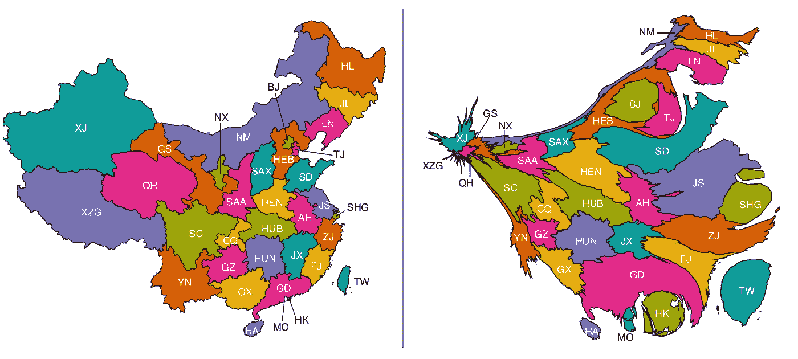
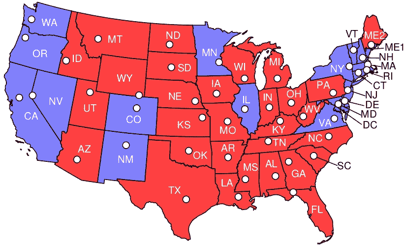
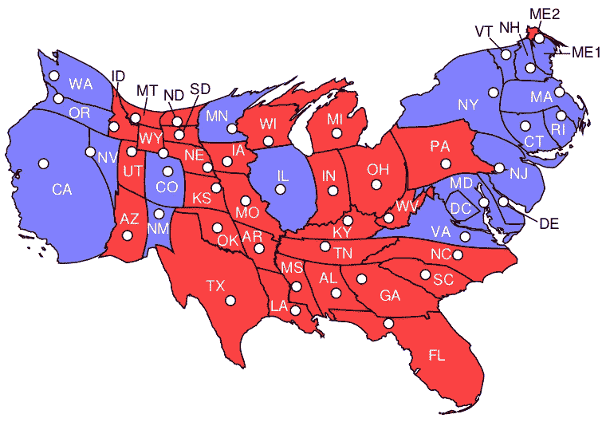
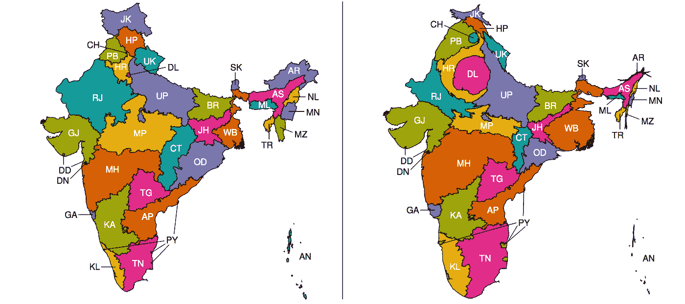

# 描绘真实世界

> 原文：<https://towardsdatascience.com/mapping-the-real-world-bd9a159ce6f8?source=collection_archive---------13----------------------->

**Fig 1\.** Administrative divisions of China and Taiwan on (Left) an equal-area map, and (Right) a Flow-Based Cartogram where areas are proportional to GDP.

我们都认为我们知道世界是什么样子的。但是我们的世界地图总是反映最重要的东西吗？例如，关于中国在过去几十年中惊人的经济增长已经说了很多。然而，图 1(左)中的中国地理地图并没有告诉我们中国不同地区的国内生产总值(GDP)增长程度。

如果我们能制作更多视觉信息的地图会怎么样？

事实证明，我们可以。图 1(右)展示了一幅中国地图，其中各地区根据其各自的 GDP 贡献进行了重新调整。它不仅描绘了人们在经济进步背景下谈论的真实的中国，也展示了该国发展中的严重扭曲和不平等。这是对现实的一个有力的、引人入胜的描述——中国西部和东北实际上没有出现在伟大的中国成功故事中。

如图 1(右)所示的地图被称为地图。常规地图在形状、大小和位置方面优先考虑地理准确性。另一方面，统计图根据统计数据(如人口或 GDP)重新调整地图区域，这对于特定应用程序可能更有意义，同时仍尽可能保持拓扑地理特征。

除了提供震动和警报，在可视化空间数据方面，统计图还提供了优于常规地图的统计优势。下面图 2 中描述 2016 年美国总统选举结果的地图就是一个例子。共和党的唐纳德·特朗普赢得了红色的州。民主党的希拉里·克林顿赢得了蓝色州。

**Fig 2.** 2016 US presidential election map. Red indicates Republican victory. Blue indicates Democratic victory.

快速浏览一下这张地图，就会发现唐纳德·特朗普(Donald Trump)取得了压倒性胜利。这一错误结论的出现是因为地图上的区域面积没有反映它们所代表的定量数据。例如，爱达荷州和罗德岛州都拥有 4 张选举人票。但是爱达荷州在地图上占据了明显的位置，而罗德岛几乎不引人注意。

相反，如果我们使用基于每个州的选举人票的图表来表示相同的数据，我们将获得更直观的选举结果的代表性描述。这样的图表包括在下面的图 3 中。蓝色和红色区域现在准确地显示了民主党和共和党分别赢得了多少张选举人票。

**Fig 3.** US presidential election results on a Flow-Based Cartogram. Red indicates Republican victory. Blue indicates Democratic victory.

基于扩散的图表([链接](https://doi.org/10.1073/pnas.0400280101))在很大程度上是使用中最流行的图表。这种图表生成技术在扩散的物理过程中找到了灵感。定义扩散运动的数学已经在科学文献中被仔细研究和记录，并很好地解决了手头的问题。

打个比方，考虑在房间的一个角落喷洒一些香水。几分钟后，你也能在房间的其他地方闻到香味。这是因为气味从高密度区域(最初被喷洒的角落)扩散到低密度区域(房间的其余部分)。同样，地图上的每个区域都可以认为是由粒子组成的。那么，对于人口分布图来说，高人口密度区域的粒子会向外流动并扩散，从而扩大这些区域，进而缩小低人口密度区域。

也就是说，这种图表生成方法相当慢。在当今的硬件上，他们可能需要几十分钟来创建简单的图表，如本文中使用的图表。创建图表的耗时过程是广泛采用这种数据可视化技术的巨大障碍。

为了加速图表生成过程并促进它们的共同使用，我与迈克尔·t·加斯特纳教授和 T2 研究并设计了一种新的算法，来生成我们称之为 T4 的基于流程的图表。请阅读我们在美国国家科学院院刊上发表的[研究论文。](https://doi.org/10.1073/pnas.1712674115)

总之，在生成图表时，我们希望均衡地图上所有位置的密度。虽然传播是这样做的一种方式，但不是唯一的方式。我们的技术背后的新数学带来了算法效率，并使我们能够将计算分成可以独立完成的小而不相关的部分，从而利用了当今广泛使用的多核处理器。

我们工作的结果是图表生成器的速度提高了 60 倍。本文中展示的每个图表都是在几秒钟内生成的。中国地图用了我们的方法不到 3 秒钟就制作出来了，而美国大选地图用了 1.5 秒。作为另一个例子，下面的图 4(右)中的印度图表，其中各邦根据其各自的 GDP 贡献进行了重新调整，使用我们基于流量的方法需要 2.6 秒来生成。

**Fig 4\.** States and union territories of India on (Left) an equal-area map, and (Right) a Flow-Based Cartogram where areas are proportional to GDP.

图表是一种强有力的工具，可以展示地面真相的有力表示，从而有效地提高广大民众对这些真相的认识。我希望通过我们的研究，我们可以减少创建图表的障碍，从而促进它们的采用。带着这个目标，我们还在 GitHub 上提供了我们的[软件，以及如何使用它的说明。请欣赏使用该软件创建的网格世界地图，并根据人口进行缩放，如下图 5 所示。](https://github.com/Flow-Based-Cartograms/go_cart)

**注意:**我正在开发一个 Python 包，让图表生成更加简单。我还计划建立一个 web 应用程序来实现同样的目的。这两个项目都是开源的。如果你想合作，请发电子邮件到 pratyushmore1996@gmail.com**找我。**

**研究论文:** [PNAS 文章](https://doi.org/10.1073/pnas.1712674115)

**软件:** [GitHub](https://github.com/Flow-Based-Cartograms/go_cart)

**Fig 5\. Flow-Based Cartogram of a gridded world map, rescaled according to population.**